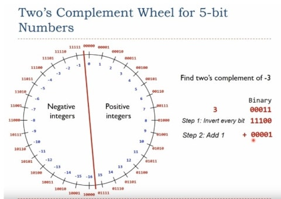

첫자리 a0 부터 a3 이라고 가정
맨 앞자리를 음수를 나타내는 비트라고 정하는 방법과
2의 보수를 음수를 나타내는 비트라고 정하는 방법 2가지를 비교

| 이진수  | 초기 구현 | 2의 보수로 구현한 음수 | 더하기 식                        |     |
| ---- | ----- | ------------- | ---------------------------- | --- |
| 0000 | 0     | 0             | `0*a3 + 0*a2 + 0*a1 + 0*a0`  |     |
| 0001 | 1     | 1             | `1*a3 + 0*a2 + 0*a1 + 1*a0`  |     |
| 0010 | 2     | 2             | `0*a3 + 0*a2 + 1*a1 + 0*a0`  |     |
| 0011 | 3     | 3             | `0*a3 + 0*a2 + 1*a1 + 1*a0`  |     |
| 0100 | 4     | 4             | `0*a3 + 1*a2 + 0*a1 + 0*a0`  |     |
| 0101 | 5     | 5             | `0*a3 + 1*a2 + 0*a1 + 1*a0`  |     |
| 0110 | 6     | 6             | `0*a3 + 1*a2 + 1*a1 + 0*a0`  |     |
| 0111 | 7     | 7             | `0*a3 + 1*a2 + 1*a1 + 1*a0`  |     |
| 1000 | -0    | -8            | `-1*a3 + 0*a2 + 0*a1 + 0*a0` |     |
| 1001 | -1    | -7            | `-1*a3 + 0*a2 + 0*a1 + 1*a0` |     |
| 1010 | -2    | -6            | `-1*a3 + 0*a2 + 1*a1 + 0*a0` |     |
| 1011 | -3    | -5            | `-1*a3 + 0*a2 + 1*a1 + 1*a0` |     |
| 1100 | -4    | -4            | `-1*a3 + 1*a2 + 0*a1 + 0*a0` |     |
| 1101 | -5    | -3            | `-1*a3 + 1*a2 + 0*a1 + 1*a0` |     |
| 1110 | -6    | -2            | `-1*a3 + 1*a2 + 1*a1 + 0*a0` |     |
| 1111 | -7    | -1            | `-1*a3 + 1*a2 + 1*a1 + 1*a0` |     |

이진수 덧셈 방식에 따를 때 (회로의 구현방식중 ) 2의 보수가 가장 적절한 음수 표현 방법이다

2는 0으로 부터 아래로 2칸 -4는 0으로 부터 위로 4칸

음수를 2의 보수로 표현 가능하다면 덧셈 회로 만으로도 뺄셈 방식이 구현 가능하다

> unsigned 와 signed 는 오버 플로우 발생 비트가 다르다 
> (1000 에서 발생 vs 1111 에서  발생)

결국 이러한 방식의 남은 마지막 문제는 0111 = 7 에서 양수가 더해질 때
즉 7보다 큰 수 -8 보다 작은수를 표현하려고 할 때 오버플로가 일어나 의도하지 않은 숫자가 나오게 된다

위에는 일반적인 자료형의 음수 표현 비트 사용이다 하지만 unsigned 자료형의 경우 위의 것을 고민할 필요가 없다