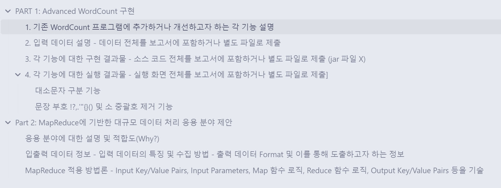
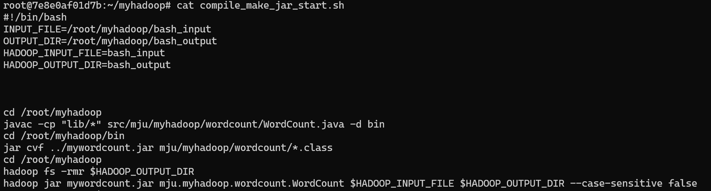
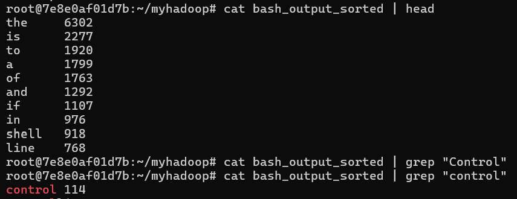
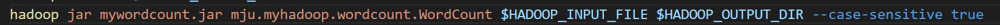
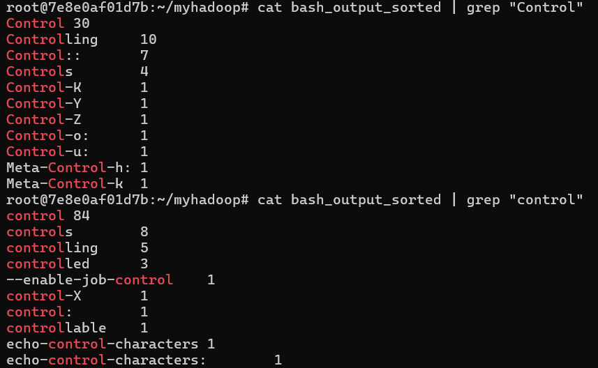
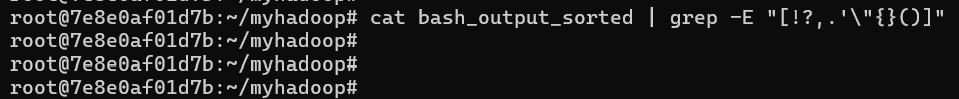

## 1. 기존 WordCount 프로그램에 추가하거나 개선하고자 하는 각 기능 설명

1. 문장 부호(!?,.'"{}()) 및 소 중괄호 제거
2. 대소문자 구분 여부를 확인하기 위해 --case-sensitive true|false 인수를 받음
## 2. 입력 데이터 설명 - 데이터 전체를 보고서에 포함하거나 별도 파일로 제출

[bash_menual_file](https://www.gnu.org/software/bash/manual/bash.txt) 를 사용하여 입력데이터로 사용하였음

## 3. 각 기능에 대한 구현 결과물 - 소스 코드 전체를 보고서에 포함하거나 별도 파일로 제출 (jar 파일 X)
WordCount.java 파일

## 4. 각 기능에 대한 실행 결과물 - 실행 화면 전체를 보고서에 포함하거나 별도 파일로 제출]

#### 대소문자 구분 기능

**대소문자 구분 안 하는 버전**

대소문자 구분하지 않은 control 단어는 114개 산출됨

---

**대소문자 구분 버전**

Control : 30 개
control : 84개
각각 분리됨

#### 문장 부호 !?,.'"{}() 및 소 중괄호 제거 기능

 제대로 동작확인함

## 응용 분야에 대한 설명 및 적합도(Why?)
실시간으로 업데이트 되는 주식관련 기사를 분석하여 현재 시장에서 관심있는 키워드 분석을 통해 여론을 실시간으로 파악하는 것이 목표 RSS 피드를 통해 원하는 뉴스 출처를 구독하고 대규모 데이터 처리에 적합한 MapReduce 모델을 활용하여 대량의 기사 데이터를 효과적으로 분석 가능

## 입출력 데이터 정보 - 입력 데이터의 특징 및 수집 방법 - 출력 데이터 Format 및 이를 통해 도출하고자 하는 정보

- 입력 데이터: RSS 피드를 통해 수집된 주식관련 뉴스 기사. 각 기사는 제목, 본문, 날짜 등으로 구성됩니다.
- 수집 방법: Python의 feedparser 라이브러리 등을 사용하여 RSS 피드에서 데이터를 추출하고, 해당 데이터를 HDFS에 저장합니다.
- 출력데이터 : 실시간 뉴스 기다들의 키워드 별 빈도수를 계산한다
## MapReduce 적용 방법론 - Input Key/Value Pairs, Input Parameters, Map 함수 로직, Reduce 함수 로직, Output Key/Value Pairs 등을 기술

1. Input Key/Value Pairs:
   Key: PATH (뉴스 기사저장 위치)
   Value: Text (뉴스 기사 내용)
2. Input Parameters:
   입력 경로: HDFS에 저장된 RSS 피드 데이터 경로
   출력 경로: 분석 결과를 저장할 HDFS 경로
   대소문자 구분 여부: --case-sensitive true|false
3. Map 함수 로직:
   기사를 입력받아 문장 부호를 제거하고, 대소문자를 처리한 후 단어를 토큰화
   각 단어의 빈도를 카운트하여 (word, 1) 형식으로 출력
4. Reduce 함수 로직:
   같은 단어에 대해 Map 단계에서 생성된 값을 합산하여 각 단어의 총 빈도를 계산합니다.
   최종적으로 각 단어와 그 빈도를 출력합니다.
5. Output Key/Value Pairs:
   Key: Text (단어)
   Value: IntWritable (단어 빈도수)