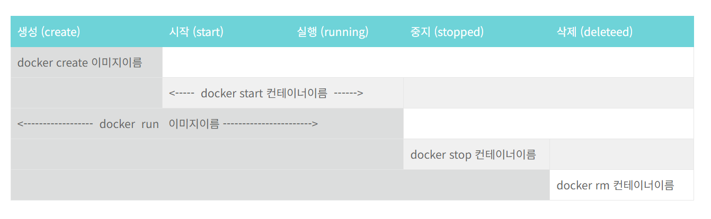

image → container → 사용

  

|   |   |   |
|---|---|---|
|이미지|컨테이너|실행|
|docker search <이미지 이름>   이미지 검색|docker run <옵션> <이미지 이름> <실행할 파일>   이미지를 컨테이너로|docker start <컨테이너 이름>   컨테이너 실행|
|docker pull <이미지 이름:태그>   이미지 다운|docker ps <옵션>   컨테이너 확인|docker restart <컨테이너 이름>   컨테이너 재실행|
|docker images   설치된 이미지 확인|docker rm <컨테이너 이름>   컨테이너 삭제|docker exec <컨테이너 이름> <명령> <메게변수>   외부에서 실행|
|docker rmi <이미지 이름>   이미지 삭제|docker commit <옵션> <컨테이너 이름> <이미지 이름: 태그>   변경된 컨테이너를 바탕으로 이미지 설정 업데이트|docker stop <컨테이너 이름>   실행 정지|
|docker build <옵션> <dockerfile 경로>   dockerfile 을 바탕으로 이미지 생성|docker diff <컨테이너 이름>   컨테이너 변경사항 파일 기준||
|docker history <이미지 이름:태그>   이미지 역사|docker inspect < 컨테이너 이름>||
||||
||||
||||
|||ctrl D,exit / ctrl P, ctrl Q|

  

  

  

  
  

chroot

namespace

cgroup