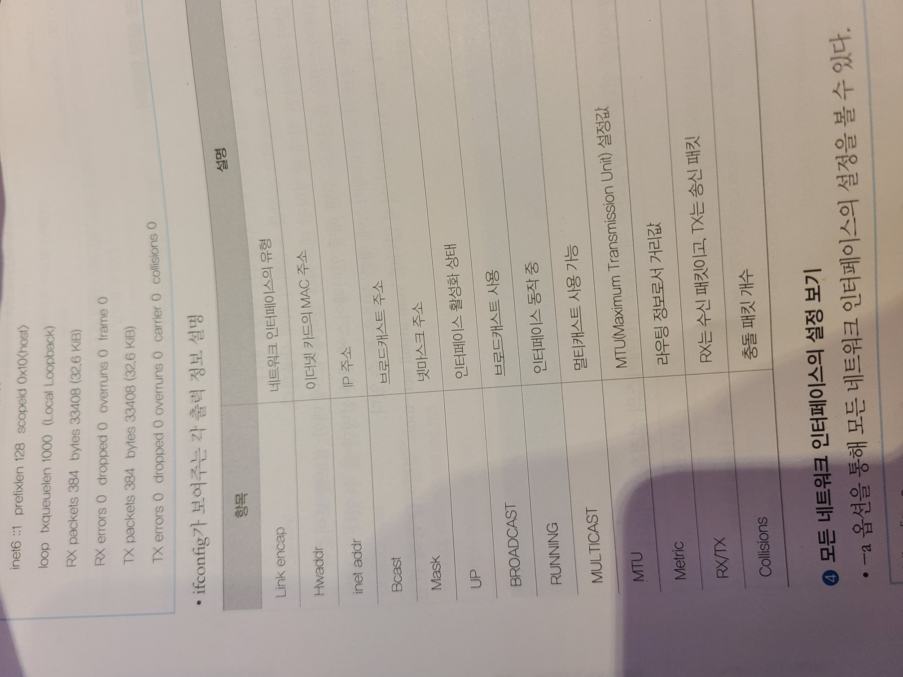

**ip, route, dhclient, systemd-resolve, netplan 등등**

  

리눅스에서 net-tools 라 불리우는 전통적 네트워크 툴을 기반으로 작동하는 계열

```
전통적
공통 : net-tools
Debian : /etc/network/interfaces
RedHat : /etc/sysconfig/network-script \#rhel9 에서 완전히 제거

새로운
공통 : NetworkManager,systemd-networkd,systemd-resolved
Devian : /etc/network/netplan 
			: 백엔드로 NetworkManager,systemd-networkd,systemd-resolved
RedHat : NetworkManager 으로 제어
```

```
NetworkManager :
GUI nm-commection-editor
TUI nmtui
CLI nmcli
```

```
ifconfig :
```

476.jpeg)

  

  

  

```
network-script : 
systemctl restart network 재시작
```