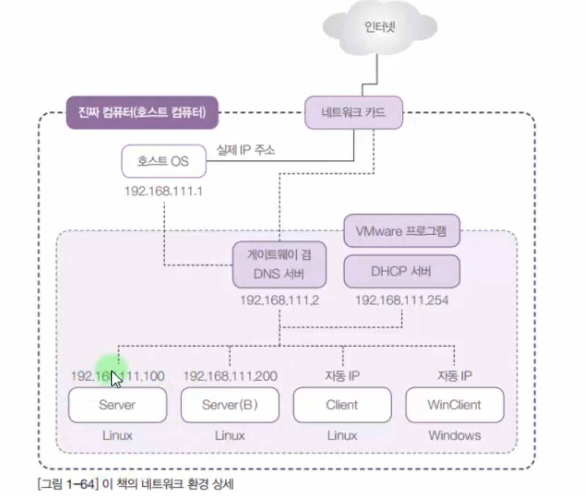

/etc/gdm3/custom.conf 파일을 변경하여 gdm3의 설정을 변경한다  
/etc/pam.d/gdm-password  
3행 루트 관련 처리  
/etc/pam.d/gdm-autologin  

  

cli 네트워크 설정(ip subnet gateway dns)  
/etc/netplan  
default 설정  
network:  
ethernets:  
ens32:  
dhcp4: true  
ve