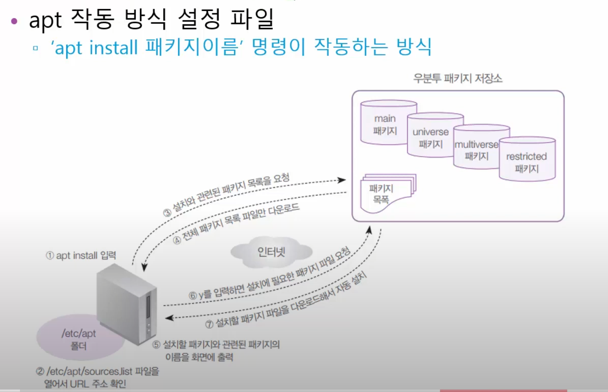
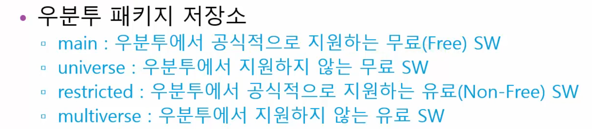
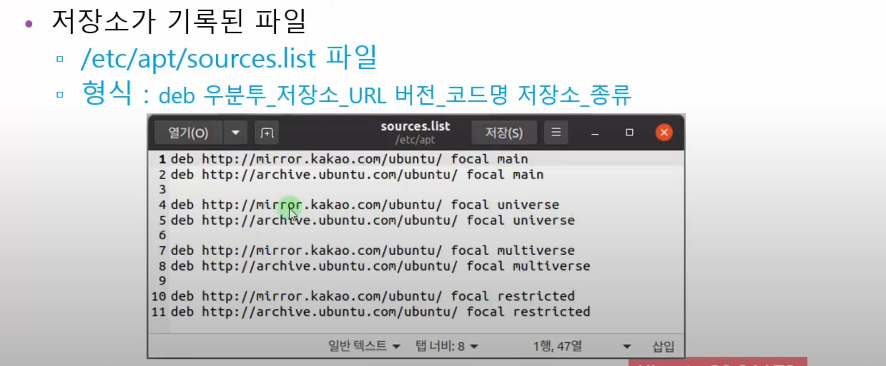

- dpkg

> [!important]  
> calculator_2.1.3-1_amd64.deb구조 : 패키지이름_버전-개정번호_아키텍쳐.deb버전:주버전.부버전.패치버전개정번호 : 문제점 개선var/lib/dpkg/info 폴더 밑에 dpkg 목록이 존재  

- apt

> [!important]  
> /etc/apt/source.list 파일을 열러서 URL 주소 확인  

deb [http://mirror.kakao.com/ubuntu/](http://mirror.kakao.com/ubuntu/) focal main  
deb  
[http://archive.ubuntu.com/ubuntu/](http://archive.ubuntu.com/ubuntu/) focal main

deb [http://mirror.kakao.com/ubuntu/](http://mirror.kakao.com/ubuntu/) focal universe  
deb  
[http://archive.ubuntu.com/ubuntu/](http://archive.ubuntu.com/ubuntu/) focal universe

deb [http://mirror.kakao.com/ubuntu/](http://mirror.kakao.com/ubuntu/) focal multiverse  
deb  
[http://archive.ubuntu.com/ubuntu/](http://archive.ubuntu.com/ubuntu/) focal multiverse

deb [http://mirror.kakao.com/ubuntu/](http://mirror.kakao.com/ubuntu/) focal restricted  
deb  
[http://archive.ubuntu.com/ubuntu/](http://archive.ubuntu.com/ubuntu/) focal restricted