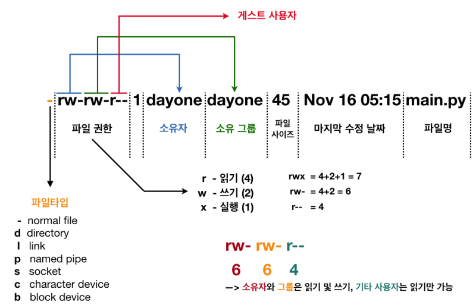

허가권(permition)



- 파일 타입
- permission 정보 (+ 특수 권한)
    - chmod 명령
- 링크 수
- 소유자
- 소유 그룹
- file 사이즈
- 마지막 수정 날짜
- 파일 명

> [!important]  
> chmod 명령 chmod [OPTION] [MODE] [FILE] OPTION -v : 모든 파일에 대해 모드가 적용되는 진단(diagnostic) 메시지 출력. -f : 에러 메시지 출력하지 않음. -c : 기존 파일 모드가 변경되는 경우만 진단(diagnostic) 메시지 출력. -R : 지정한 모드를 파일과 디렉토리에 대해 재귀적으로(recursively) 적용. MODE 파일에 적용할 모드(mode) 문자열 조합. u,g,o,a : 소유자(u), 그룹(g), 그 외 사용자(o), 모든 사용자(a) 지정. +,-,= : 현재 모드에 권한 추가(+), 현재 모드에서 권한 제거(-), 현재 모드로 권한 지정(=) r,w,x : 읽기 권한(r), 쓰기 권한(w), 실행 권한(x) X : "디렉토리" 또는 "실행 권한(x)이 있는 파일"에 실행 권한(x) 적용. s : 실행 시 사용자 또는 그룹 ID 지정(s). "setuid", "setgid". t : 공유모드에서의 제한된 삭제 플래그를 나타내는 sticky(t) bit. 0~7 : 8진수(octet) 형식 모드 설정 값.  

지정 디렉토리 하위의 모든 디렉토리와 파일의 모드를 변경하는 "-R" 외에는 거의 사용하지 않는다

[](https://blog.kakaocdn.net/dn/cg4C9X/btq1nIypDVL/MwUKeJprOtk6qbbbEPkJjK/img.png)

[](https://blog.kakaocdn.net/dn/dKxXah/btq1jkZjWmO/2sWah94UmO18fUdkXzEnM1/img.png)

[](https://blog.kakaocdn.net/dn/bjt7Ic/btq1s3VyALa/4kuVzdG04cXjApQp1k62Q0/img.png)

사용자 자리가 비어있다면 a(모든사용자가 default가 된다)

  

## 디렉토리의 권한

- 디렉토리에 있는 파일 및 디렉토리 리스트 읽기. (r = read) (ls -l 명령은 x 권한이 있어야 한다) 실제로는 ls dirtest 명령이 작동하지 않는다
- 디렉토리에 파일 추가, 이름 변경, 삭제. (w = write)
- 디렉토리에 접근. cd 명령으로 working directory 이동. (x = execute)

  

결론

- 디렉토리의 내용을 읽기 위해서는 읽기(r) 권한 필요.
- 디렉토리의 내용을 변경하기 위해서는 쓰기(w) 권한 필요.
- 디렉토리의 접근을 위해 실행(x) 권한 필요하며 가장 기본적인 접근 권한.

## **3. chmod 명령 사용 예제.**

그럼 이제, 다양한 예제를 통해 chmod 사용 방법을 알아보겠습니다.

```
$ chmod u+x FILE# 파일 소유 사용자에게 실행권한 추가.
$ chmod u+w FILE# 파일 소유 사용자에게 쓰기 권한 추가.
$ chmod u=rwx FILE# 파일 소유 사용자에게 읽기, 쓰기, 실행 권한 지정.
$ chmod u-x FILE# 파일 소유 사용자의 실행 권한 제거.
$ chmod g+w FILE# 파일 소유 그룹에 쓰기 권한 추가.
$ chmod g-x FILE# 파일 소유 그룹의 실행 권한 제거.
$ chmod o=r FILE# 파일 소유 사용자 및 그룹을 제외한 사용자는 읽기만 가능.
$ chmod a-x *# 현재 디렉토리의 모든 파일에서 모든 사용자의 읽기 권한 제거.
$ chmod a-w FILE# 모든 사용자에 대해 쓰기 권한 제거.
$ chmod u=rwx,g=r FILE# 파일 소유 사용자는 모든 권한, 그룹은 읽기만 가능.
$ chmod ug=rw FILE# 파일 소유 사용자와 그룹이 읽기, 쓰기 가능.
$ chmod g=rw,o=r FILE# 파일 소유 그룹은 읽기, 쓰기 가능, 그 외 사용자는 읽기만 가능.
$ chmod ug=rw,o=r FILE# 파일 소유 사용자 및 그룹은 일기, 쓰기 가능, 그외 사용자는 읽기만 가능.
$ chmod 000 FILE# 모든 사용자의 모든 권한 제거. = ---------
$ chmod 664 FILE# 사용자(읽기+쓰기), 그룹(읽기+쓰기), 그외 사용자(읽기) = rw-rw-r--
$ chmod 755 FILE# 사용자(읽기+쓰기+실행), 그룹(읽기+실행), 그외 사용자(읽기+실행) = rwxr-xr-x
$ chmod 777 FILE# 모든 사용자에 모든 권한 추가.
$ chmod -R g+x DIR# DIR 디렉토리 하위 모든 파일 및 디렉토리에 그룹 실행(x) 권한 추가.
$ chmod -R o-wx *# 현재 디렉토리의 모든 파일에서 그외 사용자의 쓰기, 실행 권한 제거
$ chmod -R a-x,a+X *# 현재 디렉토리 기준 모든 파일 읽기 권한 제거, 디렉토리 실행 권한 추가.
$ chmod -R a-x+X *# 위(chmod -R a-x,a+X *)와 동일.
$ chmod u=g FILE# FILE의 그룹 권한 값을 사용자 권한으로 적용.
    $ ls -l
    -rwxr--r-- 1 ppotta manager   23 Mar 26 04:13 FILE
    $ chmod u=g FILE
    -r--r--r-- 1 ppotta manager   23 Mar 26 04:13 FILE

$ chmod u+g FILE# FILE의 사용자 권한에 그룹 권한 값을 추가.
    $ ls -l
    -r-x-w--w- 1 ppotta manager   23 Mar 26 04:13 FILE
    $ chmod u+g FILE
    -rwx-w--w- 1 ppotta manager   23 Mar 26 04:13 FILE
```