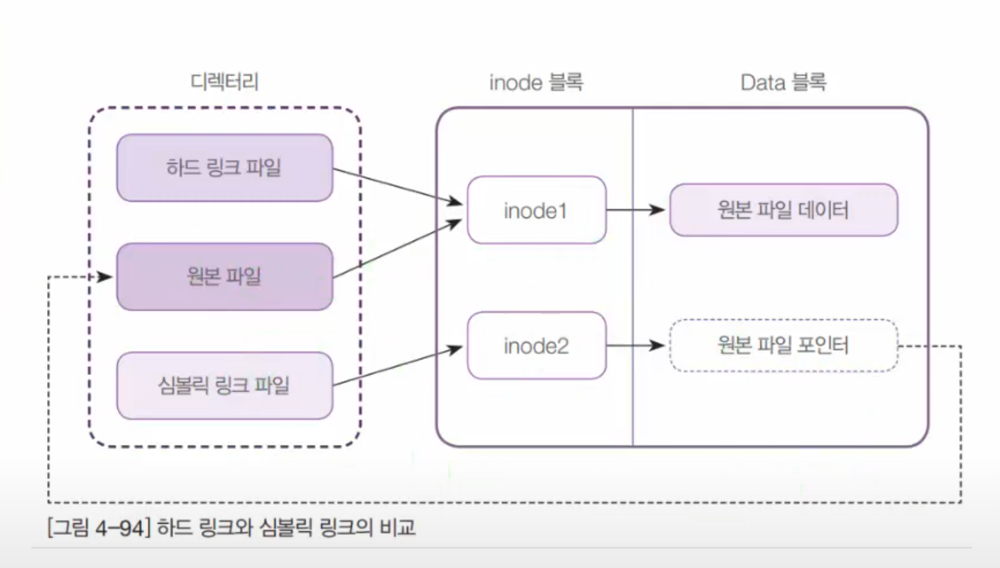

파일은 inode 블록 data 블록 두개로 나누어 진다

inode 에 파일의 metadata가 존재하게 된다  
여기서 metadata란 소유주 권한 등의 정보이다  

  

ls -i 옵션으로 조회 가능

  

> [!important]  
> ln 명령어사용법: ln [옵션]... [-T] TARGET LINK_NAME또는: ln [옵션]... TARGET또는: ln [옵션]... TARGET... DIRECTORY또는: ln [옵션]... -t DIRECTORY TARGET...1번 형식에서는 TARGET에 LINK_NAME으로 링크를 생성합니다.2번 형식에서는 현재 디렉토리에 TARGET에 대한 링크를 생성합니다.3번과 4번 형식에서는 각각의 TARGET에 대한 링크를 DIRECTORY에 생성합니다.기본적으로 하드 링크를 생성하며, --symbolic 옵션을 사용하여 심볼릭 링크를 생성할 수 있습니다.기본적으로 각 대상(새 링크의 이름)은 이미 존재하지 않아야 합니다.하드 링크를 생성할 때는 각 TARGET이 존재해야 합니다. 심볼릭 링크는 임의의 텍스트를 가질 수 있으며,나중에 해석될 경우 상대적인 링크는 부모 디렉토리를 기준으로 해석됩니다.긴 옵션에 대한 필수 인수는 짧은 옵션에 대해서도 필수입니다.--backup[=CONTROL] 각 대상 파일에 대해 백업을 생성합니다.-b --backup과 유사하지만 인수를 받지 않습니다.-d, -F, --directory 슈퍼 사용자가 디렉토리에 하드 링크를 시도할 수 있도록 합니다.(참고: 시스템 제한으로 인해 슈퍼 사용자라도 실패할 수 있습니다.)-f, --force 기존의 대상 파일을 삭제합니다.-i, --interactive 대상 파일을 제거할지 여부를 확인합니다.-L, --logical 심볼릭 링크인 TARGET을 해제합니다.-n, --no-dereference LINK_NAME이 디렉토리로의 심볼릭 링크인 경우 일반 파일로 취급합니다.-P, --physical 하드 링크를 직접적으로 심볼릭 링크에 생성합니다.-r, --relative 심볼릭 링크를 링크 위치를 기준으로 상대 경로로 생성합니다.-s, --symbolic 하드 링크 대신 심볼릭 링크를 생성합니다.-S, --suffix=SUFFIX 일반적인 백업 접미사를 재정의합니다.-t, --target-directory=DIRECTORY 링크를 생성할 DIRECTORY를 지정합니다.-T, --no-target-directory 언제나 LINK_NAME을 일반 파일로 취급합니다.-v, --verbose 링크된 각 파일의 이름을 출력합니다.--help 이 도움말을 표시하고 종료합니다.--version 버전 정보를 출력하고 종료합니다.백업 접미사는 '~'이며, --suffix 또는 SIMPLE_BACKUP_SUFFIX로 설정할 수 있습니다.버전 관리 방법은 --backup 옵션 또는 VERSION_CONTROL 환경 변수를 통해 선택할 수 있습니다.다음은 값입니다:none, off 백업을 생성하지 않음 (--backup이 주어져도 해당)numbered, t 번호가 매겨진 백업을 생성함existing, nil 번호가 매겨진 백업이 존재하면 해당, 그렇지 않으면 단순 백업simple, never 항상 단순 백업을 생성함s 옵션을 사용하면 -L 및 -P 옵션이 무시됩니다. 그렇지 않은 경우, 마지막으로 지정된 옵션은TARGET이 심볼릭 링크인 경우의 동작을 제어하며 기본값은 -P입니다.