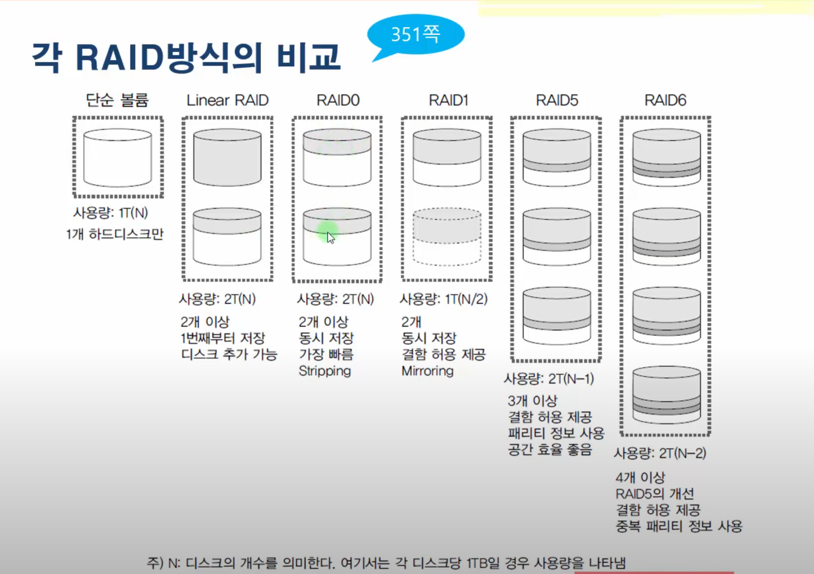
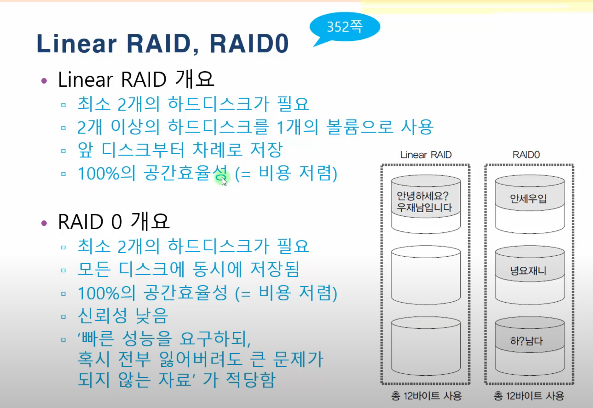
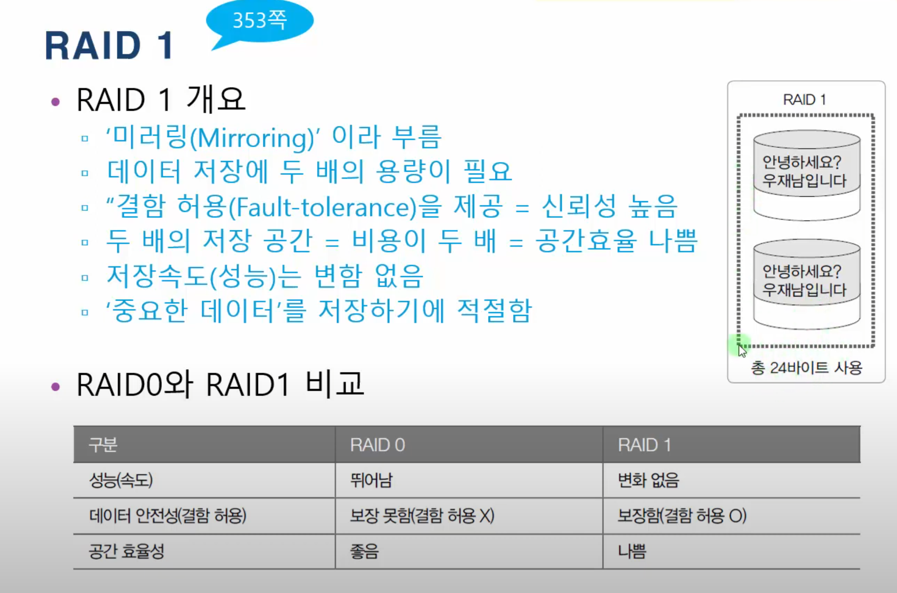
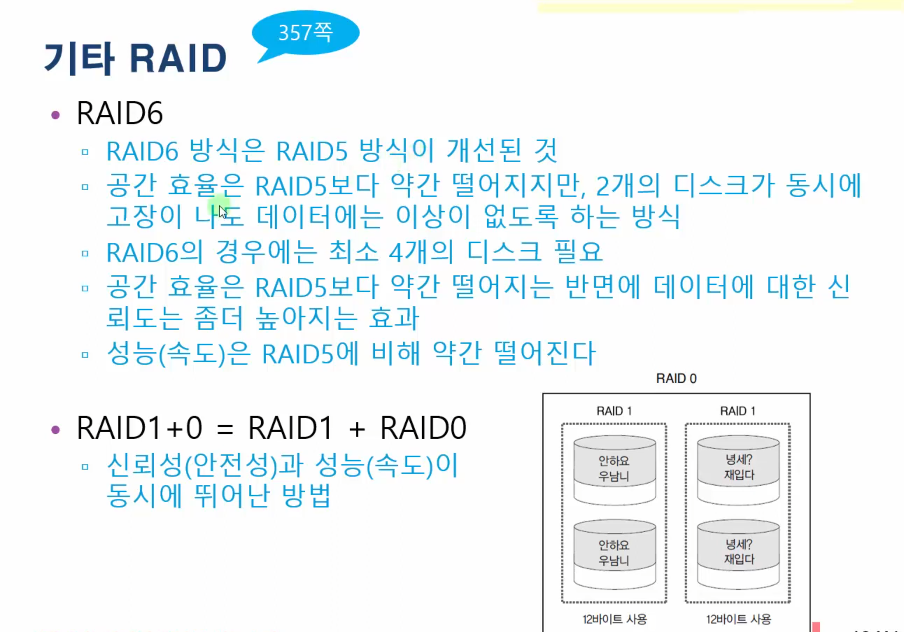
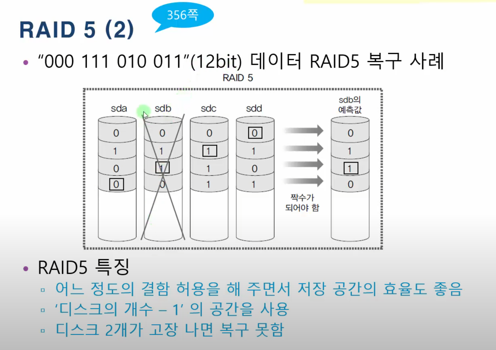
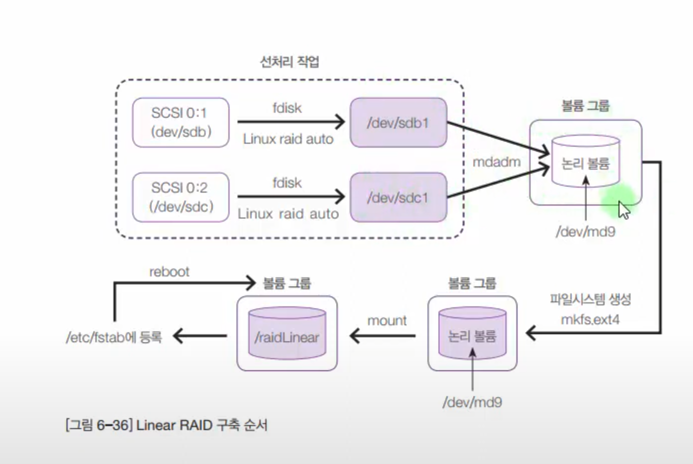

하드웨어 RAID

소프트웨어 RAID

여기서는 소프트웨어 RAID 를 이야기 한다



linear RAID : 디스크 여러개를 단순히 이어서 사용한다

RAID 0 : 순서대로 저장하는 것이 아니라 동시에 사용 속도를 나누어 사용하므로 속도가 N 개 만큼 빠르다

RAID 1 : 복사본 생성

RAID 5 : 1개 오류 허용

RAID 6 :





  






  


mdadm은 Linux에서 md 장치(일명 RAID 배열)를 구축, 관리 및 모니터링하기 위해 사용됩니다.  
  
  


  


## 파티션 생성

- fdisk 명령 + 리눅스 raid raid outo { 16진수 : fd } 로

## 파일 시스템

- mkfs.ext4

## 레이드 구성

```shell
--create [만들 /dev/md{숫자}] --level=[레이드버전] --raid-devices=[장치수] [레이드 만들 장치명1] [레이드 만들 장치명2]…

or

-C [만들 /dev/md{숫자}] -l [레이드 버전] -n [장치 수] [레이드 만들 장치명1] [레이드 만들 장치명2]…****
```

  


## 개별 확인

`--detail [/dev/md{숫자}]`

## 전체 확인

```shell
"/proc/mdstat" 파일
mdadm —detail —scan
```

  


## 단일 장치 제거

`[장치를 제거할 /dev/md{숫자}] --remove [제거할 장치명]`

## 추가

` [장치를 추가할 /dev/md{숫자}] --add [추가할 장치명]`

  


## 정지 ( "야 mdadm, 너 /dev/md0 계산 그만해" )

`stop [해제할 /dev/md{숫자}]`

  

## 슈퍼블록 제거 ( 메타데이터 제거 )

`zero-superblock [해제할 /dev/md{숫자}]`

  

  

  

  

  

  

  

  

  

  

  

  

  

  

추가

**--zero-superblock 사용이유**

RAID 0을 구성했었던, /dev/sdc1 이나 /dev/sdd1을 이용해 다른

RAID를 구성하려고 하면

**"appears to be part of a raid array" 이렇게**

**다른 레이드의 구성요소로 보인다고 하며 뭐라 뜨는데**

이건 파일시스템에서 배웠었던 메타데이터인

**"슈퍼블록"**

이 남아있어서 그럽니다.

즉

**"mdadm --create"로 디스크들을 한번이라도 레이드로 묶으면**

각 디스크에는

이 디스크는 RAID 0의 장치중 하나이고, 512KB씩 데이터를 분산저장해라

이런식의

**"사용설명서(슈퍼블록)"**

같은 것이 남있는것이죠

그래서

**"--zero-superblock"**

이란 명령어를 이용해

완전하게 슈퍼블록까지 지워준 다음 새로운 RAID를 만들어줘야 합니다