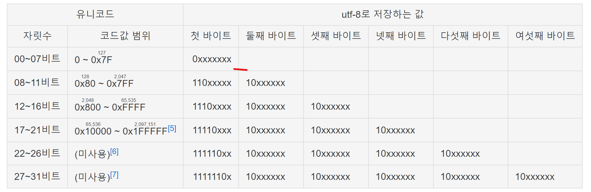
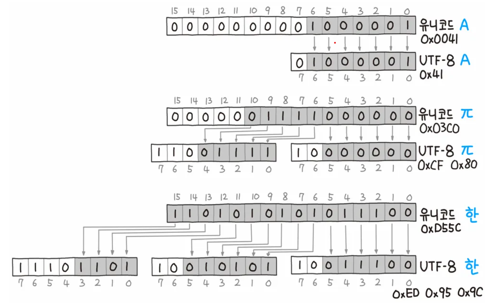
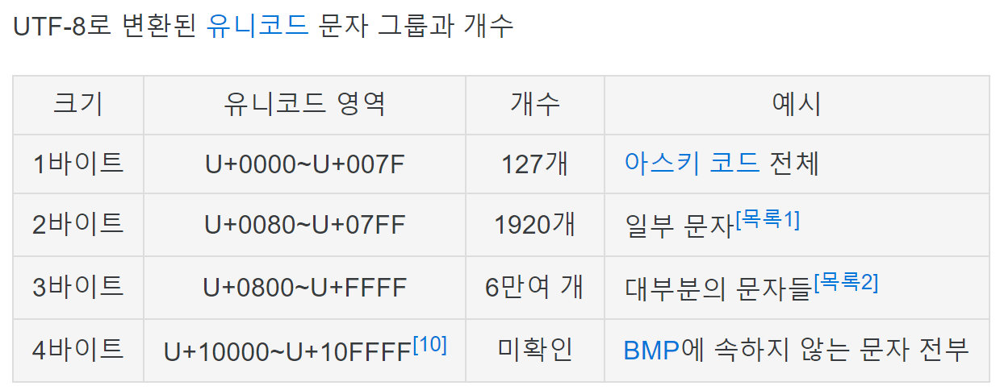

[GEEK News](https://news.hada.io/topic?id=23059) 꼭 읽어보기 바람  

- 예시 1: 문자 **A**는 아스키 문자이며 유니코드 값은 65로, 이는 16진수 0x41(0100 0001)인데, 7비트 이내로 표현 가능하므로 UTF-8로도 0x41로 표현된다.
- 예시 2: 문자 **π**는 유니코드 값이 7비트를 벗어난다. 그러나 11비트 이내에 표현이 가능한 비교적 앞쪽에 위치한 문자며, 따라서 그림과 같이 2바이트에 표현이 가능 하다.
- 예시 3: 문자 **한**은 한글 문자로 16비트를 모두 사용한다. 마지막 16비트가 1이며 따라서 이를 표현하기 위해서는 그림과 같이 3바이트를 사용해야 한다. 참고로 유니코드에는 완성형 한글 11,172자뿐만 아니라 조합형 자모가 모두 포함되어 있으며, 이처럼 한글의 UTF-8 인코딩 값은 모두 각 문자당 3바이트를 차지한다.

- 한글 [조합형](https://namu.wiki/w/%EC%A1%B0%ED%95%A9%ED%98%95) 자모는 (https://namu.wiki/w/UTF-8\#s-3]] 영역에 위치한다.
- 한글 [완성형](https://namu.wiki/w/%EC%99%84%EC%84%B1%ED%98%95) 자모는 [U+3130~318F](https://namu.wiki/w/%EC%9C%A0%EB%8B%88%EC%BD%94%EB%93%9C/3000~3FFF) 영역에 위치한다.
- 한글 [완성형](https://namu.wiki/w/%EC%99%84%EC%84%B1%ED%98%95) 글자는 [U+AC00~D7A3](https://namu.wiki/w/%EC%9C%A0%EB%8B%88%EC%BD%94%EB%93%9C/A000~AFFF)(https://namu.wiki/w/UTF-8\#fn-8) 영역에 위치한다. 예를 들어 '갑'의 유니코드값은 16진수 0xAC11(1010 1100 0001 0001)인데, 이는 총 16비트가 필요하므로 1110 1010 1011 0000 1001 0001 으로 표현한다.
- 완성형 글자 하나도 3바이트인데, 조합형은 자모 하나하나가 각각 3바이트씩(글자 하나당 6~9바이트) 사용한다. 따라서 일반적으로 완성형 글자를 사용하고, 조합형은 완성형에 없는 옛 한글 등을 쓰기 위해서 사용하는 것이 효율이 좋다.

유니코드 변환기
[https://ko.rakko.tools/tools/89/](https://ko.rakko.tools/tools/89/)