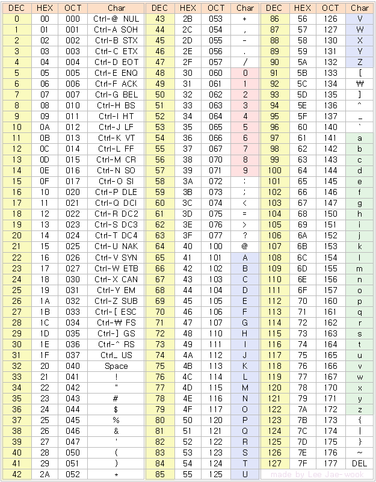
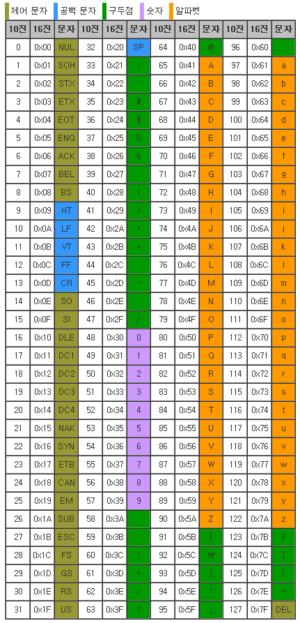

제어 문자
- 0 (Null) - 십진수 0에 해당하는 제어 문자입니다. 주로 문자열의 종료를 나타내는 데 사용됩니다.
- 1 (Start of Heading) - 통신 제어에서 사용되는 제어 문자로, 통신 헤더의 시작을 나타냅니다.
- 2 (Start of Text) - 통신 제어에서 사용되는 제어 문자로, 텍스트 데이터의 시작을 나타냅니다.
- 3 (End of Text) - 통신 제어에서 사용되는 제어 문자로, 텍스트 데이터의 종료를 나타냅니다.
- 4 (End of Transmission) - 통신 제어에서 사용되는 제어 문자로, 전송의 종료를 나타냅니다.
- 5 (Enquiry) - 통신 제어에서 사용되는 제어 문자로, 상대방에게 정보 요청을 나타냅니다.
- 6 (Acknowledge) - 통신 제어에서 사용되는 제어 문자로, 정보 수신을 확인하는 신호를 나타냅니다.
- 7 (Bell) - 터미널이나 출력 장치에서 경고음을 발생시키는 제어 문자입니다.
- 8 (Backspace) - 커서를 한 칸 뒤로 이동시키는 제어 문자입니다.

공백문자
- 9 (Horizontal Tab) - 가로 탭 문자로, 텍스트에서 일정한 간격으로 열을 정렬하거나 수평 간격을 만들기 위해 사용됩니다. 일반적으로 탭 문자는 다음 탭 정지 위치로 커서를 이동시킵니다.
- 10 (Line Feed) - 줄 바꿈 문자로, 텍스트에서 다음 줄로 이동하여 새로운 줄을 시작합니다. 주로 줄 바꿈을 나타내는 역할을 합니다.
- 11 (Vertical Tab) - 세로 탭 문자로, 주로 출력 장치에서 사용되며, 수직 간격을 만들기 위해 사용될 수 있습니다. 일반적으로 세로 탭은 다음 세로 탭 정지 위치로 커서를 이동시킵니다.
- 12 (Form Feed) - 용지 공급 문자로, 출력 장치에서 새로운 페이지를 시작하거나 용지를 공급하는 데 사용됩니다. 일반적으로 용지 공급 문자는 출력 장치의 내부 버퍼를 비우고 커서를 첫 번째 위치로 이동시킵니다.
- 13 (Carriage Return) - 복귀 문자로, 텍스트에서 커서를 현재 줄의 처음으로 이동시킵니다. 주로 줄의 끝으로 커서를 이동한 후 다음 줄로 이동하기 전에 사용됩니다.

제어문자
- 14 (Shift Out) - 출력 장치에 문자 세트 전환이 필요한 경우에 사용됩니다. 주로 7비트 ASCII 코드와 다른 문자 세트 간의 전환이나 확장 문자 세트의 사용을 나타내기 위해 사용됩니다.
- 15 (Shift In) - 출력 장치에서 이전 문자 세트로 전환하는 데 사용됩니다. Shift Out과 짝을 이루며, 문자 세트 전환이 필요한 경우에 사용됩니다.
- 16 (Data Link Escape) - 통신 제어에서 사용되며, 데이터 링크 계층에서 제어 문자가 전송되어야 함을 나타냅니다. 주로 프로토콜 간의 전환, 프레임 동기화 등에 사용됩니다.
- 17 (Device Control 1) - 주로 출력 장치 제어에 사용되는 제어 문자입니다. 특정 출력 장치의 기능을 활성화 또는 비활성화하기 위해 사용될 수 있습니다.
- 18 (Device Control 2) - 주로 출력 장치 제어에 사용되는 제어 문자입니다. 특정 출력 장치의 기능을 활성화 또는 비활성화하기 위해 사용될 수 있습니다.
- 19 (Device Control 3) - 주로 출력 장치 제어에 사용되는 제어 문자입니다. 특정 출력 장치의 기능을 활성화 또는 비활성화하기 위해 사용될 수 있습니다.
- 20 (Device Control 4) - 주로 출력 장치 제어에 사용되는 제어 문자입니다. 특정 출력 장치의 기능을 활성화 또는 비활성화하기 위해 사용될 수 있습니다.
- 21 (Negative Acknowledge) - 통신 제어에서 사용되며, 정보 수신이 실패하거나 확인이 불가능한 경우에 사용됩니다.
- 22 (Synchronous Idle) - 동기화된 통신에서 사용되며, 데이터 전송이 없는 상태를 나타냅니다.
- 23 (End of Transmission Block) - 통신 제어에서 사용되며, 전송 블록의 종료를 나타냅니다.
- 24 (Cancel) - 현재 진행 중인 작업을 취소하거나 중단하기 위해 사용됩니다.
- 25 (End of Medium) - 현재 데이터 저장 장치의 끝을 나타내는 제어 문자입니다.
- 26 (Substitute) - 통신 제어에서 사용되며, 데이터 전송 중에 오류가 발생한 경우 대체 문자로 사용될 수 있습니다.
- 27 (Escape) - 통신 및 컴퓨터 시스템에서 특정 동작이나 명령을 활성화하기 위해 사용됩니다. 주로 제어 시퀀스나 특수 명령을 나타내는 데 사용됩니다.
- 28 (File Separator) - 파일 분리자로, 데이터 레코드 내에서 파일 경계를 나타냅니다.
- 29 (Group Separator) - 그룹 분리자로, 데이터 레코드 내에서 그룹 경계를 나타냅니다.
- 30 (Record Separator) - 레코드 분리자로, 데이터 레코드를 분리하기 위해 사용됩니다.
- 31 (Unit Separator) - 유닛 분리자로, 데이터 레코드 내에서 유닛 경계를 나타냅니다.
- 127 (Delete) - delete 제어 문자로 해당 문자 이전의 문자를 삭제하는 역할을 합니다

vim에서 제어문자 입력
Unix and Linux 에서 사용: ctrl- v ctrl-m
Windows에서 사용: ctrl- q ctrl-m

Ctrl- V다음 입력 문자가 문자 그대로 삽입되어야 함을 vi(shell)에 알리고 ctrl- m는 캐리지 리턴을 위한 키 입력입니다.