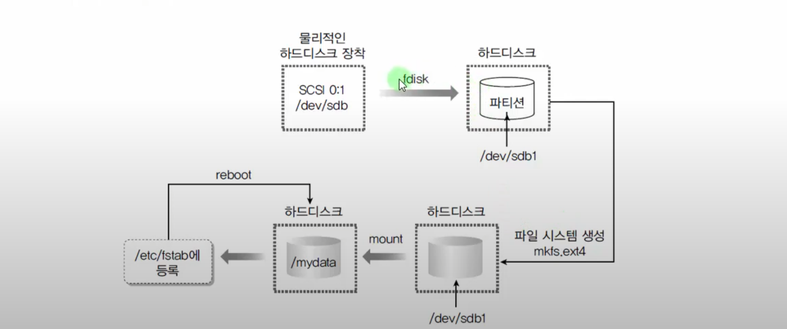

mount 인수 없음
findmnt 추천2
fdisk -l (파티션 설정)
lsblk * 추천1
df -a 
dmesg
blkid

> [!NOTE] 순서
> 디스크 -> 파티션 -> 파일시스템 지정 -> 마운트
> - 디스크 -> 파티션 : 
> 	- 파티션 정보를 저장하는 두 가지 다른 테이블 형식 mbr, gpt 방식을 먼저 정하자
> 		- fdisk
> 		- parted
> 		- gdisk
> 		- cfdisk
> 	- 파티션을 어떻게 사용할지 종류를 지정하자 linux, lvm, swap, EFI 등등
> - 파티션 -> 파일지스템 지정: 
> 	- 파티션을 사용하기 전 어떠한 파일 시스템을 사용할지 정하자
> 		- mkfs.\[파일 시스템] \[옵션] \[디스크 파티션]
> 		- mkfs -t(파일 시스템) \[옵션] \[디스크 파이션]
> 

> [!NOTE] 참조
> 
hard-disk, nvme 장치를 리눅스에서는 **==sd% # (% 장치 순서 abc, \# 은 파티션)==**
cdrom dvd 장치를 리눅스에서는 sr# (#은 숫자)이라고 부른다 여기는 파티션이 존재하지 않는다

  

디스크 파티셔닝 명령어 종류

fdisk mkfs mount

fdisk

  
파일 시스템이란
1. 데이터를 더 빠르게 읽고 저장할 수 있는 단위 블록(클러스터)을 소프트웨어적으로 계산해준다.
2. 분산 저장된 연관된 데이터들을 빠르게 찾게 해준다.
3. 디스크 조각(섹터)모음과 같이 디스크 공간을 효율적으로 사용하게 해준다.
- 하나의 섹터 크기는 512kb 최근에는 4MB 로 바꾸는 추세
- 섹터를 묶은 단위를 클러스터(윈도우) 또는 블록(유닉스)
- 클러스터가 생기면서 낭비되는 현상을 slack space 이라고 한다

1. fdisk:
    - `fdisk /dev/sdX`: 디스크 파티션 테이블을 관리하는 fdisk 도구를 실행합니다.
    - `n`: 새로운 파티션 생성
    - `d`: 파티션 삭제
    - `t`: 파티션 유형 설정
    - `w`: 변경사항 저장 및 종료
2. parted:
    - `parted /dev/sdX`: 디스크 파티션 테이블을 관리하는 parted 도구를 실행합니다.
    - `mklabel`: 새로운 파티션 테이블 생성
    - `mkpart`: 새로운 파티션 생성
    - `rm`: 파티션 삭제
    - `print`: 파티션 정보 출력
    - `quit`: parted 종료
3. gdisk (GPT 디스크 전용):
    - `gdisk /dev/sdX`: GPT 디스크 파티션 테이블을 관리하는 gdisk 도구를 실행합니다.
    - `n`: 새로운 파티션 생성
    - `d`: 파티션 삭제
    - `t`: 파티션 유형 설정
    - `p`: 파티션 정보 출력
    - `w`: 변경사항 저장 및 종료
4. cfdisk (터미널 기반의 파티션 관리 도구):
    - `cfdisk /dev/sdX`: cfdisk를 실행하여 디스크 파티션 관리를 시작합니다.
    - 화살표 키와 Enter 키를 사용하여 메뉴를 탐색하고 파티션 작업을 수행합니다.
5. parted, fdisk, gdisk, cfdisk 외에도 다른 도구 및 프로그램도 있을 수 있습니다. 예를 들어, macOS에서는 `diskutil`을 사용하여 파티션을 관리할 수 있습니다.