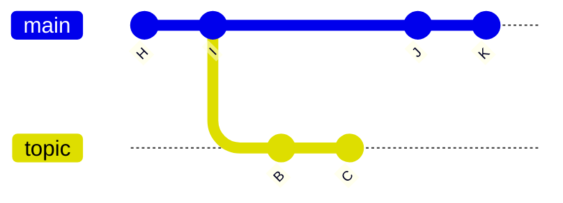
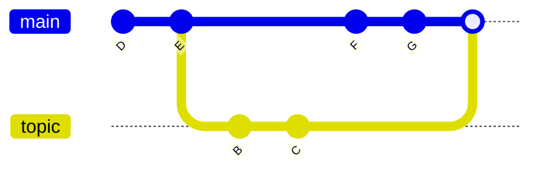
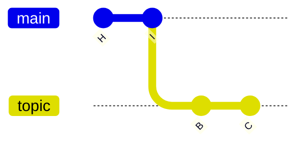
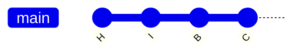
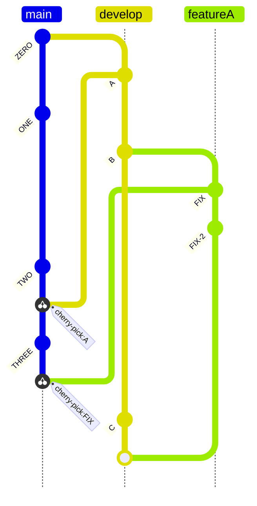

여기서 branch 를 merge 할 때

1. merge commit

이러한 방식이 기본적인 e commit 를 base 로 한 merge 방식이다

git 은 main 의 commit 가 있을 경우 위의 방식을 선택한다
하지만 만약

이렇게 있을 때(merge 시에 잡히는 base 가 최신 커밋일때)는 fast foword merge 가 기본적인 방법이다

즉 여기서 git switch main 에서
git merge topic  실행시 

이렇게 commit 된다

gitGraph
   commit id: "H"
   commit id: "I"
   branch topic
   commit id: "B"
   commit id: "C"
   checkout main
   commit id: "J"
   commit id: "K"
   merge topic id: "M1" type: NO_FF tag: "main에서 merge"
   
   
%%{init: { 'gitGraph': {'showBranches': true, 'showCommitLabel':true}} }%%
gitGraph
   commit id: "H"
   commit id: "I"
   branch topic
   commit id: "B"
   commit id: "C"
   checkout main
   commit id: "J"
   commit id: "K"
   checkout topic
   merge main id: "M2" type: NO_FF tag: "topic에서 merge"