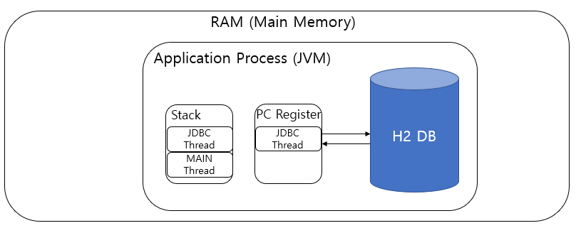
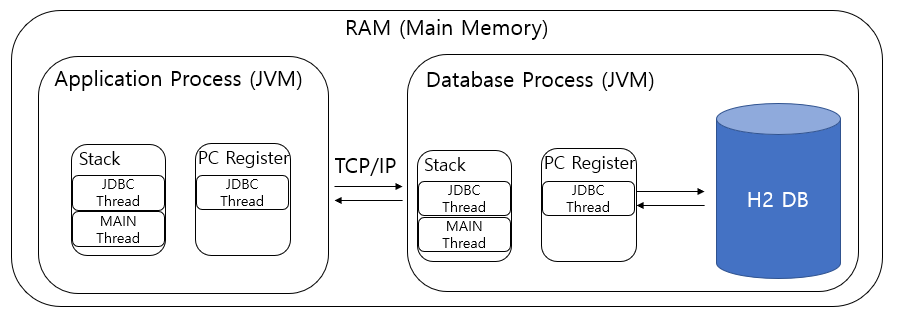

> 다운로드 링크  
> [h2 homepage link](https://www.h2database.com/html/download.html)


| tcp 포트   | 웹 접근 포트  | file 접근          | TCP 접근                             |
| -------- | -------- | ---------------- | ---------------------------------- |
| TCP:9092 | TCP:8082 | `jdbc:h2:~/test` | `jdbc:h2:tcp://<서버IP>:9092/~/test` |


### main

- `h2/bin/h2.sh` == 	`java -cp h2-2.3.232.jar org.h2.tools.Server -tcp -web`
	- `-tcp`: TCP 서버 실행
	- `-tcpAllowOthers`: TCP 서버에 외부 IP에서 접속 가능하게 함
	- `-web`: 웹 콘솔 실행
	- `-webAllowOthers`: 웹 콘솔에 외부 IP에서 접속 가능하게 함
- webGUI 기본
	- link path `localhost:8082`
- cli
	- `java -cp h2-2.3.232.jar org.h2.tools.Shell`


### 추가 도구


| **도구명**              | **설명**                                  | **사용 예시**                                                                 |
|-------------------------|-------------------------------------------|------------------------------------------------------------------------------|
| `RunScript`             | SQL 스크립트 파일을 실행하여 데이터베이스 초기화 또는 변경 적용 | ```bash java -cp h2-*.jar org.h2.tools.RunScript -url jdbc:h2:~/test -user sa -script init.sql ``` |
| `Recover`               | 크래시나 오류 후 데이터베이스 복구         | ```bash java -cp h2-*.jar org.h2.tools.Recover -dir ~/h2db/ ```             |
| `ChangeFileEncryption`  | 데이터베이스 파일 암호화 방식 변경         | ```bash java -cp h2-*.jar org.h2.tools.ChangeFileEncryption -dir ~/h2db/ -oldPassword oldpass -newPassword newpass ``` |


1. **`RunScript`**
   - `.sql` 파일에 저장된 SQL 명령들을 실행합니다.
   - 주로 초기 데이터 삽입, 테이블 생성 등에 사용됩니다.

2. **`Recover`**
   - 데이터베이스가 비정상 종료되었을 경우 로그를 분석해 데이터를 복구합니다.
   - 디렉토리 내의 `.h2.db` 파일을 기준으로 복구 진행.

3. **`ChangeFileEncryption`**
   - 인코딩된 H2 DB 파일의 암호를 변경하거나, 암호화 설정을 업데이트할 때 사용.
   - 보안 강화 및 관리에 유용.


### H2의 Local, Server 개념

#### Embedded 모드




H2 DB를 시스템의 메인 메모리에서 (**JVM 위에서**) 구동시키는 방식으로 application이 종료된다면 저장, 수정된 Data가 손실(휘발) 된다. 즉 기본적으로는 영속적이지 않은 방식이다.  
  
→ 데이터에 대한 영속성을 제공하는 방법은 존재한다.  
  
메인 메모리에 DB를 띄워놓고 해당 DB를 사용하는 Application의 스레드로 데이터에 바로 접근함으로써 데이터 읽기, 쓰기에 대한 성능을 향상할 수 있으므로 유용하게 사용할 수 있으며, 데이터 캐싱 DB에 대해서도 H2를 고려할 수 있다고 한다.  

하지만 JVM에서 데이터 연산에 사용되는 쓰레드를 인터럽트 하지 않을 수 있기에, IO 수행 시에 I/O Handler가 닫힘으로써 데이터베이스의 손상을 일으킬 수 있다.  

#### Server 모드



**해당 이미지는 하나의 시스템에서 서버 모드를 사용하는 경우이다.**  

**별도의 프로세스(JVM)를 통해 DB를 동작시켜 데이터베이스를 영속적으로 사용하는 방법이다. * *

local 환경에서는 localhost의 9092포트를 통해 DB 콘솔에 접근할 수 있으며, 별도의 서버 위에서 동작시킬 경우에 여러 Application을 해당 데이터베이스에 동시적으로 연결할 수 있다.  

서버 모드도 내부적으로는 Embedded 모드와 동일한 실행방식을 가지지만, 모든 데이터의 처리 흐름이 TCP/IP를 통하여 전송되기 때문에 Embedded 모드보다 상대적으로 느릴 수밖에 없다.  

