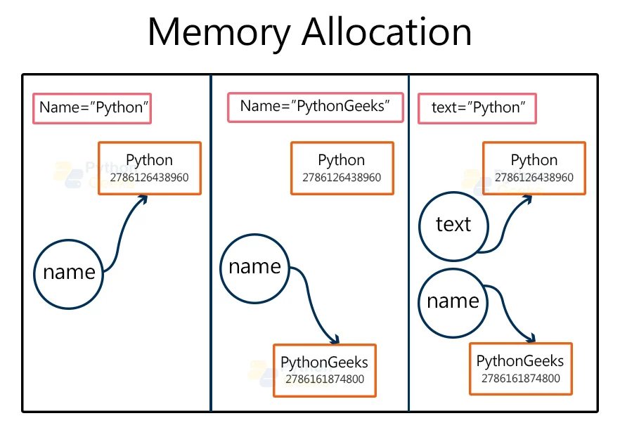
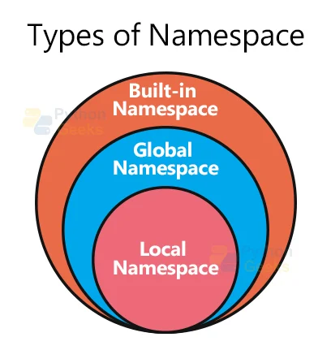
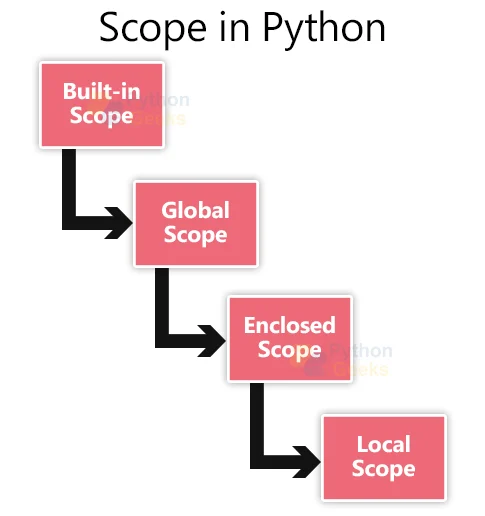

이름공간과 스코프 두가지 개념을 인지
%20image%2020240428050441.png)

python 에는 포인터 개념이 내부적으로 작동

```python
text="PythonGeeks"
print("id of text is:",id(text))
print("id of PythonGeeks is:",id("PythonGeeks"))

id of text is: 140569298174960
id of PythonGeeks is: 140569298174960
```
c/cpp 과 완벽히 동일


> [!NOTE] namespace
> 네임스페이스(Namespaces)는 이름을 객체에 매핑(mapping)하는 것으로, 파이썬에서는 변수가 실제 객체를 참조하는 이름의 집합을 의미한다

> [!NOTE] scope
> 변수(variable)나 함수(function)와 같은 식별자(identifier)들이 유효(valid)하고, 접근(access) 가능한 범위(range)를 말한다


namespace 의 종류
- built in namespace :  인터프리터가 시작될 때 생성
- global namespace :  모든 전역 객체
- local namespace : 함수 내부

```python
def func():
    var1 = 3
    print("지역공간 namespace : " , locals())
var = 3
print("built in namespace : " , dir())
print("전역공간 namespace : " , globals())
func()

built in namespace :  built in namespace :  ['ArithmeticError', 'AssertionError', 'AttributeError', 'BaseException', 'BaseExceptionGroup', 'BlockingIOError', 'BrokenPipeError', 'BufferError', 'BytesWarning', 'ChildProcessError', 'ConnectionAbortedError', 'ConnectionError', 'ConnectionRefusedError', 'ConnectionResetError', 'DeprecationWarning', 'EOFError', 'Ellipsis', 'EncodingWarning', 'EnvironmentError', 'Exception', 'ExceptionGroup', 'False', 'FileExistsError', 'FileNotFoundError', 'FloatingPointError', 'FutureWarning', 'GeneratorExit', 'IOError', 'ImportError', 'ImportWarning', 'IndentationError', 'IndexError', 'InterruptedError', 'IsADirectoryError', 'KeyError', 'KeyboardInterrupt', 'LookupError', 'MemoryError', 'ModuleNotFoundError', 'NameError', 'None', 'NotADirectoryError', 'NotImplemented', 'NotImplementedError', 'OSError', 'OverflowError', 'PendingDeprecationWarning', 'PermissionError', 'ProcessLookupError', 'RecursionError', 'ReferenceError', 'ResourceWarning', 'RuntimeError', 'RuntimeWarning', 'StopAsyncIteration', 'StopIteration', 'SyntaxError', 'SyntaxWarning', 'SystemError', 'SystemExit', 'TabError', 'TimeoutError', 'True', 'TypeError', 'UnboundLocalError', 'UnicodeDecodeError', 'UnicodeEncodeError', 'UnicodeError', 'UnicodeTranslateError', 'UnicodeWarning', 'UserWarning', 'ValueError', 'Warning', 'ZeroDivisionError', '__build_class__', '__debug__', '__doc__', '__import__', '__loader__', '__name__', '__package__', '__spec__', 'abs', 'aiter', 'all', 'anext', 'any', 'ascii', 'bin', 'bool', 'breakpoint', 'bytearray', 'bytes', 'callable', 'chr', 'classmethod', 'compile', 'complex', 'copyright', 'credits', 'delattr', 'dict', 'dir', 'divmod', 'enumerate', 'eval', 'exec', 'exit', 'filter', 'float', 'format', 'frozenset', 'getattr', 'globals', 'hasattr', 'hash', 'help', 'hex', 'id', 'input', 'int', 'isinstance', 'issubclass', 'iter', 'len', 'license', 'list', 'locals', 'map', 'max', 'memoryview', 'min', 'next', 'object', 'oct', 'open', 'ord', 'pow', 'print', 'property', 'quit', 'range', 'repr', 'reversed', 'round', 'set', 'setattr', 'slice', 'sorted', 'staticmethod', 'str', 'sum', 'super', 'tuple', 'type', 'vars', 'zip']
전역공간 namespace :  {'__name__': '__main__', '__doc__': None, '__package__': None, '__loader__': <_frozen_importlib_external.SourceFileLoader object at 0x7f2a74ccb350>, '__spec__': None, '__annotations__': {}, '__builtins__': <module 'builtins' (built-in)>, '__file__': '/home/shinnk/source_main/personal/python/class/namepace.py', '__cached__': None, 'func': <function func at 0x7f2a74c704a0>, 'var': 3}
지역공간 namespace :  {'var1': 3}
```

함수 내부에서 


**a. Built-in scope:** 모든 식별자들에 영향을 끼친다

**b. Global scope:** 모든 식별자에 영향을 끼친다

**c. Local scope:** 함수 내부의 식별자들에 영향을 끼친다

**d. Enclosed or nonlocal scope:** 위치된 곳과 내부의 함수에 영향을 끼친다


global 로 변수를 선언하면 변수를 조회할때 global namespace 부터 조회하게 된다
nonlocal 키워드를 사용하면 변수를 조회할때 한단계 위의 namespace 부터 조회하게 된다


```python
a = 3
print(locals())
print(globals())


locals() # 위치한곳의 namespace 조회
globals() # global name space 조회
print(__builtins__.__dict__) # biltins name 조회
dir() # namespace 조회 아님 하지만 builtins 의 경우 이미 저장되어 있으므로 이렇게 조회함
객체.__dict__() # 객체의 namespace 조회
```


> [!NOTE] Title
> 변수가 호출되면 어떠한 객체와 연결되어 있는지 확인하기 위해 가장 가까운 scope 부터 확인
> 만약 함수 내부의 변수라면 local -> enclosed -> global -> built-in 
> namespace 순으로 확인하며 먼저 발견되면 그것을 사용한다
> global 은 현제 파일의 전역 이름과 모듈의 전역 이름이 있는데 현제 파일의 전역파일이 먼저 조회된다


