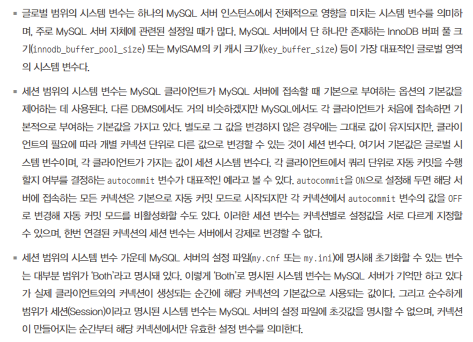
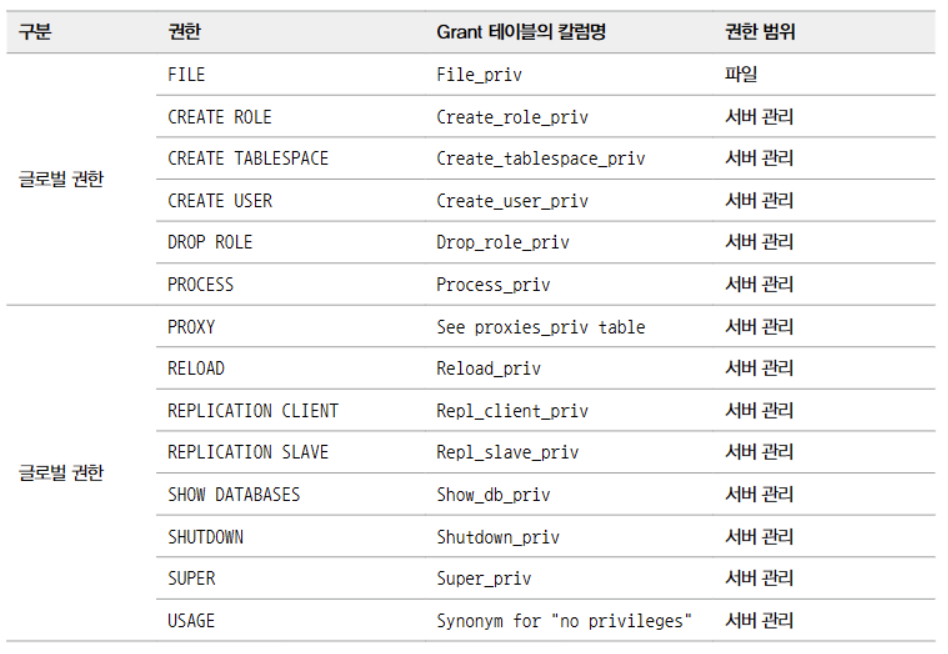
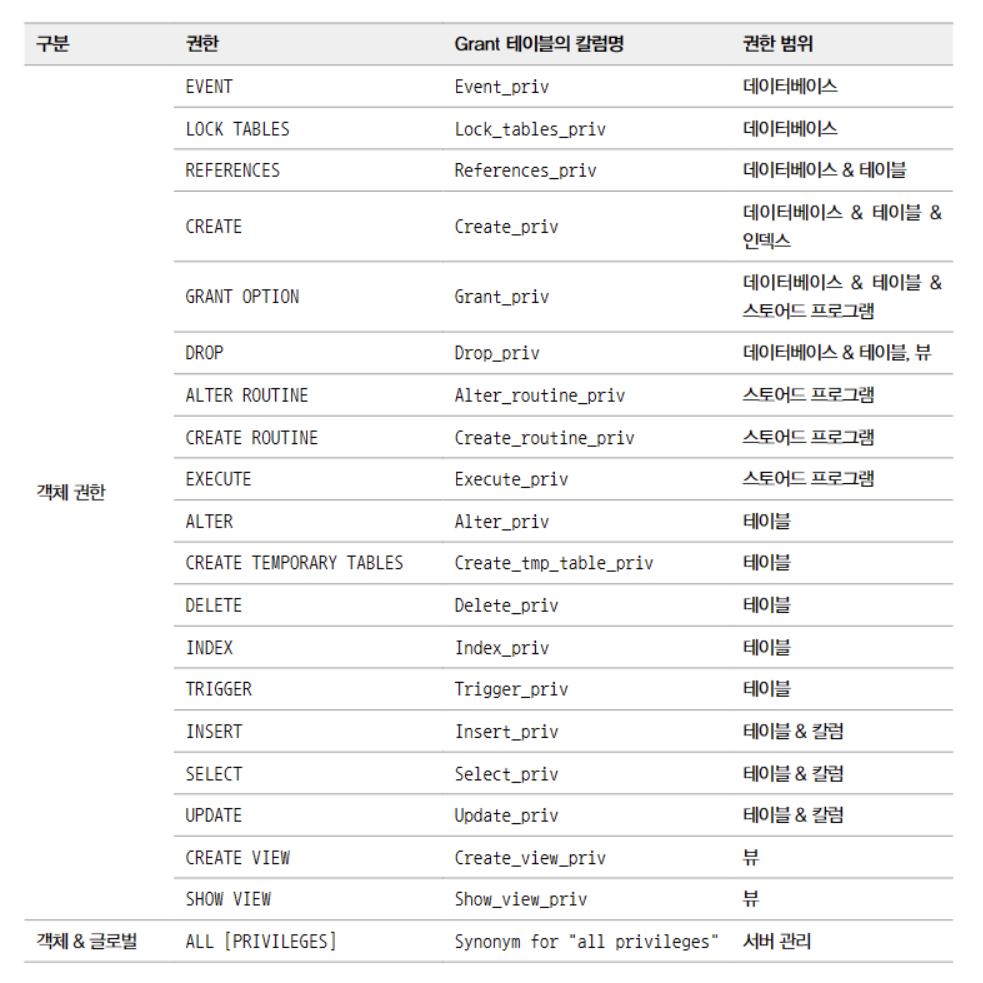
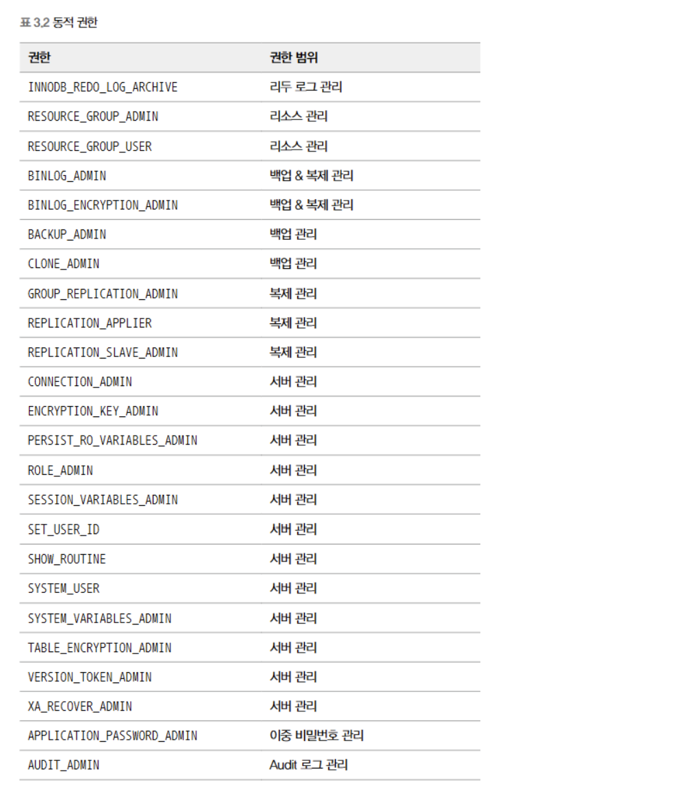

## 서버

```bash
$ apt install mysql-server, mysql-common

update-alternatives: using /var/lib/mecab/dic/ipadic-utf8 to provide /var/lib/mecab/dic/debian (mecab-dictionary) in auto mode
Setting up mysql-server-8.0 (8.0.40-0ubuntu0.22.04.1) ...
update-alternatives: using /etc/mysql/mysql.cnf to provide /etc/mysql/my.cnf (my.cnf) in auto mode
Renaming removed key_buffer and myisam-recover options (if present)
mysqld will log errors to /var/log/mysql/error.log
mysqld is running as pid 13348
Created symlink /etc/systemd/system/multi-user.target.wants/mysql.service → /lib/systemd/system/mysql.service.
Setting up mysql-server (8.0.40-0ubuntu0.22.04.1) ...
Processing triggers for man-db (2.10.2-1) ...
Processing triggers for libc-bin (2.35-0ubuntu3.8) ...
```

동작 확인 : `nc -zv localhost(host/ip) mysql(port/service name)`

mysql 서버 업그레이드
1. 인프레이스 업그레이드 : 물리적 파일을 그대로 두고 업그레이드
2. 논리적 업그레이드 : 덤프(mysqldump)


시스템 변수 : `show GLOBAL VARIABLES`
1. 적용 범위에 따른 구분: 글로벌 변수(전체 적용, my.cnf를 사용해 영구적 변경가능)와 세션 변수(세션별로 적용) both(전체 기본값은 설
   global : 영구 변경, 모든 세션에 동등하게 영향끼침
   session : 각 세션별 변경가능
   both : 영구 변경가능하면서 세션별로 따로 설정 가능
2. 정적 변수 동적 변수 : 서버가 동작중인 상태에서 변경가능 여부 : 
   정적변수my.cnf 를 변경해야 정적으로 변경되고(즉 재시작)
   동적변수 : set 명령으로 동적으로 변경할 수 있다

db 전용 서버 설정

```json
[mysqld]
server—id=l

user=mysql
datadir=/data/mysql/
default_storage_engine=innodb
defaul_tmp_storage_engine=innodb
table_open_cache=30000
table_open_cache_instances=16
open-fi1es-limit=65535
default—time-zone='+09:00'
socket=/tmp/mysq
local_infi1e=0FF
block_encryption_mode='aes-256-ecb'

core_file
innodb_buffer_pool_in_core_file=OFF

max_allowed_packet=67108864
explicit_defaults_for_timestamp=ON
sql-mode= "STRICT_TRANS_TABLES,NO_ZERO_IN_DATE, NO_ZERO_DATE, ERROR_FOR_DIVISION_BY_ZERO,NO_ENGINE SUBSTITUTION"

character-set-server-utf8mb4
character-set-filesystem-utf8mb4
collation_server-utf8mb4_0900_ai_ci
skip-character-set-client-handshake

max_connections=8000
max_connect_errors=999999

activate_all_roles_on_login=1
skip-name-resolve

ngram_token_size=2
max_heap_table_size=10M
tmp_table_size=10M
tmpdir=/data/mytmp/
secure-file-priv=/data/securefile/
default_password_lifetime=0

sysdate-is-now

### InnoDB
innodb_sort_buffer_size=64M

innodb_data_home_dir=/data/mysql/
innodb_data_file_path=ibdata1:100M:autoextend
innodb_temp_data_file_path=ibtmp1:12M: autoextend
innodb_log_group_home_dir=/log/innodb-log
innodb_log_files_in_group=3
innodb_log_file_size=2048M
innodb_file_per_table=ON
innodb_undo_directory=/log/innodb-undo/
innodb_rollback_segments=64
innodb_undo_tablespaces=2
innodb_max_undo_log_size=536870912
innodb_undo_log_truncate ON
innodb_status_output_locks=ON
innodb_print_all_deadlocks-ON
innodb_adaptive_hash_index=OFF
innodb_buffer_pool_size=206
innodb_buffer_pool_instances=10
innodb_doublewrite=OFF
innodb_checksun_algorithm=CRC32
innodb_flush_log_at_trx_commit=0
innodb_flush_method=0_DIRECT_NO_FSYNC
innodb_io_capacity=1000
innodb_io_capacity_max=5000
innodb_ft_enable_stopword-OFF
innodb_cmp_per_index_enabled=ON

### Performance schema
performance_schema=ON
performance-schema-instrument="stage/%=ON"
performance-schema-instrument='memory/%=ON'
performance-schema-instrument='wait/%=ON'
performance-schema-consumer-events_stages_current=ON
performance-schema-consumer-events_stages_history=ON
performance-schema-consumer-events_stages_history_long=ON
performance-schema-consumer-events_statements_history-OFF

performance-schema-consumer-events_statements_history_long=ON
performance-schema-consumer-events_waits_current=ON
performance-schema-consumer-events_waits_history=ON
performance-schena-consumer-events_waits_history_long=ON

performance_schema_events_stages_history_long_size=50000
performance_schema_events_stages_history_size=10
performance_schema_events_statements_history_long_size=50000
performance_schena_events_statements_history_size=10
performance_schema_events_waits_history_long_size=50000
performance_schema_events_waits_history_size=10

### TDE (Encryption)
early-plugin-load-keyring_file.so
keyring_file_data = /data/tde/tde_master.key
### Password validate

password_history=5
validate_password.length=8
validate_password.mixed_case_count=2
validate_password.number_count=2
validate_password. special_char_count=2
validate_password.dictionary_file-prohibitive_dictionary.data
validate_password.policy=STRONG

### MySQL BinLog
log-bin=/log/mysql-bin/mysql-bin
sync_binlog=0
enforce_gtid_consistency=ON
gtid-mode=ON
binlog_checksum=CRC32
binlog_order_commits=ON
binlog_format=ROW
binlog_row_image=MINIMAL
max_binlog_size=104857600

### MySQL Replica Options
slave_parallel_type=LOGICAL_CLOCK

slave_parallel_workers=4
slave_preserve_commit_order=1
binlog_rows_query_log_events=ON
log_slave_updates

### Relay Log
relay-log-/log/relay-bin/relay-bin
relay_log_info_repository=TABLE
relay_log_recovery=ON
relay_log_purge=ON

### MySQL ErrorLog
log-error-/log/mysql-err.log
log_error_verbosity=1

### MySQL Slow Log
slow-query-log=1
long_query_time=1
log_slow_extra=1
log_slow_admin_statements=1
log_slow_slave_statements=1
slow_query_log_file=/log/mysql-slow.log

### MySQL Log Expire
binlog_expire_logs_seconds=259200
log-raw
log_timestamps=SYSTEM

[client]
socket /tmp/mysql.sock
```

## 계정

SUSTEM_USER 권한을 부여하면 시스템계정
이외에는 일반계정


비밀번호 유효성검사
`INSTALL COMPONENT 'file://component_validate_password';`
`UNINSTALL COMPONENT 'file://component_validate_password';`

권한

`GRANT (권한 목록) ON (객체) TO (유저);`
`SHOW GRANTS FOR 'username'@'host';`
`REVOKE ALL PRIVILEGES ON *.* FROM 'username'@'host';`

객체는 데이터베이스, table 이 될수 있다
정적권한을 줄때는 객체를 명시하지 말아야 한다
정적권한

동적권한


기본적으로 role 은 활성화 되지 않음: `activate_all_roles_on_login=ON`
`mysql.default_roles`, `mysql.role_edges`
`mysql.user` 의 `account_locked` 속성이 Y 이면 role, N 이면 user


