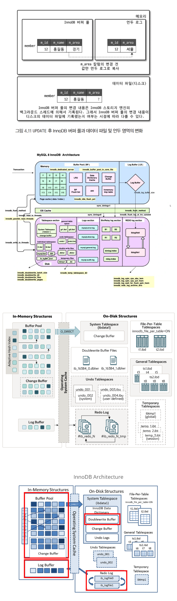
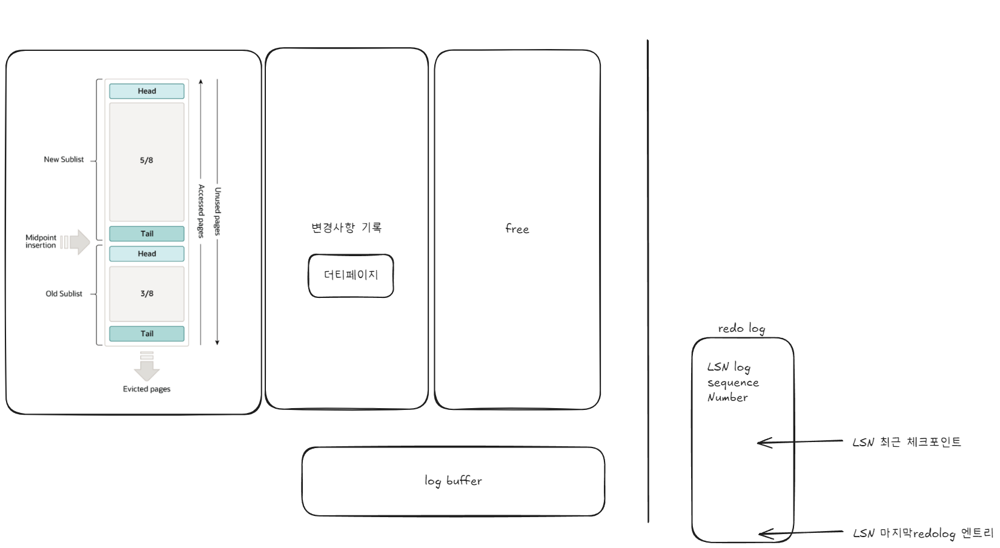
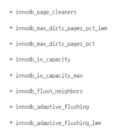
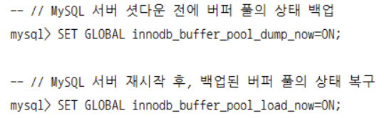

mysql 엔진 : 커넥션핸들러, sql 파서, 전처리기, 옵티마이저
스토리지 엔진 : 데이터를 스토리지에 W 또는 R => 키캐시(MyISAM) 또는 버퍼풀기능

mysql 엔진 -> 스토리지 엔진으로 요청시 헨들러 api 사용
```sql
SHOW GLOBAL STATUS LIKE 'handler%';
```
실행중인 스레드 목록
```sql
SELECT thread_id, name, type, processlist_user, processlist_host 
FROM performance_schema.threads 
ORDER BY thread_id;
```

플러그인 시스템 컴포넌트 시스템 차이
플러그인 : `show plugins;`
컴포넌트 : `select * from mysql.component;`


## innodb




데드락 감지 스레드(innodb_deadlock_detect) 을 OFF 하고 deadlock 발생을 시간(특정 데이터의 xlock 요청에 의한 잠김시간)으로 감지해서 요청 실패로 처리가능 innodb_lock_wait_timeout

### innodb buffer pool

nodb_buffer_pool_size = innodb_buffer_pool_chunk_size * innodb_buffer_pool_instances
청크는 128MB 단위 pool size 기본값 128M 즉 인스턴스 1
`show variables like '%innodb_buffer%';`

1. LRU(LRU+MRU)
2. 플러쉬(flush)
3. 프리(free)
`SHOW engine innodb status`
1. innodb_page_cleaners : 이 변수는 더티 페이지를 디스크에 동기화하는 클리너 스레드의 수를 설정합니다 이 변수의 값은 버퍼 풀 인스턴스 수보다 작아야 한다
2. innodb_max_dirty_pages_pct_lwm : 이 변수는 더티 페이지의 비율이 이 값 이하로 떨어질 때까지 클리너 스레드가 더티 페이지를 디스크에 기록. LWM(Low Water Mark)은 페이지가 낮은 임계값에 도달했을 때 동작을 시작하는 기준.
3. innodb_max_dirty_pages_pct : 이 변수는 버퍼 풀 내에서 더티 페이지가 차지할 수 있는 최대 비율을 설정. 이 비율을 초과하면 InnoDB는 더티 페이지를 디스크에 플러시하여 비율을 줄이려 한다. 기본값은 75%
4. innodb_io_capacity : 이 변수는 InnoDB가 I/O 작업을 수행할 수 있는 최대 용량을 설정한다. 디스크의 I/O 성능에 따라 이 값을 조정하여 성능을 최적화할 수 있다. 기본값은 200. <= 실제 디스크 성능보다는 db 서버가 사용할 수 있는 속도
5. innodb_io_capacity_max : 이 변수는 InnoDB가 I/O 작업을 수행할 수 있는 최대 I/O 용량을 설정. innodb_io_capacity보다 큰 값을 설정할 수 있으며, 주로 고속 SSD와 같은 스토리지 장치를 사용할 때 유용.
6.  innodb_adaptive_flushing : 이 변수는 InnoDB가 플러시 작업을 적응적으로 조절할 수 있도록 설정합니다. 이 기능을 활성화하면 시스템의 현재 부하에 따라 플러시 빈도를 조절하여 성능을 최적화할 수 있습니다.
7. innodb_adaptive_flushing_lwm : 이 변수는 적응형 플러싱이 활성화된 경우, 더티 페이지 비율이 이 값 이하로 떨어질 때까지 플러시 작업을 수행하도록 설정합니다. LWM이 낮을수록 더티 페이지를 더 자주 플러시하게 됩니다.
8. innodb_flush_neighbors : 이 변수는 InnoDB가 페이지를 디스크에 플러시할 때, 해당 페이지의 이웃 페이지도 함께 플러시할지 여부를 결정. 값이 1이면 이웃 페이지를 플러시하고, 0이면 플러시하지 않는다. SSD와 같은 스토리지에서는 0으로 설정(활성화 하지 않음 랜덤 읽기 성능이 뛰어나므로)하는 것이 성능에 유리할 수 있음



각 테이블의 인덱스별 데이터 페이지가 얼만큼 Innodb buffer pool 에 적제되어 있는가
```sql
SELECT
	it.name table_name,
	ii.name index_name,
	ici.n_cached_pages n_cached_pages
FROM information_schema. innodb_tables it
	INNER JOIN information_schema. innodb_indexes ii ON ii. table_id = it.table_id
	INNER JOIN information_schema.innodb_cached_indexes ici ON ici.index_id = ii.index_id
WHERE it.name=CONCAT('employees', '/', 'employees');
```
테이블 전체 페이지 중에서 어느정도의 비율이 Innodb 버퍼풀에 적재되어 있는가
```sql
SELECT
	(SELECT SUM(ici.n_cached_pages) n_cached_pages
	FROM information_schema.innodb_tables it
		INNER JOIN information_schema.innodb_indexes ii ON ii. table_id = it. table_id
		INNER JOIN information_schema.innodb_cached_indexes ici ON ici.index_id = ii.index_id
	WHERE it.name=CONCAT(t.table_schema, '/', t.table_name)) as total_cached_pages, ((t.data_length + t.index_length - t.data_free)/@@innodb_page_size) as total_pages
FROM information_schema.tables t
WHERE t.table_schema='employees' AND t.table_name='employees';
```


리두로그에는 변경된 단일 데이터?
double write buffer 에는 변경된 전체 페이지

언두 레코드 건수
```sql
SELECT count 
FROM information_schema.innodb_metrics 
WHERE SUBSYSTEM='transaction' 
AND NAME='trx_rseg_history_len';
```


