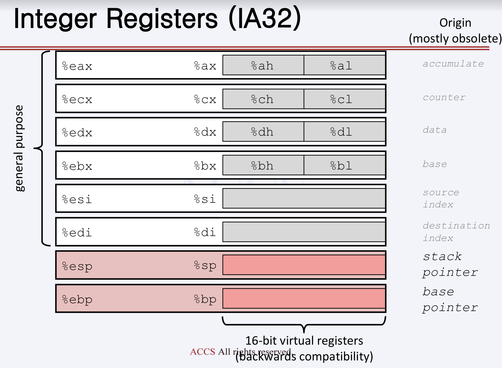
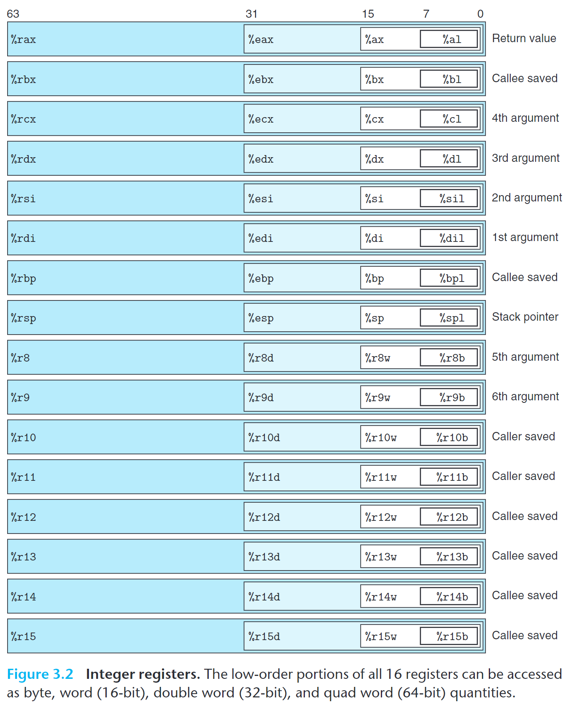

%20image%2020240417101228.png)

## vscode c 디버깅 시에 나오는 레지스터 종류
- other register :
	- x0 - x28
	- fp
	- w0 - w28
	- v0 - v31
	- fpsr
	- fpsr
	- far
	- esr
	- exception
- cpu
	- lr
	- sp
	- pc
	- cpsr
- IEEE single
	- s0 - s31
- IEEE double
	- d0 - d31