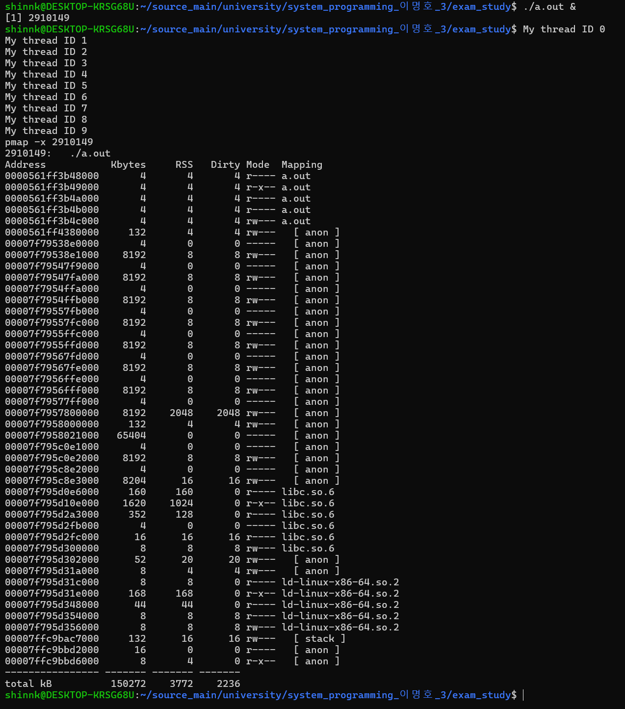

%20image%2020241207204591.png)
1. `2910149: ./a.out`
    - 프로세스 ID 2910149의 실행 파일 `./a.out`에 대한 메모리 맵입니다.
2. `Address Kbytes RSS Dirty Mode Mapping`
    - 각 열의 의미:
        - **Address**: 메모리 주소
        - **Kbytes**: 해당 영역의 크기(KB)
        - **RSS**: 실제 메모리에 올라간 크기(KB)
        - **Dirty**: 수정된 페이지 수(KB)
        - **Mode**: 메모리 접근 권한
        - **Mapping**: 매핑된 파일이나 영역의 설명
3. `0000561ff3b48000 4 4 4 r---- a.out`
    - 실행 파일의 읽기 전용 영역입니다.
4. `0000561ff3b49000 4 4 4 r-x-- a.out`
    - 실행 권한이 있는 코드 영역입니다.
5. `0000561ff3b4a000 4 4 4 r---- a.out`
    - 추가적인 읽기 전용 데이터 영역입니다.
6. `0000561ff3b4b000 4 4 4 r---- a.out`
    - 또 다른 읽기 전용 영역입니다.
7. `0000561ff3b4c000 4 4 4 rw--- a.out`
    - 쓰기 및 읽기 가능한 데이터 영역입니다(예: 전역 변수).
8. `0000561ff4380000 132 4 4 rw--- [ anon ]`
    - 익명 메모리 매핑 영역으로 힙(heap) 영역일 수 있습니다.
9. `00007f79538e0000 4 0 0 ----- [ anon ]`
    - 보호된 메모리 영역입니다.
10. `00007f79538e1000 8192 8 8 rw--- [ anon ]`
    - 스레드 스택 영역으로 8MB의 크기를 갖습니다.
그 이후 줄들은 각 스레드별 스택 영역을 나타냅니다(스레드마다 약 8MB씩 할당):
- `00007f79547fa000`부터 `00007f7956fff000`까지 반복적으로 나타나는 8MB 크기의 `rw--- [ anon ]` 영역들은 각 스레드의 스택입니다.

마지막 부분:

- `00007f795d0e6000`부터 `00007f795d356000`까지는 라이브러리(`libc.so.6`, `ld-linux-x86-64.so.2`)의 메모리 매핑 영역입니다.
- `00007ffc9bac7000 132 16 16 rw--- [ stack ]`는 메인 스레드의 스택입니다.
- `00007ffc9bbd2000`부터는 환경 변수나 프로그램 인자들이 저장된 영역일 수 있습니다.


```c


void* child_routine(void* param) {
    int id = (int)param;
    printf("My thread ID %i\n", id);
    sleep(100);
    pthread_exit(0);
}

int main() {
    pthread_t thread[NUMTHREAD];
    int param[NUMTHREAD];
    void* return_value[NUMTHREAD];
    for (int i = 0; i < NUMTHREAD; i++) {
        param[i] = i;
        pthread_create(&thread[i], 0, child_routine, (void*)param[i]);
    }
    for (int i = 0; i < NUMTHREAD; i++) {
        pthread_join(&thread[i], 0);
    }
}
```


```bash
shinnk@DESKTOP-KRSG68U:~$ ./a.out &
[1] 2910149
shinnk@DESKTOP-KRSG68U:~$ My thread ID 0
My thread ID 1
My thread ID 2
My thread ID 3
My thread ID 4
My thread ID 5
My thread ID 6
My thread ID 7
My thread ID 8
My thread ID 9
pmap -x 2910149
2910149:   ./a.out
Address           Kbytes     RSS   Dirty Mode  Mapping
0000561ff3b48000       4       4       4 r---- a.out
0000561ff3b49000       4       4       4 r-x-- a.out
0000561ff3b4a000       4       4       4 r---- a.out
0000561ff3b4b000       4       4       4 r---- a.out
0000561ff3b4c000       4       4       4 rw--- a.out
0000561ff4380000     132       4       4 rw---   [ anon ]
00007f79538e0000       4       0       0 -----   [ anon ]
00007f79538e1000    8192       8       8 rw---   [ anon ]
00007f79547f9000       4       0       0 -----   [ anon ]
00007f79547fa000    8192       8       8 rw---   [ anon ]
00007f7954ffa000       4       0       0 -----   [ anon ]
00007f7954ffb000    8192       8       8 rw---   [ anon ]
00007f79557fb000       4       0       0 -----   [ anon ]
00007f79557fc000    8192       8       8 rw---   [ anon ]
00007f7955ffc000       4       0       0 -----   [ anon ]
00007f7955ffd000    8192       8       8 rw---   [ anon ]
00007f79567fd000       4       0       0 -----   [ anon ]
00007f79567fe000    8192       8       8 rw---   [ anon ]
00007f7956ffe000       4       0       0 -----   [ anon ]
00007f7956fff000    8192       8       8 rw---   [ anon ]
00007f79577ff000       4       0       0 -----   [ anon ]
00007f7957800000    8192    2048    2048 rw---   [ anon ]
00007f7958000000     132       4       4 rw---   [ anon ]
00007f7958021000   65404       0       0 -----   [ anon ]
00007f795c0e1000       4       0       0 -----   [ anon ]
00007f795c0e2000    8192       8       8 rw---   [ anon ]
00007f795c8e2000       4       0       0 -----   [ anon ]
00007f795c8e3000    8204      16      16 rw---   [ anon ]
00007f795d0e6000     160     160       0 r---- libc.so.6
00007f795d10e000    1620    1024       0 r-x-- libc.so.6
00007f795d2a3000     352     128       0 r---- libc.so.6
00007f795d2fb000       4       0       0 ----- libc.so.6
00007f795d2fc000      16      16      16 r---- libc.so.6
00007f795d300000       8       8       8 rw--- libc.so.6
00007f795d302000      52      20      20 rw---   [ anon ]
00007f795d31a000       8       4       4 rw---   [ anon ]
00007f795d31c000       8       8       0 r---- ld-linux-x86-64.so.2
00007f795d31e000     168     168       0 r-x-- ld-linux-x86-64.so.2
00007f795d348000      44      44       0 r---- ld-linux-x86-64.so.2
00007f795d354000       8       8       8 r---- ld-linux-x86-64.so.2
00007f795d356000       8       8       8 rw--- ld-linux-x86-64.so.2
00007ffc9bac7000     132      16      16 rw---   [ stack ]
00007ffc9bbd2000      16       0       0 r----   [ anon ]
00007ffc9bbd6000       8       4       0 r-x--   [ anon ]
---------------- ------- ------- -------
total kB          150272    3772    2236
```