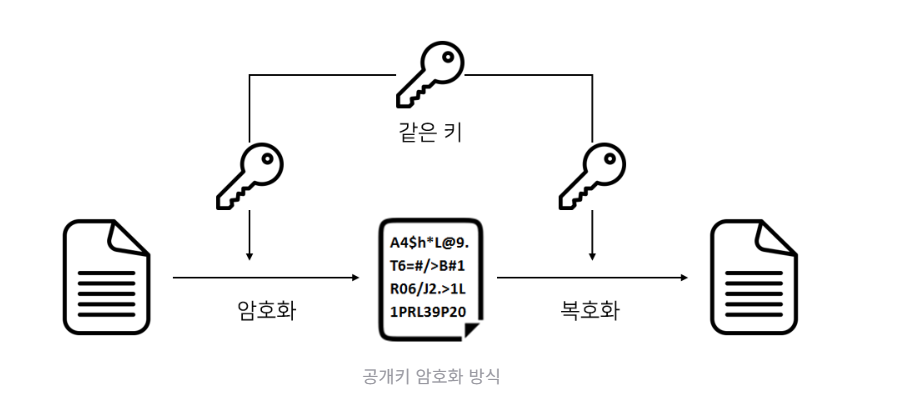
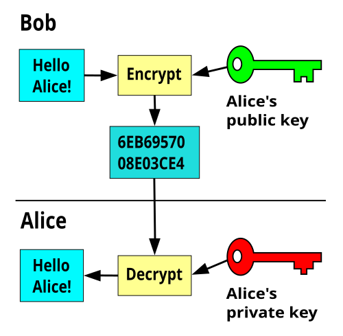
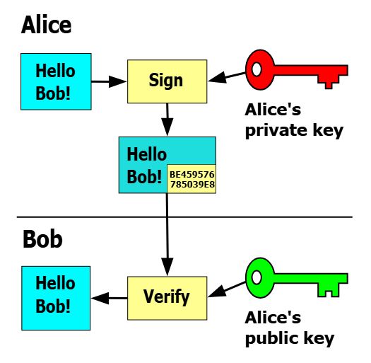

- 단방향 암호화 : 일종의 해시
	- 단일문자 대응 암호
	- 블록 암호화
		- PGP TLS IPsec
	- , SHA-256, SHA-1, MD5 등
	- db 에 비밀번호를 저장할 떄는 단방향 암호화
	- 데이터 무결성 검증 (예: 파일 해시 비교, TCP UDP 의 checksum)
- 양방향 암호화
	- 대칭키: 암호화와 복호화에 동일한 키를 사용하는 암호 방식이다. $K_{a} = K_{b}$
		- AES, DES
	- 비대칭키: 개인키(비밀) 공개키(공개)로 키가 나뉘며 1개의 키로 암호화 1개의 키로 복호화 하는 방법 $K_{a} \neq K_{b}$
		- server or client: $A, B$ 
		- 공개키: $K^{+}_{A,B}$ , 개인키: $K^{-}_{A,B}$
		- public key 암호화 => 종단간 암호화
			- $K^{+}_{A}(K^{-}_{A}(m)) = m$
		- private key 암호화 => 인증
			- $K^{-}_{A}(K^{+}_{A}(m)) = m$

---
기밀성  
메세지 무결성  
종단점 인증  
운영보안  
운영보안
블럭 암호화  
k == 64 이면 64 비트블록으로 쪼개어 각 블록을 독립적으로 암호화 한다

### 대칭키

대칭키의 경우 키를 미리 공유되어 있다는 가정이 있어야 한다

### 비대칭키 = 공개키 암호화

#### Public Key로 암호화 하는 경우  
상대방의 Public key로 data를 암호화 하고 전송하면, data를 수신한 사람은 자신의 Private key로 data를 복호화 한다.  
A 키로 암호화 한다면, B키로 복호화가 가능하고, B키로 암호화를 한다면 A키로 복호화가 가능한 것이다. Public Key는 널리 배포될 수 있기 때문에 많은 사람들이 한 명의 Private Key 소유자에게 data를 보낼 수 있다.  
#### Private Key로 암호화 하는 경우
Private Key의 소유자가 Private Key로 data를 암호화하고 Public Key와 함께 전달한다.  
이 과정에서 Public Key와 data를 획득한 사람은 Public key를 이용하여 복호화가 가능하다. 이런 위험에도 불구하고 이 방법을 사용하는 이유는 data 보호의 목적 보다는 Public Key data 제공자의 신원을 보장해주기 때문이다. 암호화된 data가 Public Key로 복호화 된다는 것은 Public Key와 쌍을 이루는 Private Key에 의해서 암호화 되었다는 것을 의미한다. 즉 data 제공자의 신원 확인이 보장된다는 것이다.  
이 방법이 공인인증체계의 기본 바탕이 되는 **전자 서명**이라는 것이다. #ModificationRequired

[HTTPS와 비대칭 키 초기 설정부터 데이터 전송까지의 모든 과정 simulation](HTTPS와%20비대칭%20키%20초기%20설정부터%20데이터%20전송까지의%20모든%20과정%20simulation.md)

#### CA(Certification Authority)로부터 얻는 것

CA는 신뢰할 수 있는 제3자 기관으로, 엔터티(사람, 서버, 라우터 등)의 신원을 검증하고 해당 엔터티의 공개 키에 대한 **인증서(Certificate)**를 발급하는 역할을 합니다. CA로부터 받는 주요 정보는 다음과 같습니다:

- **인증서 (Certificate)**:
    - 인증서는 특정 엔터티의 **공개 키와 해당 엔터티의 식별 정보(예: 웹 서버의 도메인 이름, 조직 이름, IP 주소 등)를 묶어서** CA가 디지털 서명한 것입니다.
    - 이 인증서는 송신자(예: 웹 서버)가 자신의 공개 키를 수신자(예: 클라이언트)에게 안전하게 제공할 수 있도록 합니다.
    - 클라이언트는 **CA의 공개 키를 사용하여 서버 인증서의 유효성을 검증**합니다. 만약 인증서가 CA에 의해 올바르게 서명되었고 유효 기간 내에 있다면, 클라이언트는 해당 인증서에 포함된 공개 키가 주장된 엔터티(서버)에게 실제로 속한다고 신뢰할 수 있습니다.
    - 이는 Trudy와 같은 공격자가 Bob으로 가장하여 자신의 공개 키를 Alice에게 보내는 **신원 위조(masquerading) 공격을 방지**하는 데 필수적입니다.

### RSA 알고리즘

- 덧셈:  $[(a \mod n) + (a \mod n)] = (a + b) \mod n$
- 뺄셈:  $[(a \mod n) - (a \mod n)] = (a - b) \mod n$
- 곱셈:  $[(a \mod n) \cdot (a \mod n)] = (a \cdot b) \mod n$
