## cpu 동작 과정


## cpu 구조
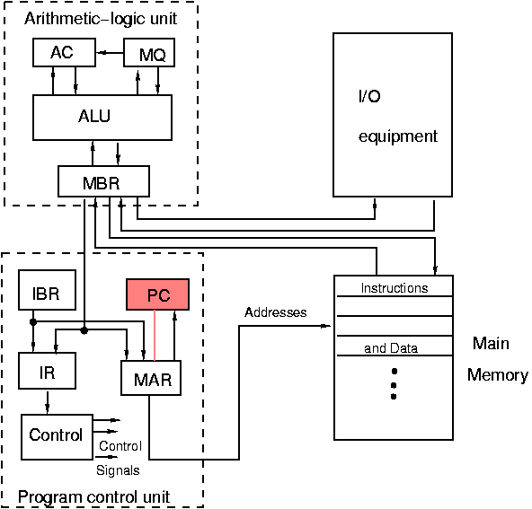


주요 부품
- 레지스터
	- PC  프로그램 카운터 (progam counter) : 다음에 실행될 메모리 주소를 저장
	- MAR  메모리 주소 레지스터 (memory Address registor) : pc 에서 주소를 넘겨 받아 메인 메모리에 접근해 데이터를 MBR  (memory buffer registor)에 저장하는 역할
	- MBR 메모리 버퍼 레지스터 (memory buffer registor) : MBR 을 통해 가져온 데이터를 임시 저장, 명령 부분은 IR(Instruction Register) 에 저장, 연산에 사용될 데이터는 AC(Accumulator) 누산기 레지스터에 저장, 메모리에 저장될 데이터를 임시 저장
	- IR 명령어 레지스터 (Instruction Register) : 현재 실행되고 있는 명령을 저장하는 레지스터
	- AC 누산기 (Accumulator) : ALU 연산을 위한 레지스터로서 연산해야 할 값 또는 연산 결과를 임시 저장
- coutrol 제어장치 : 명령어 레지스터 IR 에 있는 명령을 받아 해석하고 장치들을 제어
- ALU : 산술 논리 연산 장치

추가 부품
- BR(Base Register): 명령의 시작 주소를 기억하는 레지스터 
- MSR(Major Status Register): CPU의 주 상태를 저장하는 레지스터
- 플래그 레지스터(Flag Register): 상태를 기억하는 레지스터(오버플로우, 언더플로, 캐리, 인터럽트 등의 PSW를 기억)  
	- PSW(Program Status Word)는 시스템 내부의 순간순간의 상태를 기록하고 있는 정보를 말합니다.
- 상태 플래그 커널모드 사용자 모드 비트가 들어감 (플래그 레지스터 인가 MSR 레시스터인가)

## 명령 동작과정
기계어 로 적힌 프로그램은 각각의 몇 비트 컴퓨터 인지에 따라 명령어의 크기 + 데이터의 크기 == n 비트 컴퓨터 이다

```c
A = B + C
=====
LOAD [10] //10 주소의 데이터를 레지스터로 로드
ADD [11] //11 주소의 데이터와 더함
STORE [12] //12 주소에 저장
```

100 주소가 현재 pc 에 저장되어 있다

pc 의 값을 MAR 에 저장
MAR 의 값을 참조하여 메모리의 데이터를 로드하여 MBR 에 저장
MBR 의 명령어와 데이터중 명령어만을 IR 에 저장 ==> 인출

PC 값을 증가시켜 다음 명령의 주소를 저장(n 비트 크기 만큼) 
명령어 레지스터의 값을 제어장치로 해석한다
제어장치는 10 주소를 MAR에 저장, 메모리 주소에 접근하여 데이터를 MBR 에 저장한다 ==>  해석

PC값을 MAR로 복사, MAR의 메모리 주소를 참조해 명령과 데이터 주소를 MBR,IR에 저장 ==> 인출
PC 값 증가
IR 의 값을 제어장치가 해석하는데 add 이므로 누산기에 저장된 이전 값을 ALU 전송
11 주소의 값을 MAR 저장, 11 주소의 데이터를 MBR 에 저장 => 인출
제어장치는 MBR 의 값을 누산기에 저장, 누산기에 저장된 값을 ALU 로 전송
ALU 의 계산된 값을 누산기로 저장 ==>실행

PC 값을 MAR 로 복사, MAR 의 메모리 주소를 참조하여 명령 및 데이터 주소를 MBR, IR 에 저장
PC 값 증가
MBR 의 값을 제어장치가 해석하여 12 주소를 MAR 에 저장, 누산기의 값을 MBR 에 저장
제어장치가 MBR 을 MAR 에 저장된 주소값에 저장 ==> 저장


## 인터럽트
인터럽트는 컴퓨터 하드웨어나 소프트웨어가 CPU에게 어떤 사건이 발생했음을 알리는 방법
기준에 따라 분류


기준의 분류
#### 발생 원인에 따른 분류
- **하드웨어 인터럽트**: 외부 하드웨어 장치로부터 오는 신호에 의해 발생합니다. 예를 들어, 키보드 입력, 마우스 클릭, 네트워크 패킷 수신 등이 있습니다. 하드웨어 인터럽트는 특정 하드웨어 장치가 데이터 처리 준비가 완료되었거나, 데이터 전송이 필요한 상황 등을 CPU에 알립니다.
- **소프트웨어 인터럽트**: 프로그램 내부에서 명령을 통해 의도적으로 발생시키는 인터럽트입니다. 이는 주로 운영체제의 서비스를 요청할 때 사용되며, 시스템 호출이 이에 해당합니다.

#### 처리 방식에 따른 분류
- **마스커블 인터럽트 (Maskable Interrupt)**: 이 인터럽트는 일시적으로 차단(마스크)할 수 있습니다. 우선순위에 따라 처리할 수 있으며, 더 중요한 작업을 우선적으로 처리하기 위해 일시적으로 차단될 수 있습니다.
- **논마스커블 인터럽트 (Non-Maskable Interrupt, NMI)**: 이 인터럽트는 차단할 수 없습니다. 시스템에 중대한 오류나 긴급 상황이 발생했을 때 사용되며, 반드시 즉시 처리되어야 합니다.

#### 용도에 따른 분류
- **벡터 인터럽트**: 인터럽트 발생 시 처리할 인터럽트 서비스 루틴(ISR)의 주소가 인터럽트 벡터에 의해 직접 지정됩니다. 이 방식은 처리해야 할 ISR을 빠르게 찾을 수 있게 해줍니다.
- **논벡터 인터럽트**: 모든 인터럽트가 공통의 인터럽트 서비스 루틴을 호출하고, ISR 내에서 실제 발생한 인터럽트의 종류를 판단하여 적절한 처리를 하는 방식입니다. 이는 벡터 인터럽트에 비해 처리 속도가 느릴 수 있습니다.

### 인터럽트 처리과정
- 하드웨어적 처리
	- 상태 레지스터 값을 저장
	- 프로세서 모드를 커널 모드로 변경 (모드 비트를 변경)
	- PC 레지스터 값을 저장
	- 발생된 인터럽트의 벡터 값(ISR 주소)을 PC 레지스터에 저장 (OS 내의 인터럽트 서비 스 루틴을 수행하게 됨)
- 소프트웨어적 처리 (OS가 수행함)
	- CPU 레지스터들의 값을 저장 (메모리에 저장)
	- 인터럽트 처리 코드를 수행
	- CPU 레지스터 값을 복원 (저장된 값들을 CPU 레지스터에 load)
	- 상태 레지스터 값을 복원 (프로세서 모드가 이전 모드로 변경됨)
	- PC 레지스터 값을 복원 (인터럽트가 발생하여 중단된 곳으로 돌아가게 됨)


## 메모리 구조

메모리
- ROM (비휘발성)
	- 부트로더
- RAM (휘발성)
	- IVT 인터럽트 백터 테이블
	- os(os 내부에 인터럽트 실제 데이터 존재)
	- 응용프로그램


## 부팅 과정
IR 값에 기본적으로 0 저장되어 있음
주소 0 의 명령을 IR 로 가져오고 실행(부트로더가 실행됨)(커널모드)
부트로더가 OS 를 메모리에 적제 및 시작 메모리 주소를 PC 에 저장
제어장치는 PC 에 저장된 메모리 주소를 참고하여 IR 에 명령을 저장
계속 실행 ....

> 운영체제는 인터럽트에 의해 구동되는 프로그램
> 타이머 인터럽트 : 주기적 인터럽트 발생
> 응용프로그램 시스템 호출을 수행
> 입출력 장치 : 입출력을 마치면 인터럽트를 발생시킴


## 프로세스 상태
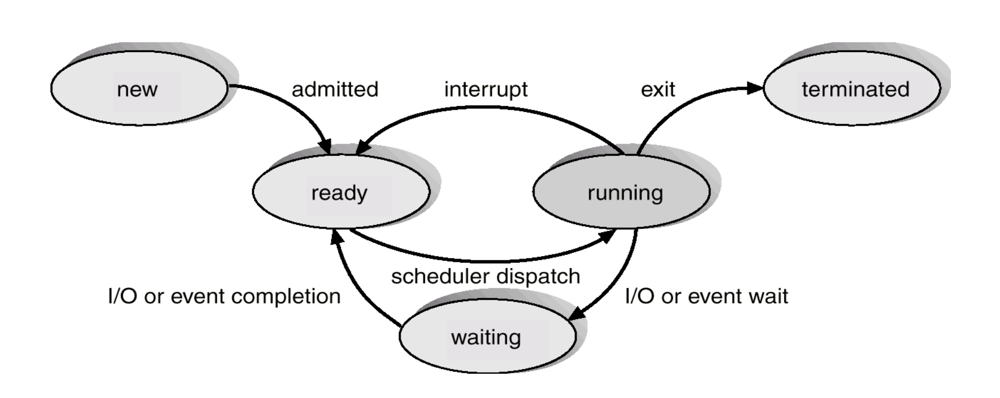

admitted :**허가** / 파일의 소유권을 확인후 허가여부를 판단 new -> ready
scheduler dispatch : 스케줄러가 실행한다
 i/o or event wait : 입출력을 기다림
io or event completion : 입출력
exit : 시스템 콜을 통한 정상적인 프로세스 종료


procectin


PCB process control block
TCP Thread control block

프로세스 레지스터등  모든 자원이 분리
쓰레드 Code Data 공유, stack register(당연) 분리 
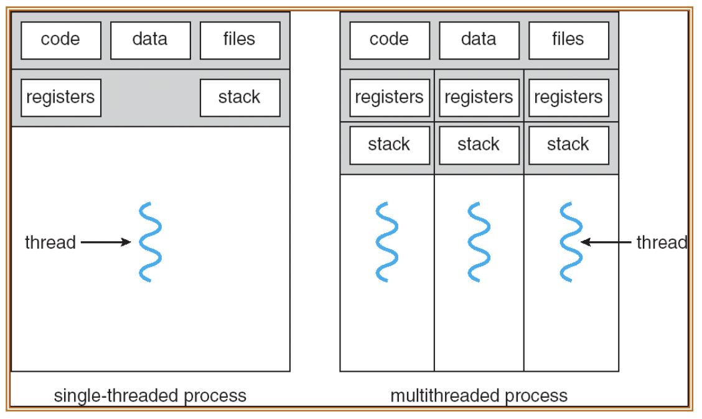


1. CPU 사용률 (utilization)
	1. 단위시간당 CPU 사용시간의 비율 (0~100%)
2. 처리량 (Throughput)
	1. 단위시간당 완료된 프로세스의 개수
3. 반환시간 (Turnaround time)
	1. 특정 프로세스를 실행하는데 걸린 총 시간
4. 대기시간 (Waiting time)
	1. 프로세스가 준비 큐에서 대기하면서 기다린 시간의 합
5. 응답시간 (Response time)
	1. 작업을 요청한 후 첫번째 응답이 나올 때까지의 시간 (응답이 시작되는 데까지 걸린 시간이며 응답을 출력하는데 걸리는 시간은 아님)


## IPC (Inter-process communication)

공유 메모리(Shared memory), 메시지 전달(Message passing)

- data transfer
	- byte stream
		- pipe
		- named pipe(fifo)
		- socket(stream)
	- message
		- posix message queue
		- sysV message queue
		- socket(datagram)
- shared memory
	- file memory mapping
		- anonymous mapping
		- file mapping
	- shared memory
		- sysV shared memory
		- posix shared memory
- synchronization
	- semaphore
		- posix memaphore
		- sysV semaphore
	- file lock
		- file lock
		- record lock


## 프로세스 스케줄링


- 선점식과 비선점식
	- 선점식 cpu 사용시간 통제 주체 => 프로그램
	- 비선점식 cpu 사용시간 통제 주체 => os 스케줄러 인터럽트

기준
- CPU 사용률 (utilization) : 단위시간당 CPU 사용시간의 비율 (0~100%)
- 처리량 (Throughput) : 단위시간당 완료된 프로세스의 개수
- 반환시간 (Turnaround time) : 특정 프로세스를 실행하는데 걸린 총 시간
- 대기시간 (Waiting time) : 프로세스가 준비 큐에서 대기하면서 기다린 시간의 합
- 응답시간 (Response time) : 작업을 요청한 후 첫번째 응답이 나올 때까지의 시간 (응답이 시작되는 데까지 걸린 시간이며 응답을 출력하는데 걸리는 시간은 아님)


- FCFS (First-Come First-Served) : 먼저온 순서대로
	- 운좋게 짧은 응답시간의 프로세스가 먼저 들어갈 수록 대기시간이 짧다
	- 비선점식
- SJF (Shortest Job First) : 가장 빨리 끝나는 놈 먼저
	- 비선점식 : 다음프로세스를 진행 할 때 큐에서 가장 적은 cpu burst 크기를 가진 프로세스를 선택하여 실행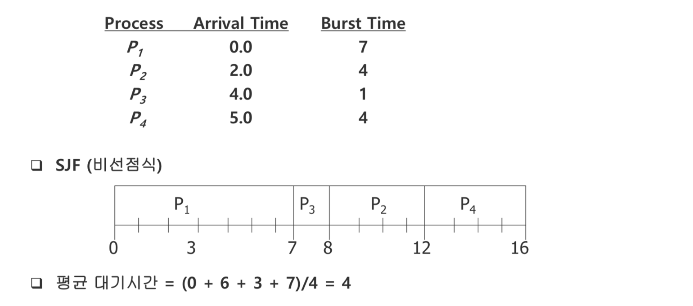
	- 선점식 : 프로세스 진행중에 남은 cpu burst 크기보다 작은 cpu burst 가 나타나면 프로세스를 뺏아 작은 cpu burst 프로세스를 실행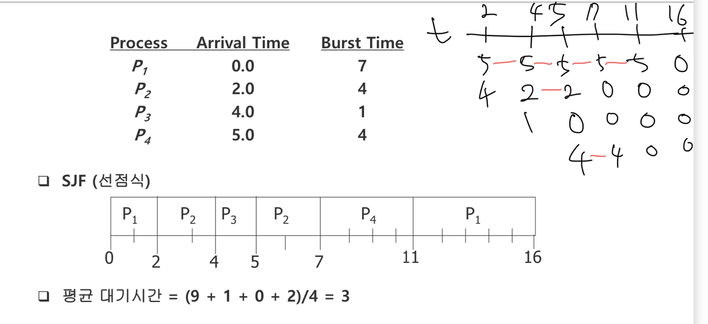
	- 지수평균 : 이전 cpu burst 크기를 이용해 지수 평균을 방법을 사용해 추청함
	  
	  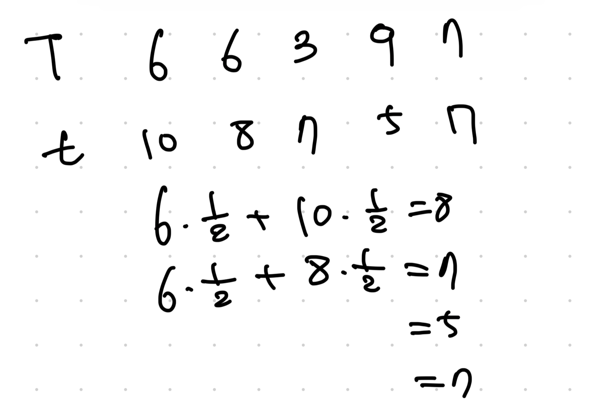
	- 비슷하게 우선순위 알고리즘이 있다 위의 경우는 cpu burst 시간이 우선순위로 설정되는 경우이다 즉 우선순위에 따라 cpu 를 점유할 수 있게 한다 선점식 비선점식 모두 가능 하지만 문제는 위와 동일하게 기아상태가 발생할수 있다는 것이다
- RR (Round Robin) : 단위시간을 process 에게 cpu를 선점하도록 허용(시분할)
	- 준비큐는 fcfs, 선점방식, 80%(cpu burst < 시간할당량) 가 좋다
	  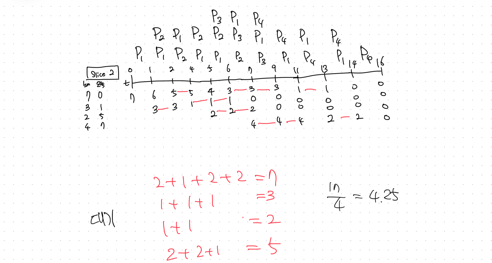
- MQ (Multi-level Queue) : 준비 큐를 여러 개의 큐로 나눈다
	- 전면 작업 (foreground job, 대화식) : 빠른 응답시간을 요구함 => round robin 처리
	- 후면 작업 (background job, 일괄처리) => fcfs 처리
	- 전면작업이 무조건 먼저 수행된다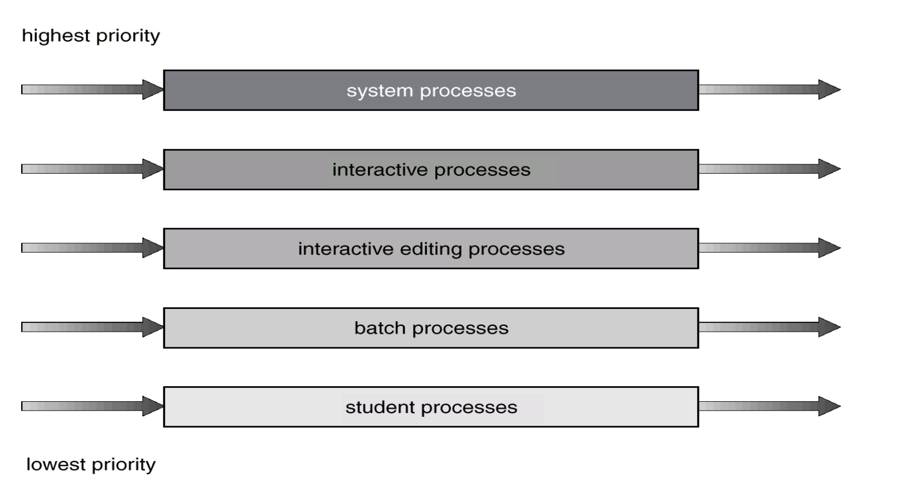
	- 우선순위, sjf(short job first) 와 마찬가지로 기아상태의 우려가 있다
- MFQ (Multi-level Feedback Queue)
	- MQ 업글 버전 다단계 큐 스케줄링(MQ)과 다르게 다단계 피드백 큐 스케줄링(MFQ)은 프로세스가 큐 사이를 이동함
		- CPU를 많이 사용하는 프로세스는 낮은 우선순위 큐로 이동시킴
		- 입출력 중심의 프로세스와 대화식 프로세스들을 높은 우선순위의 큐에 이동시킴  
		- 낮은 우선순위의 큐에서 오래 대기하는 프로세스들을 높은 우선순위의 큐로 이동 (기아 상태를 예방, 에이징)
		- 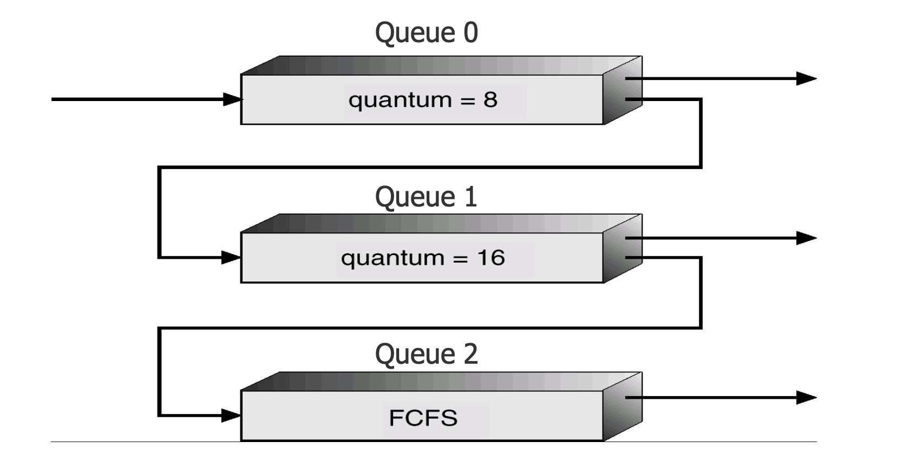
			- 새로운 프로세스는 Q0 에 들어가서 FCFS로 처리됨 CPU를 할당받으면 8 밀리 초 동안 실행되고 이 시간동안 완료되지 않는다면 Q1으로 이동됨. 이 시간동안 CPU 버스트를 끝내고 I/O 버스트로 가면 계속 Q0 에 위치함 
			- Q1 에서 다시 FCFS로 CPU를 할당받고, 16 밀리 초동안 실행되고 이 시간동안 완 료되지 않는다면 Q2로 이동됨
			- 이 예에서, CPU 버스트가 8 밀리초 이하인 프로세스가 제일 높은 우선순위를 가 지게 되고, 8 밀리 이상 16 밀리초 이하인 프로세스가 다음의 우선순위를 가짐. 이보다 긴 프로세스는 자동적으로 Q2 로 이동되어 낮은 우선순위를 가짐
			  그러므로 처음에 이야기한 cpu burst 가 큰 프로세스는 낮은 우선순위 큐로 자동적으로 천천히 이동되고 io 가 많은 프로세스는 최대한 Q0 와 가까이 위치함
- HRN (Highest Response-rate Next) : 가변적 우선순위의 비선점식 + shj
	- SJF의 약점인 긴 프로세스와 짧은 프로세스의 불평등을 보완
	- $우선순위 = \frac {대기시간 + CPU burst } {CPU burst}$
	- cpu burst 를 기준으로 했던 sjf 에서 대기시간의 가중치를 만들어줌
간트 차트를 통해 프로세스 스케줄링을 시각적으로 표현할 수 있다


## 교착상태
### 교착상태 조건 모두 만족해야 교착 가능성
1. 상호배제(Mutual exclusion)
	1. 한번에 오직 한 프로세스만이 자원을 사용할 수 있다.
2.  점유와 대기(Hold and wait)
	1. 프로세스가 적어도 하나의 자원을 점유하면서 다른 프로세스가 점유하고 있는 자 원을 추가로 얻기위해 대기한다.
3. 비선점(No preemption)
	1. 점유된 자원은 강제로 반환될 수 없고, 점유하고 있는 프로세스가 작업을 마치고 자원을 자발적으로 반환한다.
4. 순환대기(Circular wait)
	1. 대기하고 있는 프로세스 집합 {P0 , P1 , …, Pn }에서 P0 은 P1이 점유한 자원을 대기하 고, P1은 P2가 점유한 자원을 대기하고, Pn–1 은 계속해 Pn을 대기하며, Pn은 P0이 점유한 자원을 대기한다.


## 문제
1. 프로세서에서 산술, 논리 연산을 수행하는 장치는 무엇인가? => ALU
2. 프로세서의 산술 연산의 결과, 프로세서 동작 모드 등을 저장하는 레지스터는 무엇인가? => 상태 레지스터
3. 프로세서의 모드 중에서 제한 없이 모든 명령어를 사용할 수 있는 모드는 => 커널 모드
4. refresh가 필요한 RAM은 무엇인가 => dram
5. ROM의 종류로서 데이터를 삭제하고 기록할 수 있는 ROM은 무엇인가? => eprom(자외선 삭제,전류 기록), eeprom(전류 삭제, 전류 기록)
6.  저장장치 계층을 구분하는 성질 3가지는 무엇인가? => 속도, 가격, 휘발성
7. 저장장치 계층의 저장장치 중에서 CPU와의 데이터 전송이 하드웨어적으로 이루어지는 것은 무엇인가?
8. 하드웨어 인터럽트의 예를 2가지 들어보시오. => cpu 타이머 인터럽트, io 인터럽트
9. 소프트웨어 인터럽트 예를 2가지 들어보시오. => systemcall, trap 예외 인터럽트
10. 인터럽트가 발생하면 수행되는 운영체제의 코드를 무엇이라 하는가? => isr
11. 인터럽트 벡터 테이블이란 무엇인가? => isr 의 처리 코드의 주소가 적혀있는 테이블
12. 인터럽트 처리 과정 중, 하드웨어적인 처리 과정을 적으시오. =>
	1. 상태 레지스터 저장
	2. 프로세서 모드 커널모드로 변경
	3. 현제 저장된 pc 레지스터 저장
	4. 발생된 isr 주소를 pc 레지스터로 저장
13. 마이크로 커널 구조의 장단점을 설명하시오.
14. 다음은 C 언어로 작성한 프로그램이다.
    ```c
    #include <stdio.h>
    main() {
	    printf("hello, world \n"); 
    }
	```
	1. (가) 이 프로그램의 수행을 라이브러리와 시스템 호출 관점에서 설명하시오.  => printf 는 stdio.h 에 속한 라이브러리 함수로서 리눅스에선는 write 시스템 콜이 호출되면서 사용자가 원하는 동작을 수행하게 된다
	2. (나) 리눅스와 윈도우즈가 제공하는 시스템 호출은 서로 다르다. 이 C 프로그램을 리눅스에서 컴파일하여 수행이 가능한가? 윈도우즈에서 컴파일하여 수행이 가능한가? => printf 라는 표준 c 라이브러리는 내부적으로 각 os 에 시스템콜에 대응되게 수행한다
	3. (다) 위 (나)에서 작성한 답안에 대하여 그 이유를 설명하시오. => stdio.h 는 표준 c 라이브러리로서 각 컴파일러 제조사들은 각 운영체제에 맞게 라이브러리를 제공한다
1. 프로세스의 상태 중에서, CPU를 할당받기를 기다리는 상태는 무엇인가? => ready
2. 프로세스의 상태가 실행 상태에서 준비 상태로 전이하게 하는 사건은 무엇인가 => interrupt
3. PCB에서 레지스터 저장 영역의 용도는 무엇인가? => 프로세스의 상태변화시에 cpu 에 이 레지스터 값을 세팅하게 된다
4. 문맥교환(context switching)에 하드웨어 지원이 미치는 영향을 논하시오. => 문맥교환시 cpu 레지스터를 pcb(process control block) 에 저장하게 되는데 모든 레지스터를 한번에 저장할 수 있는 명령어를 하드웨어 제조사에서 제공하게 된다면 소프트웨어로 구현한 문맥교환 보다 빠르게 동작을 수행 할 수 있게 된다
5.   I/O bound 프로세스와 CPU bound 프로세스가 적절히 혼합되어 수행되는 것이 좋은 이유를 설명하시오. => cpu bound 프로세스가 실행되고 있을 때 io bound 프로세스가 io 작업을 실행하고 있을 수 있다 즉 cpu, io 자원을 유휴 상태를 최대한 줄일 수 있다
6. 장기 중기 단기 스케줄러를 설명하시오 =>
	1. 장기 스케줄러 : 어떤 프로세스를 ready queue 로 보낼지 결정하는 스케줄러 즉 메인 메모리와 보조 메모리의 스케줄링 메인 메모리는 한정(상대적으로 보조메모리에 비해 적다)되어 있기 때문에, 실행할 수 있는 프로세스보다 많은 프로세스가 메모리에 올라오면 대용량 메모리(일반적으로 하드디스크)에 임시로 저장된다. **장기 스케줄러**는 하드디스크의 프로세스 중 하나를 선택하여 메모리를 할당하고 **Ready Queue로 보내는 역할**을 한다.
	2. 중기 스케줄러(Swapper) : 우선순위가 낮은 프로세스 일정시간동안 활성화 되지 않은 프로세스들을 내린다
	3. 단기 스케줄러 : 현제 어떤 프로세스를 실행할 것이가에 대한 문제 최대한 컴퓨터 자원을 잘 활용해야 한다
7. 프로세스간 통신을 위한 메시지 전달 방법에서 직접통신과 간접통신의 특징을 비교하여 설명 하시오. => 직접통신의 경우 보내는 측의 관점에서는 받는 측의 pid 를 직접 적고 받는 측에서는 보내는 측의 pid 를 직접 적어서 메세지를 받게 된다 하지만 이와 달리 간접통신에서는 보내는 측에서는 mailbox 혹은 포트라는 추상적인 객체를 통해 전달하고 받는 측은 여러개가 될 수 있다
8. int pthread_create(pthread_t \*thread, const pthread_attr_t \*attr, void \*(\*start_routine) (void \*), void \*arg); 함수의 매개변수들을 설명하시오. => 쓰레드 id, 쓰레드 정보, 쓰레드 시작 함수,   쓰레드 함수의 매개변수
9. 쓰레드의 장점 4가지를 설명하시오. => 빠른 응답성, 자원 공유, 경제성, 멀티 프로세서 활용
10. 쓰레드 구현 방식 2가지는 무엇인가? => 사용자 수준의 쓰레드 라이브러리, 커널 쓰레드
11. 다중 쓰레딩 모델 중에서 many-to-one 모델의 특징을 설명하시오. => 많은 사용자 수준의 쓰레드를 생성해도 실제로는 하나의 커널 쓰레드와 대응된다
12. 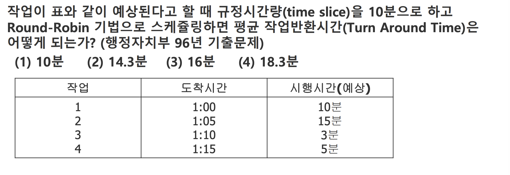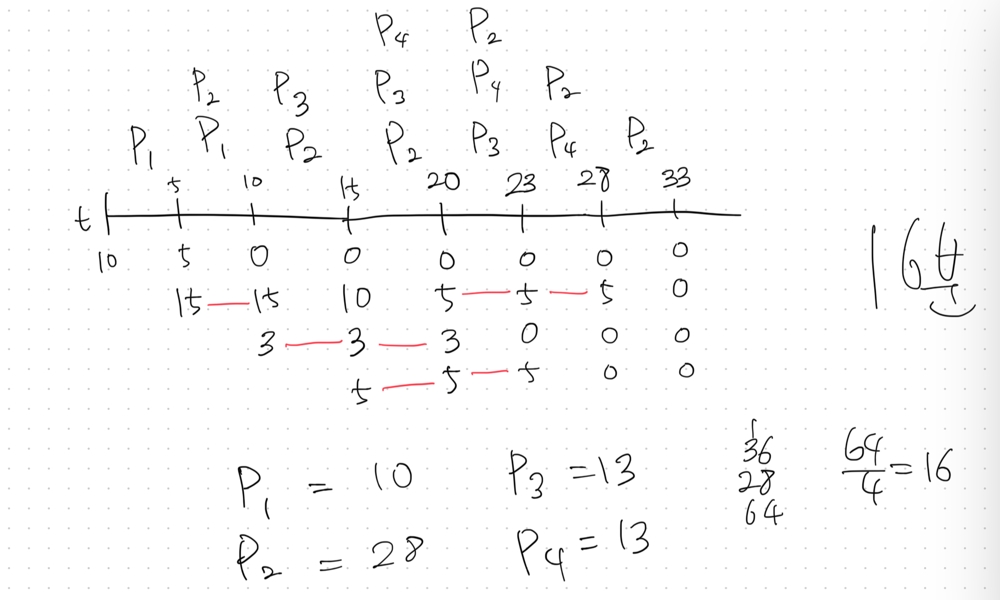
13. 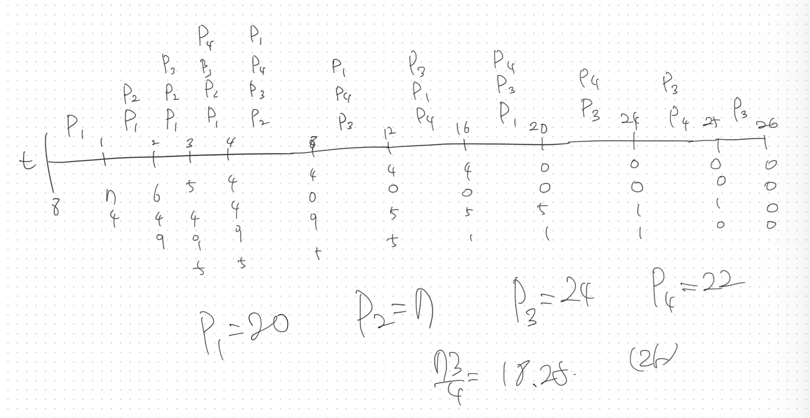
14. 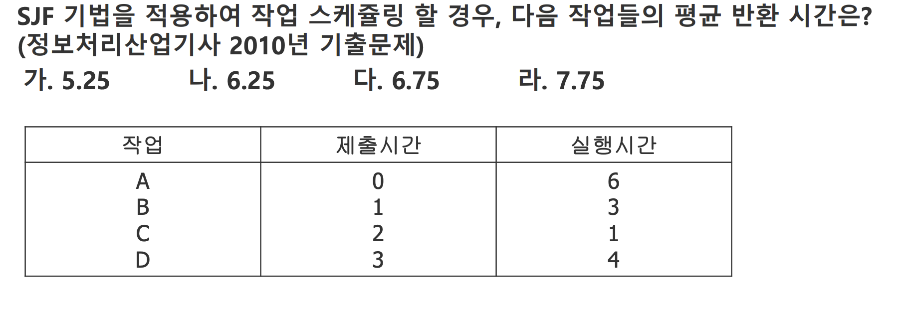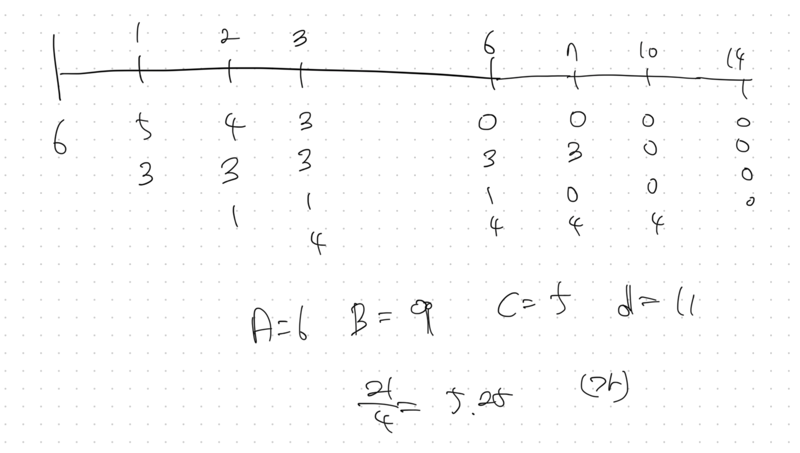
15. 교착상태가 발생하는 4가지 조건과 그 의미를 쓰시오.
16. 프로세스와 자원 간의 관계를 나타내는 그래프는 무엇인가?
17. 다음은 교착상태 발생 조건 중 어떤 조건을 제거하기 위한 것인가?
	1. 프로세스가 수행되기 전에 필요한 모든 자원을 할당시켜 준다.
	2. 자원이 점유되지 않은 상태에서만 자원을 요구하도록 한다. 
	3. 가. 상호배제 
	4. 나. 점유와 대기 
	5. 다. 비선점 
	6. 라. 순환대기 
18. 4. 교착상태 예방방법의 문제점은 무엇인가? 
19. 교착상태의 해결 방법 중 은행가 알고리즘(banker's algorithm)과 관계되는 것은?
	1. 가. Avoidance 
	2. 나. Prevention 
	3. 다. Detection 
	4. 라. Recovery


---


- 외부 단편화 문제 : 
- 내부 단편화 문제 : 실행파일로 부터 생성된 프로세스의 크기(code segment ~ stack segment) 보다 더 큰 공간을 할당 받을 때 생기는 문제 즉 더 큰 공간을 할당하는 방법을 사용할 때 생긴다 페이징방법을 사용할 때 더 큰 공간을 할당하게 된다

페이징
페이지 테이블 프로세스마다 하나씩 페이지 테이블을 가지고 있다
TLB 페이지 테이블 의 캐쉬용 하드웨어


frame = page
page 가 4KB 라고 가정하면 

프레임이 4KB(킬로바이트)인 경우, 우리는 이를 페이지 크기와 동일하다고 가정할 수 있습니다. 4KB는 2의 12승 바이트(1KB = 2^10 바이트이므로, 4KB = 2^2 * 2^10 = 2^12 바이트)입니다. 이는 메모리 주소에서 하위 12비트가 페이지 내에서의 위치, 즉 페이지 변위(offset)를 나타낸다는 것을 의미합니다. 따라서 주소의 앞쪽 비트들은 페이지 번호를 나타내게 됩니다.

예를 들어, 32비트 시스템에서 메모리 주소는 총 32비트로 표현됩니다. 여기서 하위 12비트가 페이지 변위를 나타낸다면, 남은 상위 20비트는 페이지 번호를 나타내는 데 사용됩니다. 따라서, 프레임이 4KB인 경우, 주소의 앞쪽 20비트가 페이지 번호를 나타내고, 뒤쪽 12비트가 페이지 내 변위를 나타냅니다.


TLB 는 문맥교환 대상인가?? -> 아니다
문맥교환 대상이 아닌경우 문맥교환시 TLB 를 다 지워야하지 않나?? -> 문맥교환시 계속 flush(모든 비트를 0으로 만들어야 한다)


## 메모리 관리
- 주소 바인딩
	- 컴파일 시간 : 적재 위치를 변경하고 싶으면 다시 컴파일 해야함
	- 적재시간 : 적재 할 때 결정
	- 실행시간 : 적재후 실행시간에도 실시간으로 위치가 변경할 수 있음
- 지금은 적재시간과 실행시간 주소 바인딩을 섞어서 사용한다
- 주소의 종류
	- 논리주소 : 프로세스가 실행하면서 cpu가 생성하는 주소 & 컴파일러가 생성한 주소
	- 물리주소 : 기억장치가 나타내는 주소
- 주소변환 장치 : MMU 주소변환 하드웨어 장치
- MMU
	- relocation register : 주소 변환을 할 변위값 레지스터
	- relocation register 에 연속할당 기법의 경우 프로세스의 절대 주소가 담기지만 페이징에서는 PT(페이지 테이블) 에 담긴 주소를 담는다
- 4가지 할당 기법
	- 먼저 알아햐 할 것
		- 외부 단편화 : 가용 공간의 합은 충분한데 공간에 연속되지 않았을 때 생기는 문제
		- 내부 단편화  : 할당된 기억공간 대비 프로세스가 사용하지 않는 문제
	- 연속 할당 기법 : (MS-DOS) 빈공간을 찾아서 프로세스를 생성해야 한다 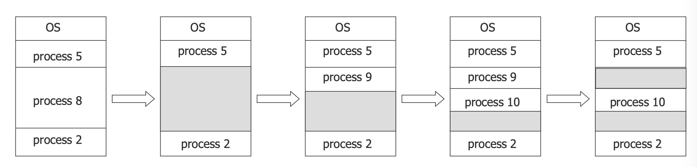
		- 최초 적합 : 충분한 것 중에서 첫번째 가용 공간에 할당
		- 최적 적합 : 중분 한 것 중에서 가장 작은 가용 공간에 할당
		- 최악 적합 : 충분한 것 중에서 가장 작은 가용 공간에 할당
		- 외부 단편화 문제만 발생 : 프로세스의 크기만큼 바이트 단위로 할당하기 때문에 없다
	- 페이징 : 페이지 라는 단위로 쪼개는 방식 프레임(512B ~ 4KB) 페이지크기 = 프레임크기
		- 페이지 테이블 = 페이지 매핑 테이블 = 페이지 맵 테이블 : 어떤 페이지를 점유하고 있는가를 각각의 프로세스 마다 기록됨 즉 PCB 에 담겨짐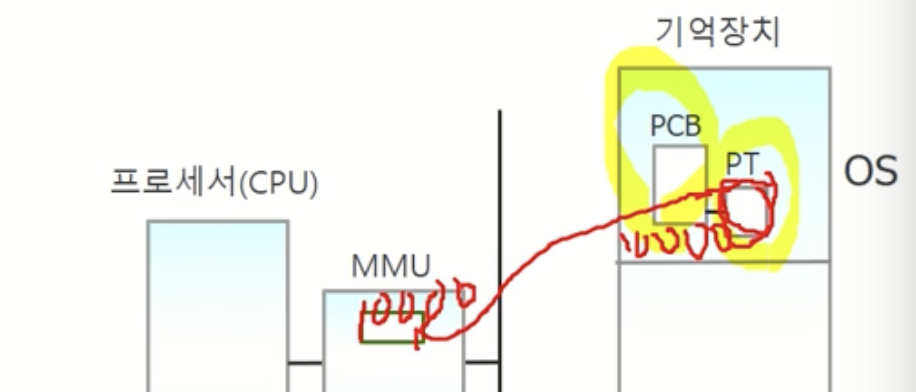
		- 페이지 번호 + offset(페이지 내부에서 위치)
		- K = 2^10 M = 2^20 G 2^30  
		- TLB : 하드웨어 캐쉬 MMU 내부에 있음 병렬 검색 가능
			- TLB 검색후 있으면 hit 판정 없으면 페이지 테이블 검색
		- 페이지 보호  : 페이지마다 보호용 비트를 두고 MMU 가 보호용 비트를 검사한다 읽기 전용 페이지에 대해 쓰기를 하면 MMU 는 인터럽트를 발생시킴
		- 공유 페이지 : 하나의 동일한 실행파일을 여러사람이 사용하면 프로세스마다 동일한 코드와 데이터 부분의 메모리를 사용하게 된다 이때 코드의 부분은 읽기 전용 파일이기 때문에 프로세스 2개 이상에서 동일마게 유지된다 그러면 우리는 2개 이상 생성하지 않고 1개의 코드부분을 공유하면 된다
	- 현대의 페이지 테이블 졸라 크다 거이 32 비트 컴퓨터는 페이지크기가 4k 이면 2^20 1M 이고 각 항목이 4B 라면 4MB 이다 64 비트 컴퓨터는 어마어마 해진다 모든 프로세스마다 이만큼 먹고 있는 것이다 즉 해결방법
		- 계층적 테이블 : 사용하지 않는 페이지들이 존재하므로 단계를 나누어 outer table 만들어 사용한다
		- 해쉬된 페이지 테이블 : 해쉬함수를 이용하여 접근에 필요한 가짓수를 빠르게 줄인다
		- 역 페이지 테이블 : ???
- 세그멘테이션 : 페이지 테이블이랑 비슷 단 나누는 단위를 코드 수준에서 나온다 그래서 외부 단편화 문재가 발생할 수 있게 된다
	- 
- 페이지화 된 세그멘테이션 : 현재 cpu 외부 단편화 문제 해결 인텔 386


## 요구 페이지
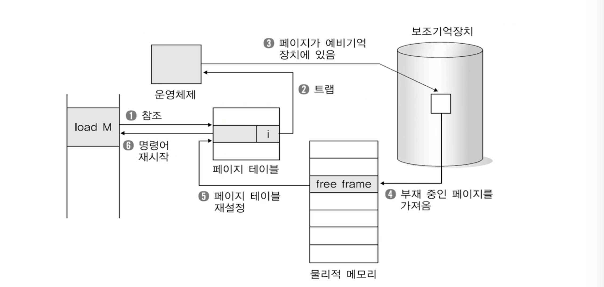
모든걸 미리 담지 않고 유효비트를 참조하여 1이면 그냥 원래대로 실행 0이면 인터럽트후 위의 과정으로 적재를 시킨 후에 계속 실행


**페이지 교체**
새 페이지를 적재할 때, 비어있는 프레임이 없다면 사용 중인 프레임을 하나 선택하여 디스크로 스왑 아웃시키고 새 페이지를 적재시키는 것 이때, 선택된 페이지 프레임을 희생(victim) 프레임이라 부름
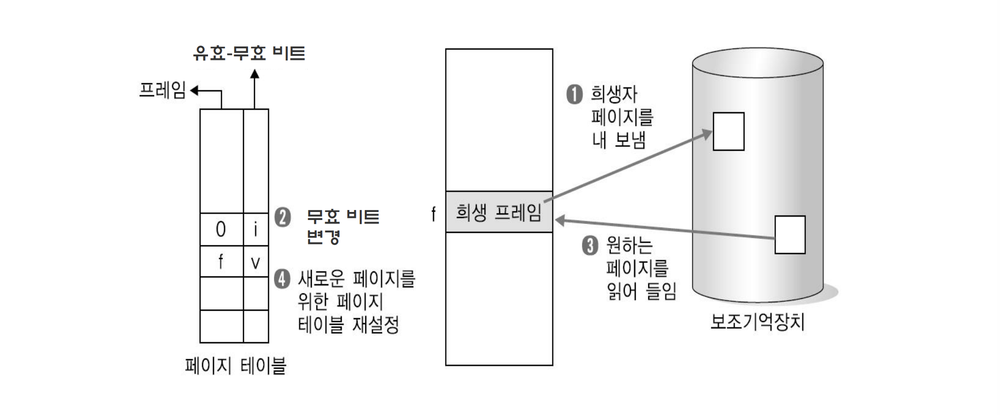

**페이지 교체 알고리즘**
 - FIFO (First-in First-out)
 - OPT (Optimal algorithm)
 - LRU (Least Recently Used)
 - Second chance
 - LFU (Least Frequently Used)
 - MFU (Most Frequently Used)


- 1단계 디렉토리
	- 이름(Naming) 문제 : 같은 이름을 가진 파일을 여러 개 만들 수 없다
	- 그룹핑(Grouping) 문제 : 파일들을 여러개씩 그룹화하여 관리할 수 없다
- 2단계 디렉토리
	- 공유 문제 : 여러 사용자가 한 파일을 공유할 수 없음
	- 이름 문제 : 한 사용자는 같은 파일 이름을 여러 개 사용할 수 없다
	- 그룹핑 문제 : 한 사용자는 파일들을 여러개씩 그룹화하여 관리할 수 없다
- 트리구조
	- 그룹핑 기능이 좋음
- 비순환 그래프 디랙토리


## 1. FCFS (First Come First Served)
- 요청이 들어온 순서대로 디스크 요청을 처리합니다.
- 디스크 헤드의 이동 거리가 길어질 수 있습니다.
- 요청 처리 시간이 길어질 수 있습니다, 특히 요청이 분산되어 있을 때.

## 2. SSTF (Shortest Seek Time First)
- 현재 디스크 헤드 위치에서 가장 가까운 트랙의 요청을 먼저 처리합니다.
- 디스크 헤드 이동 거리를 최소화하려는 알고리즘입니다.

- 평균 응답 시간이 짧아질 수 있습니다.

- 특정 요청이 계속해서 뒤로 밀리는 "기아" 현상이 발생할 수 있습니다.

## 3. SCAN
- 디스크 헤드가 한쪽 끝에서 시작하여 다른 쪽 끝으로 이동하면서 모든 요청을 처리합니다.
- 끝에 도달하면 반대 방향으로 이동하며 요청을 처리합니다.
- 엘리베이터 알고리즘이라고도 불립니다.

- 요청이 고르게 처리됩니다.
- 디스크 헤드의 이동이 일정합니다.

- 양방향으로 이동하므로, 끝에서 끝으로 이동하는 시간이 길어질 수 있습니다.

## 4. C-SCAN (Circular SCAN)
- SCAN 알고리즘과 비슷하지만, 한쪽 끝에서 다른 쪽 끝으로 이동한 후, 다시 처음으로 돌아가서 요청을 처리합니다.
- 디스크 헤드는 항상 한 방향으로만 이동합니다.


- 요청 처리 순서가 균일합니다.
- 디스크 헤드가 한쪽 방향으로만 이동하므로 SCAN보다 예측이 쉽습니다.

**단점:**

- 끝에서 처음으로 돌아가는 동안의 이동 시간은 비효율적일 수 있습니다.

이러한 디스크 스케쥴링 알고리즘은 각각의 특성과 장단점을 가지고 있으며, 시스템의 요구사항과 환경에 따라 선택될 수 있습니다.

## 5. c LOOK
c-scan 과 비슷하지만 끝가지 이동하는 것이 아닌 최소 최대 요청 블록 까지만 이동합니다
