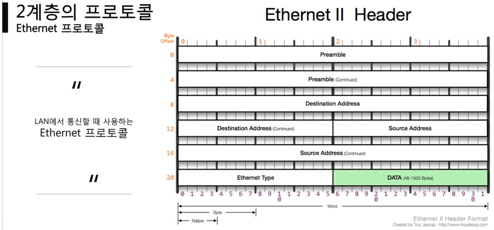

ㅆ**근거리(동일 네트워크 대역) 간 통신**
7.png)
> ethernet type 을 상위 프로토콜 type 로 이해하자

```shell
ipconfig /all
```
명령으로 자신의 mac 주소를 확인

## mac 주소
- 앞 3자리 OUI : IEEE 에서 부여하는 일종의 제조회사 식별 ID
- 뒤 3자리 고유번호 : 제조사에서 부여한 고유번호


> destination Address , source address, Ethernet type 만 확인
> destination address 목적지 MAC 주소

> Ethernet Type : 상위 프로토콜 타입 2바이트: IPv4(0x0800), ARP(Ox0806)