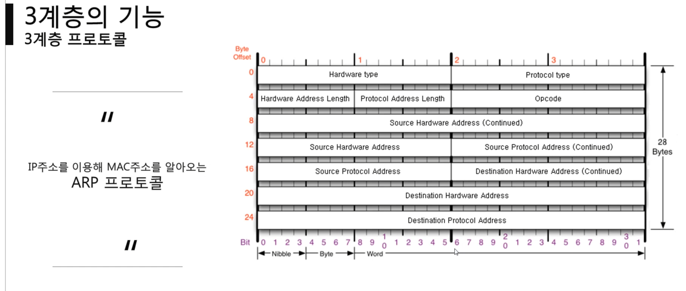
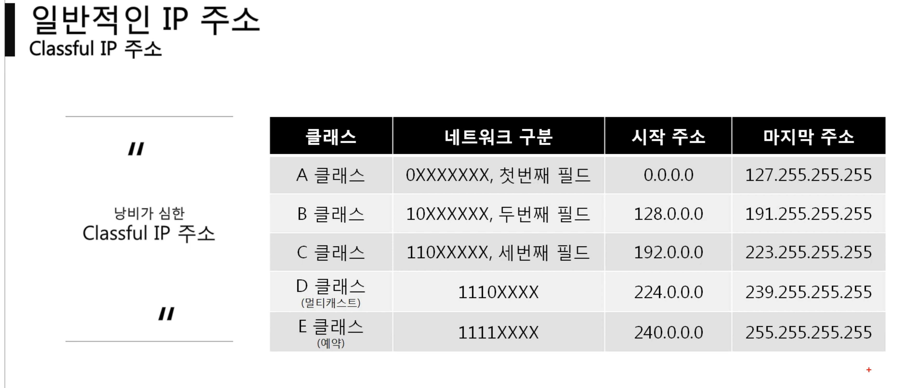
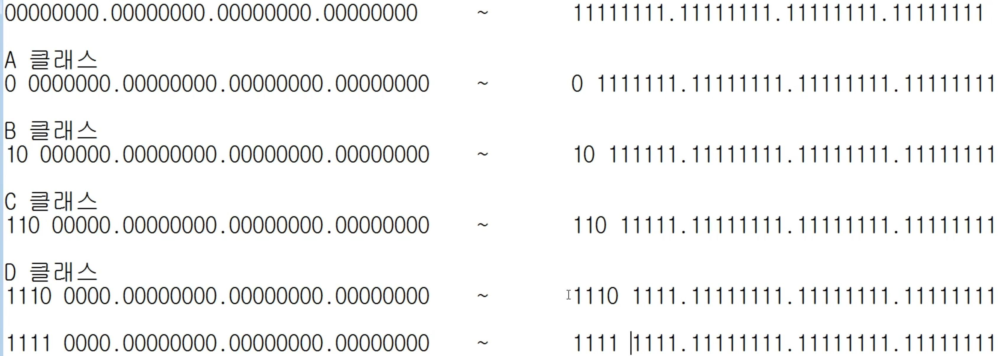
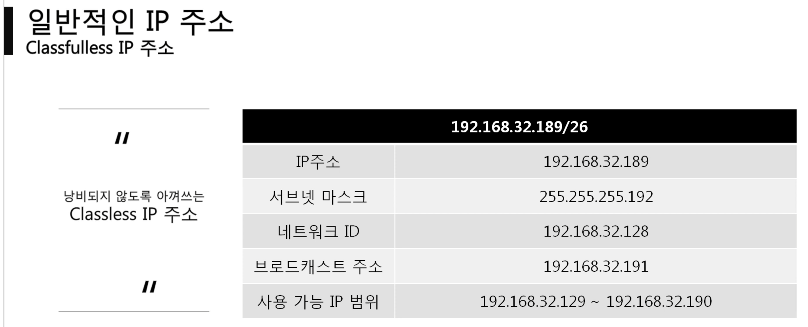
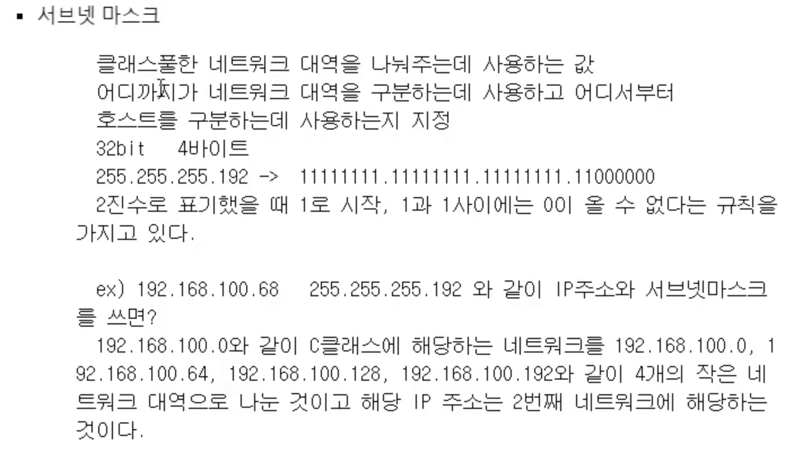
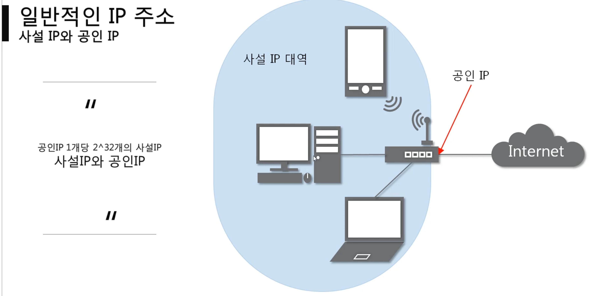
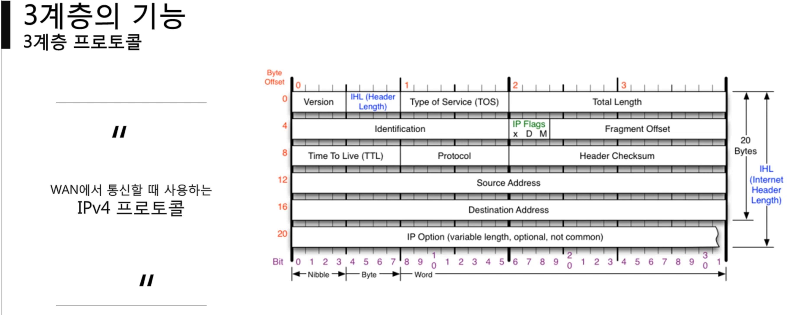
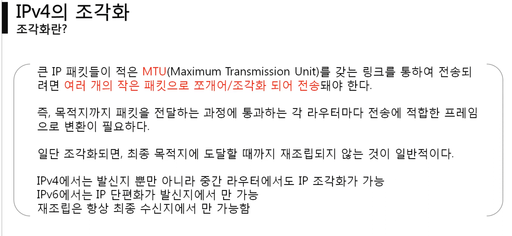
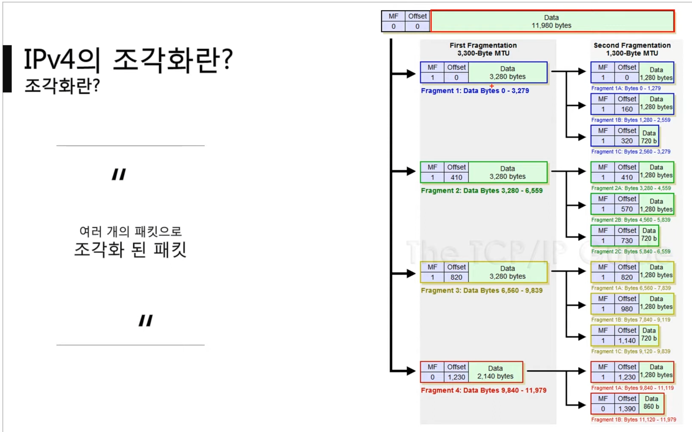

**먼거리(인터넷 통신) 간 통신**

용어 설명
IPv4: 현제 PC 에 할당된 ip 주소
서브넷 마스크 : ip 주소에 대한 네트워크 대역을 규정하는 것
게이트 웨이 : 외부와 통신할 때 사용하는 네트워크 출입구
## 목차
- ARP 프로토콜 : 동일 네트워크 대역 MAC 주소를 알기 위해 사용하는 프로토콜
- IPv4 프로토콜 : 
- ICMP 프로토콜 : 연결 확인용 프로토콜 

## ARP Protocol
**동일 네트워크 대역**

같은 네트워크 대역에서 통신을 하기 위해 MAC 주소를 ip 주소를 이용해서 알아오는 프로토콜
- hardware type : 2계층 프로토콜 type( 대부분 이더넷 0x0001)
- protocol type : 3계층 프로토콜 type( 대부분 ip 0x0800 )
- hardware address Length : MAC 주소의 길이 06
- Protocol address length : IP 주소의 길이 04
- opcode : 질문 0x0001 또는 대답 0x0002
- source hardware address : 출발지 MAC 주소
- source protocol address : 출발지 ip 주소
- destination hardware address : 도착지 MAC 주소 (알고 싶은 mac 주소)
	- 질문시에는 모르니까 000000
- destination protocol address : 도착지 ip 주소 

>  mac 주소를 모르므로 00000... 으로 비워둔다

> 동일 네트워크 대역에서 통신을 한다고 하더라도 데이터를 보내기 위해서는 7계층 부터 캡술화를 통해 데이터를 보내기 때문에 ip 주소와 MAC 주소 모두 필요하다 이때 IP 주소는 알고 MAC 주소를 도르더라도 ARP 를 통해 통신이 가능하다

> arp 는 3계층이지만 동일 네트워크 대역에서만 사용할 수 있다

> 통신 이후 arp 캐시 테이블로 관리한다
## IPv4 & ICMP Protocol
- 시대별 구분
- 프로토콜 구조
- 라우팅 테이블
- 타 네트워크 통신과정
- 조각화
### 시대별 구분
- classful
- classfulless
- 공인 사설
#### classful IP 1세대

> 네트워크 클래스별로 대역을 구분

#### classfulless IP 2세대

> 서브넷 마스크 도입으로 임의로 대역을 구분 가능

#### 현제 IP 3세대

NAT

터널링

### 프로토콜 구조

- Version 버전 0x4 고정
- IHL(Header Length) (헤더 길이/4) : 0x5, 0x6 ...
- type of Service (TOS) : 0 으로 비어있음 서비스 형식 과거에 사용
- Total Length : Packet 전체 크기 : 헤더와 페이로드 포함
- Identification, IP Flags, Fragment Offset :
         전송시 분리되서 보내지는데 이때 구별을 위한 정보
	- identification : 패킷 id, 조각화시 조각들은 동일 id
	- IP Flags(x 사용하지 않음, D Dont Fragmentation:쪼개지 마라, More Fragmentation:조각화시 마지막 패킷만 0 )
	- fragment Offset : 초기 위치에서 떨어진 만큼의 위치 8로 나눔
- Time To Live : 패킷의 생존 시간 ( 순환 오류 발생 대비 노드 최대 방문 횟수 )
	- unix 는 64 설정, window 는 128 기본 설정
	- 이를 통해 운영체제 예측 가능
- Protocol : ICMP(3계층 0x01=1), TCP(4계층 0x06=6), UDP(4계층 0x11=17 )
- Header Checksum : 헤더를 통해 생성 hash 알고리즘
- Source address : 출발지 ip
- Destination address : 목적지 ip
- IP Option : 추가적인 정보란( 0~12 바이트 정도)

>정확하게 전달될 것을 보장하지 않는다

- type : 카테고리
- Code : 소분류
- Checksum : 헤더 오류 검출용
- 추가

| Type | Code | Description |
|:---- |:---- |:----------- |
| 0    | 0    | 응답 echo request            |
| 8     | 0     | 요청 echo respond            |
| 3     | 0~15     | 목적지 도달 불가 Destination Unrechable            |
| 11     | 0~1     | 도착이후 반환 불가(방화벽, 응답x) Time Exceeded            |
| 5     | 0 ~ 3     | 원격지 라우팅 테이블 수정 Redirect Message            |
> ICMP 메세지 타입 검색

### 라우팅 테이블
netstat -r 명령어를 통해 확인

### 조각화

> ip 자체 프로토콜 최소 20 바이트를 고려해서 분리해야한다