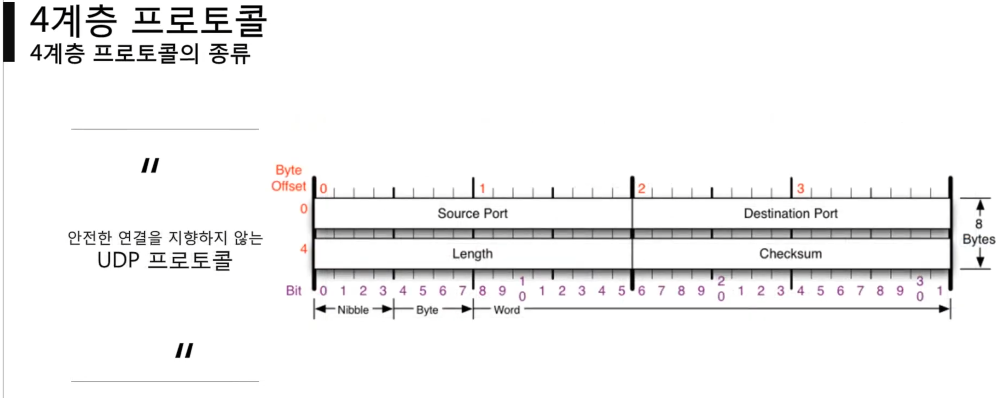
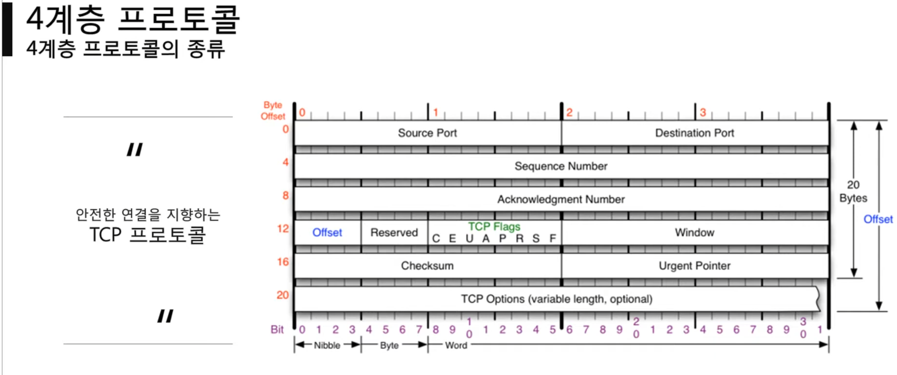
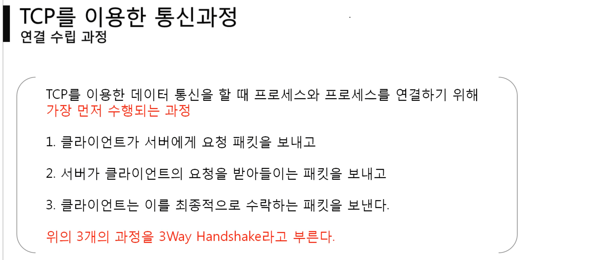
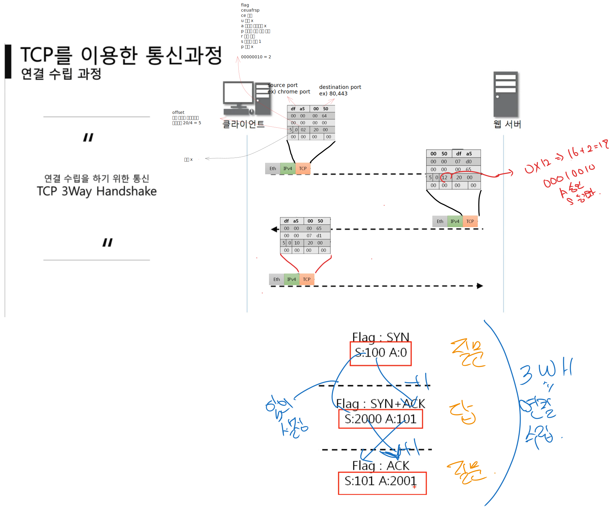
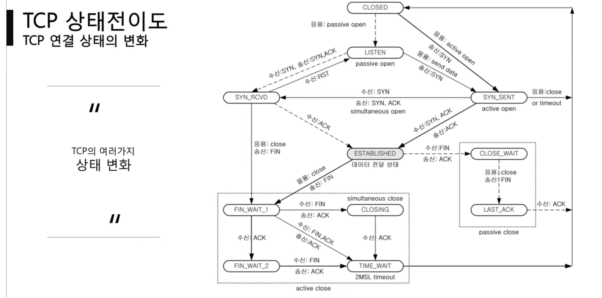
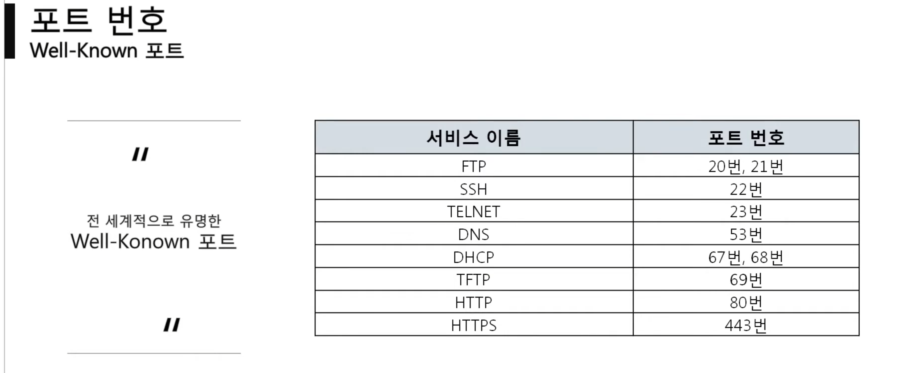
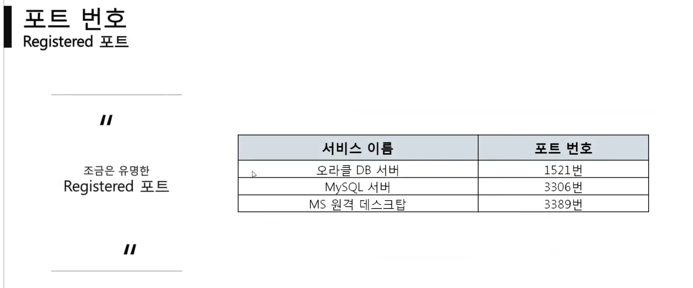
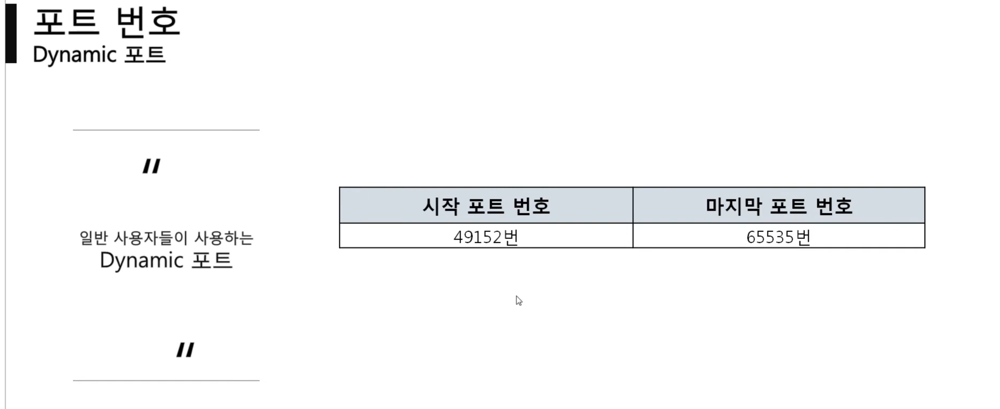

**프로그램(프로세스) 간 통신**
- 4계층 프로토콜
- 포트번호
- 프로그램 연결 정보

## 4계층 프로토콜
**전송계층**
**송신자 프로세스 수신자 프로세스 통신**

- TCP
- UDP
- 포트번호(4계층 주소)

### UDP

- source Port : 출발 프로세스 포트번호(2바이트 2^16)
- Destination Port : 도착 프로세스 포트번호 
- Length : 길이
- Checksum
DNS 서버 전송이 실패해도 다시보내면 그만
tftp 서버 : 파일 공유
RIP 프로토콜 : 라우팅 정보 공유

###6174939.png)
- source Port : 출발 프로세스 포트번호(2바이트 2^16)
- Destination Port : 도착 프로세스 포트번호 
- Sequence Number, Acknowledgment Number : 연결을 보장하는 용도로 사용
	- 보내는 입장에서의 S : 상대방의 어떠한 대답의 질문인지 기록
	- 보내는 입장에서의 A :  상대방의 질문에 데이터를 더해 전송
	- 받는 입장의 S: 어떠한 대답에 대한 질문인가
	- 받는 입장의 A : 내가 보낸 질문이 정확하게 도달했는가 내가 보냈던 질문의 S에 데이터의 크기를 더해 확인한다
	- 3way hand shake 시에는 0으로 초기화 보낼때는 +1 을 답변으로
- Offset : 헤더 길이 전체크기/4
- Reserved : 예약 사용하지 않음
- TCP Flags : 통신 상황 파악용
	- C, E 몰라도 된다
	- U : 긴급한 자료인가? 
	- A : 승인 bit 대답용
	- P : tcp 버퍼 크기 상관없이 보낸다?
	- R : 연결된 상태에서 문제 발생 초기화 필요 reset
	- S : sync 동기화 연결 시작시 1
	- F : 종료
- Window : 자신의 TCP 공간 버퍼(상대방서 보내도 되는지 판단 기준)
- Checksum
- Urgent Pointer : 긴급 데이터 위치데이터
- TCP Options
#### TCP 통신 과정 3way hand shake

> +1 은 데이터가 포함된(페이로드) 때는 데이터의 크기를 더해준다

점선은 클라이언트 요청
실선은 서버 응답
## 포트 번호
하나의 포트는 하나의 프로세스만 사용 가능하다

