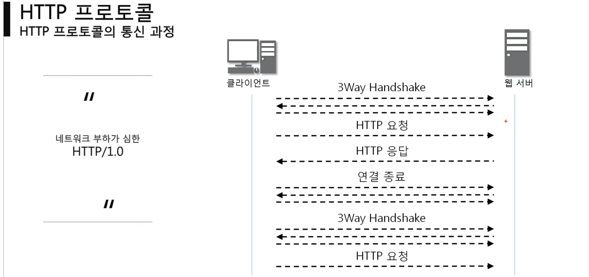
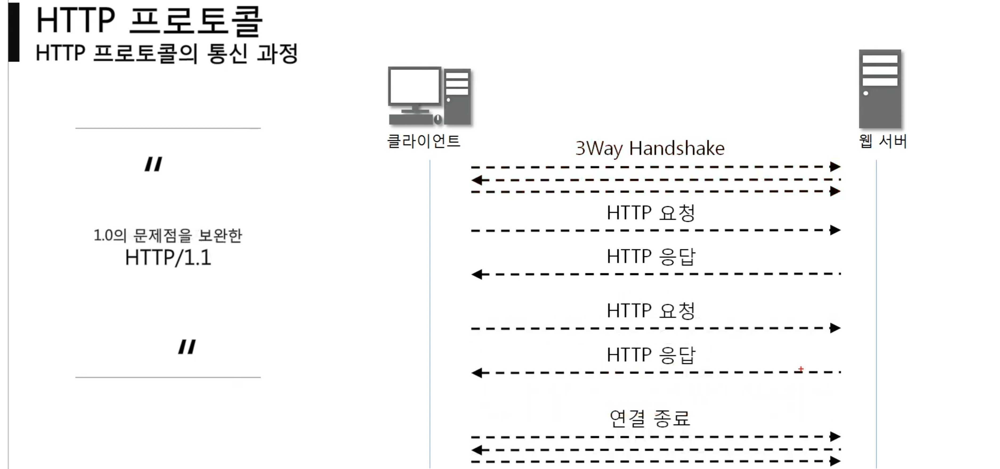
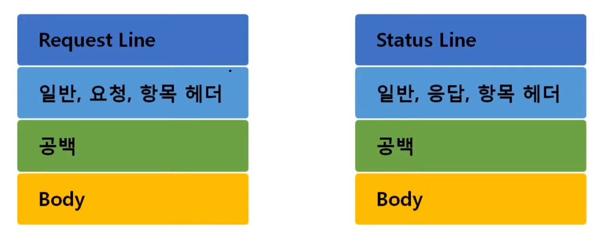
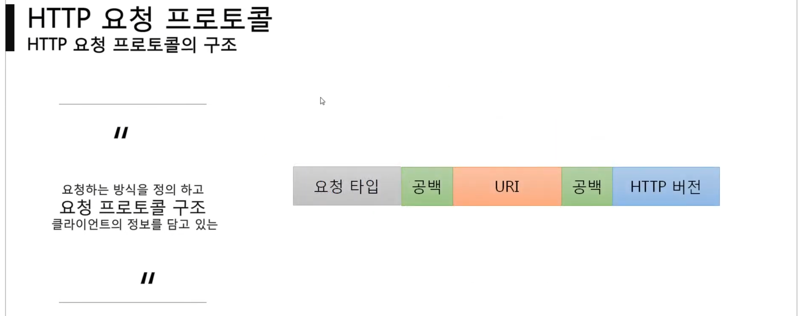
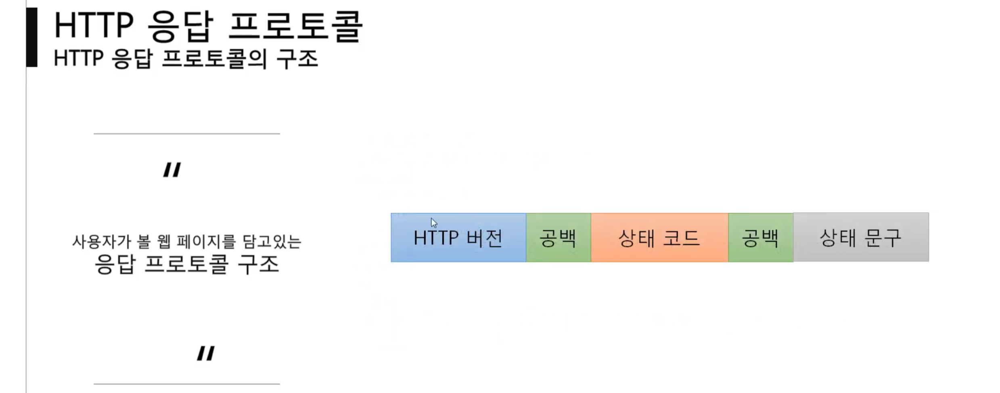
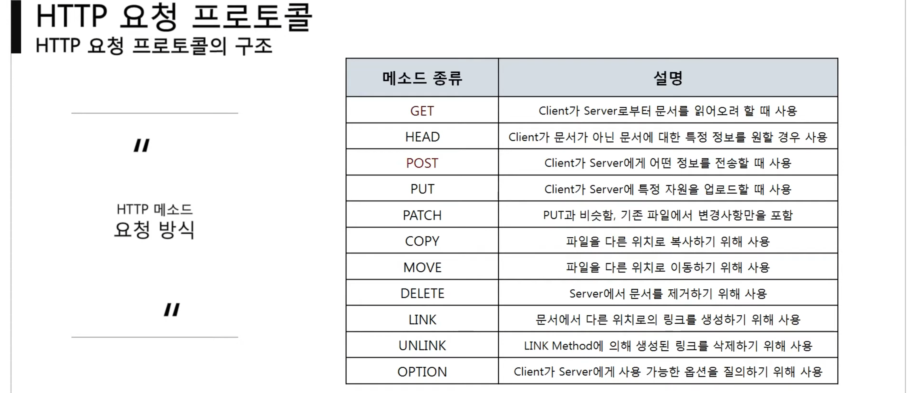
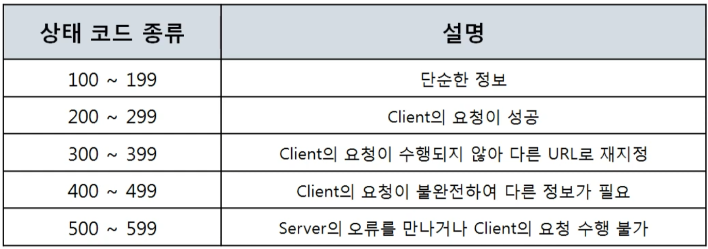
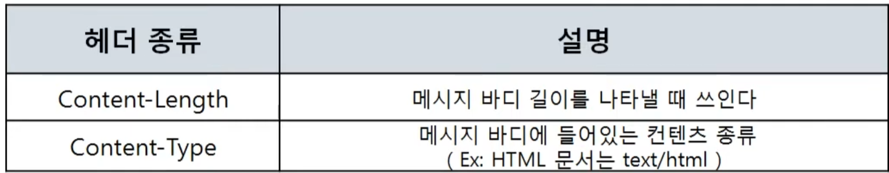
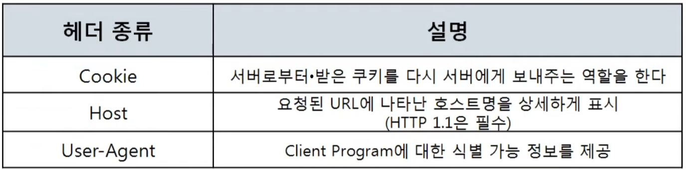
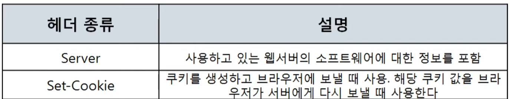

5계층 부터 7계층 까지 한번에 관리 {세션 표현 응용}
- http 1.0 에서 1.1 변경
- http 요청 프로토콜
- http 응답 프로토콜
- http 헤더 포멧

> http 버전
> RFC2068(1997)
> RFC2616(1999)
> RFC7230~7235(2014)

### http 1.0 에서 1.1 변경

> 매우 비요율적 모든 요청 응답 하나하나 3wh를 해야한다

## http 요청 & 응답 프로토콜

### request Line

ex) GET / HTTP/1.1
### status line

ex) HTTP/1.1 200 OK
#### 요청 타입

최근 백엔드(was)와 프론트(client)의 데이터 흐름은 json 형식으로 많이 사용한다 이때 요청 방식의 단일화 규칙을 세우는 것을 REST API 라고 한다

- get : 정보를 url 에 포함해서 보낸다
- post : 정보를 body에 포함해서 보낸다
### URI

## Headers
### 일반 헤더

### 요청 헤더

### 응답 헤더

### 항목 헤더
.....

