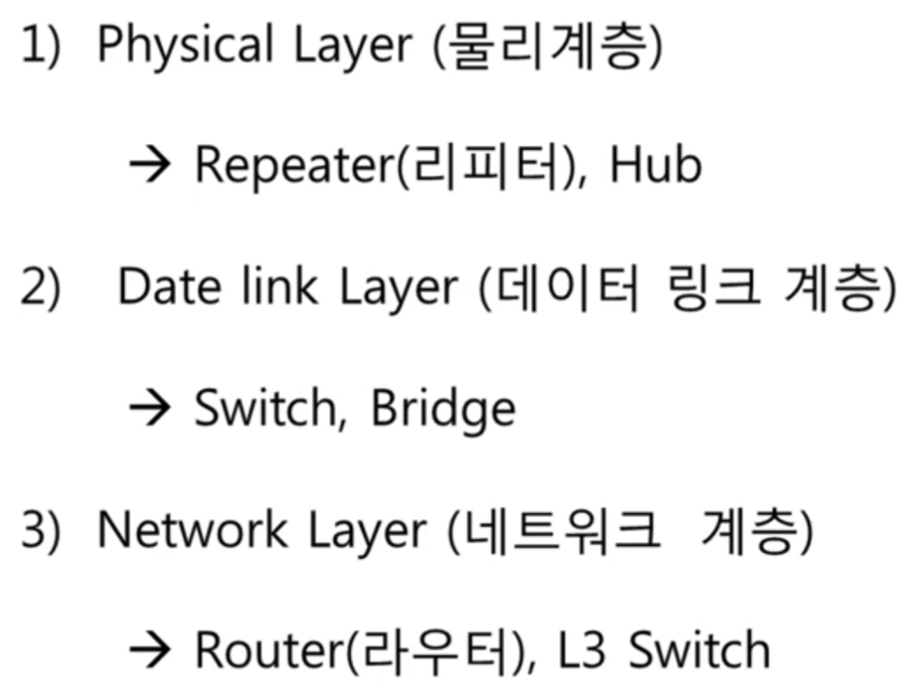
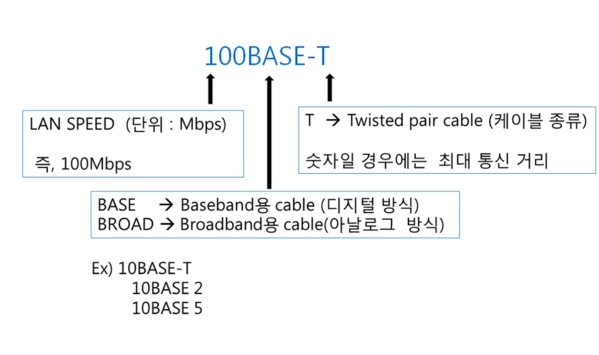
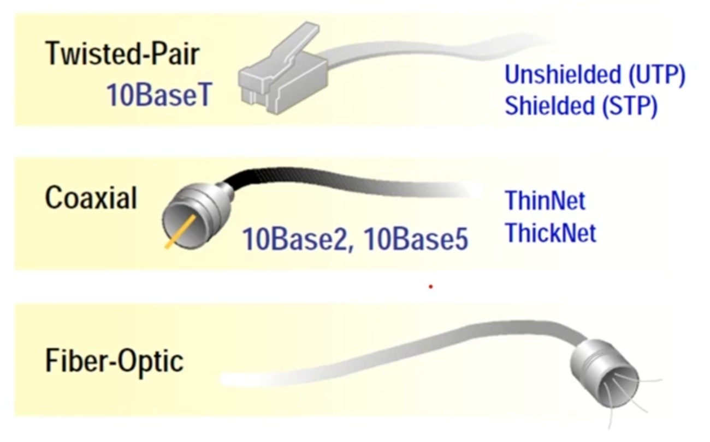

계층별 장비

## 물리계층
- 리피터 : 전기적 신호가 약할때 증폭 기능
- 허브 : 데이터를 모든 장비에 전송 일종의 브로드캐스트

## 데이터 링크 2계층
- 브릿지 : 맥주로를 기반으로 전송 포트를 결정
- 스위치 :  브릿지에 collision domain 기능 추가

## 네트워크 계층
- 라우터 : 라우팅 테이브를 참고하여 목적지와 연결되는 포트로 paket 을 전송 => 라우팅
	- 3계층 장비는 브로트캐스트를 모두 차단

## 케이블

