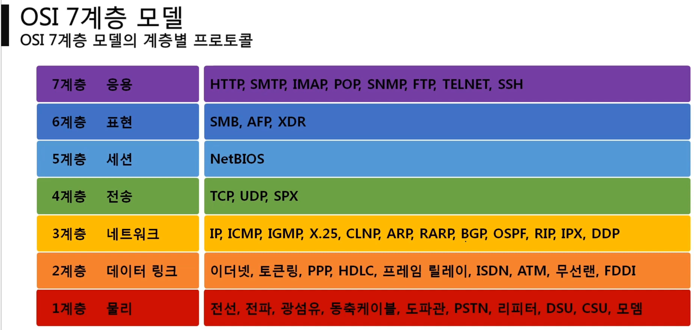
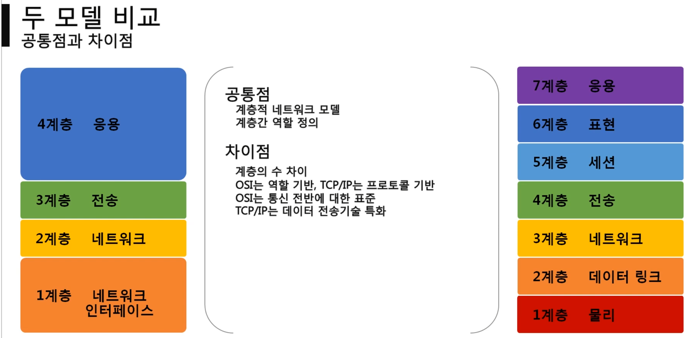
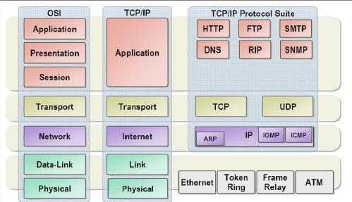
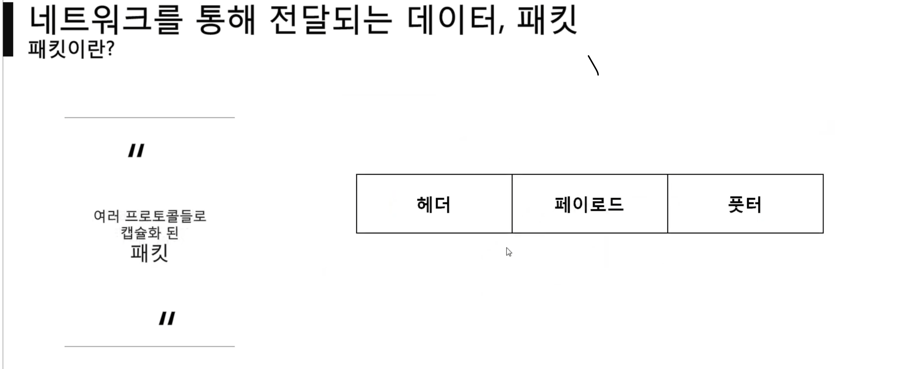
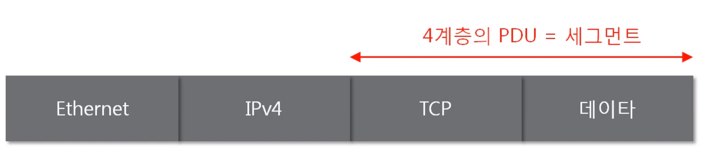
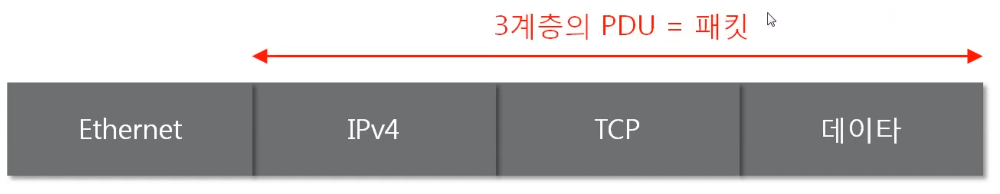
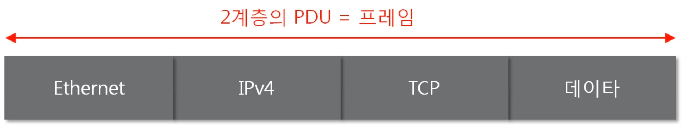
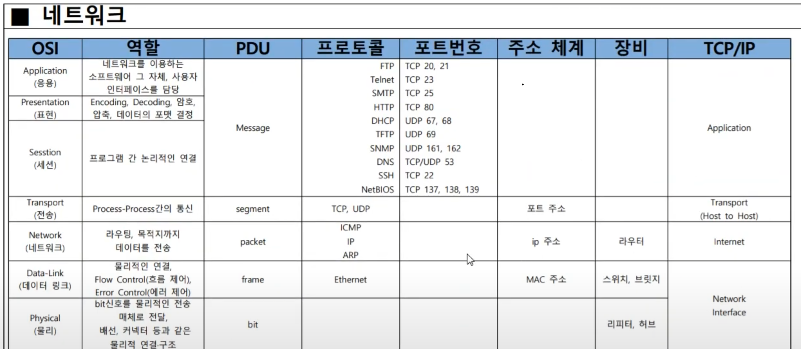
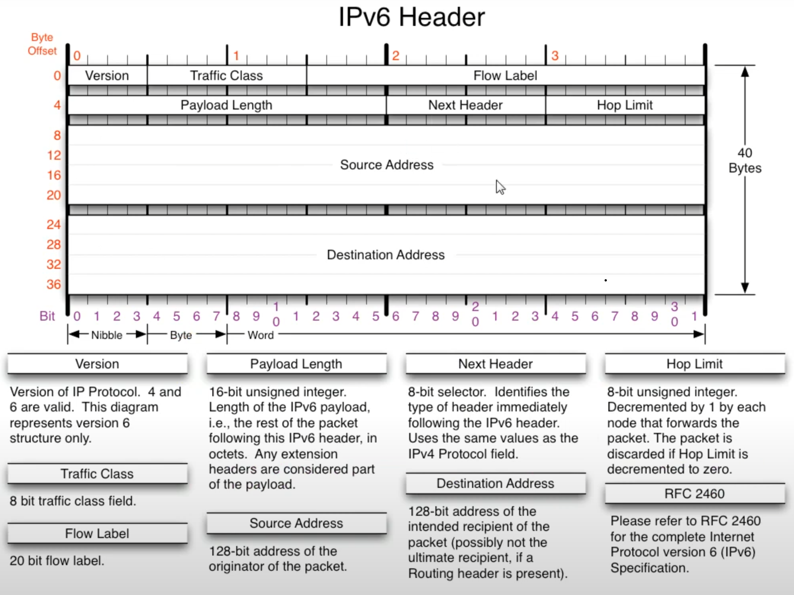

## 크기에 따른 분류
- LAN ( Local Area Network )
- WAN ( Wide Area Network )
- MAN ( Metropolitan Area Network )
- VLAN 
- CAN
- PAN

## 연결 형테애 따른 분류
- Star 중앙장비에 모든 노드가 연결
- Mesh 여러노드의 그물 형태
- Tree 계층 구조의 형태
- 링형, 버스형, 혼합형

## 통신방식에 따른 분류
- 유니 캐스트 ( 특정 대상과 1:1 통신 )
- 멀티 캐스트 ( 특정 다수와 1:N 통신 멀티 캐스트 {특정 인원})
- 브로트 캐스트 ( 네트워크에 있는 모든 대상과 통신 )

## 계층별 프로토콜

## 패킷

>이더넷 프로토콜만 풋터 사용

테이터 -> 캡슐화
인캡슐레이션 incapsulation
캡슐 -> 데이터
디캡슐레이션 decapsulati%20image%2020240506030502.png)

- frame 의 최소 크기 60byte 1계층 에서 붙는다 최대 1514byte
- 

Transport TCP 에서 PDU  : segment
Transport UDP 에서 PDU : user datagram
Network IP  에서 PDU : datagram
 

01. 네트워크란 무엇인가[https://docs.google.com/presentation/d/1cBVIS457shcUV3cfSrM9c1w3Lws3ZVE9/edit?usp=sharing&ouid=109006469823185730332&rtpof=true&sd=true](https://docs.google.com/presentation/d/1cBVIS457shcUV3cfSrM9c1w3Lws3ZVE9/edit?usp=sharing&ouid=109006469823185730332&rtpof=true&sd=true) 

02. 네트워크의 기준! 네트워크 모델
[https://docs.google.com/presentation/d/1ui8oW-jTp3z5dU7XP1a-eMnJu9GcAs49/edit?usp=sharing&ouid=109006469823185730332&rtpof=true&sd=true](https://docs.google.com/presentation/d/1ui8oW-jTp3z5dU7XP1a-eMnJu9GcAs49/edit?usp=sharing&ouid=109006469823185730332&rtpof=true&sd=true) 

03. 가까이 있는 컴퓨터끼리는 이렇게 데이터를 주고받는다
[https://docs.google.com/presentation/d/1HYg9YC3_luzxMHzVn-sGd6gzjgExGKV6/edit?usp=sharing&ouid=109006469823185730332&rtpof=true&sd=true](https://docs.google.com/presentation/d/1HYg9YC3_luzxMHzVn-sGd6gzjgExGKV6/edit?usp=sharing&ouid=109006469823185730332&rtpof=true&sd=true) 

04. 실제로 컴퓨터끼리는 IP주소를 사용해 데이터를 주고받는다

05. 통신하기 전 반드시 필요한 ARP 프로토콜
[https://docs.google.com/presentation/d/1GParqmJVI3xwzFDk-FrOqGzFsAFbqUC5/edit?usp=sharing&ouid=109006469823185730332&rtpof=true&sd=true](https://docs.google.com/presentation/d/1GParqmJVI3xwzFDk-FrOqGzFsAFbqUC5/edit?usp=sharing&ouid=109006469823185730332&rtpof=true&sd=true) 

06. 멀리있는 컴퓨터기리는 이렇게 데이터를 주고받는다[https://docs.google.com/presentation/d/1ezrr3wC9UaTGqtjRPfetCrstnd6qZ8G0/edit?usp=sharing&ouid=109006469823185730332&rtpof=true&sd=true](https://docs.google.com/presentation/d/1ezrr3wC9UaTGqtjRPfetCrstnd6qZ8G0/edit?usp=sharing&ouid=109006469823185730332&rtpof=true&sd=true) 

07. 컴퓨터의 프로그램끼리는 이렇게 데이터를 주고 받는다
[https://docs.google.com/presentation/d/1z-WGHNF81x40zbNrJRv29NMFCUVzKeyh/edit?usp=sharing&ouid=109006469823185730332&rtpof=true&sd=true](https://docs.google.com/presentation/d/1z-WGHNF81x40zbNrJRv29NMFCUVzKeyh/edit?usp=sharing&ouid=109006469823185730332&rtpof=true&sd=true) 

08. 비연결지향형 UDP 프로토콜
[https://docs.google.com/presentation/d/1vOOj3I0zHIuqLmSKwCicuSLuveZtuz9a/edit?usp=sharing&ouid=109006469823185730332&rtpof=true&sd=true](https://docs.google.com/presentation/d/1vOOj3I0zHIuqLmSKwCicuSLuveZtuz9a/edit?usp=sharing&ouid=109006469823185730332&rtpof=true&sd=true) 

09. 연결지향형 TCP 프로토콜
[https://docs.google.com/presentation/d/15SyhelhPtlwbz6wqeodjHhwVfU2bop50/edit?usp=sharing&ouid=109006469823185730332&rtpof=true&sd=true](https://docs.google.com/presentation/d/15SyhelhPtlwbz6wqeodjHhwVfU2bop50/edit?usp=sharing&ouid=109006469823185730332&rtpof=true&sd=true) 

10. NAT와 포트포워딩

[https://docs.google.com/presentation/d/1N7gScAhktYl3i_cSRi6-DHRTIwfPvq0O/edit?usp=sharing&ouid=109006469823185730332&rtpof=true&sd=true](https://docs.google.com/presentation/d/1N7gScAhktYl3i_cSRi6-DHRTIwfPvq0O/edit?usp=sharing&ouid=109006469823185730332&rtpof=true&sd=true) 

11. WWW(웹)를 이용할 때는 이렇게 데이터를 주고받는다
[https://docs.google.com/presentation/d/1W2AIBsANAttvrbcrh9wLMrPYbaB8Hkht/edit?usp=sharing&ouid=109006469823185730332&rtpof=true&sd=true](https://docs.google.com/presentation/d/1W2AIBsANAttvrbcrh9wLMrPYbaB8Hkht/edit?usp=sharing&ouid=109006469823185730332&rtpof=true&sd=true)

tracert 