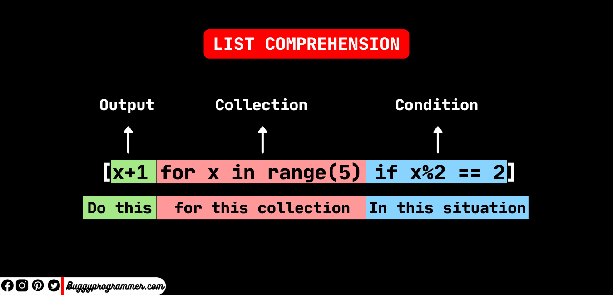

%20image%2020231223111957.png)

컴퓨터 계산 기준 output 식 발견
뒤의 for , if 좌측에서 우측으로 순서대로 순회후 out put을 계산
## for문
**for 문이 무조건 한개는 있어야 한다**
```python
lst = [1,2,3,4,5,6,7,8,9,10]
a = [x+1 for x in lst]
print(a)
 
[2, 3, 4, 5, 6, 7, 8, 9, 10, 11]
```


```python
>>> [ (x, y) for x in ['쌈밥', '치킨', '피자'] for y in ['사과', '아이스크림', '커피']] [('쌈밥', '사과'), 
('쌈밥', '아이스크림'), 
('쌈밥', '커피'), 
('치킨', '사과'), 
('치킨', '아이스크림'), 
('치킨', '커피'),
('피자', '사과'), 
('피자', '아이스크림'),
('피자', '커피')]
```
**좌측부터 계산**


## if 문
```python
lst = [1,2,3,4,5,6,7,8,9,10]
c = [x for x in lst if x > 4]
print(c)
 
[5, 6, 7, 8, 9, 10]
```

## 중첩 if 문
```python
d = [x for x in lst if x > 4 if x%2 == 0]
 
[6, 8, 10]
```


## if else
```python
lst = [1,2,3,4,5,6,7,8,9,10]
e = [x if x > 4 else 'less than 4' for x in lst]
print(e)
['less than 4', 'less than 4', 'less than 4', 'less than 4', 5, 6, 7, 8, 9, 10]
```

> [!NOTE] 
> if else 문은 왜 앞에다가 사용하는가??
> if else 는 여기서는 삼항 연산자로 사용된다 
> 처음에 예시로 든 (x+1)  과 (x if x > 4 else 'less than 4') 이렇게 하나의 output 이다
> 문으로 보지 않도록 하자


## nested
```python
matrix = [
     [1, 2, 3, 4],
     [5, 6, 7, 8],
     [9, 10, 11, 12],
]

[[row[i] for row in matrix] for i in range(4)]

[1, 5, 9](1,%205,%209)
```

