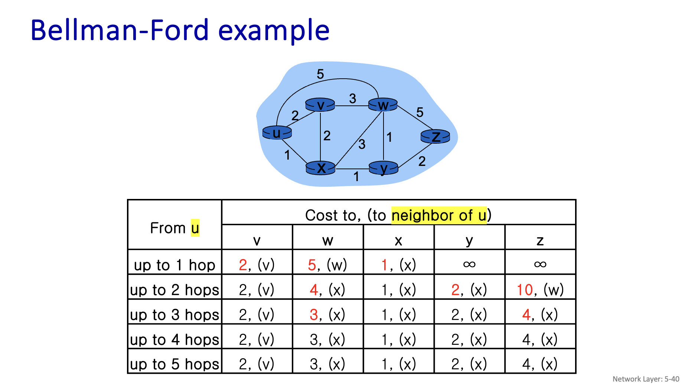

이 표는 시작 노드 **u**에서 다른 모든 노드(v, w, x, y, z)까지의 최단 거리를 벨만-포드 알고리즘을 사용하여 찾는 과정을 보여줍니다. 벨만-포드 알고리즘은 **거쳐가는 간선(hop)의 개수를 1개부터 점차 늘려가며** 최단 거리를 갱신하는 방식입니다.

---

### ## 기본 개념: 벨만-포드 알고리즘

벨만-포드 알고리즘의 핵심 아이디어는 다음과 같습니다.

- **k개의 간선까지만 사용했을 때의 최단 거리**를 계산합니다.
- 이전 단계(k-1개 간선 사용)의 최단 거리 정보를 이용해 현재 단계(k개 간선 사용)의 최단 거리를 갱신합니다.
- 공식: `D[u] > D[v] + cost(v, u)` 이면 `D[u] = D[v] + cost(v, u)`로 갱신합니다. (v를 거쳐 u로 가는 거리가 더 짧다면 갱신)

주어진 표에서 "up to k hops"는 최대 k개의 간선을 사용했을 때 **u**로부터 각 노드까지의 최단 거리를 의미합니다.

---

### ## 단계별 논리 설명

각 단계에서 비용(Cost)과 다음 경유지(to neighbor of u)가 어떻게 결정되는지 살펴보겠습니다. 이 과정을 이해하려면 각 노드 간의 직접적인 연결 비용을 알아야 하지만, 표의 변화를 통해 역으로 추적해 보겠습니다.

#### 🔎 **1단계: 최대 1개의 간선 사용 (up to 1 hop)**

이 단계에서는 시작 노드 **u**와 **직접 연결된 이웃 노드**까지만의 거리를 계산합니다.

- **v까지의 비용: 2, 경유지: (v)**
    - **논리:** u에서 v까지 직접 연결된 간선의 비용이 2입니다.
- **w까지의 비용: 5, 경유지: (w)**
    - **논리:** u에서 w까지 직접 연결된 간선의 비용이 5입니다.
- **x까지의 비용: 1, 경유지: (x)**
    - **논리:** u에서 x까지 직접 연결된 간선의 비용이 1입니다.
- **y, z까지의 비용: ∞**
    - **논리:** u에서 y와 z로는 직접 연결된 간선이 없으므로, 초기 비용은 무한대(∞)입니다.

---

#### 🔎 **2단계: 최대 2개의 간선 사용 (up to 2 hops)**

이제 최대 2개의 간선을 사용하여 갈 수 있는 경로를 계산합니다. 즉, **1단계에서 계산된 이웃 노드(v, w, x)를 거쳐** 다른 노드로 가는 경로를 고려합니다.

- **v까지의 비용: 2, 경유지: (v)**
    - **논리:** u에서 v로 가는 직접 경로(비용 2)보다 더 짧은 경로가 발견되지 않았습니다.
- **w까지의 비용: 4, 경유지: (x)**
    - **논리:** 기존의 u→w 직접 경로(비용 5)보다 **u→x→w 경로**가 더 짧다는 것을 의미합니다.
    - 계산: `u→x 비용(1) + x→w 비용(3) = 4` 입니다. (따라서 x와 w는 비용 3으로 연결되어 있음을 알 수 있습니다.)
    - 비용이 5에서 4로 갱신되고, 경유지도 w에서 x로 변경되었습니다.
- **x까지의 비용: 1, 경유지: (x)**
    - **논리:** u에서 x로 가는 직접 경로(비용 1)가 여전히 최단 거리입니다.
- **y까지의 비용: 2, 경유지: (x)**
    - **논리:** u에서 y로 가는 새로운 경로가 발견되었습니다. u→x→y 경로입니다.
    - 계산: `u→x 비용(1) + x→y 비용(1) = 2` 입니다. (x와 y는 비용 1로 연결되어 있음을 알 수 있습니다.)
- **z까지의 비용: 10, 경유지: (w)**
    - **논리:** u에서 z로 가는 새로운 경로가 발견되었습니다. u→w→z 경로입니다.
    - 계산: `u→w 비용(5) + w→z 비용(5) = 10` 입니다. (w와 z는 비용 5로 연결되어 있음을 알 수 있습니다.)

---

#### 🔎 **3단계: 최대 3개의 간선 사용 (up to 3 hops)**

최대 3개의 간선을 사용하여 가는 경로를 계산합니다. **2단계에서 갱신된 거리 정보**를 활용합니다.

- **w까지의 비용: 3, 경유지: (x)**
    - **논리:** 기존 u→x→w 경로(비용 4)보다 더 짧은 경로가 발견되었습니다. u→x→y→w 경로일 가능성이 높습니다.
    - 계산: `u→x→y 비용(2) + y→w 비용(1) = 3` 입니다. (y와 w는 비용 1로 연결되어 있음을 알 수 있습니다.)
    - 비용이 4에서 3으로 갱신되었습니다.
- **z까지의 비용: 4, 경유지: (x)**
    - **논리:** 기존 u→w→z 경로(비용 10)보다 훨씬 짧은 경로가 발견되었습니다. u→x→y→z 경로일 가능성이 있습니다.
    - 계산: `u→x→y 비용(2) + y→z 비용(2) = 4` 입니다. (y와 z는 비용 2로 연결되어 있음을 알 수 있습니다.)
    - 비용이 10에서 4로 크게 줄고, 경유지도 w에서 x로 변경되었습니다.
- **v, x, y는 변경 없음:** 더 짧은 경로가 발견되지 않았습니다.

---

#### 🔎 **4단계 및 5단계: 최대 4, 5개 간선 사용**

- **논리:** 3단계에서 계산된 비용과 비교했을 때 **어떤 노드로의 비용도 더 이상 줄어들지 않았습니다.**
- 이는 **3개의 간선을 사용하는 경로에서 이미 모든 노드까지의 최단 거리가 구해졌음**을 의미합니다.
- 벨만-포드 알고리즘은 이렇게 더 이상 거리 갱신이 일어나지 않으면 최단 경로 탐색을 완료합니다. 보통 (전체 노드 개수 - 1) 만큼 반복하면 최단 거리를 보장하지만, 그전에 갱신이 멈추면 조기 종료할 수 있습니다.

---

### ## 최종 결과 요약

표의 마지막 줄(up to 4 또는 5 hops)이 시작 노드 **u**에서 각 노드까지의 최종 최단 거리입니다.

- **u → v:** 비용 2 (경로: u→v)
- **u → w:** 비용 3 (경로: u→x→y→w)
- **u → x:** 비용 1 (경로: u→x)
- **u → y:** 비용 2 (경로: u→x→y)
- **u → z:** 비용 4 (경로: u→x→y→z)

---

### ## 경유지(Next Hop) 표기의 장점

최단 거리 알고리즘에서 비용(Cost)만 계산하지 않고 다음 경유지(표에서는 'to neighbor of u')를 함께 기록하는 이유는 **실제 경로를 복원**하기 위해서입니다.

- **비용 vs. 경로**: 단순히 'u에서 z까지 최단 거리는 4'라는 사실만 아는 것과, '**u → x → y → z**'라는 경로를 아는 것은 큰 차이가 있습니다. 내비게이션 앱이 "목적지까지 요금은 5,000원입니다"라고만 알려주고 경로를 알려주지 않는다면 무용지물인 것과 같습니다.
- **경로 재구성 (Path Reconstruction)**: 최종적으로 계산된 경유지 정보를 따라가면 전체 경로를 알아낼 수 있습니다.
    - 예시: **z**로 가는 최종 경유지는 **(x)**입니다. 이는 최단 경로가 `u → x ...`로 시작함을 의미합니다.
    - (실제 알고리즘에서는 모든 노드에 대해 직전 노드(predecessor)를 저장하므로) `x`는 `y`를 통해 왔고, `y`는 `u`에서 온 `x`를 통해 왔다는 것을 역추적하여 `u → x → y → z` 전체 경로를 완성할 수 있습니다.

결론적으로 경유지 정보는 알고리즘이 찾은 **최단 거리의 '증거'이자 '실행 계획'**이 됩니다.

---

### ## 🔎 2단계 (최대 2개 간선 사용) 상세 비교 과정

2단계는 **1단계의 결과에, 간선을 하나 더 추가했을 때** 더 짧은 경로가 생기는지 모든 가능성을 확인하는 과정입니다.

**시작 정보 (1단계 결과):**

- `D(v) = 2` (경유지 v)
- `D(w) = 5` (경유지 w)
- `D(x) = 1` (경유지 x)
- `D(y) = ∞`
- `D(z) = ∞`

이제 각 목적지(v, w, x, y, z)에 대해, **u의 직접 이웃(v, w, x)을 거쳐 가는 경로**와 기존 경로를 비교합니다.

#### **1. 목적지: v**

- **기존 최단 거리:** `u → v` (비용 2)
- **새로운 경로 탐색:**
    - u → w → v: 비용 `D(w) + cost(w,v) = 5 + ?`
    - u → x → v: 비용 `D(x) + cost(x,v) = 1 + ?`
- **결론:** `u → v` 직접 경로(비용 2)보다 더 짧은 2-hop 경로가 발견되지 않았습니다. **변경 없음**.

#### **2. 목적지: w**

- **기존 최단 거리:** `u → w` (비용 5)
- **새로운 경로 탐색:**
    - u → v → w: 비용 `D(v) + cost(v,w) = 2 + ?`
    - **u → x → w**: 비용 `D(x) + cost(x,w) = 1 + 3 = 4`
- **비교:** 새로운 경로 `u → x → w`의 비용(4)이 기존 경로 비용(5)보다 **더 저렴합니다.**
- **결론:** `w`까지의 최단 거리를 **4**로 갱신하고, 경유지를 `(w)`에서 **`(x)`**로 변경합니다.

#### **3. 목적지: x**

- **기존 최단 거리:** `u → x` (비용 1)
- **새로운 경로 탐색:**
    - u → v → x: 비용 `D(v) + cost(v,x) = 2 + ?`
    - u → w → x: 비용 `D(w) + cost(w,x) = 5 + ?`
- **결론:** `u → x` 직접 경로(비용 1)는 이미 매우 저렴하여, 다른 노드를 거쳐 가는 경로가 더 짧아질 가능성이 거의 없습니다. **변경 없음**.

#### **4. 목적지: y**

- **기존 최단 거리:** `∞` (경로 없음)
- **새로운 경로 탐색:**
    - u → v → y: 비용 `D(v) + cost(v,y) = 2 + ?`
    - u → w → y: 비용 `D(w) + cost(w,y) = 5 + ?`
    - **u → x → y**: 비용 `D(x) + cost(x,y) = 1 + 1 = 2`
- **비교:** 새로운 경로 `u → x → y`의 비용(2)이 기존 비용(`∞`)보다 **더 저렴합니다.**
- **결론:** `y`까지의 최단 거리를 **2**로 갱신하고, 경유지를 **`(x)`**로 설정합니다.

#### **5. 목적지: z**

- **기존 최단 거리:** `∞` (경로 없음)
- **새로운 경로 탐색:**
    - u → v → z: 비용 `D(v) + cost(v,z) = 2 + ?`
    - **u → w → z**: 비용 `D(w) + cost(w,z) = 5 + 5 = 10`
    - u → x → z: 비용 `D(x) + cost(x,z) = 1 + ?`
- **비교:** 새로운 경로 `u → w → z`의 비용(10)이 기존 비용(`∞`)보다 **더 저렴합니다.** (u→x를 통한 경로는 아직 z로 이어지지 않음)
- **결론:** `z`까지의 최단 거리를 **10**으로 갱신하고, 경유지를 **`(w)`**로 설정합니다.

이러한 모든 비교 과정을 거쳐 표의 **"up to 2 hops"** 행이 완성되는 것입니다. 이와 같은 '완화(relaxation)' 과정을 모든 간선에 대해 반복하며 최적의 해를 찾아 나가는 것이 벨만-포드 알고리즘의 핵심입니다.