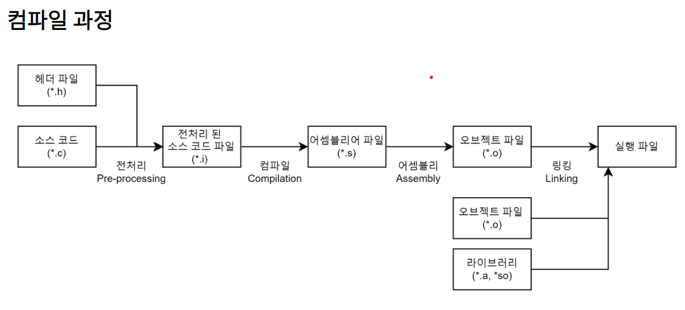

## 과정별 순서
## 요약
%20image%2020240104121023.png)
## 전처리기
`gcc -E program.c -o program.i`
옵션 : `-E  Preprocess only; do not compile, assemble or link.`

**헤더 파일 삽입** : \#include 지시문을 만나면 해당하는 헤더 파일을 찾아 **헤더 파일에 있는 모든 내용을 복사해서 소스 코드에 삽입**한다. 즉, 헤더 파일은 컴파일에 사용되지 않고 소스 코드 파일 내에 전부 복사된다. 헤더 파일에 선언된 함수 원형은 후에 링킹 과정을 통해 실제로 함수가 정의되어 있는 오브젝트 파일(컴파일된 소스 코드 파일)과 결합한다.

**매크로 치환 및 적용** : \#define 지시문에 정의된 매크로를 저장하고 같은 문자열을 만나면 **\#define 된 내용으로 치환**한다. 간단하게 말해 매크로 이름을 찾아서 정의한 값으로 전부 바꿔준다.

**컴파일러 기능 지정** : \#pragma once 한번만 컴파일 \#pragma warning(disable:4996) scanf 경고 끄기

## 컴파일
`gcc -S hello.c`
`gcc -S hello.i`
`-S  Compile only; do not assemble or link.``

## 어셈블리
`gcc -c program.s -o program.o`

## 링킹

**링킹(Linking) 과정**은 링커(Linker)를 통해 오브젝트 파일(*.o)들을 묶어 실행 파일로 만드는 과정이다.

이 과정에서 **오브젝트 파일들**과 프로그램에서 사용하는 **라이브러리 파일들**을 **링크**하여 **하나의 실행 파일**을 만든다.

이때 라이브러리를 링크하는 방법에 따라 **정적 링킹(Static Linking)**과 **동적 링킹(Dynamic Linking)**으로 나눌 수 있다. 링킹 방식의 차이는 앞서 설명했던 라이브러리 포스트를 참고하자.

서론 개발하다 보면 라이브러리를 사용할 일이 많다. 라이브러리를 사용해보면 정확한 개념은 몰라도 프로그램을 개발할 때 필요한 기능을 가져다 쓰는 도구라는 것은 어렴풋이 이해할 수 있다
### **링커의 역할**

링커의 역할은 크게 **심볼 해석**과 **재배치**로 나눌 수 있다.

#### **심볼 해석(Symbol Resolution)**

**심볼 해석**은 각 오브젝트 파일에 있는 **심볼 참조를 어떤 심볼 정의에 연관시킬지 결정하는 과정**이다. 여러 개의 오브젝트 파일에 같은 이름의 함수 또는 변수가 정의되어 있을 때 어떤 파일의 어떤 함수를 사용할지 결정한다.

#### **재배치(Relocation)**

**재배치**는 오브젝트 파일에 있는 **데이터의 주소나 코드의 메모리 참조 주소를 알맞게 배치하는 과정**이다.

링커가 컴파일러가 생성한 오브젝트 파일을 모아서 하나의 실행 파일을 만들 때, **각 오브젝트 파일에 있는 데이터의 주소나 코드의 메모리 참조 주소**가 **링커에 의해 합쳐진 실행 파일에서의 주소와 다르게 때문에 그것을 알맞게 수정**해줘야 한다.

**이를 위해 오브젝트 파일 안에 재배치 정보 섹션(**Relocation Information Section)**이 존재한다.** 

링킹 과정에서 **같은 세션끼리 합쳐진 후 재배치**가 일어난다.

위 그림을 통해 알 수 있듯이 오브젝트 파일 형식은 링킹 과정에서 링커가 여러 개의 오브젝트 파일들을 하나의 실행 파일로 묶을 때 필요한 정보를 효율적으로 파악할 수 있는 구조이다.

링킹을 하기 전 오브젝트 파일을 **재배치 가능한 오브젝트 파일(Relocatable Object File)**이라 부르고 링킹을 통해 만들어지는 오브젝트 파일을 **실행 가능한 오브젝트 파일(Executable Object File)**이라 부른다.

- c++ -> c 변환 번역기 컴파일러(?)를 cfront 라 한다
- GNU g++ gcc 과 같은 컴파일러를 프리웨어라 한다
- 어떤라이ㅡㅂ러리들은 그것을 사용하려면 컴파일 명령행에 명시적으로 요구된 명령을 입력해야한다

( CC test.c -lm) (-lm 수학라이브러리 링크 명령)

(g++ test.cpp. -lg++)

- 윈도우 커맨드라인 컴파일러는 Cygwin 과 MinGW 이다
-