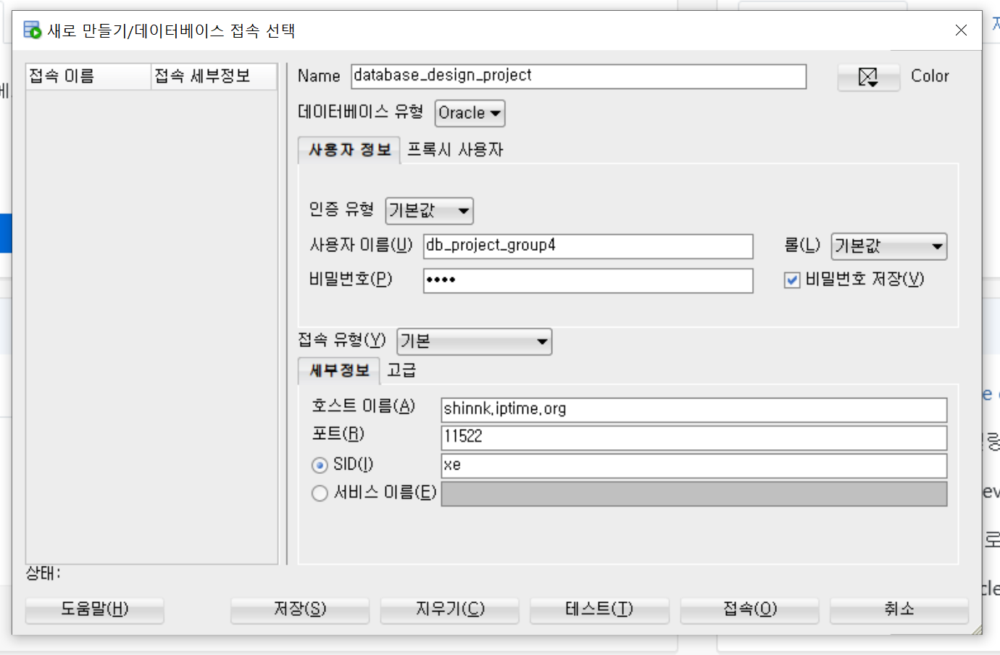
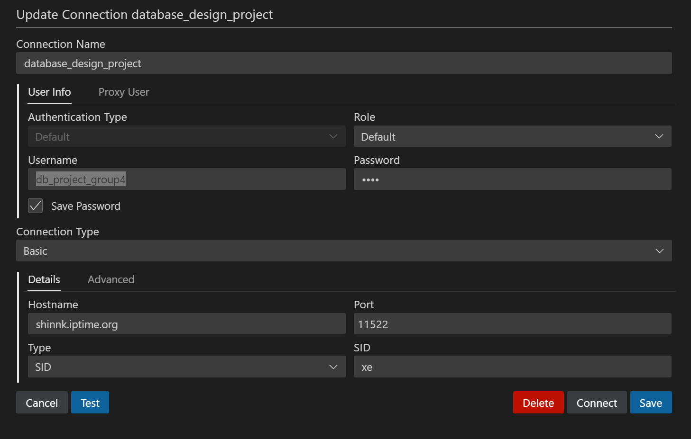

미리 data 를 담아놓은 db 입니다
환경구성이 잘 안되시는 분은 여기서 이것을 사용하시면 됩니다
학기 끝날 때 까지 서버를 열어 두겠습니다
%20image%2020241113211582.png)

```
비밀번호는 1111
단 data 뷰어 용으로만 사용해 주세요(create문 truncate 등등 data 를 손보는 작업은 하지 말아 주세요)
```
