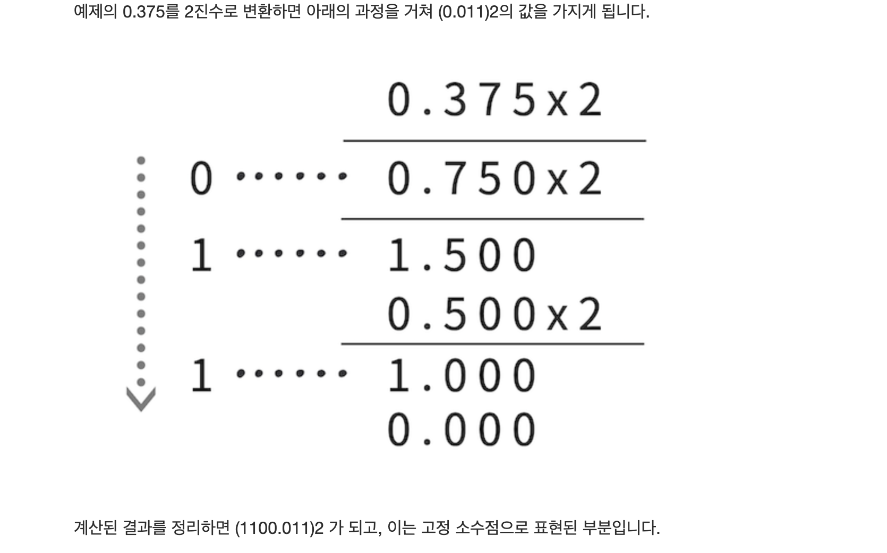
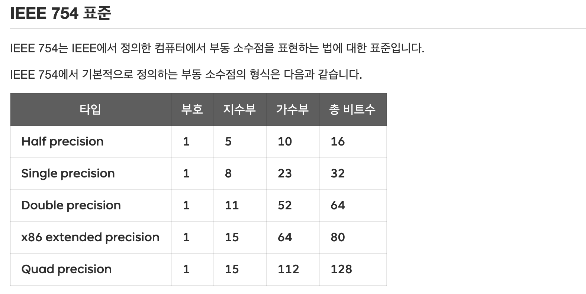
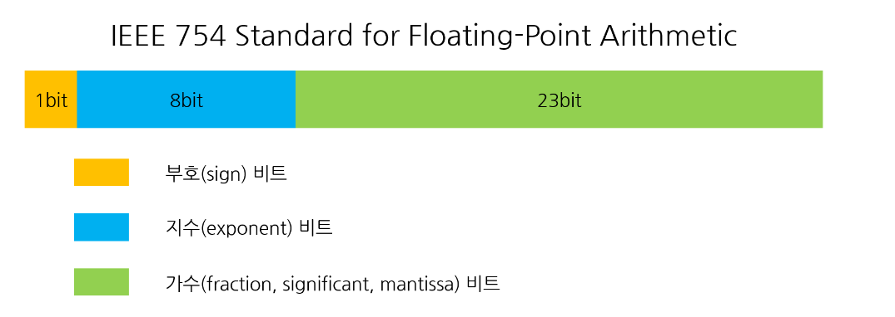

### 소수의 10진수 2진수 계산 방법

**예시 1: 10진수 1.625 → 2진수 1.101**  
1. **정수 부분(1):**  
   - 1 ÷ 2 = 0 ... **나머지 1**  
   - 따라서 정수 부분은 **1**입니다.  

2. **소수 부분(0.625):**  
   - 0.625 × 2 = 1.25 → **정수 부분 1**, 소수 부분 0.25  
   - 0.25 × 2 = 0.5 → **정수 부분 0**, 소수 부분 0.5  
   - 0.5 × 2 = 1.0 → **정수 부분 1**, 소수 부분 0 (계산 종료)  
   - 따라서 소수 부분은 **101**입니다.  

3. **결과:**  
   - 정수 부분(1) + 소수 부분(.101) = **1.101**

**예시 2: 10진수 3.375 → 2진수 11.011**  
1. **정수 부분(3):**  
   - 3 ÷ 2 = 1 ... **나머지 1**  
   - 1 ÷ 2 = 0 ... **나머지 1**  
   - 따라서 정수 부분은 **11**입니다. 
2. **소수 부분(0.375):**  
   - 0.375 × 2 = 0.75 → **정수 부분 0**, 소수 부분 0.75  
   - 0.75 × 2 = 1.5 → **정수 부분 1**, 소수 부분 0.5  
   - 0.5 × 2 = 1.0 → **정수 부분 1**, 소수 부분 0 (계산 종료)  
   - 따라서 소수 부분은 **011**입니다. 
3. **결과:**  
   - 정수 부분(11) + 소수 부분(.011) = **11.011**

**예시 3: 10진수 0.875 → 2진수 0.111**  
1. **정수 부분(0):**  
   - 정수 부분이 없으므로 **0**입니다. 
2. **소수 부분(0.875):**  
   - 0.875 × 2 = 1.75 → **정수 부분 1**, 소수 부분 0.75  
   - 0.75 × 2 = 1.5 → **정수 부분 1**, 소수 부분 0.5  
   - 0.5 × 2 = 1.0 → **정수 부분 1**, 소수 부분 0 (계산 종료)  
   - 따라서 소수 부분은 **111**입니다.  
3. **결과:**  
   - 정수 부분(0) + 소수 부분(.111) = **0.111**

**예시 4: 10진수 5.6 → 2진수 101.100110... (반복 소수)**  
1. **정수 부분(5):**  
   - 5 ÷ 2 = 2 ... **나머지 1**  
   - 2 ÷ 2 = 1 ... **나머지 0**  
   - 1 ÷ 2 = 0 ... **나머지 1**  
   - 따라서 정수 부분은 **101**입니다.  
2. **소수 부분(0.6):**  
   - 0.6 × 2 = 1.2 → **정수 부분 1**, 소수 부분 0.2  
   - 0.2 × 2 = 0.4 → **정수 부분 0**, 소수 부분 0.4  
   - 0.4 × 2 = 0.8 → **정수 부분 0**, 소수 부분 0.8  
   - 0.8 × 2 = 1.6 → **정수 부분 1**, 소수 부분 0.6 (반복 시작)  
   - 따라서 소수 부분은 **100110...** (0.6이 반복되므로 순환 소수).  
3. **결과:**  
   - 정수 부분(101) + 소수 부분(.100110...) = **101.100110...**

고정 소수점 방식 vs 부동 소수점 방식 두개의 논의
또한 실제 어떻게 컴퓨터에0,75 = 0.11(2진수) => 사람이 표현하는 방식
12.125 = 1100.001(2진수) => 사람이 표현하는 방식
실제 컴퓨터에 저장할 떄는 . 소수점을 넣을 수 없으므로 고정적으로 소수점 (.) 을 지정해서 저장하는 방식이 사용된다
예컨테 위의 0.75 를 8bit 자료형에서 앞자리 4은 정수 뒷자리 4 는 소수점 아래라고 정하면 실제 컴퓨터에 32 bit 가 저장될 때는 (00001100) 이렇게 저장된다 부호비트가 맨 앞의 bit 를 할당 3자리 정수 4자리 소수점 아래 소수 라고 전제하여도 동일한 bit 로 저장됨

즉 고정적으로 소수점을 정한다고 해서 고정 소수점 방식이라고 한다

하지만 위의 방식은 0.1 같은 수는 어림잡아 표현할 수 밖에 없다
0.3 => 0.01001100110011......(0011)

즉 위의 방식은 2가지 문제를 가지고 있다
1. 정확한 수를 표현하지 못함
2. 소수점 아래에 bit를 많이 배정하면 작은수 밖에 표현하지 못하고 정수부에 bit 를 많이 배정하면 작은 수밖에 표현하지 못한다
여기서 우리는 2번 째 문제를 해결해 보자

## 부동 소수점 방식

- $N = (-1)^S * 2^{E-127} * 1.M$
- 부호 1 비트 S
- 지수 8비트 : 범위(range)를 나타낸다 E
- 가수 23 비트 : 정밀도(precision)를 나타낸다 M 
- 바이어스 127 : 

> 정규화된 표현 : 가수 23 M 에서 1.M 형태의 정규화된 표현을 사용한다 이를 통해 더 큰 범위를 표현할 수 있도록 한다

> 정규화된 표현을 모든 지수부 모든 가수부에서 그대로 사용한다면 부동소수점방식에서 0을 표시할 수 없다 

> 지수부를 2의 보수로 하지 않고 바이어스를 사용해서 음수를 표현한 이유 : 
> 지수부가 0 이면 0.M 비정규표현을 사용할 때 지수부와 가수부가 모두 0일때 0이 계산된다 
> 0임을 확인하는 하드웨어 복잡성 증대를 막기 위해 이렇게 사용한다

### 결론 (반정밀도 기준)
- $E = 31$ 이고 $M \neq 0$ 이면 $N = \text{NaN}$
- $E = 31$ 이고  $M = 0$ 이면 $N = (-1)^S \times \infty$
- $0 < E < 31$  이면 $N = (-1)^S \times 2^{E - 15} \times (1.M)$
- $E = 0$ 이고 $M \neq 0$ 이면 $N = (-1)^S \times 2^{-14} \times (0.M)$
- $E = 0$ 이고 $M = 0$  - $N = (-1)^S \times 0$.  
### 결론 (단정밀도 기준)
- 만약 $E = 255$ 이고 $M\neq0$ 이면 $N =\text{NaN}$ (Not a Number).
- 만약 $E = 255$ 이고 $M = 0$ 이면 $N=(-1)^S \times \infty$ 
- 만약 $0<E<255$ 이면   $N=(-1)^S \times 2^{E-127}\times(1.M)$
- 만약 $E=0$ 이고 $M \neq 0$ 이면 $N=(-1)^S \times 2^{-126} \times (0.M)$
- 만약 $E = 0$ 이고 $M=0$ 이면 $N=(-1)^s \times 0$
### 결론 (배정밀도 기준)
- $E = 2047$ 이고 $M \neq 0$ 이면 $N = \text{NaN}$
- $E = 2047$ 이고 $M = 0$ 이면 $N = (-1)^S \times \infty$
- $0 < E < 2047$ 이면 $N = (-1)^S \times 2^{E - 1023} \times (1.M)$
- $E = 0$ 이고 $M \neq 0$ 이면 $N = (-1)^S \times 2^{-1022} \times (0.M)$
- $E = 0$ 이고 $M = 0$ 이면 $N = (-1)^S \times 0$