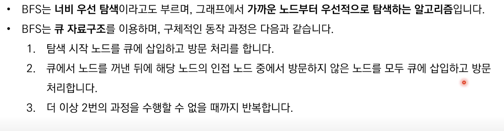

```cpp
#include <iostream>
#include <vector>
#include <queue>
#include <array> // for std::array

using namespace std;

void bfs(int start) {
    queue<int> q;
    q.push(start);              // 초기 시작 노드 큐에 삽입
    visited[start] = true;      // 방문 처리

	// que 처리 알고리즘
    while (!q.empty()) {
	    // 해당 노드 처리
        int x = q.front();
        q.pop();

        cout << x << ' ';
		// 해당 노드와 연결된 방문하지 않은 노드 처리
        for (int y : graph[x]) {
            if (!visited[y]) {
                q.push(y);
                visited[y] = true;
            }
        }
    }
}

int main(void) {
	// visited 배열을 std::array로 변경 (선택적)
	array<bool, 9> visited{}; // 기본적으로 false로 초기화

	// 그래프 연결 정보를 중괄호 초기화 리스트로 표현
	vector<int> graph[] = {
	    {}, // 0번 인덱스는 사용하지 않음 (1번부터 시작)
	    {2, 3, 8},  // 1번 노드에 연결된 노드들
	    {1, 7},      // 2번 노드에 연결된 노드들
	    {1, 4, 5},  // 3번 노드에 연결된 노드들
	    {3, 5},      // 4번 노드에 연결된 노드들
	    {3, 4},      // 5번 노드에 연결된 노드들
	    {7},        // 6번 노드에 연결된 노드들
	    {2, 6, 8},  // 7번 노드에 연결된 노드들
	    {1, 7}       // 8번 노드에 연결된 노드들
	};
    bfs(1); // 1번 노드부터 탐색 시작
    return 0;
}
```

