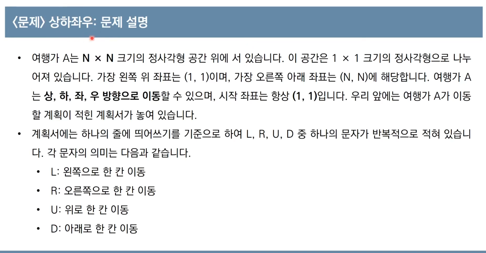
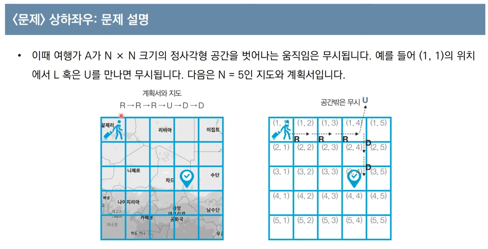
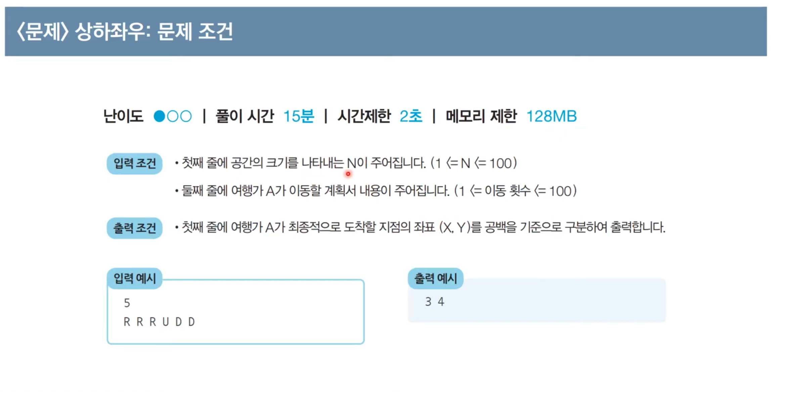
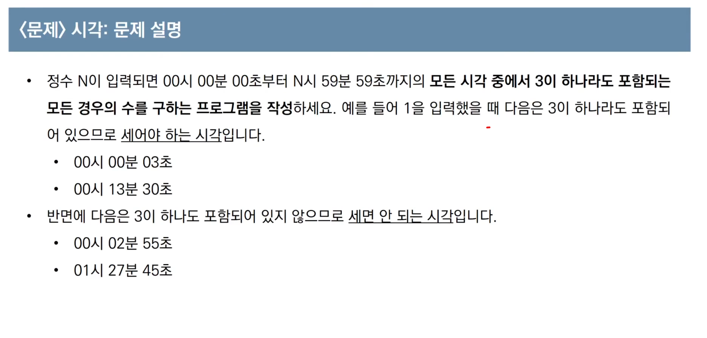
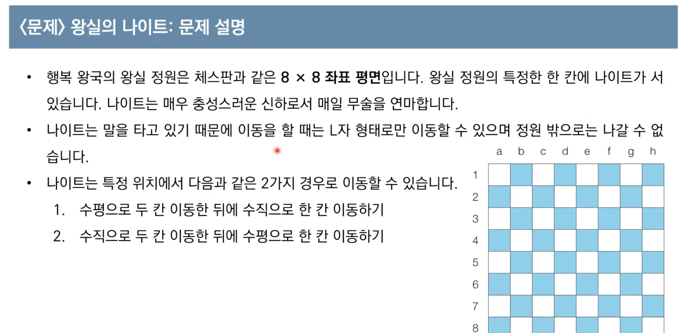
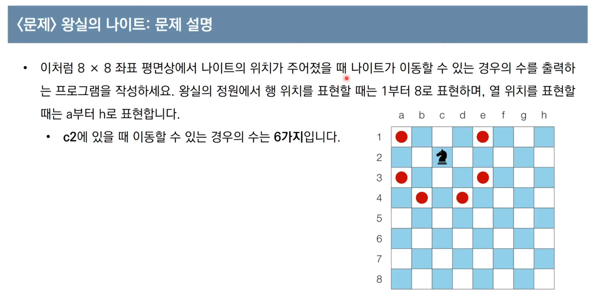

**머릿속에 있는 알고리즘을 소스코드로 바꾸는 과정**
- 알고리즘은 간단한데 코드가 지나칠 만큼 길어지는 문제
- 실수 연산을 다루고 특정 소수점 자리까지 출력해야 하는 문제
- 문자열을 특정한 기준에 따라서 끊어 처리해야 하는 문제
- 적절한 라이브러리를 찾아서 사용해야 하는 문제 ( 모든 순열 모든 조합을 찾는 문제 python itertools 모듈을 사용해야 쉬워진다 )

시뮬레이션 유형 구현 유형 완전탐색 


1. 미로 탐색 (문제 번호: 2178) - BFS 알고리즘을 사용하여 최단 경로를 찾는 문제입니다.  
    URL: [https://www.acmicpc.net/problem/2178](https://www.acmicpc.net/problem/2178)
    
2. 토마토 (문제 번호: 7576) - BFS 알고리즘을 사용하여 최소 일수를 구하는 문제입니다.  
    URL: [https://www.acmicpc.net/problem/7576](https://www.acmicpc.net/problem/7576)
    
3. 단지번호붙이기 (문제 번호: 2667) - DFS 또는 BFS 알고리즘을 사용하여 단지를 구분하고 개수를 세는 문제입니다.  
    URL: [https://www.acmicpc.net/problem/2667](https://www.acmicpc.net/problem/2667)
    
4. 유기농 배추 (문제 번호: 1012) - DFS 또는 BFS 알고리즘을 사용하여 배추흰지렁이가 필요한 최소 개수를 구하는 문제입니다.  
    URL: [https://www.acmicpc.net/problem/1012](https://www.acmicpc.net/problem/1012)
    
5. 섬의 개수 (문제 번호: 4963) - DFS 또는 BFS 알고리즘을 사용하여 섬의 개수를 구하는 문제입니다.  
    URL: [https://www.acmicpc.net/problem/4963](https://www.acmicpc.net/problem/4963)
    
6. 행렬 (문제 번호: 1080) - 그리디 알고리즘을 사용하여 최소 횟수로 변환하는 문제입니다.  
    URL: [https://www.acmicpc.net/problem/1080](https://www.acmicpc.net/problem/1080)
    
2차원 배열 문제들




```python
h , K = map(str,input().split())
h = int(h)
count = 0
    for j in range(60):
        for k in range(60):
            if K in str(i) + str(j) + str(k):
                count += 1
print(count)
```




```python
input_data = input()
row = int(input_data[1])
column = ord(input_data[0]) - ord('a') + 1
  
steps = [ # dx dy 로 리스트 2개로 만드는게 낮다 c/java 대응
    (-2,-1),
    (-2,1),
    (-1,2),
    (1,2),
    (2,1),
    (2,-1),
    (1,-2),
    (-1,-1),
    ]
count = 0
for step in steps:
    next_row = row + step[0]
    next_column = column + step[1]
    if next_row > 0 and next_row < 9 and next_column > 0 and next_column < 9:
        count += 1
  
print(count)
```

> [!NOTE]
> 0 인 경우를 생각하자
