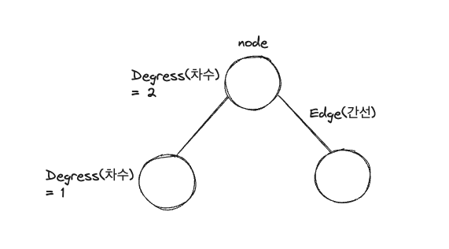
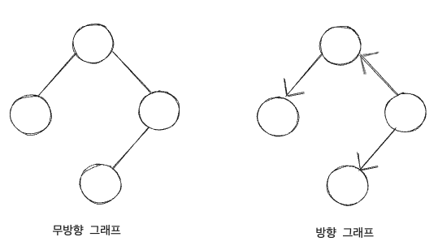
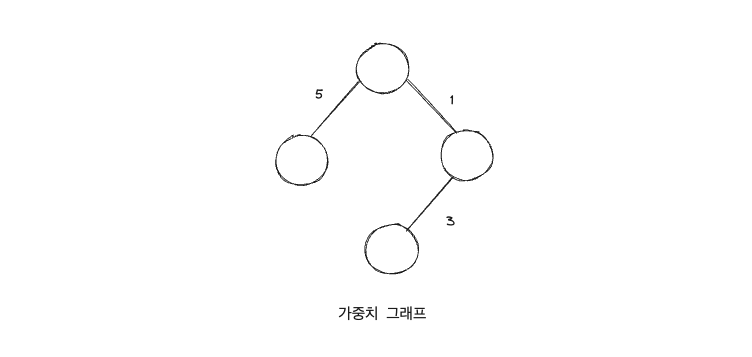
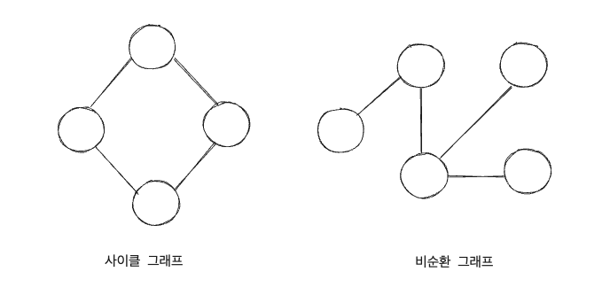
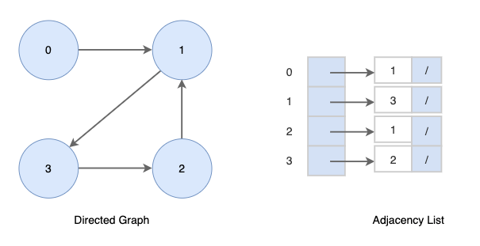
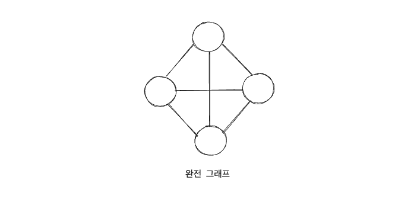

📖 그래프의 종류와 개념
----------

그래프는 여러 개의 점(노드 또는 정점)들이 선으로 연결된 구조를 나타내는 **수학적인 개념**입니다. 그래프는 다양한 현실 세계의 문제를 모델링하고 분석하는 데 사용됩니다.

## 그래프의 용어 ###


`노드(Node) 또는 정점(Vertex)` N or V  
: 그래프에서 하나의 점을 나타냅니다. 노드는 데이터를 저장하는데 사용될 수 있습니다.  
`간선(Edge)`  E
: 그래프에서 노드와 노드를 연결하는 선을 나타냅니다. 간선은 노드 쌍 사이의 관계를 나타냅니다.  
`인접(Adjacent)`  
: 두 개의 노드가 간선으로 직접 연결되어 있는 상태를 말합니다. 인접한 노드는 서로 이웃이라고도 합니다.  
`차수(Degree)`  
: **노드에 연결된 간선의 수**를 나타냅니다. 무방향 그래프에서는 노드의 차수는 해당 노드와 인접한 노드의 수입니다.  
`경로(Path)`  
: 그래프에서 노드들을 연결하는 간선의 순서를 나타내는 순서쌍입니다. 경로의 길이는 경로에 속한 간선의 수입니다.  
`사이클(Cycle)`  
: 그래프에서 동일한 노드로 되돌아오는 경로를 말합니다. 즉, 경로의 시작 노드와 끝 노드가 동일한 경우를 말합니다.  
`가중치(Weight)`  
: 가중치 그래프에서 간선에 할당된 값 또는 비용을 나타냅니다. 가중치는 간선의 특성을 나타내는데 사용됩니다.

## 그래프의 종류 ###

`무방향 그래프` & `방향 그래프`  
: 간선의 방향의 유무에 따라 구분되는 그래프  

`가중치 그래프`  
: 그래프에 가중치 또는 비용이 할당된 그래프(네트워크 이론이나 신경망 이론에 활용되는 개념)  

`연결 그래프` & `비연결 그래프`  
: 모든 노드에 대해 경로가 존재하면 **연결 그래프**, 특정 노드에 대한 경로가 하나라도 존재하지 않을 경우 **비연결 그래프**  

`사이클 그래프` & `비순환 그래프`  

`완전 그래프`  
: 그래프의 모든 노드가 연결되어 있는 그래프  


---

그래프의 한 종류인 트리에 대해🧐
----------

트리(Tree)는 그래프(Graph)의 한 종류로, **계층적인 구조**를 나타내는 **비순환적인 연결 그래프**입니다. 트리는 하나의 루트(Root) 노드에서 시작하여 다양한 자식(Child) 노드들로 확장되는 구조를 가지며, 각 노드는 하나의 부모(Parent) 노드와 연결되어 있습니다.

## 트리의 특징 🔎 ###

`계층 구조`: 트리는 하나의 루트 노드에서 시작하여 계층적인 구조를 형성합니다. 각 노드는 부모-자식 관계를 가지며, 자식 노드들은 동일한 계층에 속합니다.

`방향성`: 트리는 방향 그래프의 한 형태로, 간선은 단방향으로 표시됩니다. 각 노드는 자식 노드들을 가리키는 방향으로 연결됩니다.

`비순환성`: 트리는 순환 구조를 가지지 않습니다. 즉, 어떤 노드에서 시작해도 동일한 노드로 되돌아갈 수 있는 순환 경로가 존재하지 않습니다.

`유일한 경로`: 루트 노드에서 어떤 노드까지의 경로는 유일합니다. 트리 내에서는 어떤 노드도 다른 경로를 통해 도달할 수 없습니다

## 트리에 종류 ###

`이진 트리 (Binary Tree)`  
: 각 노드가 최대 **두 개의 자식을 가질 수 있는 트리**입니다. 이진 트리는 왼쪽 자식과 오른쪽 자식으로 구성되며, 자식의 배치에는 순서가 있습니다. 이진 트리는 데이터 검색, 정렬, 압축 등 다양한 애플리케이션에서 사용됩니다.

`이진 탐색 트리 (Binary Search Tree)`  
: 이진 트리의 한 종류로, 이진 탐색의 원리를 기반으로 합니다. 모든 노드는 **왼쪽 서브트리의 값보다 작고, 오른쪽 서브트리의 값보다 큰 키 값을 가집니다.** 이진 탐색 트리는 데이터 검색, 정렬, 범위 검색 등에 효율적으로 사용됩니다.

`AVL 트리`  
: 균형 이진 탐색 트리로서, 모든 노드의 왼쪽 서브트리와 오른쪽 서브트리의 높이 차이가 최대 1인 트리입니다. AVL 트리는 삽입, 삭제 시에 자동으로 균형을 유지하여 탐색 성능을 보장합니다.

`레드-블랙 트리 (Red-Black Tree)`  
: 균형 이진 탐색 트리로서, 각 노드는 레드(Red) 또는 블랙(Black) 색깔을 가지며, 특정한 규칙을 따릅니다. 레드-블랙 트리는 AVL 트리보다 균형을 유지하는 데에 조금 덜 엄격한 규칙을 가지며, 데이터의 삽입과 삭제가 더 효율적입니다.

`B-트리 (B-Tree)`  
: 다양한 자료 구조에서 사용되는 균형 탐색 트리입니다. B-트리는 노드마다 여러 개의 키 값을 가지며, 많은 수의 자식을 가질 수 있습니다. B-트리는 대용량 데이터베이스의 인덱스 구조나 파일 시스템에서 사용되는 것과 같은 곳에서 사용됩니다.

`힙 (Heap)`  
: 이진 트리의 한 종류로, 최대 힙과 최소 힙으로 나눌 수 있습니다. 최대 힙은 부모 노드의 값이 자식 노드의 값보다 큰 힙이며, 최소 힙은 그 반대입니다. 힙은 우선순위 큐와 같은 자료 구조에서 사용되어 최댓값 또는 최솟값에 빠르게 접근할 수 있습니다.

---

### 그래프(Graph)의 구현 2가지

#### 1\. 인접 리스트(Adjacency List)

인접 리스트(Adjacency List)로 그래프를 표현하는 것이 **가장 일반적인 방법** 이다.

- 모든 정점(혹은 노드)을 인접 리스트에 저장한다. 즉, 각각의 정점에 인접한 정점들을 리스트로 표시한 것이다.
	- 배열(혹은 해시테이블)과 배열의 각 인덱스마다 존재하는 또 다른 리스트(배열, 동적 가변 크기 배열(ArrayList), 연결리스트(LinkedList) 등)를 이용해서 인접 리스트를 표현

		```java
		0: 1
		1: 2
		2: 0, 3
		3: 2
		4: 6
		5: 4
		6: 5
		```

	- 정점의 번호만 알면 이 번호를 배열의 인덱스로 하여 각 정점의 리스트에 쉽게 접근할 수 있다.
- 무방향 그래프(Undirected Graph)에서 (a, b) 간선은 두 번 저장된다.
	- 한 번은 a 정점에 인접한 간선을 저장하고 다른 한 번은 b에 인접한 간선을 저장한다.
	- 정점의 수: N, 간선의 수: E인 무방향 그래프의 경우
		- N개의 리스트, **N개의 배열,** 2E개의 노드가 필요
- 트리에선 특정 노드 하나(루트 노드)에서 다른 모든 노드로 접근이 가능 -> Tree 클래스 불필요
	- 그래프에선 특정 노드에서 다른 모든 노드로 접근이 가능하지는 않음 -> Graph 클래스 필요

		```java
		class Graph { public Node[] nodes; }
		// 트리의 노드 클래스와 동일
		class Node {
		  public String name;
		  public Node[] children;
		}
		```

#### 2\. 인접 행렬(Adjacency Matrix)

인접 행렬은 NxN 불린 행렬(Boolean Matrix)로써 matrix\[i\]\[j\]가 true라면 i -> j로의 간선이 있다는 뜻이다.

- 0과 1을 이용한 정수 행렬(Integer Matrix)을 사용할 수도 있다.

	```java
	if(간선 (i, j)가 그래프에 존재)
	  matrix[i][j] = 1;
	else
	  matrix[i][j] = 0;
	```

- 정점(노드)의 개수가 N인 그래프를 인접 행렬로 표현
	- 간선의 수와 무관하게 항상 n^2개의 메모리 공간이 필요하다.
- 무방향 그래프를 인접 행렬로 표현한다면 이 행렬은 대칭 행렬(Symmetric Matrix)이 된다.
	- 물론 방향 그래프는 대칭 행렬이 안 될 수도 있다.
- 인접 리스트를 사용한 그래프 알고리즘들(Ex. 너비 우선 탐색) 또한 인접 행렬에서도 사용이 가능하다.
	- 하지만 인접 행렬은 조금 **효율성이 떨어진다.**
	- 인접 리스트는 어떤 노드에 인접한 노드들을 쉽게 찾을 수 있지만 인접 행렬에서는 **인접한 노드를 찾기 위해서는 모든 노드를 전부 순회해야 한다.**

==인접 리스트와 인접 행렬 중 선택 방법==

- 인접 리스트
	- 그래프 내에 적은 숫자의 간선만을 가지는 **희소 그래프(Sparse Graph)** 의 경우
	- 장점
		- 어떤 노드에 **인접한 노드들** 을 쉽게 찾을 수 있다.
		- 그래프에 존재하는 **모든 간선의 수** 는 O(N+E) 안에 알 수 있다.: 인접 리스트 전체를 조사한다.
	- 단점
		- 간선의 존재 여부와 정점의 차수: 정점 i의 리스트에 있는 노드의 수 즉, 정점 차수만큼의 시간이 필요
- 인접 행렬
	- 그래프에 간선이 많이 존재하는 **밀집 그래프(Dense Graph)** 의 경우
	- 장점
		- 두 정점을 연결하는 **간선의 존재 여부** (M\[i\]\[j\])를 O(1) 안에 즉시 알 수 있다.
		- **정점의 차수** 는 O(N) 안에 알 수 있다.: 인접 배열의 i번 째 행 또는 열을 모두 더한다.
	- 단점
		- 어떤 노드에 인접한 노드들을 찾기 위해서는 모든 노드를 전부 순회해야 한다.
		- 그래프에 존재하는 모든 간선의 수는 O(N^2) 안에 알 수 있다.: 인접 행렬 전체를 조사한다.


> 밀집 그래프(dense graph)는 간선의 수가 최대 간선의 수에 가까운 그래프이다. 그와 반대로, **간선이 얼마 없는 그래프**는 희소 그래프(sparse graph)라고 한다.

### 그래프(Graph)의 탐색

일반적인 방법 두 가지:  
**[깊이 우선 탐색(Depth-First Search)](https://gmlwjd9405.github.io/2018/08/14/algorithm-dfs.html)** 과 **[너비 우선 탐색(Breadth-First Search)](https://gmlwjd9405.github.io/2018/08/15/algorithm-bfs.html)**

루트 노드(혹은 다른 임의의 노드)에서 시작해서 다음 분기(branch)로 넘어가기 전에 해당 분기를 완벽하게 탐색하는 방법

- 즉, 넓게(wide) 탐색하기 전에 깊게(deep) 탐색하는 것이다.
- 사용하는 경우: **모든 노드를 방문** 하고자 하는 경우에 이 방법을 선택한다.
	- 깊이 우선 탐색이 너비 우선 탐색보다 좀 더 간단하다.

루트 노드(혹은 다른 임의의 노드)에서 시작해서 인접한 노드를 먼저 탐색하는 방법

- 즉, 깊게(deep) 탐색하기 전에 넓게(wide) 탐색하는 것이다.
- 사용하는 경우: **두 노드 사이의 최단 경로 혹은 임의의 경로를 찾고 싶을 때** 이 방법을 선택한다.
	- Ex) 지구상에 존재하는 모든 친구 관계를 그래프로 표현한 후 Ash와 Vanessa 사이에 존재하는 경로를 찾는 경우
	- 깊이 우선 탐색의 경우 - 모든 친구 관계를 다 살펴봐야 할지도 모른다.
	- 너비 우선 탐색의 경우 - Ash와 가까운 관계부터 탐색


---

 
### 알고리즘에서 그래프

알고리즘 코딩테스트에서는 다양한 그래프 알고리즘과 그래프 기반의 문제들이 출제될 수 있습니다. 주요한 그래프 알고리즘과 문제 유형은 다음과 같습니다:

`깊이 우선 탐색 (Depth-First Search, DFS)`  
: 그래프의 모든 노드를 탐색하고, 각 노드를 방문한 순서를 기록하는 알고리즘입니다. 주로 그래프 탐색, 사이클 판별, 연결 요소 확인 등에 사용됩니다.  
[문제 풀어보기](https://school.programmers.co.kr/learn/courses/30/lessons/43165)

`너비 우선 탐색 (Breadth-First Search, BFS)`  
: 루트 노드(혹은 다른 임의의 노드)에서 시작해서 다음 분기(branch)로 넘어가기 전에 해당 분기를 완벽하게 탐색하는 방법
[문제 풀어보기](https://school.programmers.co.kr/learn/courses/30/lessons/43163)

`다익스트라 알고리즘 (Dijkstra's Algorithm)`  
: 가중치 그래프에서 시작 노드로부터 모든 다른 노드까지의 최단 경로를 찾는 알고리즘입니다.  
[문제 풀어보기](https://school.programmers.co.kr/learn/courses/30/lessons/12978)

`벨만-포드 알고리즘 (Bellman-Ford Algorithm)`  
: 가중치 그래프에서 시작 노드로부터 모든 다른 노드까지의 최단 경로를 찾는 알고리즘입니다. 음수 가중치를 가진 간선이 있는 경우에도 동작합니다.  
[문제 풀어보기](https://school.programmers.co.kr/learn/courses/30/lessons/12978)

`크루스칼 알고리즘 (Kruskal's Algorithm)`  
: 가중치 그래프에서 최소 신장 트리를 찾는 알고리즘입니다. 모든 간선을 가중치 순으로 정렬한 뒤, 사이클을 형성하지 않는 간선을 추가하여 트리를 형성합니다.  
[문제 풀어보기](https://school.programmers.co.kr/learn/courses/30/lessons/42861)

`프림 알고리즘 (Prim's Algorithm)`  
: 가중치 그래프에서 최소 신장 트리를 찾는 알고리즘입니다. 시작 노드에서부터 출발하여, 현재 트리와 연결되지 않은 노드 중 최소 가중치의 간선을 선택하여 트리를 확장합니다.  
[문제 풀어보기](https://school.programmers.co.kr/learn/courses/30/lessons/42861)

`위상 정렬 (Topological Sorting)`  
: 방향 그래프에서 노드들을 선형적으로 정렬하는 알고리즘입니다. 선행 관계가 있는 작업의 우선 순위를 결정하는 데 사용됩니다.  
[문제 풀어보기](https://school.programmers.co.kr/learn/courses/30/lessons/49191)

`최소 공통 조상 (Lowest Common Ancestor, LCA)`  
: 트리에서 두 노드의 가장 가까운 공통 조상을 찾는 알고리즘입니다. 주로 트리 구조를 활용한 문제에서 사용됩니다.  
[문제 풀어보기](https://school.programmers.co.kr/learn/courses/30/lessons/43165)

이 외에도 그래프 기반의 다양한 문제 유형이 있을 수 있으며, 각 문제에 맞는 적절한 알고리즘을 선택하여 문제를 해결하는 것이 중요합니다.

---