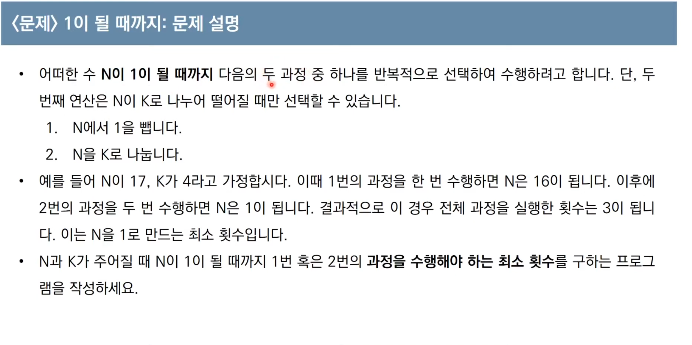
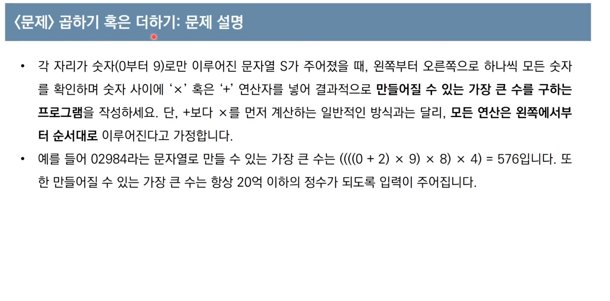
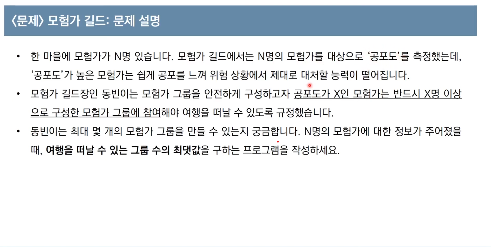
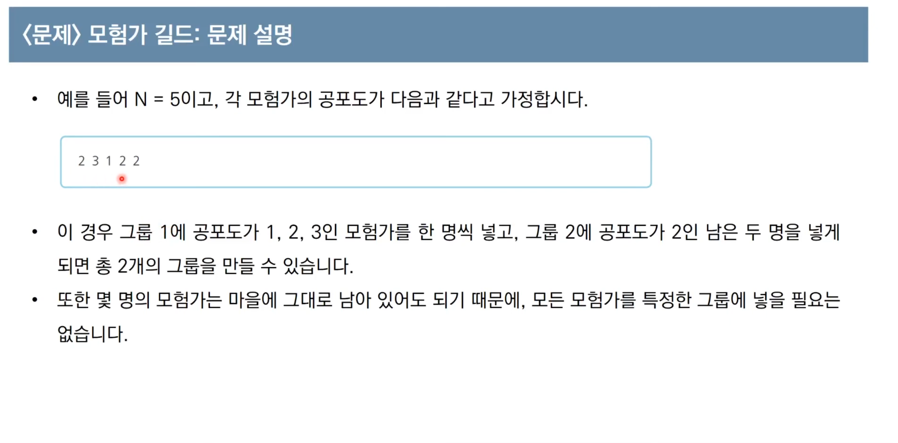

현재 상황에서 지금 당장 가장 좋은 것만 고르는 방법

지금 당장 가장 좋은 것을 고르는 방식이 답이 되는 것을 보장하는가?
=> 정당성

그리디의 경우 <span style="background:rgba(240, 200, 0, 0.2)">정당성 분석</span>이 가장 중요


단순히 매 상황에서 가장 큰 값만 고르는 경우(그리디)의 경우 5 -> 10 -> 4 를 고르게 되어 틀리게 된다

[!]
탐욕법으로 얻은 해가 최적의 해가 되는 상황에서 이를 추론 할 수 있어야 풀리는 문제 출제


---


```
가장 큰 회폐 단위부터 최대한 돈을 거슬러 준다 ==> 그리디

정당성 분석:
거스름돈 동전 중에서 모든 조합의 큰 단위가 작은 단위의 배수 이므로 작은 단위의 동전들을 조합해 다른 해가 나올 수 없다
예시:
거스름돈 800원 일때 화폐 단위가 500원 400원 100원 이라면
500 x 1 + 100 x 3 (틀림)
400 x 2 (맞음)
```

```python
n = 1260
count = 0
array = [500,100,50,10]
for coin in array:
	count += m // coin
	n %= coin
print(count)
```

```cpp
using namespace std;
int n = 1260;
int cnt = 0;
int coinTypes[4] = {500, 100, 50, 10};
int main() {
    for (int i = 0; i < 4; i++) {
        int coin = coinTypes[i];
        cnt += n / coin;
        n %= coin;
    }
    cout << cnt << '\n';
}
```

---
## 실전

## 문제1


> [!NOTE]
> 가능하면 최대한 많이 나눈다
> 정당성 분석:
> N 이 아무리 큰 수여도 k 로 계속 나눈다면 기하급수적으로 빠르게 줄일 수 있다
> (k>=2 일때 기준)

```python
def greedy(n,k):
    count = 0
    while n != 0:
        if (n % k) == 0:
            n = n // k
            count += 1
        else:
            n -= 1
            count += 1
    return count
  
n,k = map(int,input().split())
print(greedy(n,k))
```

## 문제2


> [!NOTE]
>  0을 곱하는 경우 숫자가 작아짐 / 0을 더하는 경우 숫자가 동일함
>  1을 곱하는 경우 숫자가 동일함 / 1을 더하는 경우 숫자가 커짐

```python
def greedy(s):
    first = 0
    second = 0
    for i in range(len(s)):
        second = s[i]
        if first == 0 or second == 0 or first == 1 or second == 1:
            first += second
        else:
            first *=second
    return first
s = [int(i) for i in input()]
print(greedy(s))
```




> [!NOTE] 
> 정당성 분석: ??

```python
n = int(input())
data = list(map(int, input().split()))
data.sort()

count = 0 # 현제 그룹에 포함된 모험가의 수
result = 0 # 총 그룹의 수

for i in data: # 공포도를 기준으로 낮은 것을 한개씩 확인하면서 순회
    count += 1 # 해당 모험가 포함
    # 현재 그룹에 포함된 모험가의 수가 현재 공포도 이상이렴 그룹 결정
    if count >= i: 
        result += 1 # 총 그룹수 증가
        count = 0 # 모험가 수 초기화
        
print(result)
```