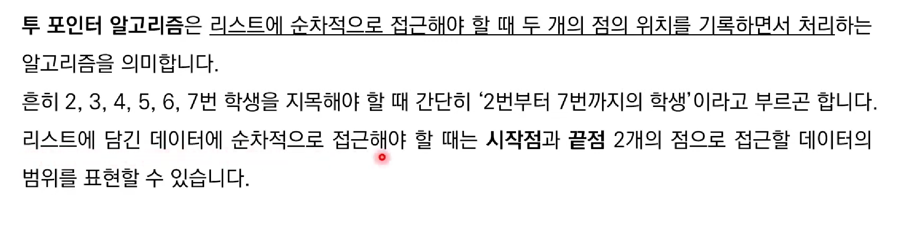
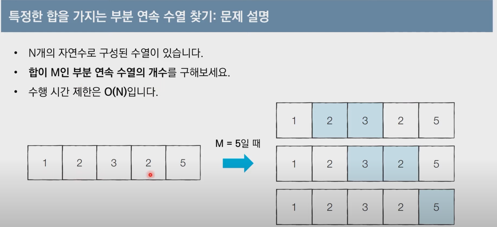
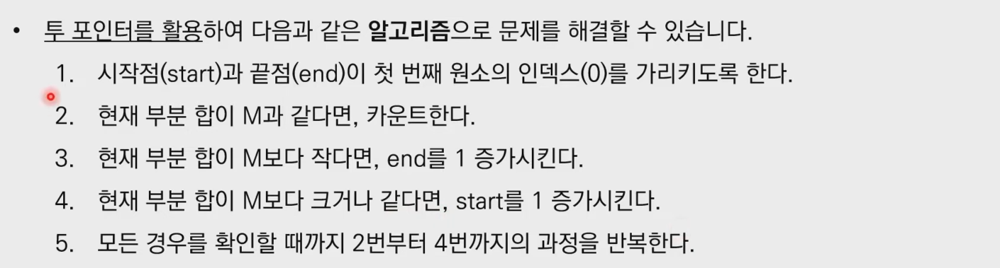
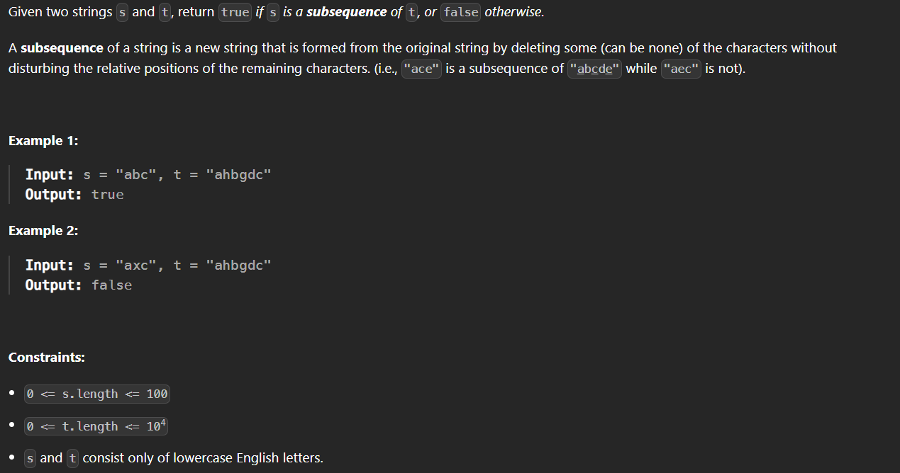

리스트에 순차적으로 접근해야 할 때 두개의 점의 위치를 기록하면서 처리하는 알고리즘





완전 탐색에서
인덱스인 end 가 1 증가하면 부분합이 증가
인덱스인 start 가 1 증가하면 부분합이 감소
이조건을 이용해서 $O(n)$ 으로 만들어야 한다


```cpp
int countSubarraysWithSum(const std::vector<int>& vec, int M) {
    int ret = 0; // 부분합이 M인 부분 배열의 개수
    int start = 0; // start 포인터 초기화
    int end = 0; // end 포인터
    int interval_sum = 0; // 현재 부분합

    while (start < vec.size()) {
        // end 포인터를 가능한 만큼 이동
        while (end < n && interval_sum < M) {
            interval_sum += vec[end]; // 부분합 계산
            end++;                    // 인덱스 이동
        }

        // 부분합이 M일 때 카운트 증가
        if (interval_sum == M) {
            ret++;
        }
		// interval_sum 이 target 보다 클 때는 start 를 이동
        // start 포인터를 증가시키고, interval_sum에서 vec[start]를 빼기
        interval_sum -= vec[start];
        start++;
    }

    return ret;
}
```



```cpp
class Solution {
public:
    bool isSubsequence(string &s, string &t) {
        int sp = 0;
        int tp = 0;

        // 투포인터여도 다른 배열을 지칭하는 인덱스이므로 1개의 반복문으로 해결 가능하다
        // 포인터가 size 보다 작아야 하는 조건이 필요하다
        while(sp < s.size() && tp < t.size()){
            if(s[sp] == t[tp]){
                sp++;
            }
            tp++;
        }
        return sp == s.size();
    }
};
```