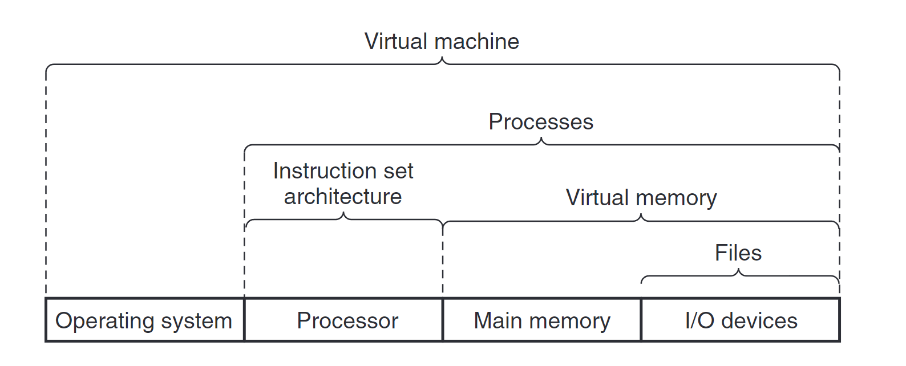

## A Tour of Computer Systems
- 1.1 Information Is Bits + Context 39 정보는 비트 + 문맥이다
	- 동일한 비트열이 문맥에 따라 string integer floating-point instruction 으로 해석될수 있다
- 1.2 Programs Are Translated by Other Programs into Different Forms 40
- 1.3 It Pays to Understand How Compilation Systems Work 42
- 1.4 Processors Read and Interpret Instructions Stored in Memory 43
- 1.5 Caches Matter 47
- 1.6 Storage Devices Form a Hierarchy 50
- 1.7 The Operating System Manages the Hardware 50
- 1.8 Systems Communicate with Other Systems Using Networks 55
- 1.9 Important Themes 58
- 1.10 Summary 63
  Bibliographic Notes 64
  Solutions to Practice Problems 64

direct memory access (DMA, discussed in Chap- ter 6)
cache memories chapter6
공유 라이브러리 주소 공간 chapter 7
kernel vietual memory 가 뭐지?? chapter 9
unix i o chapter 10
Thread-Level Concurrency vs instruction level parallelism 의 차이 12장 에서 하이퍼스레딩? 5장에서 instruction ??
파이프라닝 chapter4

62page
- Thread level concurrency
- instruction level parallelism
- single instruction multiple data parallelism ??
- 

> relocatable object program 과 excutable object program 의 차이
> hello.o 파일에서 내부의 printf 함수의 구현은 printf.o라는 별도의 사전 컴파일된 개체 파일에 있으며, 이 파일은 어떻게든 우리의 hello.o 프로그램과 병합되어야 합니다. 이 병합을 링커(ld)가 처리합니다.
> 재배치 가능한 오브젝트 프로그램은 컴파일러나 어셈블러가 소스 코드를 컴파일하여 생성한 중간 단계의 파일 .o 파일이며 링크 단계 통과후 실행파일이 됩니다

> buses 는 word 라는 단위로 잘려져 전송된다 여기서 워드의 크기는 시스템에 따라 달라진다 32 비트에서는 4바이트 64 비트는 8바이트 이다 즉 워드라는 것은 시스템에서 사용하는 기본적인 전송 단위로서 고정적인 단위가 아닌 추상 단위이다

> io 장치는 io 버스에 컨트롤러 또는 아탑터 로 연결된다 둘의 차이는 #ModificationRequired 

> main memory 는 바이트 1개가 하나의 주소에 매핑된다 주소는 0부터

> 프로세서는 instruction set 을 구현한 것은 맞지만 실제로는 실행속도를 빠르게 하는 여러가지 기술을 지원한다 즉 동일한 instruction set을 해석하는 프로세스의 구현은 많이 다를 수 있다

> L1 L2 cache 는 sram 이고 main memory 는 dram 이다

> %20image%2020240619110245.png)

> 프로세스의 메모리 자원 (코드 데이터 힙 스텍 레지스터 ) 쓰레드 메모리 자원( 스텍 레지스터 ) 나머지는 공유한다

> 1 클록에 1개 이상의 명령을 수행하는 프로세서를 puperscalar 라고 한다

> word 는 포인터의 크기를 나타내는 자료형이다 크기는 컴퓨터 비트 마다 다르다
