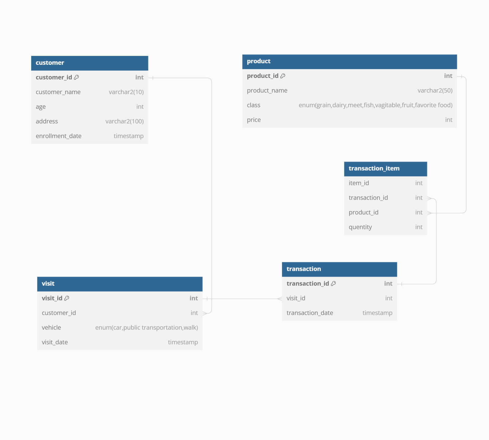
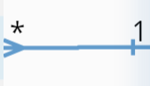
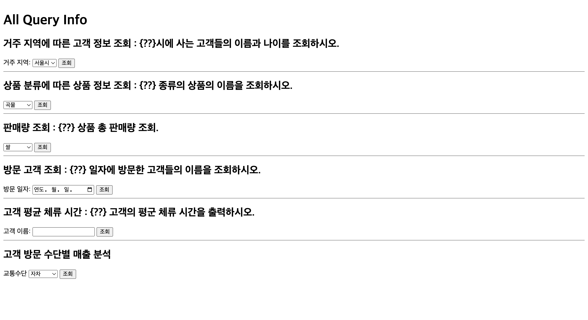
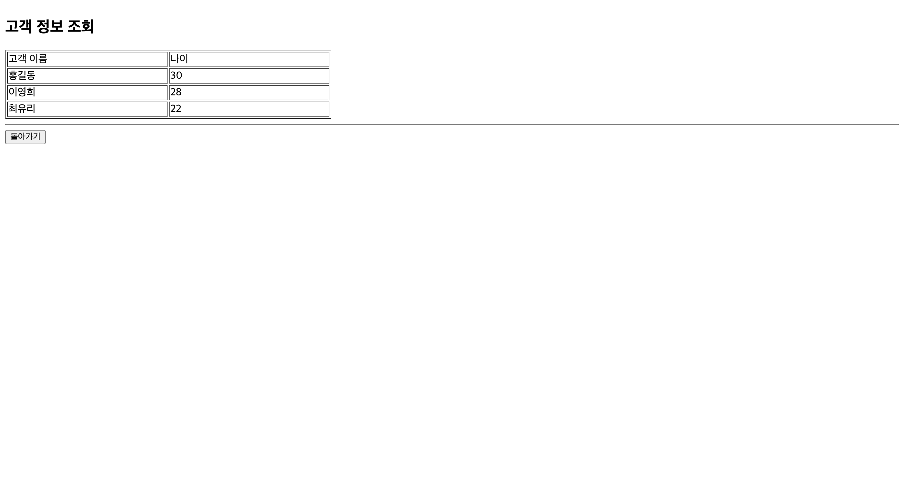
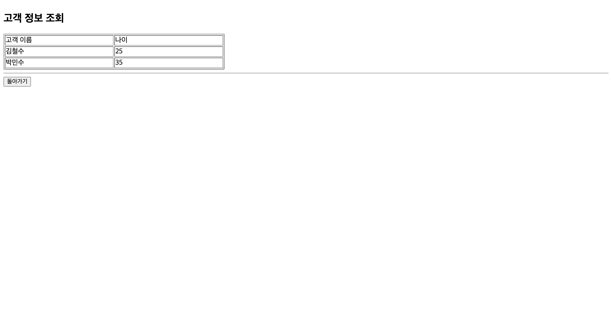
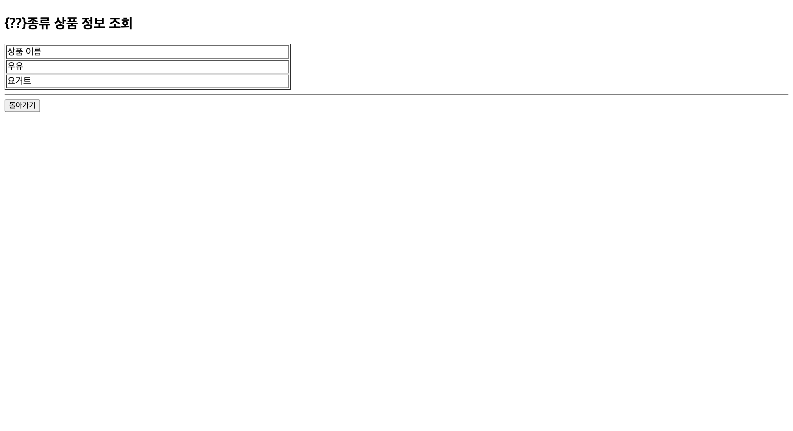
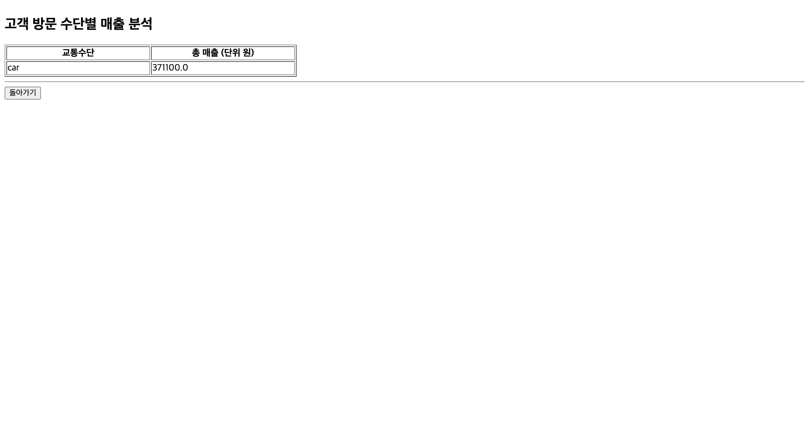

> 열쇠표시 : primary key
> 
> 좌측 : FK, 우측:PK


1. 목표로 하는 데이터베이스 시스템에 대한 설명
	1. 마트에 방문하는 고객의 거래를 관리하기 위한 db 시스템
2. 데이터베이스 스키마 다이어그램 표현 (“Schema_Diagram.pdf” 참조)
	1. 상단에 위치
3. 데이터베이스를 구성하는 테이블들의 명세 표현 (“테이블정의서.xls” 참조)
	1. 파일로 첨부
4. 주요 질의서(Query) 세트 및 각각에 대한 설명

### {??}시에 사는 고객들의 이름과 나이를 조회하시오
```sql
select customer_name, age
from customer
where address like '%{??}시%';
```
### {??} 종류의 상품의 이름을 조회하시오.
```sql
select product_name
from product
where class = '{??}';
```
### 고객이 거래 1회당 산 {??}의 갯수의 평균을 조회하시오.
```sql
SELECT SUM(quantity) AS total_quantity
FROM transaction_item
WHERE product_id = (
	SELECT product_id
	FROM product
	WHERE product_name = ?
```
### {??} 형식 YYYY-MM-DD 일자에 방문한 고객들의 이름을 조회하시오.
```sql
SELECT c.customer_name
FROM
	customer c INNER JOIN visit v
	ON c.customer_id = v.customer_id
WHERE TRUNC(v.visit_date) = DATE '{??}';
```
### {??} 이름 손님이 머무른 시간의 평균을 조회하시오.
```sql
SELECT AVG(t.transaction_date - v.visit_date) * 24 AS "avg_time(hour)"
from (
	select
		customer_name,
		visit_id,
		visit_date
	from
		customer inner join visit on customer.customer_id = visit.customer_id
	where customer_name = '{??}' ) v
	inner join transaction t on v.visit_id = t.visit_id;
```
### {??} 고객의 구매 내역 조회
```sql
SELECT 
	c.customer_name,
	p.product_name,
	ti.quantity,
	p.price,
	(ti.quantity * p.price) AS total_price
FROM customer c
	JOIN visit v ON c.customer_id = v.customer_id
	JOIN transaction t ON v.visit_id = t.visit_id
	JOIN transaction_item ti ON t.transaction_id = ti.transaction_id
	JOIN product p ON ti.product_id = p.product_id
WHERE 
	c.customer_name = '고객 이름'
ORDER BY 
	t.transaction_date DESC;
```


## 웹 인터페이스












## 결론 및 시사점
- 쿼리문을 만드는데에는 크게 어렵지 않았지만 설계를 하는것이 훨씬 어려웠던것 같다
- 설계에서 테이블간의 단순하게 한개의 PK FK 관계로 연결되다 보니 쿼리문이 길어지고 복잡했던것 같다

### 추가

생성및 제거 DDL
```sql

CREATE TABLE customer (
  customer_id INT PRIMARY KEY,
  customer_name VARCHAR2(50) NOT NULL,
  age INT NOT NULL,
  address VARCHAR2(100),
  enrollment_date DATE DEFAULT CURRENT_DATE
);

CREATE TABLE visit (
  visit_id INT PRIMARY KEY,
  customer_id INT,
  transportation varchar(30) check ( transportation in ('car','public transportation','walk')),
  visit_date DATE DEFAULT CURRENT_DATE,
  FOREIGN KEY (customer_id) REFERENCES customer(customer_id)
);

CREATE TABLE product (
  product_id INT PRIMARY KEY,
  product_name VARCHAR2(50) NOT NULL,
  class VARCHAR2(15) check ( class in ('grain', 'dairy', 'meet', 'fish', 'vagitable', 'fruit', 'favorite food') ),
  price INT NOT NULL
);
-- 음식 마트 종류: 유제품, 곡물, 과일, 채소, 고기, 생선, 가공식품 순으로 나열하였습니다.
-- 

CREATE TABLE transaction (
  transaction_id INT PRIMARY KEY,
  visit_id INT NOT NULL,
  transaction_date DATE DEFAULT CURRENT_DATE,
  FOREIGN KEY (visit_id) REFERENCES visit(visit_id)
);

CREATE TABLE transaction_item (
  item_id INT PRIMARY KEY,
  transaction_id INT,
  product_id INT NOT NULL,
  quantity INT NOT NULL,
  FOREIGN KEY (transaction_id) REFERENCES transaction(transaction_id),
  FOREIGN KEY (product_id) REFERENCES product(product_id)
);


-- 만들어 보자 예시로

-- 1. customer 테이블 시간은 마음대로 하되 순서대로
TRUNCATE TABLE customer;

INSERT INTO customer (customer_id, customer_name, age, address, ENROLLMENT_DATE) VALUES (1, '홍길동', 30, '서울시 강남구', TO_DATE('2024-04-30 10:00:00', 'YYYY-MM-DD HH24:MI:SS'));
INSERT INTO customer (customer_id, customer_name, age, address, ENROLLMENT_DATE) VALUES (2, '김철수', 25, '용인시 처인구', TO_DATE('2024-04-30 10:30:00', 'YYYY-MM-DD HH24:MI:SS'));
INSERT INTO customer (customer_id, customer_name, age, address, ENROLLMENT_DATE) VALUES (3, '이영희', 28, '서울시 송파구', TO_DATE('2024-04-30 11:00:00', 'YYYY-MM-DD HH24:MI:SS'));
INSERT INTO customer (customer_id, customer_name, age, address, ENROLLMENT_DATE) VALUES (4, '박민수', 35, '용인시 처인구', TO_DATE('2024-04-30 11:30:00', 'YYYY-MM-DD HH24:MI:SS'));
INSERT INTO customer (customer_id, customer_name, age, address, ENROLLMENT_DATE) VALUES (5, '최유리', 22, '서울시 용산구', TO_DATE('2024-04-30 12:00:00', 'YYYY-MM-DD HH24:MI:SS'));


-- 2. visit 테이블
TRUNCATE TABLE visit;
INSERT INTO visit (visit_id, customer_id, transportation, visit_date) VALUES (1, 1, 'car',                    TO_DATE('2024-05-01 11:00:00', 'YYYY-MM-DD HH24:MI:SS'));
INSERT INTO visit (visit_id, customer_id, transportation, visit_date) VALUES (2, 2, 'public transportation',  TO_DATE('2024-05-01 12:00:00', 'YYYY-MM-DD HH24:MI:SS'));
INSERT INTO visit (visit_id, customer_id, transportation, visit_date) VALUES (3, 3, 'walk',                   TO_DATE('2024-05-02 13:00:00', 'YYYY-MM-DD HH24:MI:SS'));
INSERT INTO visit (visit_id, customer_id, transportation, visit_date) VALUES (4, 4, 'car',                    TO_DATE('2024-05-02 20:10:00', 'YYYY-MM-DD HH24:MI:SS'));
INSERT INTO visit (visit_id, customer_id, transportation, visit_date) VALUES (5, 5, 'public transportation',  TO_DATE('2024-05-02 21:00:00', 'YYYY-MM-DD HH24:MI:SS'));
INSERT INTO visit (visit_id, customer_id, transportation, visit_date) VALUES (6, 1, 'walk',                   TO_DATE('2024-05-02 21:30:00', 'YYYY-MM-DD HH24:MI:SS'));
INSERT INTO visit (visit_id, customer_id, transportation, visit_date) VALUES (7, 2, 'car',                    TO_DATE('2024-05-03 15:00:00', 'YYYY-MM-DD HH24:MI:SS'));
INSERT INTO visit (visit_id, customer_id, transportation, visit_date) VALUES (8, 3, 'public transportation',  TO_DATE('2024-05-03 20:00:00', 'YYYY-MM-DD HH24:MI:SS'));
INSERT INTO visit (visit_id, customer_id, transportation, visit_date) VALUES (9, 4, 'walk',                   TO_DATE('2024-05-04 08:00:00', 'YYYY-MM-DD HH24:MI:SS'));
INSERT INTO visit (visit_id, customer_id, transportation, visit_date) VALUES (10, 5, 'car',                   TO_DATE('2024-05-04 11:00:00', 'YYYY-MM-DD HH24:MI:SS'));
INSERT INTO visit (visit_id, customer_id, transportation, visit_date) VALUES (11, 1, 'public transportation', TO_DATE('2024-05-06 12:00:00', 'YYYY-MM-DD HH24:MI:SS'));
INSERT INTO visit (visit_id, customer_id, transportation, visit_date) VALUES (12, 2, 'walk',                  TO_DATE('2024-05-08 11:00:00', 'YYYY-MM-DD HH24:MI:SS'));
INSERT INTO visit (visit_id, customer_id, transportation, visit_date) VALUES (13, 3, 'car',                   TO_DATE('2024-05-08 13:00:00', 'YYYY-MM-DD HH24:MI:SS'));
INSERT INTO visit (visit_id, customer_id, transportation, visit_date) VALUES (14, 4, 'public transportation', TO_DATE('2024-05-08 21:00:00', 'YYYY-MM-DD HH24:MI:SS'));
INSERT INTO visit (visit_id, customer_id, transportation, visit_date) VALUES (15, 5, 'walk',                  TO_DATE('2024-05-10 09:00:00', 'YYYY-MM-DD HH24:MI:SS'));
INSERT INTO visit (visit_id, customer_id, transportation, visit_date) VALUES (16, 1, 'car',                   TO_DATE('2024-05-10 10:00:00', 'YYYY-MM-DD HH24:MI:SS'));
INSERT INTO visit (visit_id, customer_id, transportation, visit_date) VALUES (17, 2, 'public transportation', TO_DATE('2024-05-10 11:00:00', 'YYYY-MM-DD HH24:MI:SS'));
INSERT INTO visit (visit_id, customer_id, transportation, visit_date) VALUES (18, 3, 'walk',                  TO_DATE('2024-05-10 12:00:00', 'YYYY-MM-DD HH24:MI:SS'));
INSERT INTO visit (visit_id, customer_id, transportation, visit_date) VALUES (19, 4, 'car',                   TO_DATE('2024-05-10 19:00:00', 'YYYY-MM-DD HH24:MI:SS'));
INSERT INTO visit (visit_id, customer_id, transportation, visit_date) VALUES (20, 5, 'public transportation', TO_DATE('2024-05-10 21:00:00', 'YYYY-MM-DD HH24:MI:SS'));

-- 3. product 테이블
TRUNCATE TABLE product;
INSERT INTO product (product_id, product_name, class, price) VALUES (1, '쌀', 'grain', 2000);
INSERT INTO product (product_id, product_name, class, price) VALUES (2, '우유', 'dairy', 1500);
INSERT INTO product (product_id, product_name, class, price) VALUES (3, '소고기', 'meet', 10000);
INSERT INTO product (product_id, product_name, class, price) VALUES (4, '방어', 'fish', 8000);
INSERT INTO product (product_id, product_name, class, price) VALUES (5, '당근', 'vagitable', 1200);
INSERT INTO product (product_id, product_name, class, price) VALUES (6, '사과', 'fruit', 3000);
INSERT INTO product (product_id, product_name, class, price) VALUES (7, '피자', 'favorite food', 5000);
INSERT INTO product (product_id, product_name, class, price) VALUES (8, '빵', 'grain', 2500);
INSERT INTO product (product_id, product_name, class, price) VALUES (9, '요거트', 'dairy', 1600);
INSERT INTO product (product_id, product_name, class, price) VALUES (10, '돼지고기', 'meet', 11000);
INSERT INTO product (product_id, product_name, class, price) VALUES (11, '고등어', 'fish', 8500);
INSERT INTO product (product_id, product_name, class, price) VALUES (12, '양배추', 'vagitable', 1300);
INSERT INTO product (product_id, product_name, class, price) VALUES (13, '바나나', 'fruit', 3500);
INSERT INTO product (product_id, product_name, class, price) VALUES (14, '라면', 'favorite food', 5500);
INSERT INTO product (product_id, product_name, class, price) VALUES (15, '옥수수', 'grain', 2700);

-- 4. transaction 테이블
TRUNCATE TABLE transaction;
INSERT INTO transaction (transaction_id, visit_id, transaction_date) VALUES (1, 1, TO_DATE('2024-05-01 12:00:00', 'YYYY-MM-DD HH24:MI:SS'));
INSERT INTO transaction (transaction_id, visit_id, transaction_date) VALUES (2, 2, TO_DATE('2024-05-01 12:34:00', 'YYYY-MM-DD HH24:MI:SS'));
INSERT INTO transaction (transaction_id, visit_id, transaction_date) VALUES (3, 3, TO_DATE('2024-05-02 14:00:00', 'YYYY-MM-DD HH24:MI:SS')); -- 수정
INSERT INTO transaction (transaction_id, visit_id, transaction_date) VALUES (4, 4, TO_DATE('2024-05-02 20:45:00', 'YYYY-MM-DD HH24:MI:SS')); -- 수정
INSERT INTO transaction (transaction_id, visit_id, transaction_date) VALUES (5, 5, TO_DATE('2024-05-02 21:45:00', 'YYYY-MM-DD HH24:MI:SS')); -- 수정
INSERT INTO transaction (transaction_id, visit_id, transaction_date) VALUES (6, 6, TO_DATE('2024-05-02 22:00:00', 'YYYY-MM-DD HH24:MI:SS')); -- 수정
INSERT INTO transaction (transaction_id, visit_id, transaction_date) VALUES (7, 7, TO_DATE('2024-05-03 16:30:00', 'YYYY-MM-DD HH24:MI:SS')); -- 수정
INSERT INTO transaction (transaction_id, visit_id, transaction_date) VALUES (8, 8, TO_DATE('2024-05-03 21:00:00', 'YYYY-MM-DD HH24:MI:SS')); -- 수정
INSERT INTO transaction (transaction_id, visit_id, transaction_date) VALUES (9, 9, TO_DATE('2024-05-04 09:30:00', 'YYYY-MM-DD HH24:MI:SS')); -- 수정
INSERT INTO transaction (transaction_id, visit_id, transaction_date) VALUES (10, 10, TO_DATE('2024-05-04 12:00:00', 'YYYY-MM-DD HH24:MI:SS')); -- 수정
INSERT INTO transaction (transaction_id, visit_id, transaction_date) VALUES (23, 3, TO_DATE('2024-05-02 15:30:00', 'YYYY-MM-DD HH24:MI:SS')); -- 수정
INSERT INTO transaction (transaction_id, visit_id, transaction_date) VALUES (11, 11, TO_DATE('2024-05-06 12:00:00', 'YYYY-MM-DD HH24:MI:SS'));
INSERT INTO transaction (transaction_id, visit_id, transaction_date) VALUES (12, 12, TO_DATE('2024-05-08 11:45:00', 'YYYY-MM-DD HH24:MI:SS')); -- 수정
INSERT INTO transaction (transaction_id, visit_id, transaction_date) VALUES (13, 13, TO_DATE('2024-05-08 15:00:00', 'YYYY-MM-DD HH24:MI:SS')); -- 수정
INSERT INTO transaction (transaction_id, visit_id, transaction_date) VALUES (14, 14, TO_DATE('2024-05-08 22:30:00', 'YYYY-MM-DD HH24:MI:SS')); -- 수정
INSERT INTO transaction (transaction_id, visit_id, transaction_date) VALUES (15, 15, TO_DATE('2024-05-10 09:45:00', 'YYYY-MM-DD HH24:MI:SS')); -- 수정
INSERT INTO transaction (transaction_id, visit_id, transaction_date) VALUES (24, 4, TO_DATE('2024-05-02 21:30:00', 'YYYY-MM-DD HH24:MI:SS')); -- 수정
INSERT INTO transaction (transaction_id, visit_id, transaction_date) VALUES (16, 16, TO_DATE('2024-05-10 12:30:00', 'YYYY-MM-DD HH24:MI:SS')); -- 수정
INSERT INTO transaction (transaction_id, visit_id, transaction_date) VALUES (17, 17, TO_DATE('2024-05-10 12:45:00', 'YYYY-MM-DD HH24:MI:SS')); -- 수정
INSERT INTO transaction (transaction_id, visit_id, transaction_date) VALUES (18, 18, TO_DATE('2024-05-10 14:00:00', 'YYYY-MM-DD HH24:MI:SS')); -- 수정
INSERT INTO transaction (transaction_id, visit_id, transaction_date) VALUES (19, 19, TO_DATE('2024-05-10 20:30:00', 'YYYY-MM-DD HH24:MI:SS')); -- 수정
INSERT INTO transaction (transaction_id, visit_id, transaction_date) VALUES (20, 20, TO_DATE('2024-05-10 22:30:00', 'YYYY-MM-DD HH24:MI:SS')); -- 수정

-- 5. transaction_item 테이블
TRUNCATE TABLE transaction_item;
-- transaction_item 무작위 테이블 데이터 생성
BEGIN
    FOR transaction_id IN 1..20 LOOP
        FOR i IN 1..(1 + DBMS_RANDOM.VALUE(0, 4)) LOOP
            INSERT INTO transaction_item (item_id, transaction_id, product_id, quantity)
            VALUES (transaction_id * 10 + i, transaction_id, ROUND(DBMS_RANDOM.VALUE(1, 15)), ROUND(DBMS_RANDOM.VALUE(1, 5)));
        END LOOP;
    END LOOP;
END;
/
COMMIT;
/


-- 제거
-- DROP TABLE transaction_item;
-- DROP TABLE transaction;
-- DROP TABLE product;
-- DROP TABLE visit;
-- DROP TABLE customer;
```
