## SQL

- DDL (data definition laguage)
	- 쿼리
		- Create Table
		- Drop Table
		- Truncate Table
		- Alter Table
			- alter table r {add, add constraint, modifiy, drop colume, set unused, drop unused colume} A
		- rename
	- Data Type
	- Constraint (NOT NULL, DEFAULT, CHECK, REFERENCE)
- DML (data manipulation language)
	- select
		- select
		- from
		- where
		- group by
		- having
		- order by
	- delete
	- insert
	- update


## Domain Types
- char(n) : 고정 길이 문자열
- varchar(n) : 가변 길이 문자열
- int : integer 정수 하위 집합
- smallint : 작은 int
- numeric(p, d) : p=숫자 전체 길이, d=소수점 아래자리수
	- ex) numeric(3,1) : 0.1 부터 99.9 까지 저장 가능 더 정밀한 소수점은 버려짐
- real, double precision : 부동 소수점 숫자
- float(n) : n 자리 정밀도 소수

### MySQL

1. **TINYINT**: 1바이트 정수 (-128 ~ 127 또는 0 ~ 255)
2. **SMALLINT**: 2바이트 정수 (-32,768 ~ 32,767 또는 0 ~ 65,535)
3. **MEDIUMINT**: 3바이트 정수 (-8,388,608 ~ 8,388,607 또는 0 ~ 16,777,215)
4. **INT (INTEGER)**: 4바이트 정수 (-2,147,483,648 ~ 2,147,483,647 또는 0 ~ 4,294,967,295)
5. **BIGINT**: 8바이트 정수 (-9,223,372,036,854,775,808 ~ 9,223,372,036,854,775,807 또는 0 ~ 18,446,744,073,709,551,615)
6. **FLOAT**: 4바이트 부동 소수점 수 (가변 소수점)
7. **DOUBLE**: 8바이트 부동 소수점 수 (가변 소수점)
8. **DECIMAL (NUMERIC)**: 고정 소수점 수 (정밀도와 소수 자릿수 지정 가능)

### PostgreSQL

1. **SMALLINT**: 2바이트 정수 (-32,768 ~ 32,767)
2. **INTEGER (INT)**: 4바이트 정수 (-2,147,483,648 ~ 2,147,483,647)
3. **BIGINT**: 8바이트 정수 (-9,223,372,036,854,775,808 ~ 9,223,372,036,854,775,807)
4. **REAL**: 4바이트 부동 소수점 수 (가변 소수점)
5. **DOUBLE PRECISION**: 8바이트 부동 소수점 수 (가변 소수점)
6. **NUMERIC**: 고정 소수점 수 (정밀도와 소수 자릿수 지정 가능)
7. **DECIMAL**: `NUMERIC`의 동의어

### Oracle

1. **NUMBER**: 가변 정밀도와 소수 자릿수를 갖는 숫자 (정밀도와 소수 자릿수 지정 가능)
2. **BINARY_FLOAT**: 4바이트 부동 소수점 수 (가변 소수점)
3. **BINARY_DOUBLE**: 8바이트 부동 소수점 수 (가변 소수점)
4. **FLOAT**: `NUMBER`의 동의어로 사용되며, 정밀도 지정 가능


## CREATE TABLE DDL
```sql
CREATE TABLE 테이블이름 (
컬럼이름 datatype [DEFAULT기본값] [컬럼제약조건],
컬럼이름 datatype [DEFAULT기본값] [컬럼제약조건],
…
[테이블 제약조건] …
);
```

- table 이름은 reserbed word 는 사용 불가 이름의 시작은 문자로 그리고 `A~Z, a~z, 0~9, _, $, #` 문자만 허용 
- culumn 제약 조건 : 컬럼 제약조건: \[CONSTRAINT이름\] constraint_type
- table 제약 조건 : 테이블 제약조건: \[CONSTRAINT이름\] constraint_type(column,..)
- 제약조건 이름을 넣지 않으면 시스템이 알아서 임의 의 제약 조건의 이름을 만들어준다

- 제약조건
	- NOT NULL : 컬럼 제약조건만 가능 테이블 제약조건을 가능 하지 않음
	- UNIQUE : NULL 의 중복은 괜찮음, 자동으로 인덱스 생성
	- PRIMARY KEY = NOT NULL + UNIQUE
		- 복합 컬럼의 경우 순서가 인덱스 생성시 사용되게 되고 자주 사용하는 column 을 순서가 앞쪽에 배치되어야 search 가 빠르다 #ModificationRequired (인덱스 원리를 넣어보자)
	- FOREIGN KEY : 참조 무결성 제약
		- 참조하는 PK 가 사라질 때 행동 양식을 정해 줄 수 있다  뒤에 붙여주면 된다
		- 정하지 않고 PK 를 삭제하려고 할 때 그 PK 값을 참조하는 FK 가 참조오류가 발생해서 오류를 내뱉는다
		- ON DELETE CASCADE: 해당하는 FK를 가진 참조행도 삭제 
		- ON DELETE SET NULL: 해당하는 FK를 NULL로 바꿈(PK 는 NULL 이 안되지만 이렇게 해서 정보를 유지시킨다 db 의 지속성에 문제를 일으키므로 주의해서 사용해야 한다)
	- CHECK : 사용자 임의 조건
	- 제약조건 추가
		- ALTER TABLE테이블이름 ADD CONSTRAINT …
		- NOT NULL은 추가하지 못함
		- `ALTER TABLE emp ADD CONSTRAINT emp_mgr_fk FOREIGN KEY(mgr) REFERENCES emp(empno);`
	-  제약조건 삭제
		- ALTER TABLE테이블이름 DROP CONSTRAINT제약조건이름
		- PRIMARY KEY의 경우 FK 조건이 걸린 경우에는 CASCADE로 삭제 해야함
		- `ALTER TABLE book DROP CONSTRAINT c_emp_u;`
		- `ALTER TABLE dept DROP PRIMARY KEY CASCADE;`
- subquery 를 통한 테이블 생성
	```sql
	CREATE TABLE empSALES 
	AS SELECT * FROM emp WHERE job = ‘SALES’;
	-- 일반적으로 임시 테이블을 만들 때 사용된다
	-- not null 제약 조건만 상속 pk fk 제약 조건의 경우 사라진다
	-- pk fk 가 들어가면 다른 테이블에 영향을 끼치기 때문에 의도적인 동작이다
	```

## ALTER TABLE DDL

컬럼 이름, constraint, datatype, default 등등 컬럼의 속성이 변경 대상이다

- ADD : `ALTER TABLE 테이블명 ADD (추가할 칼럼명과 속성들);` 
  => `ALTER TABLE PLAYER2 ADD (ADDRESS VARCHAR2(80))`
- MODIFIY (이름을 제외한 컬럼의 속성 변경) : 
  `ALTER TABLE 테이블명 MODIFY (칼럼명1 데이터 유형 [DEFAULT 식] [NOT NULL], 칼럼명2 데이터 유형 ...);`
  => `ALTER TABLE PLAYER2 MODIFY (JOIN_YYYY VARCHAR2(8) DEFAULT '20020129' NOT NULL);`

- DROP COLUMN : `ALTER TABLE 테이블명 DROP COLUMN 삭제할 칼럼명;`
  => `ALTER TABLE PLAYER2 DROP COLUMN ADDRESS;`
- ADD CONSTRAINT : `ALTER TABLE 테이블명 ADD CONSTRAINT 제약조건명 (칼럼명);`
  => `ALTER TABLE PLAYER2 ADD CONSTRAINT PLAYER_FK2 FOREIGN KEY (TEAM_ID) REFERENCES TEAM(TEAM_ID);`
- DROP CONSTRAINT : `ALTER TABLE 테이블명 DROP CONSTRAINT 제약조건명`
  => `ALTER TABLE PLAYER2 DROP CONSTRAINT PLAYER_FK2;`


### NOT NULL 제약조건과 다른 제약조건의 차이
```sql
CREATE TABLE 예시테이블 (
    컬럼명1 데이터타입 [NOT] NULL,
    컬럼명2 데이터타입deafault 10,
    ...
    CONSTRAINT 제약조건이름 PRIMARY KEY (컬럼명1, 컬럼명2),
    CONSTRAINT 제약조건이름 FOREIGN KEY (컬럼명2) REFERENCES 다른테이블(컬럼명),
    CONSTRAINT 제약조건이름 UNIQUE (컬럼명3),
    CONSTRAINT 제약조건이름 CHECK (조건식)
);
```
과 같이 table 수준의 제약조건에서는 NOT NULL 조건 부여 불가
```sql
ALTER TABLE PLAYER2 DROP CONSTRAINT PLAYER_FK2;
ALTER TABLE table_name MODIFY column_name data_type NOT NULL;
```
과 같이 drop contraint 구문에서도 NOT NULL 조건 부여 불가
modify 구문에서 변경해야함
## RENAME TABLE DDL
- RENAME : `RENAME 변경전_테이블명 TO 변경후_테이블명`
  => `ALTER TABLE PLAYER2 RENAME COLUMN PLAYER_ID TO TEMP_ID;`
## DROP TABLE DDL


### Delete, Truncate, Drop
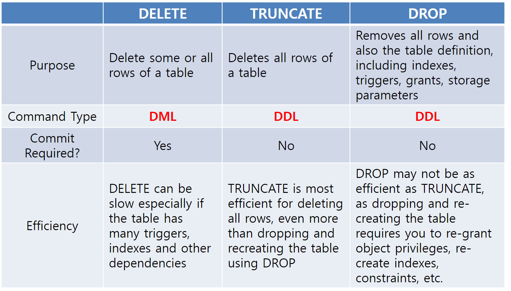

- 컬럼 

- 컬럼 추가  ALTER TABLE 테이블명 ADD (추가할 칼럼명);
	- `ALTER TABLE book ADD (pubs VARCHAR2(50));`
- 컬럼 수정 ALTER TABLE 테이블명 MODIFY (칼럼명1 데이터 유형 \[DEFAULT 식\] \[NOT NULL\], 칼럼명2 데이터 유형 ...)
	- `ALTER TABLE PLAYER2 MODIFY (JOIN_YYYY VARCHAR2(8) DEFAULT '20020129' NOT NULL)`
- 컬럼 이름 수정 ALTER TABLE 테이블명 RENAME COLUMN 변경해야 할 칼럼명 TO 새로운 칼럼명;
	- `ALTER TABLE PLAYER2 RENAME COLUMN PLAYER_ID TO TEMP_ID;`
- 컬럼 삭제 ALTER TABLE 테이블명 DROP COLUMN 삭제할 칼럼명;
	- ALTER TABLE book DROP COLUMN author ;
- UNUSED 컬럼 (SET UNUSED -> DROP UNUSED COLUMES)
	- ALTER TABLE boosek SET UNUSED (author); ALTER TABLE book DROP UNUSED COLUMNS;
	- 임시로 컬럼을 사용하지 않는 상태로 대기해 두었다가 이후 안정성 확보 이후 완전히 지운다 이 쿼리는 오라클만 지원한다

## comment
dbms 는 테이블에 또는 컬럼에 즉 attributte 에 상세정보와 같은 comment 를 달 수 있다

oracle, postgresql comment 만들기
  ```sql
	--생성시 에는 주석을 만들수 없음
	COMMENT ON TABLE your_table_name IS 'your_comment'; -- table 주석달기
	COMMENT ON COLUMN your_table_name.your_column_name IS 'your_comment';
	-- column 주석달기
	```

mysql commnet 만들기
```sql
create table test(
	pid	INT	NOT NULL COMMENT '제품ID', -- 생성시 열에 commnet
	...
) comment '임시 테이블입니다' -- 생성시 table 에 commnet
ALTER TABLE products COMMENT '상품정보'; -- 변경시 table에 comment
ALTER TABLE products MODIFY prod_name VARCHAR(100) NULL COMMENT '제품이름'; -- 변경시 열에 commnet
```

확인은 모든 dbms 가 각각 다름


## 기타 DDL
- truncate table
- rename
- drop table


## select DML
```sql
-- select 기본 구조
SELECT [ALL | DISTINCT] 열_리스트
  [FROM 테이블_리스트] [USING(열_리스트) | ON 조건]
  [WHERE 조건]
  [GROUP BY 열_리스트 [HAVING 조건]]
  [ORDER BY 열_리스트 [ASC | DESC]];
```
### sql 실행 순서
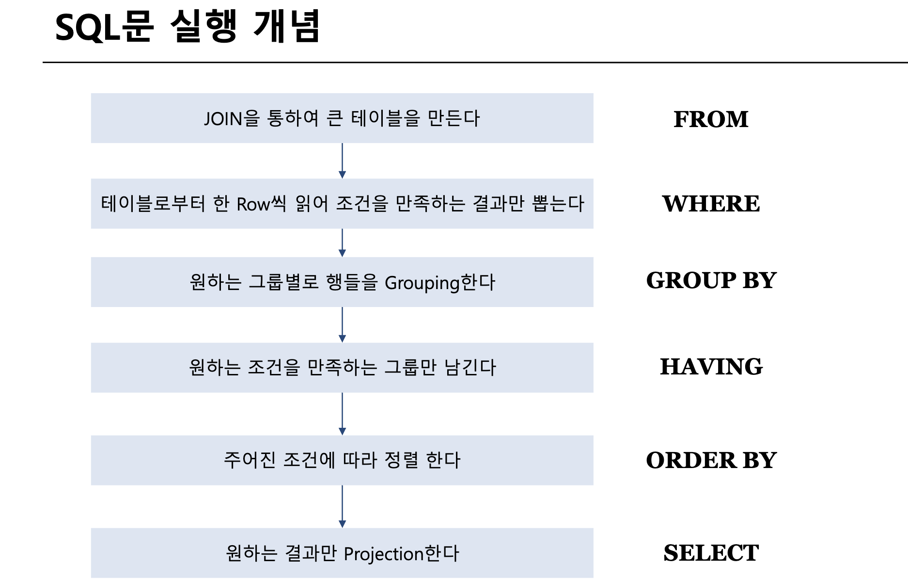

### FROM절 (join)
기본적으로 FROM문에서 작동
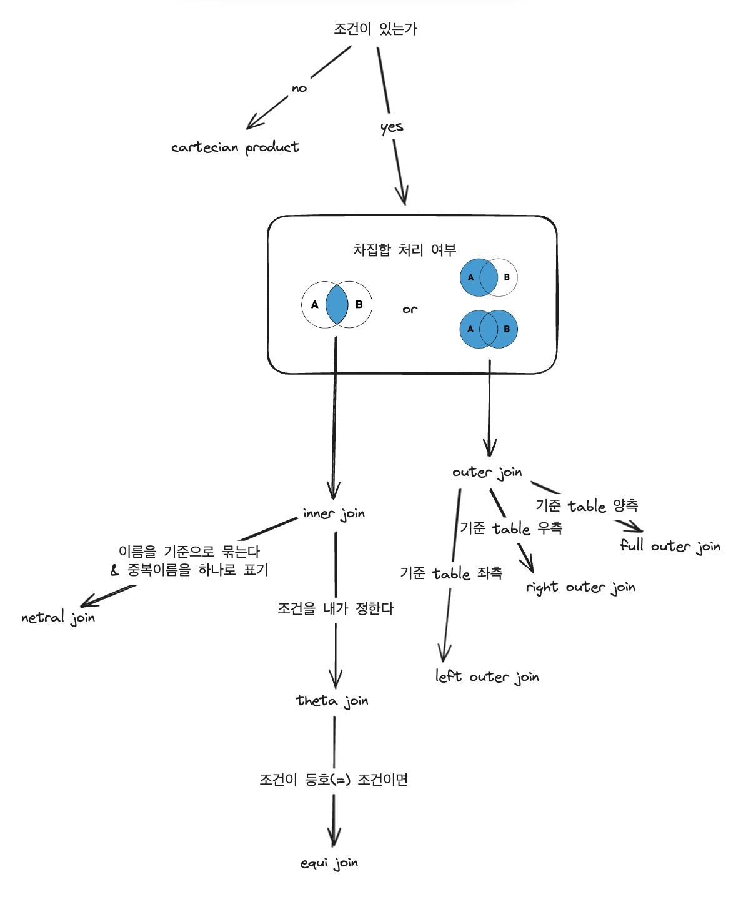

- cross join : cartasian product : 모든 조합
	- `,` 또는 `join` 이라고 적어도 같은말 sql 에서는  cross join 이다
- inner join == null 이 안나오게 조건을 만족하는 모든 튜플 결국 의미상 theta join 과 비슷
- theta join == 임의의 조건에 의한 조인 결국 의미상 inner join 과 비슷
- equi join == theta join 의 조건이 같다는 조건일 떄
- {left,right,full} outer join == 조건을 만족하지 않아도 null 과 함께 나옴 [outer join 의 대한 이해](06.University/database(university)/데이터베이스%20용어%20정의%20및%20relation%20algebra.md#^a02478)
- natural join == equi join(=) && 동일한 column명 중복 제거
- self join 자기 자신과 조인


- as 구문을 통해 임시로 attribute 이름을 만들 수 있다 `old-name as new-name`


> 의미의 명확성을 위해 조인 조건은 on 또는 using() 문을 통해 완성하자

> theta join 이면서 equi join 이 아닌 경우 : 한 테이블에는 사람들의 정보가, 다른 테이블에는 도시의 정보가 저장되어 있다고 가정해봅시다. 이때, 사람들의 나이가 특정 도시에 속한 사람들의 평균 나이보다 큰 경우만을 선택하는 조건을 사용하여 두 테이블을 조인하고 싶다면, 이러한 경우에는 θ-join을 사용할 수 있습니다. 즉, "=" 대신에 ">" 연산자를 조인 조건으로 사용합니다.

### WHERE 문
추가 조건 연산
- 문자열 매치
	- `where name like '%dar%'`
	- `%` : 문자열과 매칭
	- `_` :  하나의 문자와 매칭
	- `like '100\%' escape '\'` : excape 를 통해 special 문자를 일반 문자로 처리할 수 있다 즉 `100%` 문자열와 완벽히 일치하는 value 는 true 로 반환된다


#### null
- null 산술연산 = null
	- ex) 5 + null = null
- null 비교 연산 = unknown : 새로운 진리값 만들어짐 
	-  OR
		- (unknown or true) =true
		- (unknown or false) =unknown
		- (unknown or unknown) =unknown
	- AND
		- (true and unknown) =unknown
		- (false and unknown) =false
		- (unknown and unknown) =unknown
	- NOT
		- (not unknown) =unknown
> [!NOTE] 참조
> where 절에서 unknown 값이 나오면 false 와 동일하게 처리한다
> 즉 where salary = null 이라고 쓰면 모든 값의 비교에서 unknown 이 반환되고 모든값이 false 와 같이 처리된다
> 그러므로 where salary is null 에서의 (is null)과 같은 새로운 is, is not 조건 연산자가 만들어졌다

#### sql 연산자 우선순위
1. Arithmetic operators : 산술 연산
2. Concatenation operator 
3. Comparison conditions : 비교 연산
4. IS \[NOT\] NULL, LIKE, \[NOT\] IN
5. \[NOT\] BETWEEN
6. NOT logical condition
7. AND logical condition
8. OR logical condition

### group by
group by 에 참여하지 않은 attribute  는 논리상 select 문에서 그냥은 참여할 수 없다
having, order by 도 마찬가지
aggreate function parameter  로써는 가능하다
#### aggregate function
여러 행을 한행으로 결과치를 만들어 낸다 여러행을 한행으로 만드는 성질 때문에 1행만 나오게 되고 많은 경우에 실제 사용시에는 group by 와 함께 사용되게 된다

> 위의 where 절의 null 의 설명을 참조:  count 를 제외한 avg, min, max, sum 의 경우에는 필연적으로 산술연산 또는 비교연산이 들어가게 되고 이러한 점 때문에 count 를 제외한 연산자의 경우에는 null 값을 제거하고 연산하게 된다

> count 의 경우
> count(\*) => null 포함 모든 값 갯수
> count(column 명) => null 제외 값의 개수 

| salary |
| ------ |
| null   |
| null   |
| 10000  |
| 20000  |
| 10000  |
```sql
select count(*), count(salary), count(distinct salary), avg(salary), 
from '위의 테이블'
-- 결과 : 5, 3, 2 
```

#### having
Aggregation 결과에 대해 다시 condition을 적용할 때 사용
### order  by
특이하게 논리상 이후에 수행될 select 문에 `select student.name "학생이름"`
처럼 alias 한 이름이 사용될 수 있다
group by 절에서 select 문의 alias 를 사용하지 못한다 그런데 order by 에서는 사용 가능하다

### SELECT 문
산술 연산 사용 가능
## set operator
두 질의에 결과에 대한 연산 수행
다른 연산과는 다르게 중복을 제거한다 중복을 제거하려면 union all 같이 all 을 붙인다
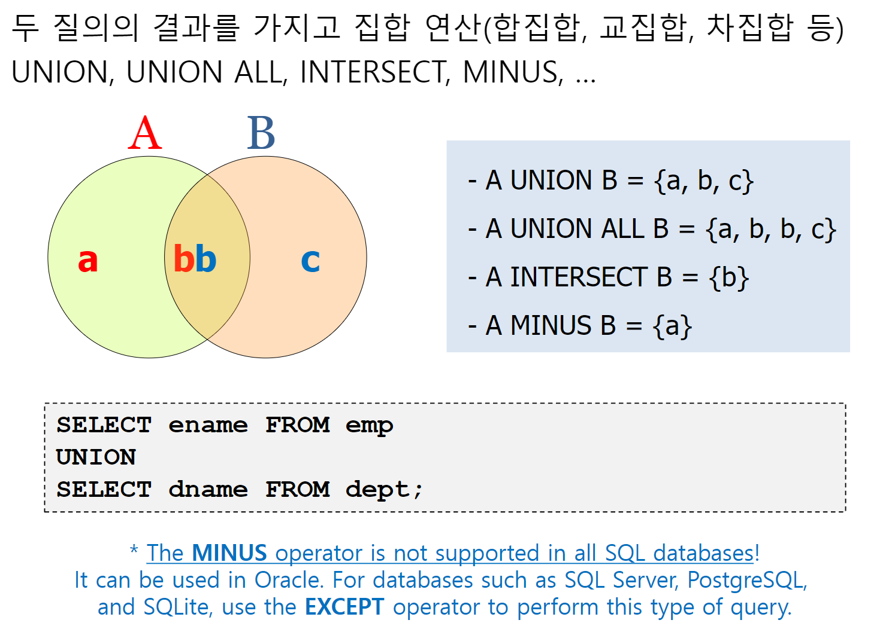
- UNION \[ ALL \] : 합집합
- EXCEPT \[ ALL ]: 차집합 (minus : 연산은 몇몇 dbms는 지원하지 않는다(posgresql, msql) execpt 연산이 표준)
- INTERSECT \[ALL] : 교집합

> [!NOTE] 참조
> 다른 연산과는 다르게 중복을 제거한다 중복을 제거하려면 union all 같이 all 을 붙인다
> r 의 어떤 튜플x가 m번 존재, s의 어떤 튜플 x가 n 번 존재한다면
> r union s => x 1회 등장
> r uinon all s => x m+n회 등장


## nested subquery
쿼리 내부의 쿼리
```sql
select A1,A2, ...,An
from r1,r2, ...,rm
where P
```
이러한 sql 문이 있을 때
- $A_i$  : 단일 값을 반환하는 subquery 로 대체될 수 있다
- $r_i$ : 유효한 subquery 로 대체될 수 있다
- p : B `< [not] in,>` (subquery) 형태의 표현식에 들어갈 수 있다

각각에 subquery 의 위치에 따라 가능한 형태가 다르고 표현도 다르다 이러한 것들의 별칭 또한 존재한다
### Scalar subquery
select 문에서 **함수**처럼 **단일값**을 반환하는 query
```sql
select dept_name, (
	select count(*)
	from instructor where
	department.dept_name =instructor.dept_name
	) as num_instructors
from department;
```

| dept_name | num_instructors |
| --------- | --------------- |
| 물리학과      | 6               |
| 컴공학과      | 12              |
| 철학과       | 8               |

from에서 tuple 이 하나하나씩 넘어 올 때 마다 dept_name 내부에 들어가는 값이 일종의 parameter 처럼 계속 바뀌면서 다른 출력을 낸다

### inline view
임시 공간에 테이블을 생성하여 사용하는 View 와 비슷함
```sql
-- 평균 급여 42000 이상인 부서와 그 평균 급여
select dept_name,avg_salary
from
	(select dept_name, avg (salary) as avg_salary
	from instructor
	group by dept_name ) 
where avg_salary > 42000;
```

### where 내부의 suquery
주로 테스트 용도로 사용됨
- 집합 \[not\] in
- 비교 some, all, \[not\] exits, unique
-  
#### for set membership : \[not\] in => 집합용
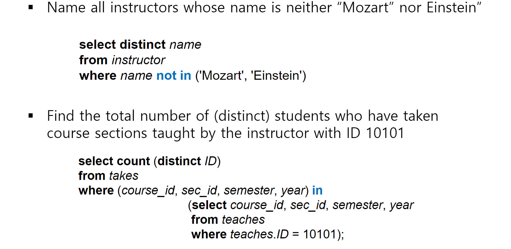

#### for set comparisons  : some, all 비교용
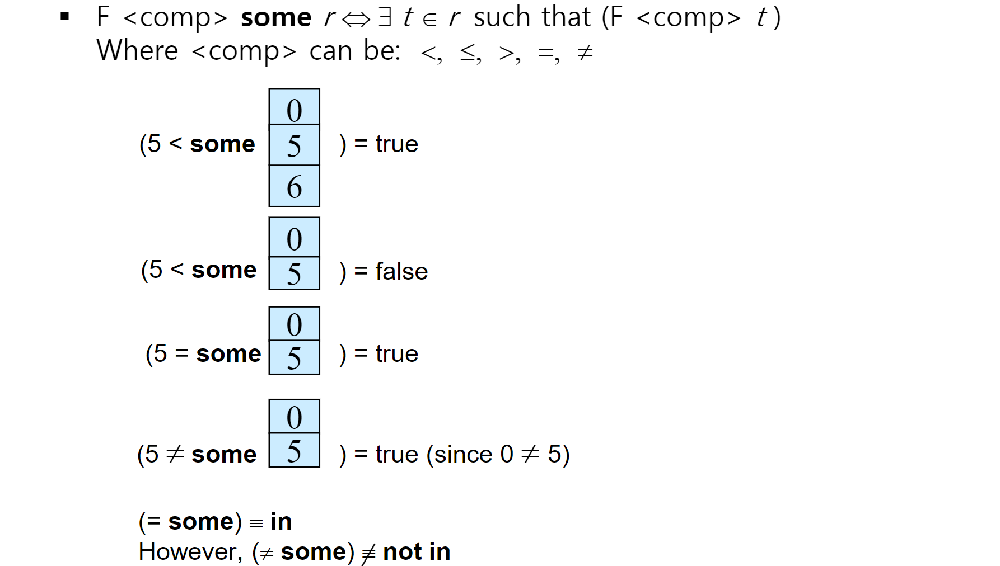
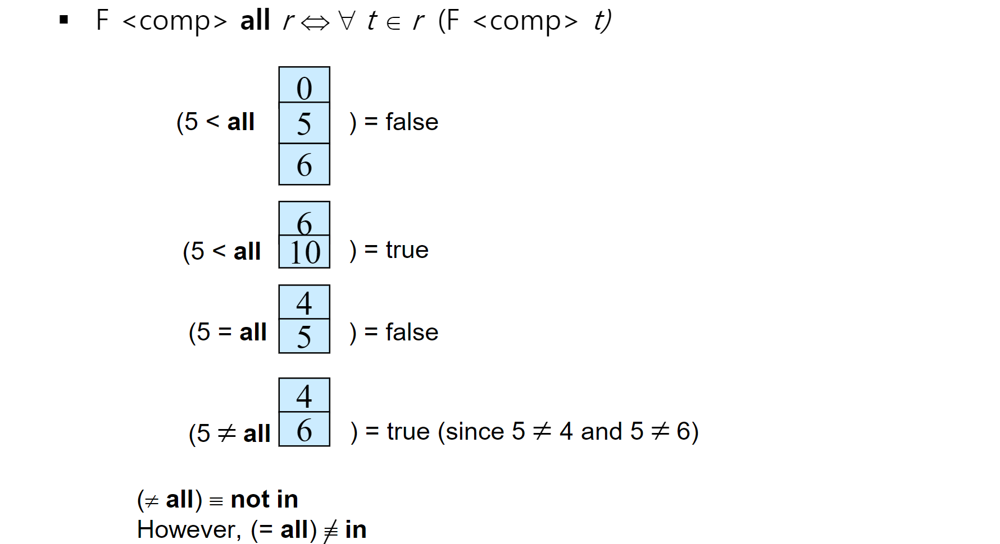
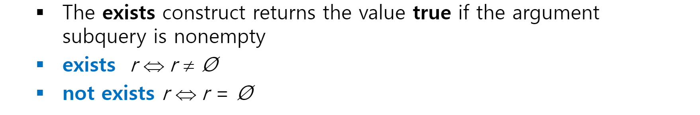
#### for set cardinality :


### with 절
from 절 subquery inline view 의 발전된 방향으로서 
1. **재사용성**: `WITH` 절을 통해 정의된 Common Table Expression(CTE)는 쿼리 내에서 여러 번 참조될 수 있습니다. 이는 복잡한 쿼리를 여러 부분으로 나누어 각 부분을 한 번만 계산하고, 그 결과를 여러 번 재사용함으로써 성능을 향상시킬 수 있습니다.
    
2. **가독성과 유지 보수**: 쿼리가 더 읽기 쉽고 이해하기 쉬워지므로, 성능 최적화를 위한 수정이 필요할 때 쉽게 변경할 수 있습니다. 잘 구조화된 쿼리는 성능 문제를 진단하고 해결하는 데도 도움이 됩니다.
    
3. **실행 계획 최적화**: 데이터베이스의 쿼리 최적화기는 `WITH` 절을 사용함으로써 더 효율적인 실행 계획을 생성할 수 있습니다. 이는 데이터베이스 시스템에 따라 다르지만, `WITH` 절이 제공하는 명확한 논리적 구조는 최적화기가 더 좋은 결정을 내리는 데 도움이 될 수 있습니다.
```sql
with max_budget (value) as 
	(select max(budget) from department) 
select department.dept_name from department,max_budget
where department.budget = max_budget.value;
```


## INSERT INTO DML
`INSERT INTO 테이블이름 [(컬럼리스트)] VALUES (값리스트)`
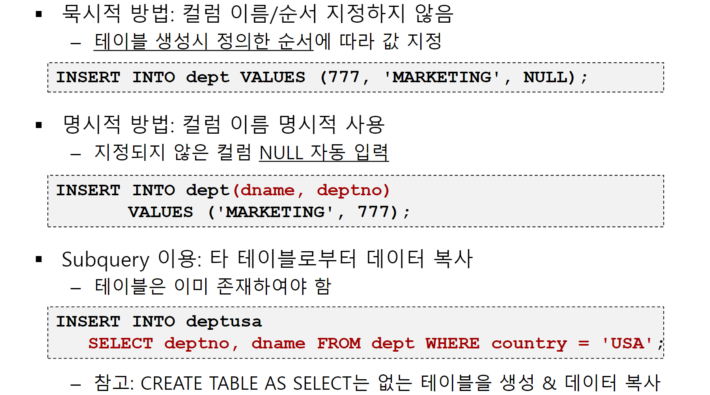
## UPDATE DML
`UPDATE 테이블이름 SET 변경내용 [WHERE조건]`
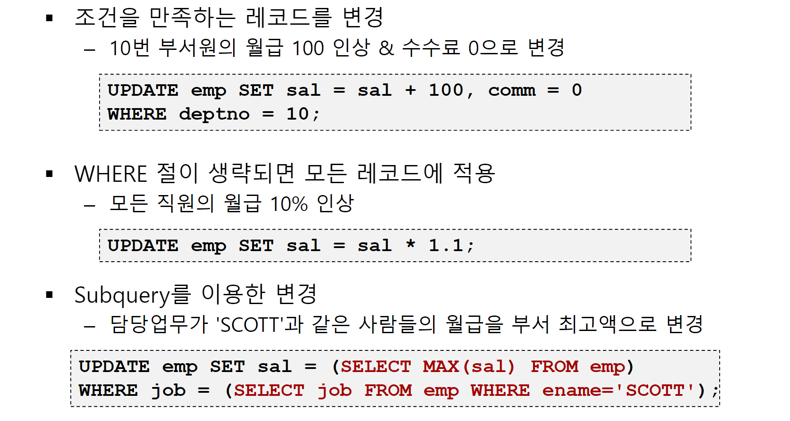

## DELETE DML
`DELETE FROM 테이블이름 [WHERE조건];`


## DML 참고
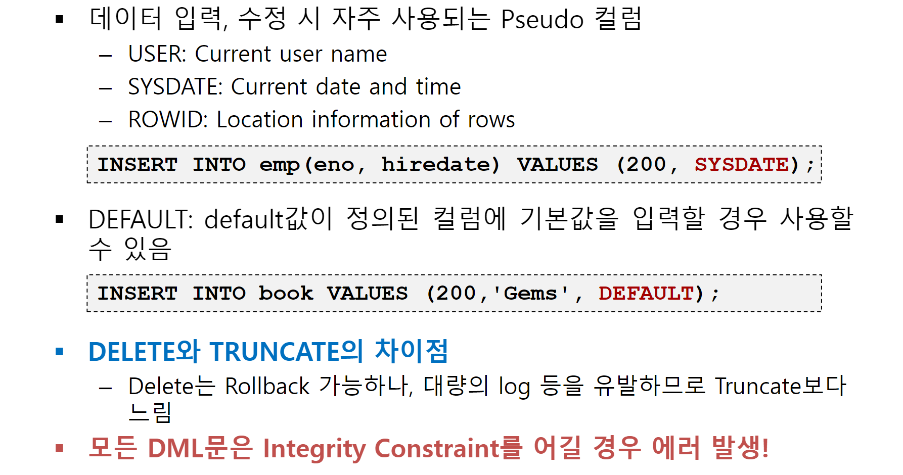


## Function
- Character Function : 
	- LOWER : 문자열를 받아서 모두 소문자로
	- UPPER : 문자열를 받아서 모두 소문자로
	- CONCAT : 문자열 2 개를 받아서 이어준다
	- SUBSTR(문자, 시작인덱스, 길이) : substring 시작 인덱스 부터 길이만큼 추출 
	- LENGTH : 문자열을 받아서 길이를 반환 from dual 를 사용 
	- LTRIM : LTRIM('xxxYYZZxYZ','x') = 'YYZZxYZ'
	- RTRIM :  RTRIM('XXYYzzXYzz','z') = 'XXYYzzXY' 
	   RTRIM('XXYYZZXYZ          ') = 'XXYYZZXYZ' 우측 공백제거
	- TRIM :  TRIM('x' FROM 'xxYYZZxYZxx') = 'YYZZxYZ'
	- ASCII
- Number function
	- ABS : Absolute 숫자의 절대값을 반환합니다. 예를 들어, -5의 절대값은 5입니다
	- MOD : Modulo 두 숫자를 나눈 나머지를 반환합니다. 예를 들어, 10 MOD 3은 1을 반환합니다.
	- ROUND : Round 숫자를 반올림합니다. 예를 들어, ROUND(5.67)은 6을 반환합니다.
	- TRUNC : Truncate 소수점 이하를 버립니다. 예를 들어, TRUNC(5.67)은 5를 반환합니다.
	- SIGN : 숫자의 부호를 반환합니다. 양수이면 1, 음수이면 -1, 0이면 0을 반환합니다.
	- CHR/CHAR : 아스키 코드 값을 해당 문자로 변환합니다. 예를 들어, CHR(65)는 'A'를 반환합니다.
	- CEIL : 주어진 숫자보다 크거나 같은 가장 작은 정수를 반환합니다. 예를 들어, CEIL(4.2)는 5를 반환합니다.
	- FLOOR : 주어진 숫자보다 작거나 같은 가장 큰 정수를 반환합니다. 예를 들어, FLOOR(4.8)는 4를 반환합니다.
	- EXP : Exponential 주어진 숫자의 자연 지수 함수 값을 반환합니다. 예를 들어, EXP(1)은 약 2.718을 반환합니다.
	- LOG : Logarithm 주어진 숫자의 로그 값을 반환합니다. 예를 들어, LOG(100, 10)은 2를 반환합니다 (밑이 10일 때).
	- LN : Natural Logarithm 주어진 숫자의 자연 로그 값을 반환합니다. 예를 들어, LN(2.718)은 1을 반환합니다
	- POWER : 주어진 숫자를 제곱합니다. 예를 들어, POWER(2, 3)은 8을 반환합니다.
	- SIN :
	- COS : 
	- TAN : 
- Date function
	- SYSDATE : 데이터베이스 서버의 현재 날짜와 시간
	- EXTRACT : 날짜나 시간 값에서 특정 부분(연도, 월, 일, 시, 분, 초 등)을 추출합니다. 예를 들어, `EXTRACT(YEAR FROM date_column)`은 주어진 날짜에서 연도를 추출합니다.
	- TO_NUMBER(TO_CHAR(d,'DD'|'MM'|'YY'))
		- - `TO_CHAR(date_column, 'DD')`: 날짜에서 일을 문자열로 추출합니다
		- `TO_NUMBER(TO_CHAR(date_column, 'DD'))`: 날짜에서 일을 숫자로 변환하여 추출합니다.
		- `TO_CHAR(date_column, 'MM')`: 날짜에서 월을 문자열로 추출합니다.
		- `TO_NUMBER(TO_CHAR(date_column, 'MM'))`: 날짜에서 월을 숫자로 변환하여 추출합니다.
		- `TO_CHAR(date_column, 'YY')`: 날짜에서 연도의 마지막 두 자리를 문자열로 추출합니다.
		- `TO_NUMBER(TO_CHAR(date_column, 'YY'))`: 날짜에서 연도의 마지막 두 자리를 숫자로 변환하여 추출합니다
- Conversion function
	- TO_CHAR : `TO_CHAR(date_column, 'YYYY-MM-DD')` mysql 안되노
	- TO_NUMBER `TO_NUMBER('12345')`
	- TO_DATE / CAST: 문자열을 날짜로 변환합니다
	  `TO_DATE('2024-05-17', 'YYYY-MM-DD')`, `CAST(some_column AS VARCHAR(20))`
	- CONVERT : 한 데이터 타입을 다른 데이터 타입으로 변환
	  `CONVERT(VARCHAR, some_date, 23)`
- Null-Related function 
	- NVL/ISNULL : `NVL(column, 'default')` default 반환 첫 번째 인수가 NULL인 경우 두 번째 인수를 반환
	- NULLIF :: `NULLIF(a, b)`는 `a`와 `b`가 같으면 NULL을 반환하고, 다르면 `a`를 반환
	- COALESCE : Coalesce `COALESCE(column1, column2, 'default')`는 `column1`이 NULL이 아니면 그 값을 반환하고, NULL이면 `column2`를 반환하며, `column2`도 NULL이면 'default'를 반환합니다. 인수 중에서 첫 번째로 NULL이 아닌 값을 반환합니다

## case 표현식
```sql

CASE
	SIMPLE_CASE_EXPRESSION 조건
	ELSE 표현절
END

CASE
	SEARCHED_CASE_EXPRESSION 조건
	ELSE 표현절
END

DECODE(expr, value1, return1 
	   [, value2, return2, ... , default])  --Oracle Only.
```


```sql
SELECT ENAME, EMPNO, MGR,
	CASE some_column
		WHEN 'value1' THEN 'result1'
		WHEN 'value2' THEN 'result2'
		ELSE 'default_result'
	END
FROM EMP;
```

```sql
SELECT ENAME, EMPNO, MGR,
	CASE
		WHEN some_column > 100 THEN 'Greater than 100'
		WHEN some_column = 100 THEN 'Equal to 100'
		ELSE 'Less than 100'
	END
FROM EMP;
```


- 두 table의 동일 속성에서 누가 fk 가 될것인가
- fk 로 엮여있는 table 에서 pk를 어떻게 설정할 것인가
	- student 와 instructor 의 advisor 의 예


