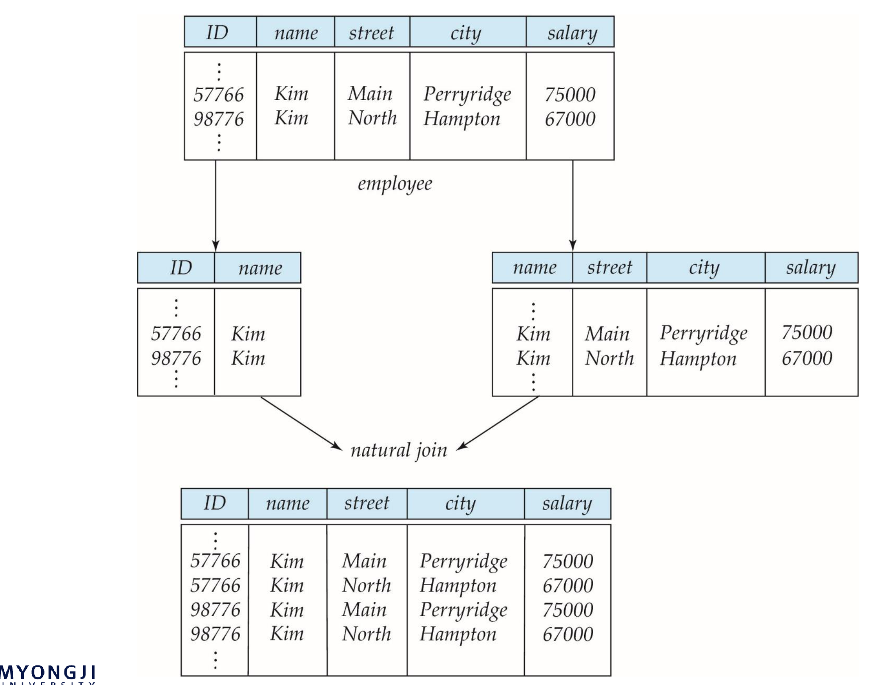
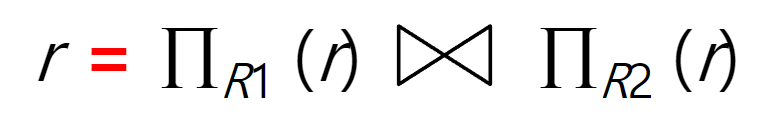

## 나쁜 디자인과 좋은 디자인
$R = in\_dept(ID, name, salary, dept\_name, building, budget)$

- 나쁜 디자인

1. 정보의 중복: 중복 데이터는 아래의 이상현상에서 자세히 나타난다
   dept_name ->building, budget :  functional dependency 관계로 building, budget 은 정보의 중복이 발생할 수 있다
2. 이상 현상: Anomaly 
	1. Insertion Anomaly:loan-number 없이branch-name 등 insert 불가
	2. Deletion Anomaly: 어떤 branch의 마지막 loan을 delete하면 branch 자체가 사라짐
	3. Update Anomaly: 어떤 특정한 branch의 정보(예: Downtown의assets) 를 update하면 해당되는 튜플들을 모두 업데이트해야 함 한개라도 실패하면 안된다

- Decomposition 이 필요하다는 결론
	- 중복 데이터를 최소화
	- 정보를 보존 하면서 분리
	- 함수 종속성 유지 (BCNF)

> functional dependency 는 현실의 실세계의 돌아가는 법칙을 반영한 것이다

## 정규화
- 1NF : 데이터는 원자적이어야 한다(Domain is atomic if its elements are considered to beindivisible)
- 2NF second nomal form
- 3NF
- BCNF
- 4NF

### 1정규화

| 앨범이름 | 가수명 | 곡명          |
| ---- | --- | ----------- |
| 1집   | 에일라 | A,B,C,D ... |

1FN : 테이블을 구성하는 모든 요소들이 atomic(원자적이다) 즉 분해 불가능하다 위의 엘범 테이블의 경우 곡명에 여러가지 곡이 들어가 있고 만약 각각을 parsing 해서 사용하게 되면 첫번째 정규화 규칙을 지키지 못하게 된다
하지만 여기서 나는 곡명을 파싱하지 않고 그냥 통째로만 사용할 꺼야 라고 한다면 제 1정규화가 되어있지 않다고 말할 수 없다

### 손실분해 Lossy Decomposition

분해를 할 때 정보를 모두 저장되어 있는 채로 분리할 수 있어야 한다

Branch = (b_name, b_city, asset), Loan = (loan#, c_name, amount)
- 문제점: 상관 관계가 없어짐 (연결 정보의 손실)
- Called a Connection Trap
Branch = (b_name, b_city, asset), Loan = (loan#, c_name, amount, b_city)
- natural join시 tuple 증가
- information(relationship) 상실
- 잘못된 상관 관계(b_city)

> 정확하지 않은 정보가 늘어나는 것 또한 손실분해라고 한다

즉 분해를 할 때 Lossless-join Decomposition 을 해야한다
분해를 하면 자연조인시(공통 attribute 가 존재할 때) 본래의 원본 테이블보다 크거나 같다 같을 때 만을  Lossless-join Decomposition 이라고 한다

분해를 할 때 아래의 것을 본래는 고려하면서 분해를 해야한다
- Functional Dependencies 
- multivalued dependencies (we will not cover this!) : 어떤 함수 종속도 존재하지 않은 분해의 무손실 분해를 보장할 수 있는 다중값 종속
### 기능적 종속성 functional dependency
a -> b
- a functionally determines b
- a, b : set of attributes 집합이 가능하다
- two tuples with same a have same b 
- a가 정해지면 반드시 b가 정해진다. 
- a 값이 같은데 b 값이 다를 수 없다
> 실제 Application의 규칙에 의해 정해짐(실 세계의 규칙을 반영)

예시) student 테이블
student = {ID, name, gen, ...}
ID -> name gen ...
ID 는 이름 성별 등등을 결정한다 즉 id가 같은 tuple 은 다른 이름을 가질 수 없다
> trivial 이라는 것은
> customer-name, loan-number →customer-name
> customer-name →customer-name
> 당연히 기능적 종속성을 만족하는 관계이다

**closure set of functional dependency**
F : 함수 종속의 집합
F+ : F 로 부터 추론 가능한 모든 집합

**attribute set closure**
(AG)+ 는 AG 로 만들 수 있는 모든 Attrubute 집합이다
AG 가 후보키 인지 확인법
1. 슈퍼키가 맞는가 즉 AG 를 통해 R 을 구성할 수 있는가
2. AG 의 부분집합이 존재하는가
함수 분해를 통해 무손실 분해를 증명할 수 있다
## Lossless-join Decomposition Revisited
R1 과 R2 의 교집합 attribute 가 superkey 일 때 원본으로 되돌릴수 있다
즉 분해할 때 superkey 를 각각 가져가야 한다
3단계일때

## Boyce-Codd Normal Form BCNF
trivial 하지 않은 모든 함수종속에서 결정자가 superKey인 경우 BCNF

## Third Normal Form: Motivation

## meterialized view
from 의 경우 미리 1번만 조인 시켜서  작동하게 되는데 즉 1회성으로 메모리에
하지만 meterialized view 는 물리적으로 보조메모리에 저장시킨다

> BCNF 는 데이터중복을 방지하여 어노몰리 문제가 사라지지만 함수 의존성을 보장하지 못할 수도 있다 그래서 3NF 를 사용하여 데이터 중복이 되더라도 즉 어노몰리 문제가 발생하더라도 함수의존성을 보존하는 것을 목표로  한다

> 분해 문제 풀어보기
> 3nf 는 일정수준의 중복이 필연적으로 발생하게 된다
> 