## 기본 용어 정의
- attribute : culume(열)의 이름 rable(레이블)
- domain(도메인) : attribute가 가질수 있는 값(value)들의 집합(null 은 모든 domain 의 원소이다)
- row == record == tuple : 가로 value 의 집합
- entity :  하나의 tuple 을 통해 표현하고 싶은 객체
- arity : attribute 의 개수
- relation(table) : tuple 의 집합 
     ( table 을 통해 표현하는 것은 entity 간의 차이를 나타내므로 관계 라고 명칭 )
- database : table 의 집합

> NULL 은 0 이나 "" 이 아님 nonvalue 임
> 모든 domain 은 명시하지 않는 한 NULL 을 포함

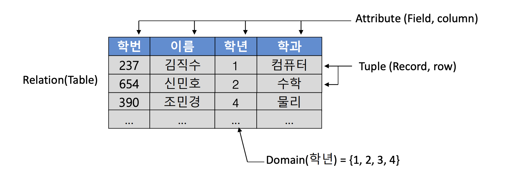

---

- schema : 논리적 구조 일종의 data type == 테이블의 기본적 구조 == attribute 가 모두 동일 모든 attribute 의 domain 
- instance : 특정시점의  entity 들의 상태(dbms 의 상태)

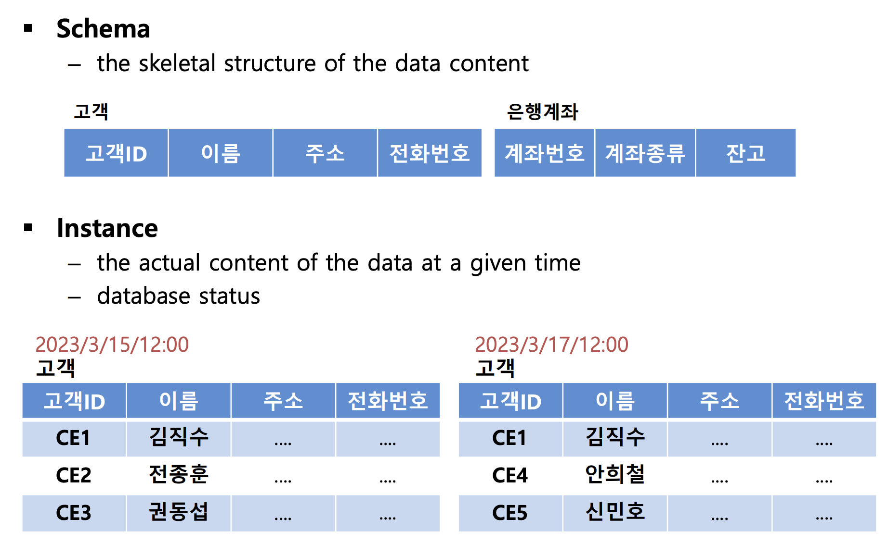

---

- key :  tuple 을 구별하기 위한 Attribute 조합의 집합
     tuple을 구별하지 못해도 만들어진 목적은 tuple 을 구별하기위해 만들어짐
     결국 모든 Attribute 의 모든 가능한 **부분 집합**
- Super key : relation 에서 tuple 을 구별하기 위한 unique 한 Attribute 의 집합
     attribute 를 여러개 묶던지 tuple 들이 모두 **구별만 되면 성립**
- Candidate Key(후보키) :  Superkey 중 minimal 한 key 집합
     attribute 를 하나만 빼더라도 tuple 들이 구별이 되지않는 집합의 원소가 최소가 되는 집합
- Primary key :  Candidate key 중 하나 (relation 을 정의할 떄 선택)
     NULL 값 부여 불가
- Foreign key : 타 table의 value 을 참조하는 Attribute 집합
     참조하는 주체는 key 가 아닐 수 있지만 참조되는 객체의 value 는 primary key 의 value
	- reference integrity :참조된 table의 primary key 의 값들 중 하나이거나 NULL만 가능하다

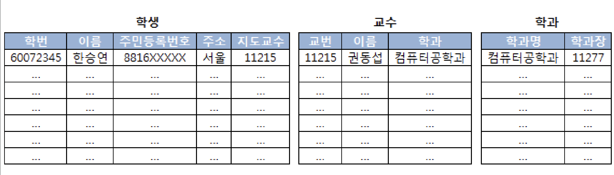

> 학생 table 에서
> super key : {학번, 이름, 주민등록번호} , {학번}, {주민등록번호, 지도교수} .... 등등
> candidate key :  {학번} , {주민등록번호}
> primary key :  학번 => db 설계자가 임의 지정
> forigen key : 지도교수
> 교수 table 에서
> super  key : {교번, 이름} {교번} {교번, 학과}
> candidate key : {교번}
> forigen key : 없음

---

## 표기 관습

relation 은 소문자 r
relation 의 스키마는 대문자 R
속성의 집합은 그리스 영문자 $\alpha, \beta$
속성의 집합이 슈퍼키일 때 K : K 는 r(R) 의 슈퍼키
r 이라고 하면 특정 시점의 r(R) 의 인스턴스 값을 표시한다
## Entity - relationship model
table 들의 관계로 얽혀 있는 database 를
관계를 중심으로 보기편하게 시각화를 시도하는 모델

위에서 학생과 교수의 table 의 관계를 예시로 들자
학생의 attribute들 중 지도교수라는 attribute 가 있고 들어갈 수 있는 value 는 교수의 primary key 인 교번이 들어가게 된다 이때 이러한 테이블의 관계를 아래처럼 표현한다
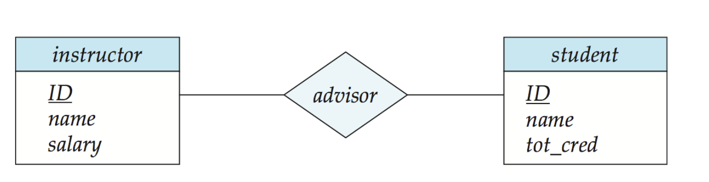
둘의 관계는 advisor 관계이며 이 관계를 visual 하게 보여줄 수 있다

## database 의 수학적 해석
$공식적으로, 도메인 집합 (D_1, D_2, \ldots, D_n)이 주어졌을 때$
$관계 (r)은 (D_1 \times D_2 \times \ldots \times D_n)의 부분집합입니다.$
$따라서, 관계는 (n)-튜플 ((a_1, a_2, \ldots, a_n))의 집합이며, 여기서 각 (a_i)는 (D_i)에 속합니다.$

## database language
- Data Definition Language (DDL) create
	- Database Schema를 정의하는 언어 
		- create table (table 생성)
			- 
		- drop table r
		- alter table r
			- alter table r add A D
			- alter table r drop A ( 지원하는 dbms 별로 없음 )
-  Data Manipulation Language (DML) modification
	- Database의 data를 조작(schema는 불변)하는 언어
		- Retrieve(조회) : select {} from {} where ...
		- Insert(저장) : insert into r values (smith, 00102 ...)
		- Delete(삭제) : delete from r where ...
		- Change(변경) : 
- Data Control Language (DCL) system
	- Database의 constraint를 제어하는 언어 priviliege
	     여기서 말하는 제약조건은 attribute value 의 제약조건(not null 등 )이 아닌 db 사용자 관리 접근 ip 허용 등 아닌 시스템적인 제약조건을 말한다
- Procedural vs. nonprocedural
	- sql 이 대표적인 nonprocedural 언어이다
	- 내부적으로는 sql 문은 해석하여 procedural 로 변환하여 순차적 처리를 위한 언어

## Transaction Management(트랜젝션)
계좌 A 에서 계좌 B 로 50 달러를 옮기는 상황을 생각해 보자 논리적인 행동 하나로 보이지만
프로그래밍에서는 계좌 A 의 50 달러를 전체 남아있는 계좌 액수 에서 빼는 행동, 계좌 B 에 50 달러를 추가하는 행동 이 있다 이때 A 계좌에 남아있는 계좌의 액수가 부족 또는 네트워크 불완전 등 일련의 문제 발생으로 인해 하나의 행위가 실패했다고 가정하자
이 때 하나의 행동만 성공 적으로 처리되게 된다면 문제가 심각해진다(둘다 못하는 것이 낮다)
그래서 두가지의 행동을 하나로 묶어 실패 할꺼면 둘다 실패하던가 성공할시 둘다 성공해야하는 것으로 두개의 논리적 행동을 하나의 논리적 행동으로 묶어 처리할 필요가 있는데 이렇게  개별적이고 분할할 수 없는 작업으로 구분되는 정보 처리 과정을 **Transaction** 이라고 한다

DB 또한 이러한 것을 지원한다

## 정규화 이론

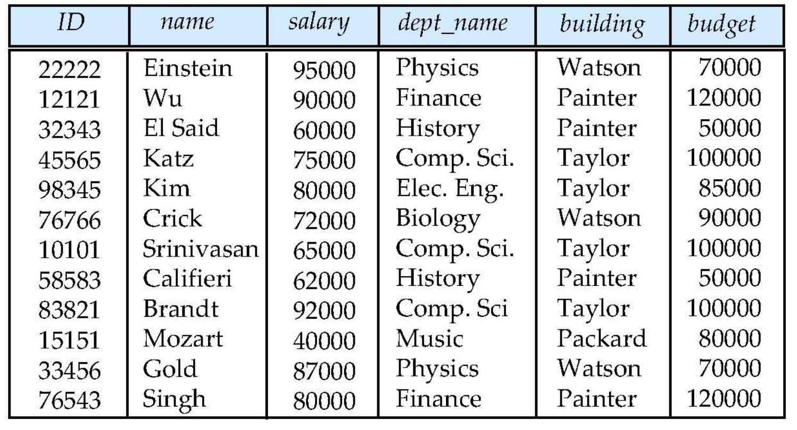
위의 그림과 아래의 그림을 비교해볼때 위는 table을 적절히 나눈 경우 모두 하나의 table 로 관리하는 경우의 예시이다
- 예를 들어 physics 의 예산을 7000 에서 8000 으로 변경할 때 id 33456 tuple 또한 바꾸어야 하는데 이렇게 중복이 발생하게 되면 성능상 오버헤드를 낳는다
### 비정규화 된 데이터베이스의 문제
정보가 중복 저장 => 보조 기억 장치 오버헤드
업데이트시 여려개의 tuple 을 건드려야 한다

## 데이터베이스 설계 방식
- ER (Entity - relationship) model 통하여 설계를 접근한다
- Normalization Theory(정규화 이론) : 어떤 디자인이 나쁜 디자인 인지 공식화

## [학교 시스템 데이터베이스](06.University/database(university)/학교%20시스템%20데이터베이스.md)
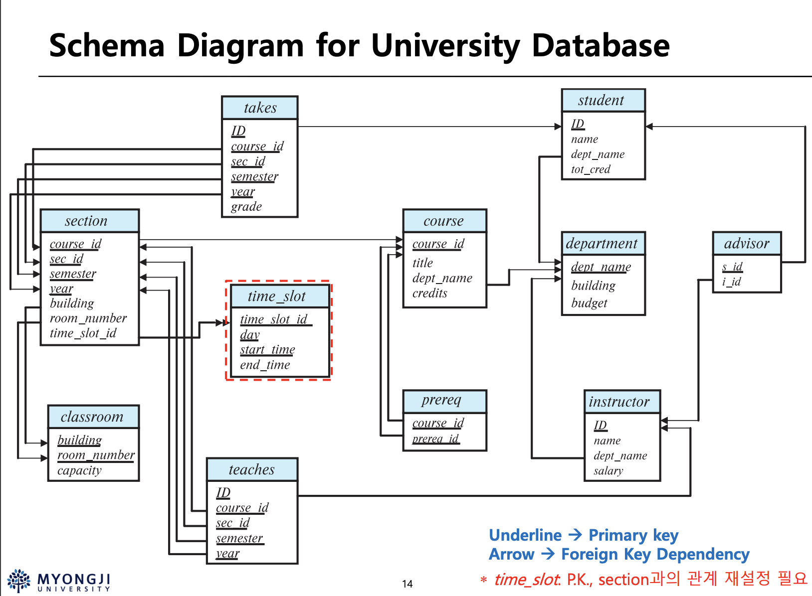

> 화살표 기준 출발 하는 부분이 Foreign attribute

## relation algebra

### Procedural language
sql(non procedural) 문이 내부적으로 처리하는 언어

#### Six basic/primitive operators
- select: $\sigma_c(r)$ **선택** => **수평 선택**
  c 조건을 만족하는 R table tuple 의 부분 집합을 선택한다
- project: $\Pi_a(r)$ **투영** => **수직 선택**
- cartesian product: $r \times s$ **tuple의 가능한 모든 조합** (동일 attribute 일 경우 r table 의 rB, s table dml sB 라고 표기하여 두집합의 attribute를 다르게 판단한다)
- rename: $\rho_s(r)$ 또는 $\rho_{s(A1,A2,A3)}(r)$ **rename** 이름을 다시 짓는다 R을 S로 
  여기서 table 이름만 재설정 할 수도 attribute 의 이름을 재설정 할 수도 있다

#### additional operation
- set intersection(교집합): $r\cap s = r -(r-s)$ 
- Natural join(자연 조인): $r \bowtie s = \sigma_{r.A_1 = S.A_1 \land r.A_2 = s.A_2 \land \ldots \land r.A_n = s.A_n}(R \times S)$ 
  **product 중복 제거**
  cartecian product 에서 동일 attribute 또는 동일 domain 의 값을 
- Theta join(세타 조인) Equi join(등가 조인): $r \bowtie s$, $r\bowtie_\theta s = \sigma_\theta(r \times s)$ **select + product**
  지정된 조건을 만족하는 모든 튜플 조합 특히 조건에 = 등호의 조건이 들어갈 때 equi join 이라고 부른다
- Assignment Operation(대입 연산) : $temp1 \leftarrow r \times s$ 일종의 변수 설정
- Outer join(외부 조인) : ⟕, ⟖, ⟗ 좌측 우측 양쪽 순서로 table 을 null 값이 들아가더라도 join 하여 projection 한다

#### netraul join 과 inner join 의 차이
netural join 의 경우 동일한 attribute 이름을 기준으로 서로를 묶지만 inner join 의 경우 임의로 어떠한 attribute 를 같은 기준으로 join 할지 선택할 수 있다

##### outer join 에 대한 이해
^a02478
cartasian product 의 경우 모든 가능한 조합을 모두 표기하기 때문에 이러한 일이 발생하지 않는다
하지만 동일한 두개의 attribute value 하나의 value 로  join (netural join 등) 할 때 가능하지 않은 조합 null 도 표기하고 싶을 때 문제가 발생한다 즉 정보 손실을 방지하는 조인 연산의 확장

##### additional operation의 primitive opration 을 통한 구현

$r \bowtie s = \pi_{R.A_1, R.A_2, \ldots, R.A_n, S.B_1, S.B_2, \ldots, S.B_m}(\sigma_{R.A_i = S.A_i}(r \times s))$ 
#### NULL
- null 의 산술연산은 null 이다
- Aggregate function ( 집계 함수 ) 는 avg max 등 계산시에 null을 무시한다
- 비교 연산에서 NULL 과의 비교는 새로운 진리값 (unknown) 을 반환한다 ("1 < null")
	- (unknown or true) = true
	- (unknown or false) = unknown
	- (unknown or unknown) = unknown
	- (true and unknown) = unknown,
	- (false and unknown) = false,
	- (unknown and unknown) = unknown
	- (not unknown) = unknown

#### Extended Relational-Algebra Operations
primitive operation 으로는 표현할 수 없는 연산들

- Generalized Projection( 일반화 수직선택(투영) ) : $\Pi_{F_1,F_2,....,Fn}(r)$  projection 에서의 $\Pi_a(r)$  a 는 attribute 명이 들어가지만, 속성 값을 계산하거나 수정하는 산술식 대입이 가능하다 또한 상수 또한 들어갈 수 있다 (상수의 경우 )
- Aggregate function ( 집계 함수 ) :  $_{G_1,G_2,G_3,G_4} \Gamma_{F_1(A_1), F_2(A_2), F_3(A_3), F_4(A_4)}(R)$ 
  G1: attribute => 어떠한 그룹(단위)로 연산을 적용할 것이냐
  F1(A1): 연산적용을 통해 새로 만들어진 attribute 
  value 들의 평균, 최소, 최대, 합, 개수 를 새로운 attribute 로 하여 table 을 생성
  ex) $_{dept\_name} \Gamma_{avg(salary)\ as\ avg\_sal}(R)$ : dept_name, avg_sal attribute 를 갖는 table
  
#### advanced topics
- Division(): $r\div s$ table S의 모든 tuple 과 관련있는 R 의 tuple 반환
	- 여러 행으로부터 단일 결과 값을 계산하는데 사용된다

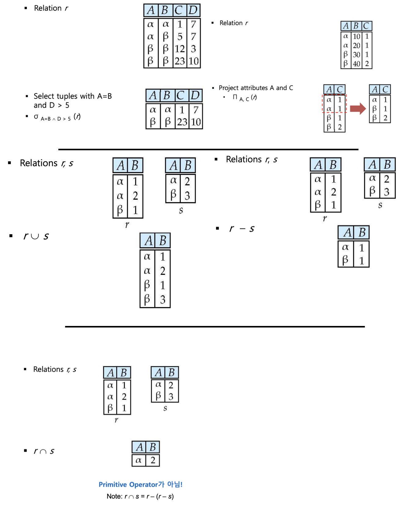

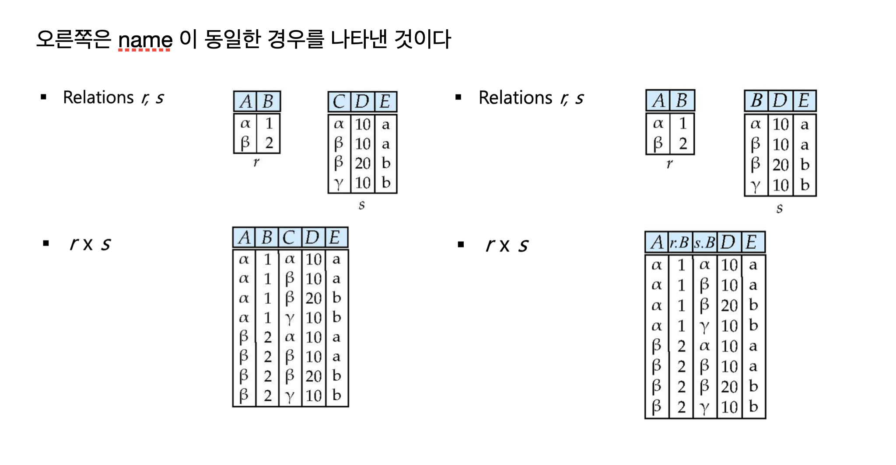

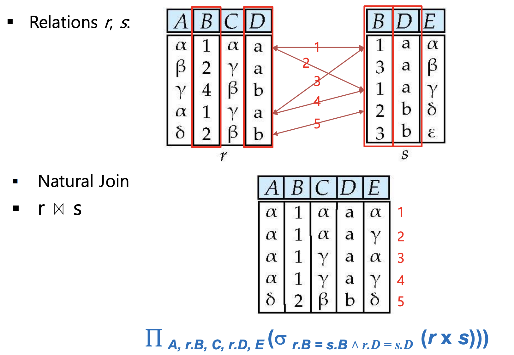

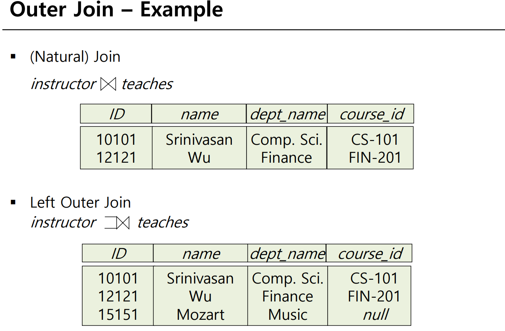
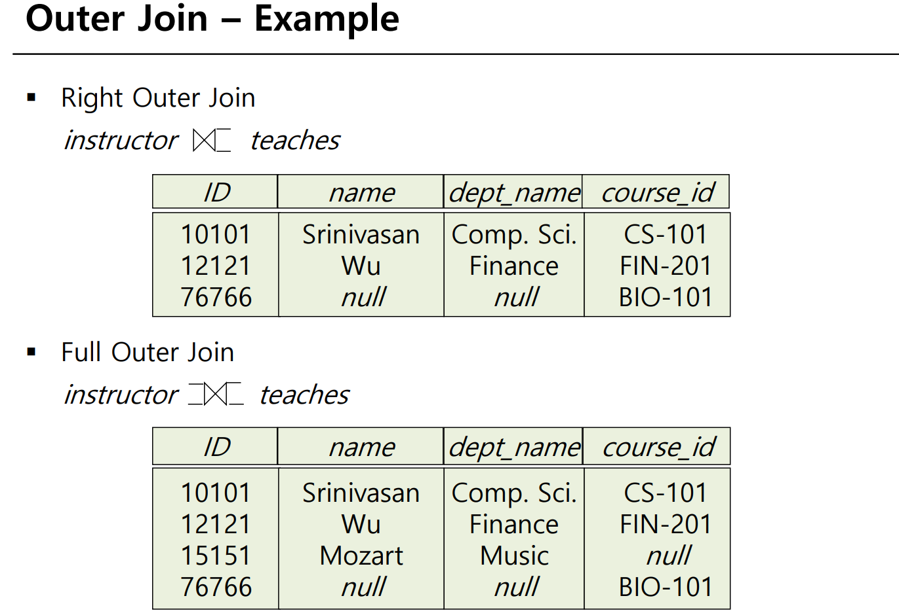
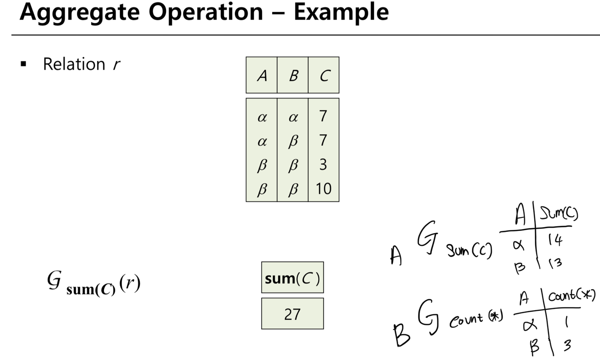
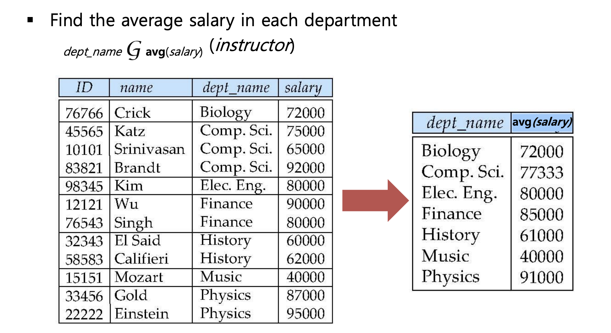
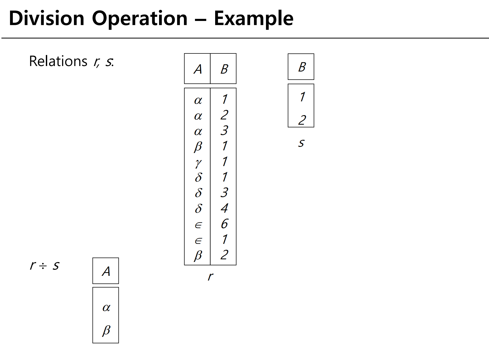
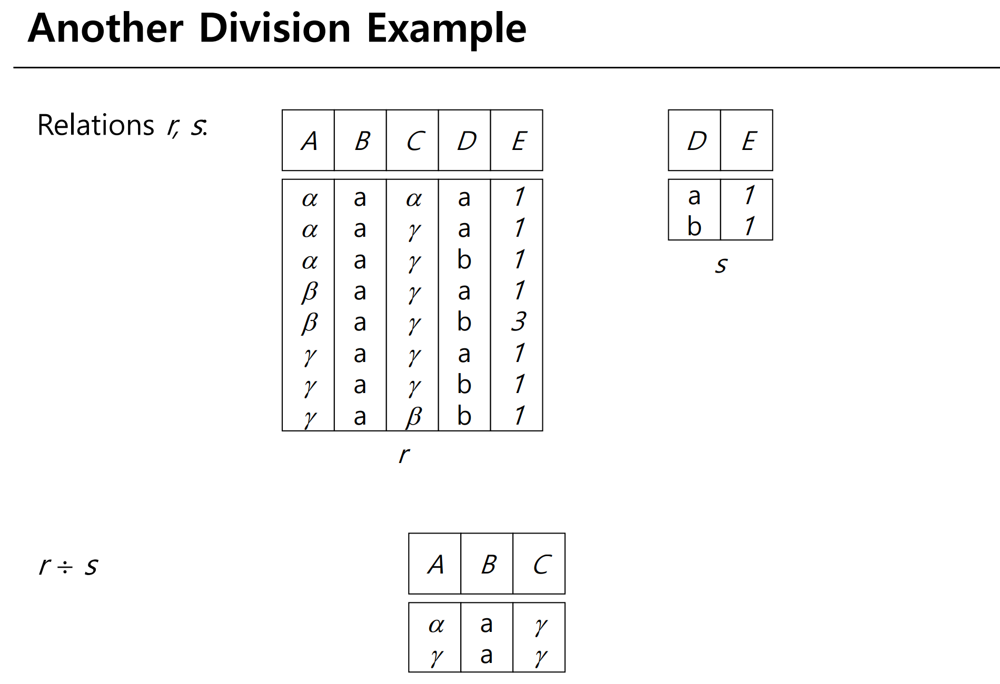

## 참조 무결성 제약 조건과 외래키 제약 조건
=> $참조 무결성 제약 조건 \supset 외래키 제약 조건$ 
- 제약 조건이란 데이터의 입력 조건을 말한다
- 외래키 제약 조건 : 참조하는 값이 참조되는 값의 attribute의 domain 중 하나에 나와야 한다 & 참조되는 값은 pk 의 구성 속성중 하나이다
- 참조 무결성 제약 조건 : 참조하는 값이 참조되는 값의 attribute의 domain 중 하나에 나와야 한다
pk 구성요소라는 추가되는 조건에 의해 외래키 제약 조건이 더 엄격하다
현재 dbms 는 외래키 제약조건은 지원하지만 참조되는 속성이 주 키가 아닌 참조 무결성 제약조건은 언제나 깨질 수가 있다 즉 두 관계의 차집합의 사례에 대해서는 지원하지 않는다

## procedural language (relation algebra) 문제
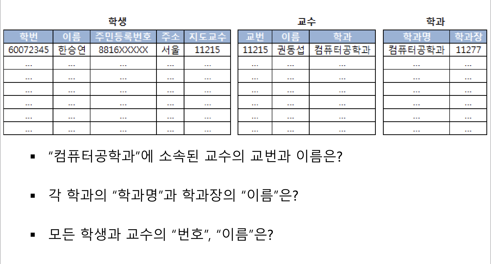
1. 컴퓨터공학과, 교수, 교번 관계는 교수 table 만으로 확인 가능하다
	1. $\Pi_{\text{교수.교
번,교수.이름}}(\sigma_{\text{교수.학과} = \text{"컴퓨터공학과"}}(교수))$
	2. and 의 표시는 , 가 아닌 $\land$ 표기가 맞다
2. 학과명 학과장 이름 교수 table 과 학과 table 을 동시에 확인해야 한다
	1. $\Pi_{\text{교수.학과,교수.이름}}(\sigma_{\text{교수.학과=학과.학과명,교수.교번=학과.학과장 }}(교수 \times 학과))$ //product 구현
	2. $\Pi_{\text{교수.학과,교수.이름}}({\text{교수}}\bowtie{\text{학과}} )$ // join구현
	3. 최적화가 가능한가?? primitive 연산으로는 불가능하지 않나??
3. 학생 교수의 번호, 이름 => 학생 교수 table 동시 확인(rename 후 합집합)
	1. $(\rho_{\text{학생(번호,이름)}}(\Pi_{학생.학번, 학생.이름}(학생)))\cup(\rho_{\text{교수(번호,이름)}}(\Pi_{교수.교번, 교수.이름}(교수)))$
	2. $\cup, -, \times, \bowtie$  binary 연산 이후 table 의 이름은 무었인가??
4. 교집합 $R \cap S$ 을 primitive operation 으로만 표현하라
	1. $R \cup S - (R-S) - (S-R) = R \cap S$
5. natural join $R \bowtie S$ 을 primitive operation 으로만 표현하라
	1. $R \bowtie S = \sigma_{R.A_1 = S.A_1 \land R.A_2 = S.A_2 \land \ldots \land R.A_n = S.A_n}(R \times S)$
6. 가장 높은 연봉을 받는 교수의 이름을 말하시오
	1. 모든사람과 비교시 한번이라도 연봉이 딸리는 사람
	   $\Pi_{instructor.name}(\sigma_{instructor.salary<d.salary}(instructor\times\rho_d(instorctor))$
	2. 가장 높은 연봉을 받는 사람 = 모든사람과 비교시 연봉이 한번도 딸리지 않는 사람 = 전체 사람 - 모든사람과 비교시 한번이라도 연봉이 딸리는 사람 $result = \Pi_{instructor.name} - \Pi_{instructor.name}(\sigma_{instructor.salary<d.salary}(instructor\times \rho_d(instorctor))$

### 은행 데이터베이스

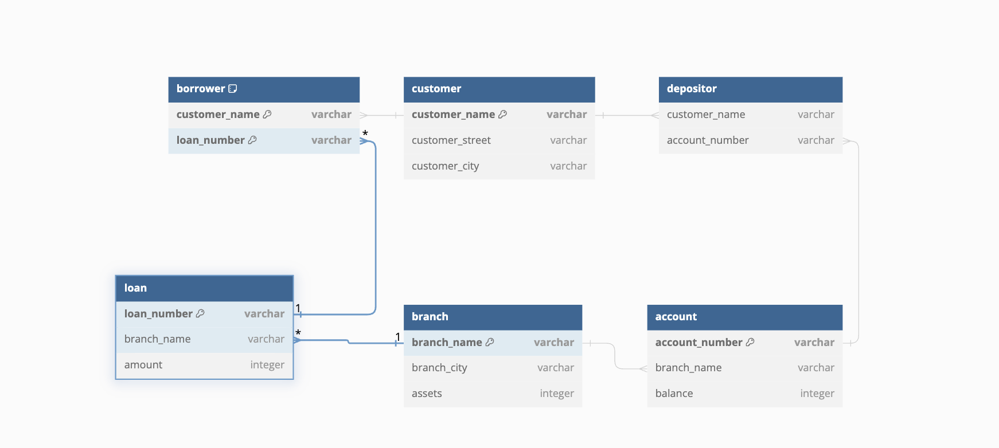
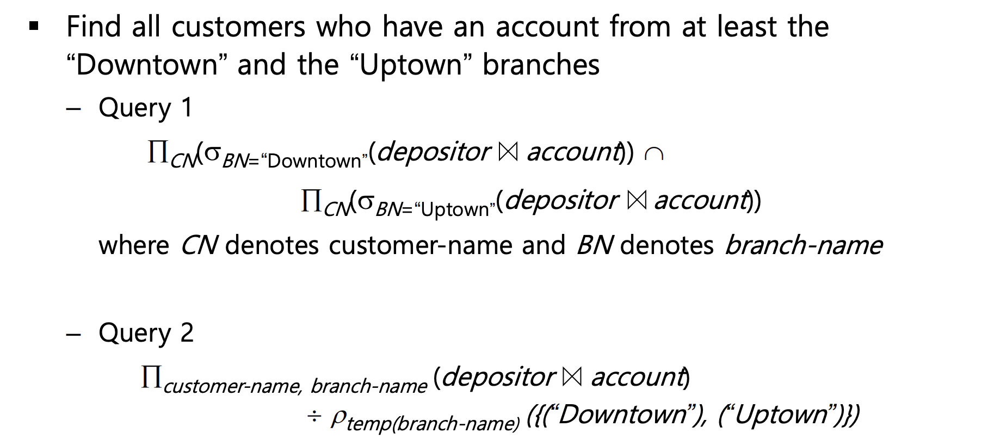
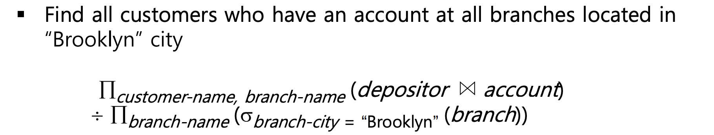
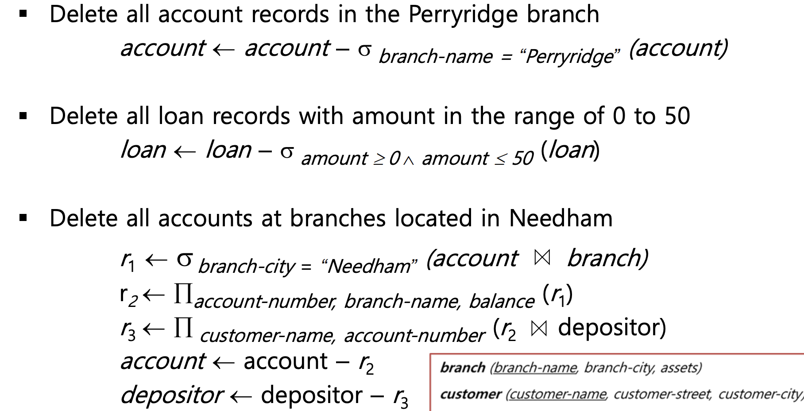
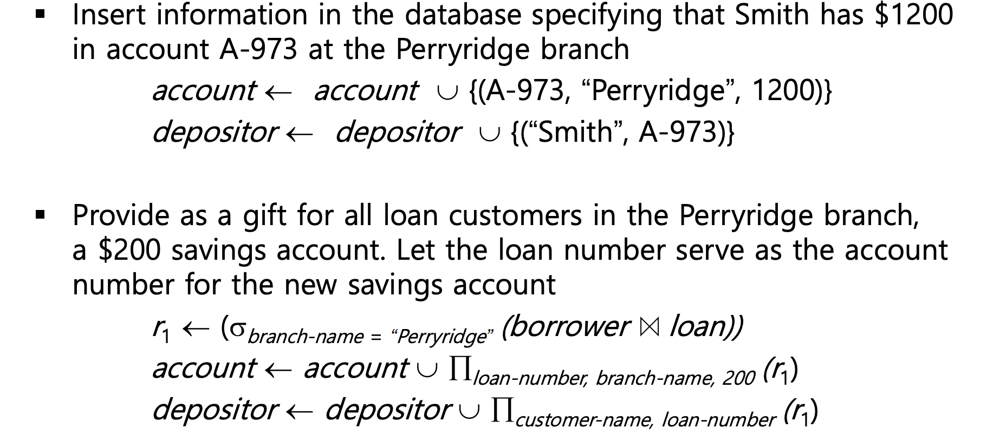
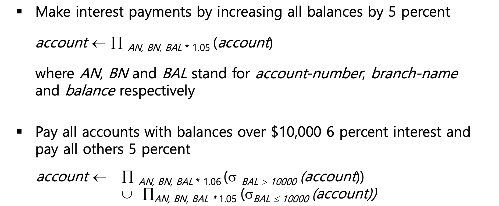

$d$

## relation algebra 와 sql 의 차이
1. 순수한 relation algebra 는 중복을 제거한다 예를 들어 pojection 의 결과가 동일한 튜플이 생기면 1개로 표기한다
2. multiset relation algebra 는 sql 문으로 부터 중복을 유지한다 
즉 아래의 구분 multiset relation algebra 와 sql 은 완벽하게 의미가 일치한다

> [!problem]
> select $A_1, A_2, A_3 \dots A_n$
> from $r_1, r_2, r_3, \dots r_n$
> where P
>$\Pi_{A_1, A_2, A_3, \dots A_n}(\sigma_P(r_1 \times r_2 \times \dots \times r_n))$

> [!Problem]
> select $A_1, A_2$ sum($A_3$)
> from $r_1, r_2, r_3 \dots r_m$
> where P
> group by $A_1, A_2$
> $_{A_1, A_2}\Gamma_{sum(A_3)}(\sigma_P(r_1 \times r_2 \times \dots \times r_m))$

> multiset : 컴퓨터/통신 멀티셋, 동일 항목이 여러 개 출현하는 것을 허락하는 집합체.

## 예시 1: 최소한 두 종류의 상품을 구매한 고객 찾기

- **Query 1** $(\pi_{CustomerName}(\sigma_{ProductName="Book"}(Purchases)) \cap \pi_{CustomerName}(\sigma_{ProductName="Laptop"}(Purchases)))$
    
- **Query 2** $(\pi_{customer-name, product-name} (Purchases) \div \rho_{temp(product-name)} ({("Book"), ("Laptop")}))$
    

## 예시 2: 두 지점에서 대출을 받은 고객 찾기

- **Query 1** (\pi_{CN}(\sigma_{BN="East Branch"}(borrower loan)) \cap \pi_{CN}(\sigma_{BN="West Branch"}(borrower loan)))
    
- **Query 2** (\pi_{customer-name, branch-name} (borrower loan) \div \rho_{temp(branch-name)} ({("East Branch"), ("West Branch")}))