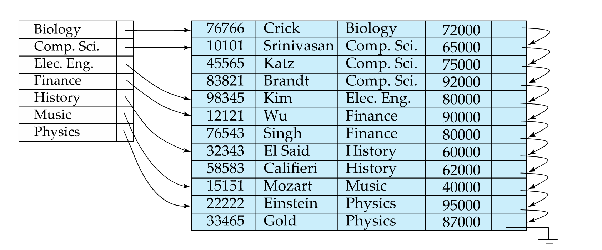
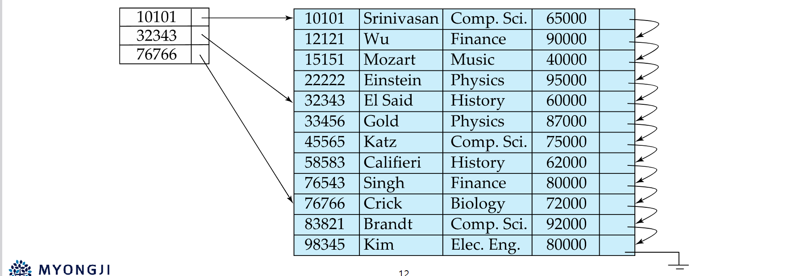

인덱스 : data에 빠르게 접근하기 위한 수단

## 기본
### 인덱스 파일(index entriy)의 구조

- search key 검색키 : record 를 찾는 데 사용되는 속성이나 속성들의 집합
### 인덱스의 종류
Ordered indices : record가 정렬된 순서와 동일하게 정렬된 search key
Hash indices : buckets 범위 안에서 값이 일정하게 분배로 된어 있다 값이 할댕

## 인덱스 평가 지표
- Access types(접근 유형)
	-  지정된 value 를 통해 즉각적으로 record 를 찾기
	-  지정된 value 를 통해 범위를 통해 record 를 찾기
- Access time(접근 시간) : 특정한 data 혹은 data 집합 접근에 걸리는 시간
- Insertion time(삽입 시간) 새로운 데이터 삽입 + 인덱스 구조 업데이트
- Deletion time(삭제 시간) 데이터 삭제 + 인덱스 구조 업데이트
- Space overhead(공간 부담) : 인덱스 구조가 차지하는 추가적인 공간

## Ordered index
- primary index (clustering index) : 검색 키의 값을 파일과 동일하게 정렬된 순서로 저장
	- 일반적인 상황에서는 primary index 의 search key 가 primary key 인 경우가 많지만 무조건 그럴 필요는 없다
- secondary index (non clustering index) : 검색 키의 값과 파일의 순서가 동일한 순서가 아님

## Dense index, sparse index
- Dense index : index file(index entry)에 모든 search key 값이 나타난다
	- access time 적어짐
	- insetion time, Deletion time 커짐
	- space overhead 커짐
- spase index : index file(index entry)에 search key 값이 단지 몇 개만 나타나다
	- access time 많아짐
	- insertion time, Deletion time 작아짐
	- space overhead 작아짐

## 두개의 조합

1. primary index 이면서 dense index : 데이터의 정렬 순서와 맞으면서 모든 search key 값이 index entry 에 출현
2. primary index 이면서 sparce index : 데이터의 정렬 순서와 맞으면서 search key 값이 몇 개만 출현
	1. 1번과 2번의 비교 즉 dence 와 sparce 의 비교 
3.  

primary & Dense

primary & sparce

leafnode 는 덴스인덱스

루트에서 leaf 까지는 미만이면 좌측 이상이면 우측
leaf 에서는 모든 값을 가지고 있다 DENSE
leaf 에서 실제 값을 찾을 때는 좌측에 있다

노드의 하나의 크기는 운영체제가 관리하는 block 과 동일하다

tree 의 깊이를 최대한 낮추어야 한다

All paths from root to leaf are of thesame length
Each node that is not a root or a leaf has betweenn/2 andn children (n = number of pointers in a node)
A leaf node has between (n–1)/2 andn–1 values

## 1. 모든 루트에서 리프까지의 경로 길이가 동일하다 (All paths from root to leaf are of the same length)

## 2. 루트나 리프가 아닌 각 노드는 n/2에서 n개의 자식 노드를 가진다 (Each node that is not a root or a leaf has between n/2 and n children, where n is the number of pointers in a node)
## 3. 리프 노드는 (n–1)/2에서 n–1개의 값을 가진다 (A leaf node has between (n–1)/2 and n–1 values)

## 특수 경우 (Special cases)

### a. 루트가 리프가 아닌 경우, 최소한 2개의 자식 노드를 가져야 한다 (If the root is not a leaf, it has at least 2 children)

### b. 루트가 리프인 경우, 0에서 (n–1)개의 값을 가질 수 있다 (If the root is a leaf, it can have between 0 and (n–1) values)

## B-tree B+-tree 에 비한 장단점

Advantages of B-Tree indices:
- may use less tree nodes than a corresponding B+-Tree
- sometimes possible to find search-key value before reaching leaf node
Disadvantages of B-Tree indices:
- only a small fraction of all search-key values are found early 일부분만 일찍 찾는다
- non-leaf nodes are larger, so fan-out is reduced → B-Trees typically have greater depth than corresponding B+-Tree 
	- b-tree b+-tree 에 비해 non leaf 노드는 각 key 들의 포인터 뿐만 아니라 자식 노드 포인터도 가지고 있으므로 노드에서 엣지로 나아가는 선(fan out)들이 적어진다 선이 적어진다는 말은 tree 의 높이가 높아지게 되고 이것은 성능상 불리한 점을 가져온다
- insertion and deletion are more complicated than B+-Trees
- implementation is harder than B+-Trees
> Typically, advantages of B-Trees do not outweigh disadvantages!

## 멀티키 접근
하나의 key를 기준으로 가져온후 조건을 확인하거나 두개의 key를 각각 가져와서 교집합 하던가
후자가 더 느린 경우가 생긴다
인덱스를 쓴다고 빨라진다고 보장할 수 없다

그래서 composite search keys 생김 두개의 search key를 사용해서 찾으므로

## 비트맵 인덱스

online analytics 데이터 분석용 db??
b+-tree 도 아니다

> 성능이 낮은 쿼리는 무었인가
> 인덱스가 2개에서 쿼리 순서에 따른 문제
