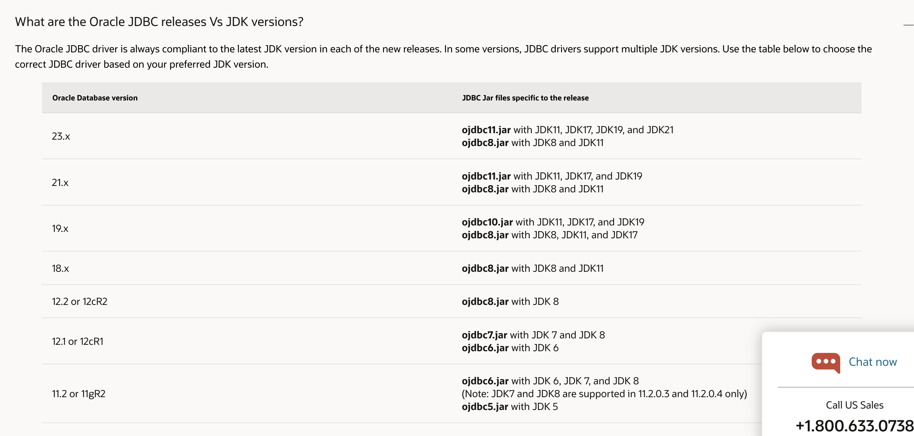
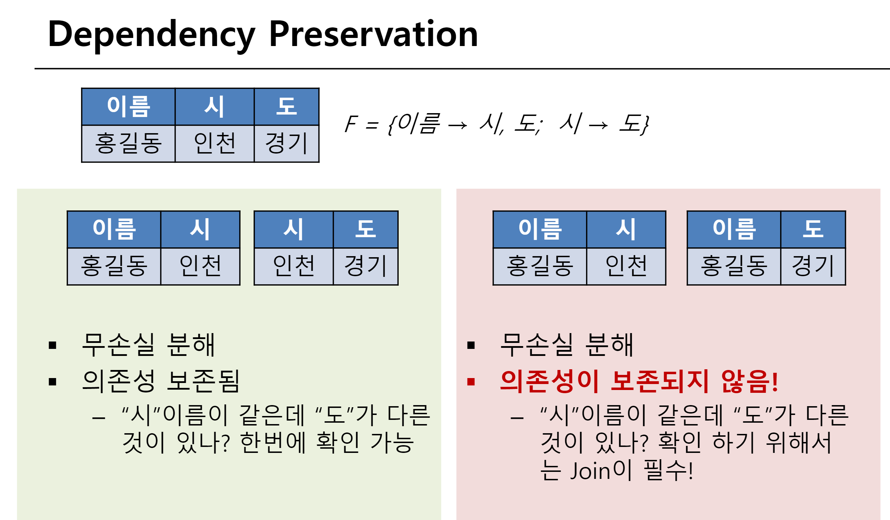
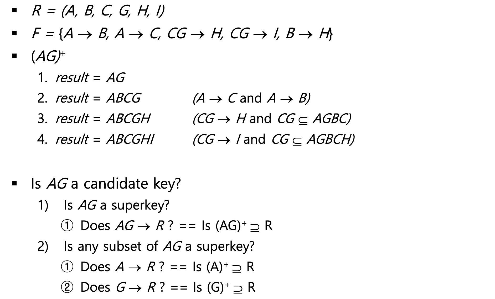
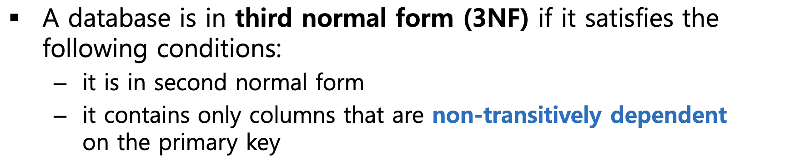
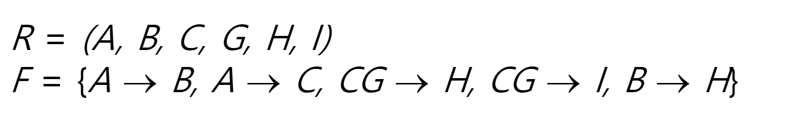

> [!question1]
> unary 연산이후에는 rename 을 제외하고는 table의 이름이 바뀌지 않았다 하지만
> $\cup, -, \times, \bowtie$  등의 binary 연산 이후 table 의 이름은 무었인가요??


> [!question]
> not null 은 제약조건에 속하는데 왜 modify 에서 변경하며 add,drop constraint 구문에서는 not null 변경이 안되는 이유
```sql
CREATE TABLE 예시테이블 (
    컬럼명1 데이터타입 [NOT] NULL,
    컬럼명2 데이터타입,
    ...
    CONSTRAINT 제약조건이름 PRIMARY KEY (컬럼명1, 컬럼명2),
    CONSTRAINT 제약조건이름 FOREIGN KEY (컬럼명2) REFERENCES 다른테이블(컬럼명),
    CONSTRAINT 제약조건이름 UNIQUE (컬럼명3),
    CONSTRAINT 제약조건이름 CHECK (조건식)
);
```
과 같이 table 수준의 제약조건에서는 NOT NULL 조건 부여 불가
```sql
ALTER TABLE PLAYER2 DROP CONSTRAINT PLAYER_FK2;
ALTER TABLE table_name MODIFY column_name data_type NOT NULL;
```
과 같이 drop contraint 구문에서도 NOT NULL 조건 부여 불가

default 구문도 제약조건인건가요??






> 애초에 말이 안되는 함수 종속성 규칙이지만
> 여기서 처음부터 F 가 F={이름 -> 시 ; 이름 -> 도} 라고 주어진다면 좌측처럼 분해된다면 lossy decomposition이고 우측이라면 무손실 분해이다



> 위는 AG가 후보키가 된다는 증명과정
> 그렇다면 AG 를 찾는 과정은 모든 조합을 다 확인해야 하는다2^6 -1



> 3NF 의 2번째 정의??



> 이것의 후보키를 구해보자
> 