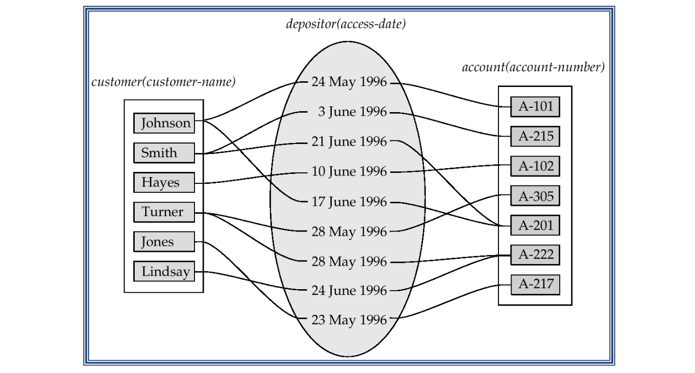
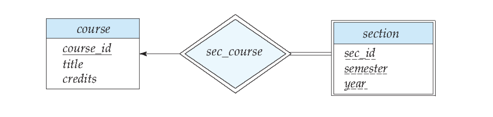
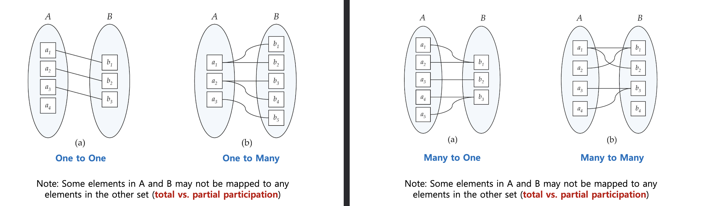
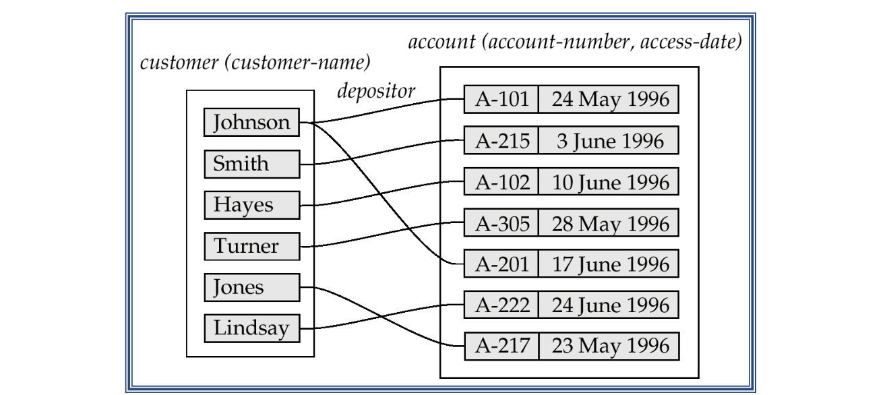
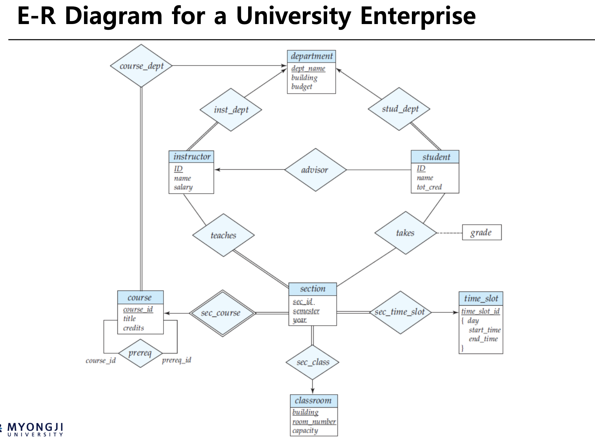
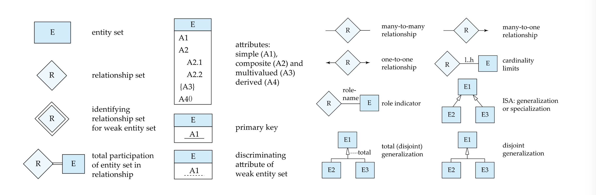
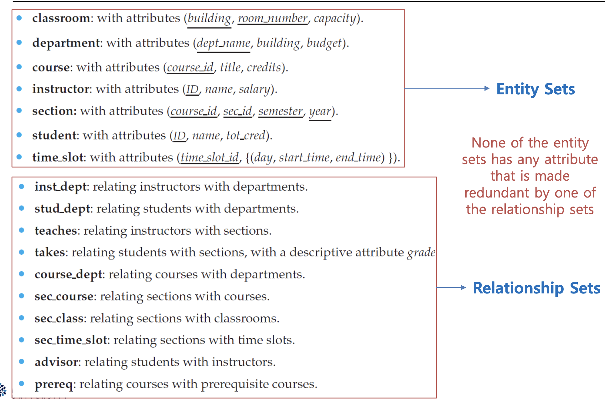
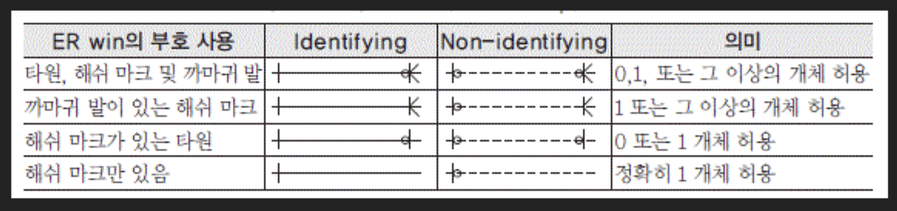
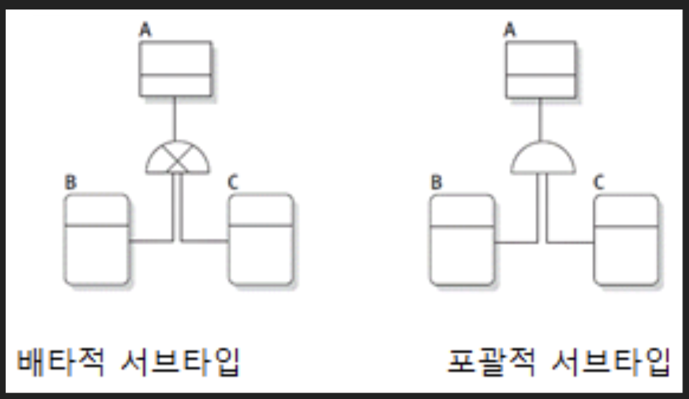

27, 51, 52page

entity

> 전제조건 : ER 모델 추상화된 모델로서 name = (first_name, middle_initial, last_name) 이렇게 여러가지 속성들을 같이 가지고 있는 속성을 분해하지 않고 1개의 속성으로 나타내도 된다

## ER 모델 entity set
- entity set ~= relation(table) => customer, Account
- value set ~= domain (entity 가 가질 수 있는 value 들의 집합) => {이름들, A-\*\*\*}
- simple attribute vs composite attribute
	- simple : 분해 불가능한 속성 (id, dept)
	- composite : 분해가능한 속성 (이름: 성과 이름 2개로 이루어짐)
- single-valued attribute vs multivalued attribute
	- single-valued : 아이디, 소속학과
	- multivalued attribute : 아이들{철수, 영희}
- Derived attributes : 계산하기 전 : 만나이 = (현재 날짜 - 생일)

## ER 모델 Relationship
- Relationship Sets : Entity들의 상호연관관계 => depositor
- Role : Relationship sets에서 각 entity의 역할 => access-date

## ER 모델 Weak entity set

1 to many, partial total

자체적으로 독립하기 어려운 집합
- weak entity set 의 master entity 가 정해저야 정해진다
- weak entity set 의 pk = master entity set 기본키 + 구별자
- 식별과 존재를 모두 의존
- 실무모델링에서는 식별관계 weak relation 관계이다

## ER 모델 Relationship Cardinality(관계 수)

Relationship Cardinality(entiy 가 몇개냐?): 엔터티와 연관될 수 있는 엔터티의 수 : 
- one to many : instructor vs student : 1명의 교수는 여러 학생을 지도한다 반대로 1명의 학생은 1명의 지도교수를 가진다
- one to one : 와이프 vs 남편 : 이혼이 없다는 가정하에
- ER-model : one 측에 화살표(->), many 측에 직선이 그어진다
- erwin :  
participation 참여율 : 모든 entiy가 relationship에 참여하는 개념인가
- 왼쪽 그림은 a라는 엔터티 집합은 b라고 하는 엔터티의 집합과의 관계에 partial participation을 하고 있고 b의 집합은 a 집합과의 관계에 total participation을 한다
- 오른쪽 그림은 a라는 집합은 b라고 하는 엔터티의 집합과의 관계에 total participation을 하고 있고 b의 집합도 a 집합과의 관계에 total participation을 한다
- total total 은 dbms 에서 구현 불가능
- ER-model : 두줄 직선은 total participation, 한줄직선은 Partial participation 이다
- erwin 에서는 :  

1:many 관계에서 relationship entity set 은 many entity set 에 붙는다

## ER diagram for a university database

### instructor student
둘의 관계는 one to many : 한명의 교수는 여러명의 학생을 지도교수로 하고 있다 한명의 학생은 한명의 지도교수를 가진다
교수는 advisor에 partial 하고 있다 : 교수는 학생을 한명도 지도하지 않을 수 있다
학생은 advisor에 total 하고 있다 : 학생은 지도 교수를 한명도 안 가질 수 있다
strong strong

### instructor department
둘의 관계는 many to one : 한명의 교수는 하나의 학과를 가지고 있다 하나의 학과는 여러명의 교수가 있다
학과는 inst_dept 에 partial 하고 있다 : 학과는 교수를 가지지 않을 수 있다
교수는 inst_dept 에 total 하고 있다 : 교수는 학과를 무조건 갖는다
> many측에 즉 교수측에 dept_name 이 fk 로 들어가면 table 을 따로 만들지 않아도 된다

### course section
둘의 관계는 one to many : 한 과목은 여러개의 강좌가 개설될 수 있다 한 강좌는 1개의 과목이다
과목은 course_sec 에 partial 하고 있다 : 과목으로 개설된 강좌가 없을 수 있다
강좌는 course_sec 에 total 하고 있다 : 모든 강좌는 과목을 가진다
strong weak : 과목은 강좌 없이도 구별될 수 있다, 강좌는 과목 없이는 구별될 수 없다

## ER diagram -> relation schemes 결론

이진관계기준!!!
- **many to many 다대다 관계** : 
	- 관계집합 entity 생성시 : 양 엔티티 집합의 기본 키의 합이 관계집합 최소 슈퍼키가 되어 이것을 기본 키로 선택
	- 관계집합 entity 생성안할 때 : 브릿지를 만들지 않는한 불가
- **one to many 일대다 및 다대일 관계** : 
	- 관계집합 entity 생성시 : "많은 쪽 엔티티 집합"의 기본 키가 관계 집합 최소 슈퍼키 이것을 기본 키로 사용
	- 관계집합 entity 생성안할 때 : 많은 쪽이 one 측의 기본 키를 가져가서 그것을 왜래키로 사용해도 관계집합이 충분히 표현
		- 
- **one to one 일대일 관계** : 
	- 관계집합 entity 생성시 : 참여하는 ㅡ엔티티 집합 중 어느 쪽의 기본키 모두 관계집합 최소 슈퍼키 가능 이것을 기본 키를 선택
	- 관계집합 entity 생성안할 때 : 아무 entity 집합이나 상대측의 pk 를 자신의 fk 로 사용하면 가능

relationship cardinarity의 각각의 경우
- many to many && partial partial && strong strong (m:m, p:p, s:s)
	- 양쪽의 attribute를 모두 pk 로 entity set 을 만든다
- one to many && partial total && strong strong (o:m, p:t, s:s)
	- many측의 attribute가 pk이자 fk, one 측의 attribute 가 fk 인 entity set 을 만든다
		- total 이므로 not null 조건이 있어야 한다
	- many측이 total이면 one측에 있는 pk를 가져다가 many측에 붙인다
- on to many && 
- one to many && total total : 불가능
- one to many && partial total && strong weak (o:m, p:t, s:w)
	- many 측의 attribute가 pk 이자 fk, one 측의

## ER diagram -> relation schemes 예시

- 중복 속성은 고유한 속성이 아닌데 가지고 있는 entity set 부분을 FK 로 한다

## 기호 설명

1. **직사각형 (Rectangles)**: 개체 집합(entity set)을 나타냅니다. 개체 집합의 이름이 직사각형 안에 적혀 있으며, 해당 개체 집합의 모든 속성(attributes)도 나열됩니다.
2. **다이아몬드 (Diamonds)**: 관계 집합(relationship set)을 나타냅니다. 관계 집합의 이름이 다이아몬드 안에 적혀 있습니다.
3. **비분할 직사각형 (Undivided Rectangles)**: 관계 집합의 속성을 나타냅니다. 관계의 주요 키(primary key)의 일부인 속성은 밑줄로 표시됩니다.
4. **선 (Lines)**: 개체 집합과 관계 집합을 연결합니다. 이 선은 개체와 관계 간의 연관성을 나타냅니다.
5. **점선 (Dashed Lines)**: 관계 집합의 속성과 그 관계 집합을 연결합니다. 속성이 관계에 포함됨을 나타냅니다.
6. **이중선 (Double Lines)**: 개체가 관계 집합에 완전하게 참여(total participation)하고 있음을 나타냅니다. 즉, 해당 개체는 반드시 이 관계에 포함되어야 합니다.
7. **이중 다이아몬드 (Double Diamonds)**: 약한 개체 집합(weak entity set)과 연결된 식별 관계 집합(identifying relationship set)을 나타냅니다. 약한 개체는 독립적으로 식별될 수 없고, 반드시 다른 개체와의 관계를 통해 식별됩니다.

화살표 one, 직선 many

식별관계 vs 비 식별관계

> total participation - total participation
>        1                              many
> 불가

A <= relation ship = B
이것을 ddl 로 강제할 방법이 없다

## goal for decomposition
1. Lossless-join decomposition
2. No redundancy
3. Dependency preservation

