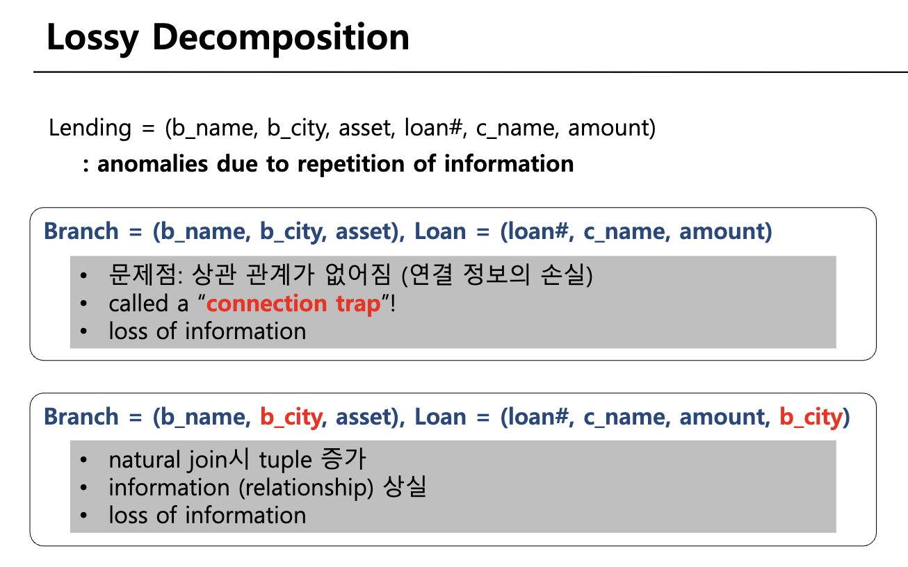
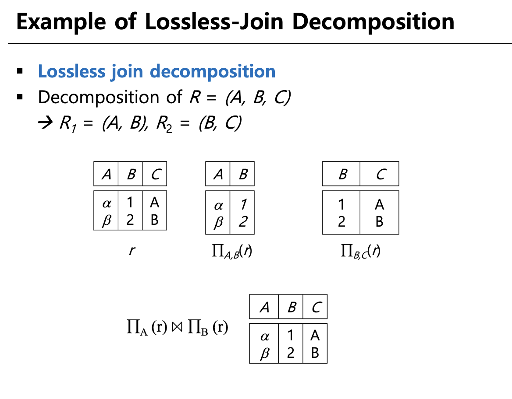
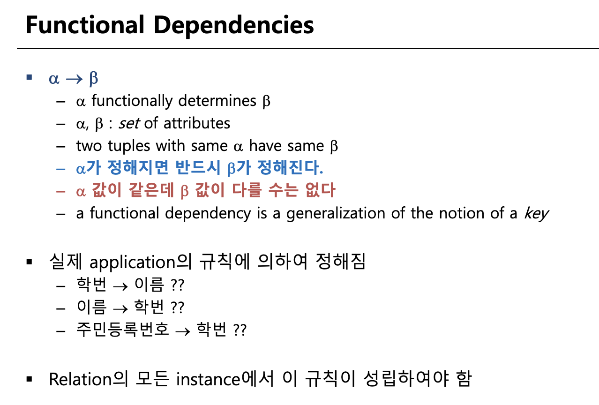

정규화 시에 제대로 분해 되었는지 확인하는 2가지 개념
1. 손실분해가 일어나지 않게
2. 중복 data 가 존재하는가 (redundency)
3. 종속성이 보존되게
## 분해

- 나쁜 디자인
	- 특정 정보를 표현 불가 -> 대출이 없는 지점은 오픈할 수 없다
	- 정보의 중복 -> 동일 지점에서 빌린 여러개의 대출
	- 정보의 손실
	- anomaly (update, insertion, deletion)
		- update : loan-number 없이 branch-name 등 insert 불가
		- delete : 어떤 branch의 마지막 loan을 delete하면 branch 자체가 사라짐
		- update : 어떤 특정한 branch의 정보(예: Downtown의assets)를 update하면 해당하는 튜플들을 모두 업데이트해야 함
- 좋은 디자인
	- 정보의 중복을 피한다
	- 정보의 관계가 표현된다
	- 무결성 제약 조건

분해를 안하면 업데이트시 여러개의 동시에 업데이트해야하는 문제가 발생
- 싱크시에 트래픽 발생, 싱크 실패 확율

그렇다면 분해는 쉬운가? 그렇지 않다
### 손실분해(lossy decomposition)

손실 분해의 예시이다
### 무손실 분해(lossless decomposition)

무손실 분해의 예시이다

이것을 보장하게 하는 것을 위해 아래의 함수 종속 개념을 사용하여 보장하게 된다


## functional dependencies


> trivial functional dependencies
> {주민등록번호} =>  {주민등록번호, 성별} // 당연한 이야기
> {주민등록번호} => {주민등록번호} // 당연한 이야기
> {주민등록번호} => 공집합 // 수학적으로 당연한 이야기


## 정규화

BCNF : 함수 종속 $\alpha -> \beta$ 에서 $\alpha$는 슈퍼키이다
- r(R) relation을 BCNF 조건을 어긋나게 하는 함수종속 $\alpha\ \rightarrow\ \beta$ 의 각 속성조합인  $r_1 =\alpha\ \cup\ \beta$ 와 $r_2=R\ - (\beta\ -\ \alpha)$ 2개로 나눈다
- 즉 알파를 볼모로 잡고 나머지를 다른 table 로 분리 
3정규형 : 함수 종속 $\alpha -> \beta$ 에서 $\alpha$는 슈퍼키 이거나 $\beta-\alpha$ 는 후보키에 속한다

정규화 과정


BCNF 목표
lossless join
Dependency preservation

```

```
1차 정규화
1. 모든 entity 는 원자적이어야 한다


2차 정규화
1. 1차 정규화 완료
2. 모든 key 가 아닌 attrivutes 는 완전하게 PK 종속되어야 한다
3. 

3차 정규화 쉬운 정의
1. 2차 정규화 완료
2. transitively dependent(a -> b && b-> c) 가 없어야 한다