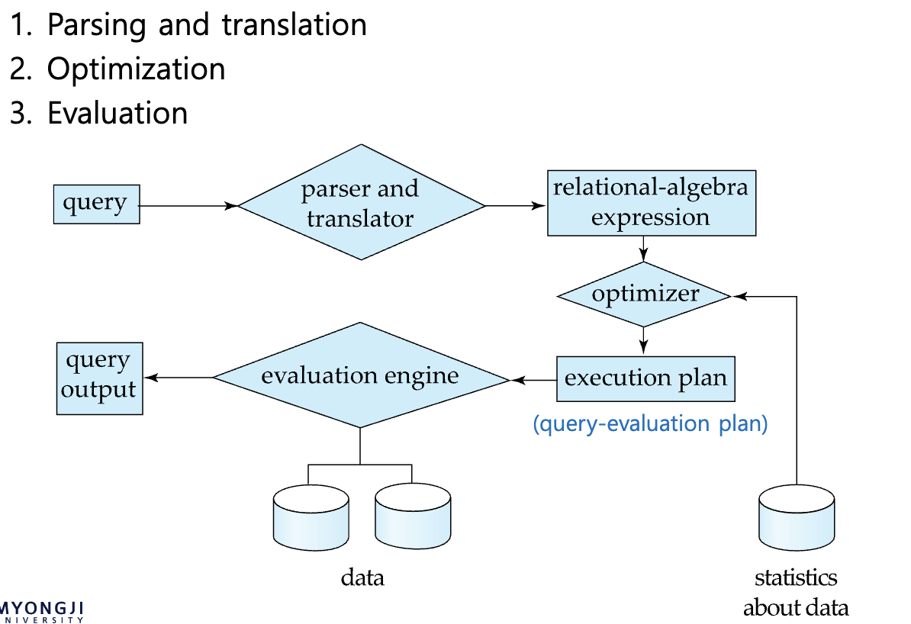

1. 쿼리 비용 측정
2. 관계 대수 평가 알고리즘
3. 개별 연산을 결합하는 알고리즘

## 쿼리 비용 측정
단순하게 disk 만 고려함 disk io 가 가장 큰 요소

seek(디스크에서 찾기) + transfer(메모리로 가져오기)

seek를 통해 시작 위치를 찾는다(instructor table 의 시작 data 위치)
transfer

- $t_T$ : time to transfer one block
	- assuming for simplicity that write cost is same as read cost
	- typically, cost to write a block is greater than read cost, since data is read back after being written to ensure that the write was successful
- $t_S$ : time for one seek

크게 selection 과 join 을 쓰기 위해 발행하는 cost 를 계한해 본다
### selection

$h_i$ = 트리 높이
$h_i(t_T+t_S)$ : 트리 통과 시간
b : 조건에 들어가는 record 이 차지하는 블록 개수
n : 조건에 들어가는 record 개수

A1 : Linear Search : $t_s+b_r*t_T$ //br 개의 블락에 걸쳐 존재
A1 , Equal on key : $t_s+b_r*t_T$ // 동등하면 평균적으로 1/2
A2 : Primary index, Equal on key : $(h_i+1)(t_T+t_S)$ // 트리 통과 + 1개의 튜플 찾기
A3 : Primary index, Equal on nonkey (중복 존재 가능): $h_i\times(t_T+t_S)+b\times t_T + t_S$ 
A4 : Secondary index, Equal on key $(h_i+1)(t_T+t_S)$ //  1개만 가능하니까 바로 찾음
A4 : Secondary index, Equal on nonkey $(h_i+n)(t_T+t_S)$ // n개의 중복 튜플 , cost 큼
A5 : Pirmary index, comparison : $h_i\times(t_T+t_S)+b\times t_T + t_S$ 
A6 : Secondary index, comparison : $(h_i+n)(t_T+t_S)$ // cost 큼
A7 : conjunctive selection using index :  최소 비용 조건을 먼저 이후는 메모리에서
A8 : conjunctive selection composite index : 가능하다면 복합 인덱스 사용
A9 : conjunctive selection by intersection of identifiers :  나오는 리프 노드의 포인터 record 의 교집합
A10 : disjunctive selection by union of identifiers : 리프노트 포인터 합집합 또는 리니어 서치

## sorting
sorting 사용 이유
- output 출력시 사용
- join 시에 정렬이 되있을 때 편한 사용

- Nested loop join
- Block Nested loop join
- index join
- merge join
- hash join
- 

r = b_r 개의 블록, n_r 개의 튜플
s = b_s 개의 블록, n_s 개의 튜플

nested-loop join
s 관점 n_r \* b_r 개의 transfer
r 관점 b_r 개의 transfer
s 관점 n_r 번 seek
r 관점 b_r 개 seek

block nested-loop join
n_r 을 b_r 로 교체