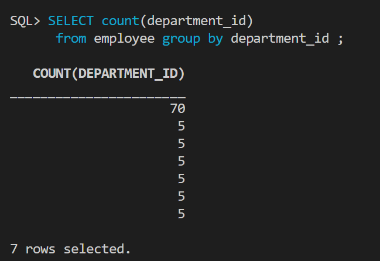
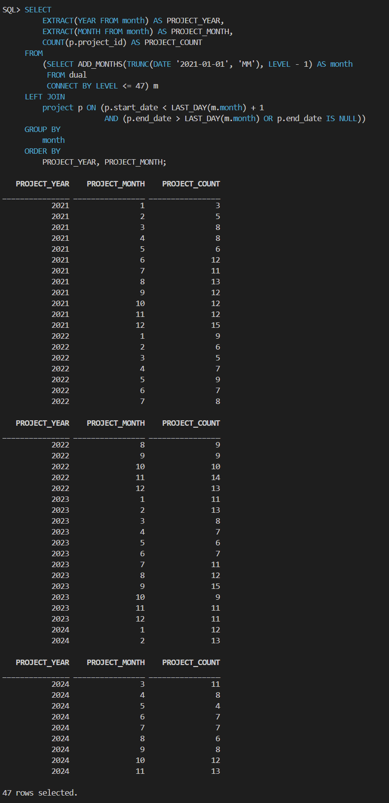

## 개발자 70 명 나머지 30명


## 월별 평균 10개 정도의 프로젝트 진행



```sql
SELECT
    EXTRACT(YEAR FROM month) AS PROJECT_YEAR,
    EXTRACT(MONTH FROM month) AS PROJECT_MONTH,
    COUNT(p.project_id) AS PROJECT_COUNT
FROM
    (SELECT ADD_MONTHS(TRUNC(DATE '2021-01-01', 'MM'), LEVEL - 1) AS month
     FROM dual
     CONNECT BY LEVEL <= 47) m
LEFT JOIN
    project p ON (p.start_date < LAST_DAY(m.month) + 1
                   AND (p.end_date > LAST_DAY(m.month) OR p.end_date IS NULL))
GROUP BY
    EXTRACT(YEAR FROM month), EXTRACT(MONTH FROM month)
ORDER BY
    PROJECT_YEAR, PROJECT_MONTH;
```