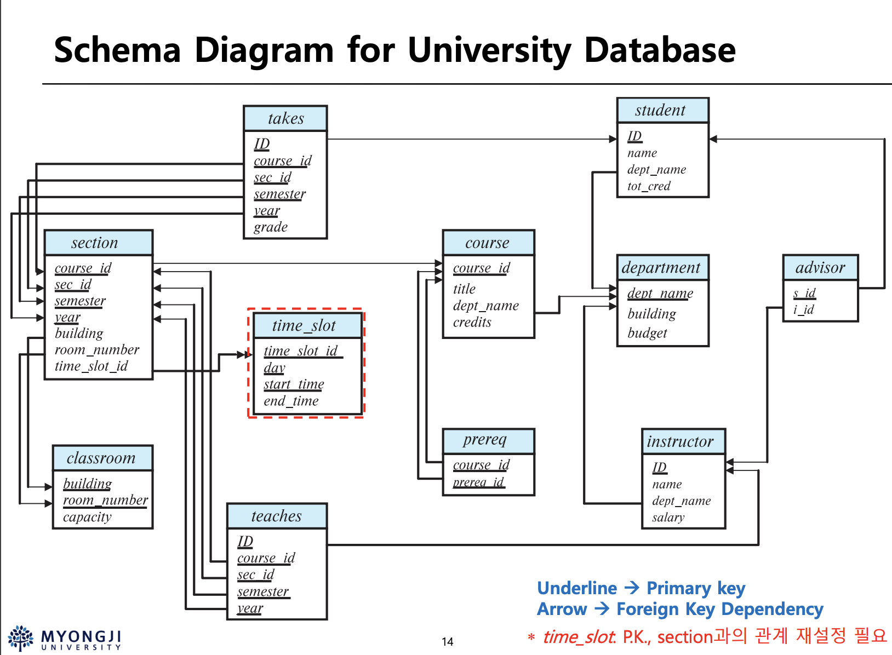

| table      | mean  |
| :--------- | :---- |
| student    | 학생    |
| instructor | 교수    |
| advisor    | 지도관계  |
| department | 학과    |
| course     | 과목    |
| prereq     | 선이수관계 |
| section    | 특정 강좌 |
| teaches    | 강의교수  |
| takes      | 수강    |
| classroom  | 강의실   |
| time_slot  | 시간표   |


우측부터 설명

- student(학생) 말그대로 학생
	- ID=PK dept_name(학과명)=FK
- advisor(지도관계) 학생과 교수의 지도관계
	- s_id(학생ID)=PK, FK
	- i_id(교수ID)=FK
	- 학생의 지도교수가 아직 배정 받지 못한 경우가 있을 수 있음 NULL 값 부여불가 기능을 사용
	- s_id 만 PK 이므로 모든 학생이 들어가고 학생의 중복은 불가능하다
- instructor(교수) 
- department(학과)
- course(과목): 학과에 존재하는 모든 과목
- prereq(선이수 관계) : 학과에 존재하는 과목의 모든 선이수 관계
	- 모든 값이 PK 이면서 FK
	- couse_id, prereq_id 묶어서 하나의 PK
- section(강의) : course 와 달리 실제 강의를 의미함
- teaches(강의 교수)
- classroom(강의실)
- tasks(수강신청 목록)


prereq 의 두 attribute 가 하나의 PK 를 이루는가 즉 집합인가?

superkey candidatekey primarykey
foreignkey => 이것만 하나의 attribute 인가??

teaches


```sql
-- 학교 시스템 데이터베이스 생성 DDL 스크립트

-- primary key만 존재하는 table부터 생성해야 foreign key가 존재하는 table을 생성할 때 문제가 없다. 즉 생성의 순서가 존재한다

--department table
--student table
--instuctor table
--advisor table
--course table
--prereq table
--classroom table
--time_slot table
--section table
--takes table
--teaches table
  
-- 지울떄는 반대로
DROP Table `teaches`;
DROP Table `takes`;
DROP Table `section`;
DROP Table `time_slot`;
DROP Table `classroom`;
DROP Table `prereq`;
DROP Table `course`;
DROP Table `advisor`;
DROP Table `instructor`;
DROP Table `student`;
DROP Table `department`;

--생성
CREATE TABLE `department` (
  `dept_name` varchar(20),
  `building` varchar(15),
  `budget` numeric(12,2) CHECK (`budget` > 0),
  PRIMARY KEY (`dept_name`)
)

CREATE TABLE `student` (
  `ID` varchar(5),
  `name` varchar(20) NOT NULL,
  `dept_name` varchar(20),
  `tot_cred` numeric(3,0) CHECK (`tot_cred` >= 0),
  PRIMARY KEY (`ID`),
  FOREIGN KEY (`dept_name`) REFERENCES `department` (`dept_name`) ON DELETE SET NULL
)

CREATE TABLE `instructor` (
  `ID` varchar(5),
  `name` varchar(20) NOT NULL,
  `dept_name` varchar(20),
  `salary` numeric(8,2) CHECK (salary > 29000),
  PRIMARY KEY (`ID`),
  FOREIGN KEY (`dept_name`) REFERENCES `department` (`dept_name`) ON DELETE SET NULL
)

CREATE TABLE `advisor`(
  `s_ID`      varchar(5),
  `i_ID`      varchar(5),
  PRIMARY KEY (`s_ID`),
  FOREIGN KEY (`i_ID`) REFERENCES instructor (ID) ON DELETE SET NULL,
  FOREIGN KEY (`s_ID`) REFERENCES student (ID) ON DELETE CASCADE
  )


CREATE TABLE `course` (
  `course_id` varchar(8),
  `title` varchar(50),
  `dept_name` varchar(20),
  `credits` numeric(2,0) CHECK (credits > 0),
  PRIMARY KEY (`course_id`),
  FOREIGN KEY (`dept_name`) REFERENCES `department` (`dept_name`) ON DELETE SET NULL
)


CREATE TABLE `prereq` (
  `course_id` varchar(8),
  `prereq_id` varchar(8),
  PRIMARY KEY (`course_id`,`prereq_id`),
  FOREIGN KEY (`course_id`) REFERENCES `course` (`course_id`),
  FOREIGN KEY (`prereq_id`) REFERENCES `course` (`course_id`)
)


CREATE TABLE `classroom` (
  `building` varchar(15),
  `room_number` VARCHAR(7),
  `capacity` numeric(4,0),
  PRIMARY KEY (`building`,`room_number`)
)

CREATE TABLE `time_slot`(
  `time_slot_id`    varchar(4),
  `day`     varchar(1),
  `start_hr`    numeric(2) CHECK (start_hr >= 0 AND start_hr < 24),
  `start_min`   numeric(2) CHECK (start_min >= 0 AND start_min < 60),
  `end_hr`      numeric(2) CHECK (end_hr >= 0 AND end_hr < 24),
  `end_min`   numeric(2) CHECK (end_min >= 0 AND end_min < 60),
  PRIMARY KEY (`time_slot_id`, `day`, `start_hr`, `start_min`)
  )


CREATE TABLE `section` (
  `course_id` varchar(8),
  `sec_id` varchar(8),
  `semester` varchar(6) CHECK (semester in ('Fall', 'Winter', 'Spring', 'Summer')),
  `year` numeric(4,0) CHECK (year > 1701 and year < 2100),
  `building` varchar(15),
  `room_number` varchar(7),
  `time_slot_id` varchar(4),
  PRIMARY KEY (`course_id`,`sec_id`,`semester`,`year`),
  FOREIGN KEY (`course_id`) REFERENCES `course` (`course_id`) ON DELETE CASCADE,
  FOREIGN KEY (`building`,`room_number`) REFERENCES `classroom` (`building`,`room_number`) ON DELETE SET NULL
)


CREATE TABLE `takes` (
  `ID` varchar(5),
  `course_id` varchar(8),
  `sec_id` varchar(8),
  `semester` varchar(6),
  `year` numeric(4,0),
  `grade` varchar(2),
  PRIMARY KEY (`ID`,`course_id`,`sec_id`,`semester`,`year`),
  FOREIGN KEY (`course_id`,`sec_id`,`semester`,`year`) REFERENCES `section` (`course_id`,`sec_id`,`semester`,`year`) ON DELETE CASCADE,
  FOREIGN KEY (`ID`) REFERENCES `student` (`ID`) ON DELETE CASCADE
)

CREATE TABLE `teaches`(
  `ID`      varchar(5), 
  `course_id`   varchar(8),
  `sec_id`      varchar(8), 
  `semester`    varchar(6),
  `year`      numeric(4,0),
  PRIMARY KEY (`ID`, `course_id`, `sec_id`, `semester`, `year`),
  FOREIGN KEY (`course_id`,`sec_id`, `semester`, `year`)
   REFERENCES `section` (`course_id`, `sec_id`, `semester`, `year`) ON DELETE CASCADE,
  FOREIGN KEY (ID) REFERENCES `instructor` (`ID`) ON DELETE CASCADE
  )

INSERT INTO classroom VALUES('Packard','101',500);
INSERT INTO classroom VALUES('Painter','514',10);
INSERT INTO classroom VALUES('Taylor','3128',70);
INSERT INTO classroom VALUES('Watson','100',30);
INSERT INTO classroom VALUES('Watson','120',50);


INSERT INTO department VALUES('Biology','Watson',90000);
INSERT INTO department VALUES('Comp. Sci.','Taylor',100000);
INSERT INTO department VALUES('Elec. Eng.','Taylor',85000);
INSERT INTO department VALUES('Finance','Painter',120000);
INSERT INTO department VALUES('History','Painter',50000);
INSERT INTO department VALUES('Music','Packard',80000);
INSERT INTO department VALUES('Physics','Watson',70000);


INSERT INTO course VALUES('BIO-101','Intro. to Biology','Biology',4);
INSERT INTO course VALUES('BIO-301','Genetics','Biology',4);
INSERT INTO course VALUES('BIO-399','Computational Biology','Biology',3);
INSERT INTO course VALUES('CS-101','Intro. to Computer Science','Comp. Sci.',4);
INSERT INTO course VALUES('CS-190','Game Design','Comp. Sci.',4);
INSERT INTO course VALUES('CS-315','Robotics','Comp. Sci.',3);
INSERT INTO course VALUES('CS-319','Image Processing','Comp. Sci.',3);
INSERT INTO course VALUES('CS-347','Database System Concepts','Comp. Sci.',3);
INSERT INTO course VALUES('EE-181','Intro. to Digital Systems','Elec. Eng.',3);
INSERT INTO course VALUES('FIN-201','Investment Banking','Finance',3);
INSERT INTO course VALUES('HIS-351','World History','History',3);
INSERT INTO course VALUES('MU-199','Music Video Production','Music',3);
INSERT INTO course VALUES('PHY-101','Physical Principles','Physics',4);


INSERT INTO instructor VALUES('10101','Srinivasan','Comp. Sci.',65000);
INSERT INTO instructor VALUES('12121','Wu','Finance',90000);
INSERT INTO instructor VALUES('15151','Mozart','Music',40000);
INSERT INTO instructor VALUES('22222','Einstein','Physics',95000);
INSERT INTO instructor VALUES('32343','El Said','History',60000);
INSERT INTO instructor VALUES('33456','Gold','Physics',87000);
INSERT INTO instructor VALUES('45565','Katz','Comp. Sci.',75000);
INSERT INTO instructor VALUES('58583','Califieri','History',62000);
INSERT INTO instructor VALUES('76543','Singh','Finance',80000);
INSERT INTO instructor VALUES('76766','Crick','Biology',72000);
INSERT INTO instructor VALUES('83821','Brandt','Comp. Sci.',92000);
INSERT INTO instructor VALUES('98345','Kim','Elec. Eng.',80000);


INSERT INTO section VALUES('BIO-101','1','Summer',2017,'Painter','514','B');
INSERT INTO section VALUES('BIO-301','1','Summer',2018,'Painter','514','A');
INSERT INTO section VALUES('CS-101','1','Fall',2017,'Packard','101','H');
INSERT INTO section VALUES('CS-101','1','Spring',2018,'Packard','101','F');
INSERT INTO section VALUES('CS-190','1','Spring',2017,'Taylor','3128','E');
INSERT INTO section VALUES('CS-190','2','Spring',2017,'Taylor','3128','A');
INSERT INTO section VALUES('CS-315','1','Spring',2018,'Watson','120','D');
INSERT INTO section VALUES('CS-319','1','Spring',2018,'Watson','100','B');
INSERT INTO section VALUES('CS-319','2','Spring',2018,'Taylor','3128','C');
INSERT INTO section VALUES('CS-347','1','Fall',2017,'Taylor','3128','A');
INSERT INTO section VALUES('EE-181','1','Spring',2017,'Taylor','3128','C');
INSERT INTO section VALUES('FIN-201','1','Spring',2018,'Packard','101','B');
INSERT INTO section VALUES('HIS-351','1','Spring',2018,'Painter','514','C');
INSERT INTO section VALUES('MU-199','1','Spring',2018,'Packard','101','D');
INSERT INTO section VALUES('PHY-101','1','Fall',2017,'Watson','100','A');


INSERT INTO teaches VALUES('10101','CS-101','1','Fall',2017);
INSERT INTO teaches VALUES('10101','CS-315','1','Spring',2018);
INSERT INTO teaches VALUES('10101','CS-347','1','Fall',2017);
INSERT INTO teaches VALUES('12121','FIN-201','1','Spring',2018);
INSERT INTO teaches VALUES('15151','MU-199','1','Spring',2018);
INSERT INTO teaches VALUES('22222','PHY-101','1','Fall',2017);
INSERT INTO teaches VALUES('32343','HIS-351','1','Spring',2018);
INSERT INTO teaches VALUES('45565','CS-101','1','Spring',2018);
INSERT INTO teaches VALUES('45565','CS-319','1','Spring',2018);
INSERT INTO teaches VALUES('76766','BIO-101','1','Summer',2017);
INSERT INTO teaches VALUES('76766','BIO-301','1','Summer',2018);
INSERT INTO teaches VALUES('83821','CS-190','1','Spring',2017);
INSERT INTO teaches VALUES('83821','CS-190','2','Spring',2017);
INSERT INTO teaches VALUES('83821','CS-319','2','Spring',2018);
INSERT INTO teaches VALUES('98345','EE-181','1','Spring',2017);


INSERT INTO student VALUES('00128','Zhang','Comp. Sci.',102);
INSERT INTO student VALUES('12345','Shankar','Comp. Sci.',32);
INSERT INTO student VALUES('19991','Brandt','History',80);
INSERT INTO student VALUES('23121','Chavez','Finance',110);
INSERT INTO student VALUES('44553','Peltier','Physics',56);
INSERT INTO student VALUES('45678','Levy','Physics',46);
INSERT INTO student VALUES('54321','Williams','Comp. Sci.',54);
INSERT INTO student VALUES('55739','Sanchez','Music',38);
INSERT INTO student VALUES('70557','Snow','Physics',0);
INSERT INTO student VALUES('76543','Brown','Comp. Sci.',58);
INSERT INTO student VALUES('76653','Aoi','Elec. Eng.',60);
INSERT INTO student VALUES('98765','Bourikas','Elec. Eng.',98);
INSERT INTO student VALUES('98988','Tanaka','Biology',120);


INSERT INTO takes VALUES('00128','CS-101','1','Fall',2017,'A');
INSERT INTO takes VALUES('00128','CS-347','1','Fall',2017,'A-');
INSERT INTO takes VALUES('12345','CS-101','1','Fall',2017,'C');
INSERT INTO takes VALUES('12345','CS-190','2','Spring',2017,'A');
INSERT INTO takes VALUES('12345','CS-315','1','Spring',2018,'A');
INSERT INTO takes VALUES('12345','CS-347','1','Fall',2017,'A');
INSERT INTO takes VALUES('19991','HIS-351','1','Spring',2018,'B');
INSERT INTO takes VALUES('23121','FIN-201','1','Spring',2018,'C+');
INSERT INTO takes VALUES('44553','PHY-101','1','Fall',2017,'B-');
INSERT INTO takes VALUES('45678','CS-101','1','Fall',2017,'F');
INSERT INTO takes VALUES('45678','CS-101','1','Spring',2018,'B+');
INSERT INTO takes VALUES('45678','CS-319','1','Spring',2018,'B');
INSERT INTO takes VALUES('54321','CS-101','1','Fall',2017,'A-');
INSERT INTO takes VALUES('54321','CS-190','2','Spring',2017,'B+');
INSERT INTO takes VALUES('55739','MU-199','1','Spring',2018,'A-');
INSERT INTO takes VALUES('76543','CS-101','1','Fall',2017,'A');
INSERT INTO takes VALUES('76543','CS-319','2','Spring',2018,'A');
INSERT INTO takes VALUES('76653','EE-181','1','Spring',2017,'C');
INSERT INTO takes VALUES('98765','CS-101','1','Fall',2017,'C-');
INSERT INTO takes VALUES('98765','CS-315','1','Spring',2018,'B');
INSERT INTO takes VALUES('98988','BIO-101','1','Summer',2017,'A');
INSERT INTO takes VALUES('98988','BIO-301','1','Summer',2018,NULL);


INSERT INTO advisor VALUES('00128','45565');
INSERT INTO advisor VALUES('12345','10101');
INSERT INTO advisor VALUES('23121','76543');
INSERT INTO advisor VALUES('44553','22222');
INSERT INTO advisor VALUES('45678','22222');
INSERT INTO advisor VALUES('76543','45565');
INSERT INTO advisor VALUES('76653','98345');
INSERT INTO advisor VALUES('98765','98345');
INSERT INTO advisor VALUES('98988','76766');


INSERT INTO time_slot VALUES('A','M',8,0,8,50);
INSERT INTO time_slot VALUES('A','W',8,0,8,50);
INSERT INTO time_slot VALUES('A','F',8,0,8,50);
INSERT INTO time_slot VALUES('B','M',9,0,9,50);
INSERT INTO time_slot VALUES('B','W',9,0,9,50);
INSERT INTO time_slot VALUES('B','F',9,0,9,50);
INSERT INTO time_slot VALUES('C','M',11,0,11,50);
INSERT INTO time_slot VALUES('C','W',11,0,11,50);
INSERT INTO time_slot VALUES('C','F',11,0,11,50);
INSERT INTO time_slot VALUES('D','M',13,0,13,50);
INSERT INTO time_slot VALUES('D','W',13,0,13,50);
INSERT INTO time_slot VALUES('D','F',13,0,13,50);
INSERT INTO time_slot VALUES('E','T',10,30,11,45);
INSERT INTO time_slot VALUES('E','R',10,30,11,45);
INSERT INTO time_slot VALUES('F','T',14,30,15,45);
INSERT INTO time_slot VALUES('F','R',14,30,15,45);
INSERT INTO time_slot VALUES('G','M',16,0,16,50);
INSERT INTO time_slot VALUES('G','W',16,0,16,50);
INSERT INTO time_slot VALUES('G','F',16,0,16,50);
INSERT INTO time_slot VALUES('H','W',10,0,12,30);


INSERT INTO prereq VALUES('BIO-301','BIO-101');
INSERT INTO prereq VALUES('BIO-399','BIO-101');
INSERT INTO prereq VALUES('CS-190','CS-101');
INSERT INTO prereq VALUES('CS-315','CS-101');
INSERT INTO prereq VALUES('CS-319','CS-101');
INSERT INTO prereq VALUES('CS-347','CS-101');
INSERT INTO prereq VALUES('EE-181','PHY-101');


```


임의 데이터 무작위 생성 참조
```python
import sqlite3
import random
import string

conn = sqlite3.connect('test_db.sqlite')
cursor = conn.cursor()

cursor.execute('''
CREATE TABLE IF NOT EXISTS test_table (
    id INTEGER PRIMARY KEY,
    name TEXT,
    value INTEGER
)
''')

for i in range(10000):
    name = ''.join(random.choices(string.ascii_letters, k=5))  # 랜덤 이름 생성
    value = random.randint(1, 100)  # 랜덤 값 생성
    cursor.execute('INSERT INTO test_table (name, value) VALUES (?, ?)', (name, value))

conn.commit()

conn.close()

```