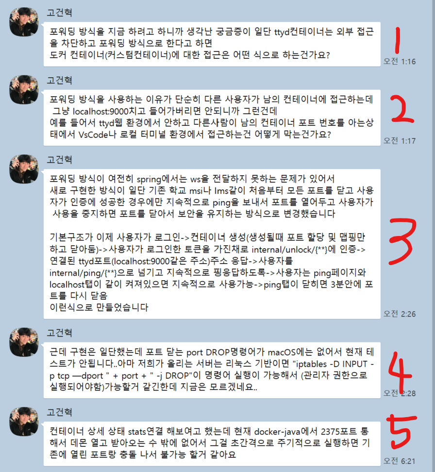
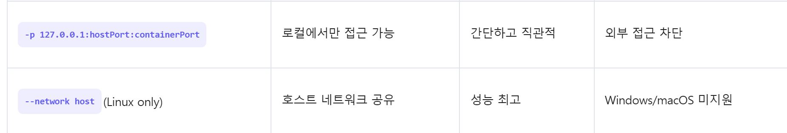

%20image%2020250513062286.png)

- [고건혁] [오전 1:16] 포워딩 방식을 지금 하려고 하니까 생각난 궁금증이 일단 ttyd컨테이너는 외부 접근을 차단하고 포워딩 방식으로 한다고 하면  
  도커 컨테이너(커스텀컨테이너)에 대한 접근은 어떤 식으로 하는건가요?
	- 아래 사진과 같은 방식중 첫번째 방식을 사용하려고 하였습니다
	  
	     
	  
- [고건혁] [오전 1:17] 포워딩 방식을 사용하는 이유가 단순히 다른 사용자가 남의 컨테이너에 접근하는데 그냥 localhost:9000치고 들어가버리면 안되니까 그런건데  
  예를 들어서 ttyd웹 환경에서 안하고 다른사람이 남의 컨테이너 포트 번호를 아는상태에서 VsCode나 로컬 터미널 환경에서 접근하는건 어떻게 막는건가요?  
	- 상단에 설명한 것 처럼 허용하는 ip 만 접근 가능한거여서 포워딩 방식으로 접근하지 않는 한 접근 할 수 없습니다
	    
- [고건혁] [오전 2:26] 포워딩 방식이 여전히 spring에서는 ws을 전달하지 못하는 문제가 있어서 새로 구현한 방식이 일단 기존 학교 msi나 lms같이 처음부터 모든 포트를 닫고 사용자가 인증에 성공한 경우에만 지속적으로 ping을 보내서 포트를 열어두고 사용자가 사용을 중지하면 포트를 닫아서 보안을 유지하는 방식으로 변경했습니다  
        
- 기본구조가 이제 사용자가 로그인->컨테이너 생성(생성될때 포트 할당 및 맵핑만 하고 닫아둠)->사용자가 로그인한 토큰을 가진채로 internal/unlock/{\*\*}에 인증->연결된 ttyd포트  (localhost:9000같은 주소)주소 응답->사용자를 internal/ping/{\*\*}으로 넘기고 지속적으로 핑응답하도록->사용자는 ping페이지와 localhost탭이 같이 켜져있으면 지속적으로 사용가능->ping탭이 닫히면 3분안에 포트를 다시 닫음 이런식으로 만들었습니다  
	- 3가지 방법중 3번 방법인 것 같은데 사용자가 터미널을 사용하고 있을 때는 외부 사람들도 접근 가능한거 아닌가요
	- 
- [고건혁] [오전 2:28] 근데 구현은 일단했는데 포트 닫는 port DROP명령어가 macOS에는 없어서 현재 테스트가 안됩니다..아마 저희가 올리는 서버는 리눅스 기반이면 "iptables -D INPUT -p tcp —dport " + port + " -j DROP"이 명령어 실행이 가능해서 (관리자 권한으로 실행되어야함)가능할거 같긴한데 지금은 모르겠네요..  
	- 이거는 해봐야 알 수 있을거 같은데 was 에서 관리자권한이 필요한 명령이 실행가능한지는 모르겠어요
	     
- [고건혁] [오전 6:21] 컨테이너 상세 상태 stats연결 해보여고 했는데 현재 docker-java에서 2375포트 통해서 데몬 열고 받아오는 수 밖에 없어서 그걸 초간격으로 주기적으로 실행하면 기존에 열린 포트랑 충돌 나서 불가능 할거 같아요
	- 이 말이 정확히 무슨 말인지 이해가 안되는데 `한 번에 여러 개의 stats 연결을 동시에 여는 게 어려움` 이런 말인가요? <- 이 문제는 조금 중요한 거 같아서 회의를 한번 해봐야 할 거 같아요
	     
- [고건혁] [오전 6:26] 기본적인 상태 전송은 어차피 ping방식으로 해서 요청을 보내니까 그 요청의 응답으로 상태 전송하면 좋을거 같아서 ping엔트포인트에 응답으로 pong상태를 보내는 식으로 만들고 있습니다
	- status 또는 stat 을 poling 또는 long Poiling 방식으로 구현하신다는 거죠?
	     